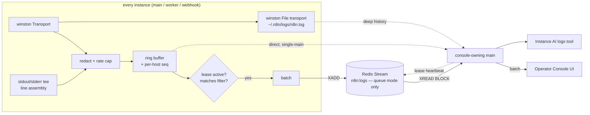

# Operator Console

Live, cross-instance log tail for self-service debugging — plus a searchable
log surface the AI Assistant can query.

**Status:** design / in progress (hackathon)
**Module name:** `operator-console` (opt-in, not a default module)

## Goal

Let an instance admin answer "what just happened?" without shell access to the
box:

1. **Live tail** of combined stdout/stderr/structured logs from *every* n8n
   instance (main, worker, webhook) in one pane.
2. **Cross-linked to executions** — jump from a failed execution to the log
   lines that execution produced, on whichever host ran it.
3. **Survives a crash** — the logs from just before an OOM kill are the ones
   you actually need.
4. **Queryable by the AI Assistant** — the agent greps the same log surface to
   diagnose failures and cite evidence.

## Non-goals

- Replacing real log aggregation (Loki/Datadog/CloudWatch). The existing
  `log-streaming.ee` module owns durable export; this is a live debugging tool
  with a bounded retention window.
- Total ordering across hosts. Logs are partially ordered by design (see
  [Ordering](#ordering)).
- Persisting logs to the n8n database. Nothing is written to Postgres/SQLite.

## Deployment modes

**The ring buffer is the product. Redis is a transport that fans several ring
buffers into one logical view.** Not a primary/fallback split — the no-Redis
case is the same feature minus a network hop.

`start.ts:224` gates multi-main on `executions.mode === 'queue'`, and queue mode
requires Redis. So **no Redis ⟹ exactly one main, no workers, no webhook
processes**. The only other producer, task runners, already forwards into
`Logger` via `forwardToLogger()` in `task-runner-process-base.ts`. One process,
one producer, nothing to fan in.

| Concern | Single main (no Redis) | Queue mode |
|---|---|---|
| Fan-in | none needed | Redis Stream `n8n:logs` |
| Lease | no-op (producer and consumer are the same process) | heartbeat over `n8n.commands` |
| Cursor | ring buffer `seq` | stream ID |
| Cross-host history | n/a | Redis `MAXLEN` window + per-host `n8n.log` |
| Deep history | existing `n8n.log` | existing `n8n.log` (per host) |
| Producer-side filter | same predicate, in-process | same predicate, at each producer |
| Batching to browser | identical | identical |
| AI snapshot | identical | identical |

Nothing above the `LogSource` interface — controller, UI, AI tool — branches on
mode.

## Enablement

Fully opt-in. Disabled → zero cost: no transport attached, no stdout patch, no
disk writes, no Redis traffic, no routes, no AI tool.

```bash
N8N_ENABLED_MODULES=operator-console
```

Registered in `MODULE_NAMES`
(`@n8n/backend-common/src/modules/modules.config.ts`) but deliberately **not**
added to `defaultModules` in `module-registry.ts`.

`instanceTypes: ['main', 'worker', 'webhook']` on the `@BackendModule`
decorator — every instance type produces; only mains consume.

### Config surface

`packages/cli/src/modules/operator-console/operator-console.config.ts`

| Env var | Default | Purpose |
|---|---|---|
| `N8N_OPERATOR_CONSOLE_CAPTURE_STDOUT` | `true` | Tee raw `process.stdout` **and** `process.stderr` in addition to the winston transport. One switch for both streams — splitting them would only save noise the level/scope filters already handle. |
| `N8N_OPERATOR_CONSOLE_BUFFER_SIZE` | `5000` | Ring buffer lines retained per host. |
| `N8N_OPERATOR_CONSOLE_MAX_LINE_BYTES` | `8192` | Longer lines truncated, flagged `truncated: true`. |
| `N8N_OPERATOR_CONSOLE_RATE_LIMIT` | `2000` | Max lines/sec/host admitted. Excess dropped and counted. |
| `N8N_OPERATOR_CONSOLE_REDACT` | `true` | Redact at ring-buffer entry (see [Security](#security)). |
| **Persistence** | | |
| `N8N_OPERATOR_CONSOLE_HISTORY` | `true` | Read deep history from the existing winston file transport. Ensures file output is attached even if `N8N_LOG_OUTPUT` omits `file`. Size, rotation and location are governed by the existing `N8N_LOG_FILE_*` vars — no new knobs. |
| **Delivery** | | |
| `N8N_OPERATOR_CONSOLE_BATCH_INTERVAL_MS` | `200` | Per-hop batch flush interval. |
| `N8N_OPERATOR_CONSOLE_BATCH_MAX_BYTES` | `65536` | Per-hop batch flush size. |
| **Queue mode only** | | |
| `N8N_OPERATOR_CONSOLE_STREAM_MAX_LEN` | `50000` | Redis Stream `MAXLEN ~`. Sets the cross-host history window. |
| `N8N_OPERATOR_CONSOLE_LEASE_TTL_MS` | `30000` | Producer stops publishing this long after the last heartbeat. |
| **AI** | | |
| `N8N_OPERATOR_CONSOLE_AI_TOOL` | `true` | Expose the `logs` tool to Instance AI. |
| `N8N_OPERATOR_CONSOLE_AI_SNAPSHOT_MAX_LINES` | `5000` | Cap on lines materialized into a sandbox snapshot. |

Read once at module init; changes require a restart (except the lease, which is
inherently dynamic).

## Architecture



### Capture

Two sources, deliberately overlapping in coverage but not in content:

**1. Winston transport (primary).** A `TransportStream` subclass appended to the
root `Logger`'s internal winston logger. Gives level, `scope`, metadata and
timestamp already parsed — no re-parsing of formatted text.

Scoped loggers (`logger.scoped('scaling')`) are winston `child()` loggers of the
root, so they write through the same transports. One attachment covers all.

Also captures **task runner** output for free, per the `forwardToLogger()` note
above.

**2. stdout/stderr tee (secondary, `CAPTURE_STDOUT=true`).** Wraps
`process.stdout.write` / `process.stderr.write` to catch what never touches
`Logger`: `console.log` from Code nodes, chatty third-party libraries, uncaught
exception dumps, V8 and native module warnings.

Two things this **must** get right:

- **Line assembly.** Writes arrive as arbitrary chunks, not lines. Buffer per
  stream, split on `\n`, flush a partial tail on a short timer.
- **Reentrancy guard.** The winston Console transport itself writes to stdout.
  Without a guard, every structured log is captured twice *and* the broadcast
  path's own debug logs recurse infinitely.

  **The guard must wrap `internalLogger.write`, not sit inside our transport.**
  Winston fans an entry out to transports in attachment order, so Console has
  already written to stdout by the time our transport runs — a flag set inside
  the transport misses every duplicate. `internalLogger.write` is the single
  funnel that `Logger.log()` and every `scoped()` child both pass through:

  ```ts
  internalLogger.write = (info: unknown) => runInternal(() => originalWrite(info));
  ```

  Plus excluding the `operator-console` scope from capture entirely.

### Record shape

Defined in `@n8n/api-types`. The label set is the design — everything else is
substring search (the Loki lesson).

```ts
export type OperatorLogRecord = {
  seq: number;                        // per-host monotonic — the cursor
  ts: string;                         // ISO 8601
  hostId: string;                     // InstanceSettings.hostId
  role: 'main' | 'worker' | 'webhook';
  stream: 'log' | 'stdout' | 'stderr';
  level: 'error' | 'warn' | 'info' | 'debug';
  scope?: LogScope;
  executionId?: string;               // ← the cross-link
  workflowId?: string;
  nodeName?: string;
  message: string;
  meta?: Record<string, unknown>;
  truncated?: boolean;
};

export type OperatorLogBatch = {
  hostId: string;
  records: OperatorLogRecord[];
  dropped: number;                    // dropped since the last batch
};

export type OperatorLogFilter = {
  minLevel?: 'error' | 'warn' | 'info' | 'debug';
  scopes?: LogScope[];
  hostIds?: string[];
  roles?: Array<'main' | 'worker' | 'webhook'>;
  executionId?: string;
  grep?: string;                      // plain substring, case-insensitive
};
```

### The `LogSource` interface

The single abstraction that makes deployment mode invisible. The **opaque
string cursor** is what does the work.

```ts
interface LogSource {
  read(opts: {
    since?: string;
    filter: OperatorLogFilter;
    limit: number;
    direction?: 'forward' | 'backward';   // default 'backward'
  }): Promise<{ records: OperatorLogRecord[]; nextCursor: string; gap: boolean }>;

  subscribe(filter: OperatorLogFilter, onBatch: (b: OperatorLogBatch) => void): () => void;

  hosts(): Promise<OperatorLogHost[]>;
}
```

`direction` defaults to `backward` because opening a console wants the *newest*
lines. Reading from the oldest record is never what a log tail wants, and over a
rotated file set it would be pathological.

- `RingBufferSource` encodes `seq`; `RedisStreamSource` uses the stream ID;
  `LogFileSource` encodes `(file, byteOffset)`.
- `gap: true` when the requested cursor has already been evicted. Returning a
  silently-partial window is the failure mode to avoid — the UI renders an
  explicit "older lines evicted" marker.
- The composite source used by the console tries ring buffer → Redis stream →
  log file, in ascending cost order.

### Execution correlation

There is **no** general execution `AsyncLocalStorage` in the codebase today
(only narrow ones in `trigger-execution-context.factory.ts` and instance-ai
tracing). We add one.

**It belongs in `@n8n/backend-common`, next to `Logger` — not in the cli
module.** `Logger.log()` must read it so that `executionId` is stamped into the
winston metadata itself, which means it lands in `n8n.log` too. If the label
were applied only at ring-buffer entry, file-backed history would lose the
execution cross-link — the single most valuable label. As a side effect this
improves `n8n.log` for everyone, not just the console.

```ts
// @n8n/backend-common/src/logging/execution-context.ts
const store = new AsyncLocalStorage<{ executionId: string; workflowId?: string }>();
```

`packages/cli` wraps the two execution entry points (dependency direction:
cli → backend-common):

- worker: `scaling/job-processor.ts` → `processJob()`
- main: the workflow runner's own-process path

ALS survives promises, timers and most third-party callbacks; lines emitted from
detached callbacks simply lack the label, which is acceptable.

### Persistence: reuse the existing winston file transport

**No new write path.** `N8N_LOG_OUTPUT=file` already writes rotated JSON-lines
to `~/.n8n/logs/n8n.log` with `maxsize`/`maxFiles` handling
(`logger.ts:setFileTransport`). We read it; we do not duplicate it.

`N8N_OPERATOR_CONSOLE_HISTORY=true` attaches the file transport if
`N8N_LOG_OUTPUT` doesn't already include `file`, so the operator never has to
set two variables to get one behaviour.

- **The file is the authoritative deep history; the ring buffer is a hot cache
  in front of it.** `read()` serves from memory when the cursor is in range and
  falls through to the files otherwise.
- **No index.** Files are size-capped, so the worst case is a linear scan —
  exactly what `grep` would do. Not worth indexing at this retention.
- **Format mapping.** File lines use `jsonConsoleFormat()`: `{ level, message,
  metadata: { timestamp, scopes, file, function, ... } }`. `LogFileSource`
  includes a parser mapping winston JSON → `OperatorLogRecord`.

#### Crash coverage — what actually survives

`ErrorReporter.init()` installs `process.on('uncaughtException')`
(`error-reporter.ts:185`) which routes to `defaultReport` → `logger.error()`
(line 151). So fatal errors already reach winston, and therefore the file.

| Crash class | In `n8n.log` | In a stdout/stderr tee |
|---|---|---|
| Errors n8n catches and logs | ✅ | ✅ |
| Uncaught exception / unhandled rejection | ✅ via `ErrorReporter` | ✅ |
| Code node `console.log` | ❌ | ✅ |
| Third-party `console.error` | ❌ | ✅ |
| Crash before `ErrorReporter.init()` | ❌ | ❌ (tee not installed yet) |
| **V8 fatal OOM banner** | ❌ | ❌ |

The V8 OOM banner is written with `fprintf(stderr)` at the C++ level, bypassing
`process.stderr.write` — **no in-process design can capture it**, so it is not a
reason to prefer a custom sink. What you need after an OOM is the last N lines
before death, durably on disk, and the file has those. Read the banner itself
from `docker logs`.

**Accepted consequence:** live tail includes tee'd stdout/stderr; history does
not. Records carry their origin so the UI can mark the boundary honestly
("history — structured logs only") rather than letting the two silently
disagree.

### Fan-out (queue mode only): Redis Stream, not pub/sub

Producers `XADD` batches to `n8n:logs` with `MAXLEN ~ STREAM_MAX_LEN`. Consumers
`XREAD BLOCK` from a cursor.

A capped stream costs about the same as pub/sub and buys three things pub/sub
cannot: **scrollback on open** (an empty pane waiting for something to happen is
how these features feel broken), **resume after reconnect** from the last stream
ID, and **a cross-host snapshot source for the AI**.

**Never use `n8n.commands`.** A debug-level firehose sharing a channel with
`stop-execution` is a latency bug waiting to happen. Precedent for a separate
channel exists (`MCP_RELAY_PUBSUB_CHANNEL`).

### Demand-driven lease (queue mode only)

Nothing crosses the network unless someone is watching.

1. A console connects → its main publishes `log-tail-start { filter, ttl }`.
2. Producers begin `XADD`ing records matching the filter.
3. The main re-arms every `LEASE_TTL_MS / 2` while a console is open.
4. Tab closed, or the main crashes → lease expires → producers stop.

Filters are evaluated **at the producer**, not in the browser — the Vector /
Fluent Bit lesson, and the single most important scaling decision here.

In single-main the lease is a no-op: producer and consumer are the same process,
and `subscribe()` is an EventEmitter listener.

Note the sink is *not* lease-gated, so disabling all consoles never blinds the
crash-survival path.

### Backpressure

Explicit policy, no silent loss:

- Per-host rate cap (`RATE_LIMIT` lines/sec) at ring-buffer entry. Excess
  dropped, counted.
- `dropped` rides on the next batch, accumulates through the pipeline, and the
  UI renders `⚠ 4,213 lines dropped` inline at the point in the stream where it
  happened.
- Lines over `MAX_LINE_BYTES` truncated with `truncated: true`.

Everyone drops — CloudWatch Live Tail has an explicit "sampled" mode. The honest
ones say so in the UI.

### Batching is per-hop

Not a single stage. Each hop batches independently on
`BATCH_INTERVAL_MS` / `BATCH_MAX_BYTES`:

| Hop | Applies in |
|---|---|
| ring buffer → sink file | both modes |
| producer → Redis | queue mode |
| main → browser (Push) | both modes |

The browser hop matters most: **one push message per batch, never per line**, or
single-main gets a message per line on a socket shared with the whole editor UI.

### Ordering

No global ordering. Each host stamps `(hostId, seq, ts)`. The UI merges on `ts`
with a ~500ms jitter buffer and renders a colored per-host gutter, the way
`stern` and `docker compose logs` do. `seq` gives per-host gap detection.

### Browser transport

Reuse the existing **Push** websocket (`packages/cli/src/push/`) — inherits
auth, origin validation, reconnect and multi-main relay.

Escape hatch if the shared socket starves node-status updates: a dedicated
`/rest/operator-console/tail` endpoint modeled on `push/websocket.push.ts`.
Deferred until measured.

## AI Assistant integration

### Approach: pull, not push

Streaming logs into the agent's context is the tempting wrong answer —
unbounded token burn, and a continuously mutating context block destroys prompt
caching (see the lazy-workspace prefix-instability incident).

Instead the agent pulls, and the highest-leverage move is handing it **ripgrep
over a real file** rather than a bespoke query DSL.

### `logs` tool

`packages/@n8n/instance-ai/src/tools/logs.tool.ts`, registered alongside
`executions.tool.ts`, gated by `N8N_OPERATOR_CONSOLE_AI_TOOL`.

| Action | Returns |
|---|---|
| `search({ query, executionId?, hostIds?, level?, since?, limit? })` | Matching records via `LogSource.read()`. |
| `context({ hostId, seq, before = 50, after = 50 })` | Surrounding lines for a hit. **Not optional** — a grep hit without neighbours is nearly useless for debugging, and the agent flounders without it. |
| `snapshot({ filter })` | Materializes a bounded JSONL into `<workspaceRoot>/logs/snapshot-<id>.jsonl` **inside the sandbox**; returns path + line count. |

### The `InstanceAiLogQueryPort`

`packages/@n8n/instance-ai` cannot import from `packages/cli`, so the tool codes
against a port that the cli side adapts to `LogSource`:

```ts
type LogRedactionAttestation = { applied: true; redactor: string };
type RedactedLogPage = OperatorLogReadResult & { redaction: LogRedactionAttestation };

interface InstanceAiLogQueryPort {
  readonly maxSnapshotLines?: number;
  read(options: LogQueryReadOptions): Promise<RedactedLogPage>;
  readContext(options: LogQueryContextOptions): Promise<RedactedLogPage>;
}
```

Two deliberate properties:

- **`readContext` is separate from `read`** because a `(hostId, seq)` window is
  not expressible through an opaque cursor.
- **Redaction is attested, not assumed.** `applied` is the literal `true`, so the
  adapter cannot produce a page without explicitly asserting redaction and naming
  which redactor ran; `assertRedactedLogPage()` re-checks at runtime before any
  record reaches the model or the sandbox. Fail-closed — this is the one path
  that ships log content off-instance.

**Gating is by presence**, matching `mcpService` in the same package: when the
module is off or `N8N_OPERATOR_CONSOLE_AI_TOOL=false`, leave
`InstanceAiContext.logQueryService` unset and the tool is never registered. No
separate boolean.

The tool is **not** in `ALWAYS_LOADED_TOOL_NAMES` — most turns never need
instance logs, and adding a conditionally-present tool to the core set would
change the cached system prefix for instances that enable the module.

### Why snapshot-on-demand, not a continuous tail into the sandbox

Continuously tailing into the remote sandbox needs a live pump plus
ephemeral-sandbox lifecycle handling — the exact class of problem behind
INS-433. Materializing on demand keeps the whole payoff: once the file exists,
the agent uses tools it already has.

```
rg -n 'ECONNREFUSED|ETIMEDOUT' logs/snapshot-abc.jsonl | head -50
jq -r 'select(.level=="error") | "\(.ts) \(.hostId) \(.message)"' logs/snapshot-abc.jsonl
```

Far more expressive than any schema we would design, and zero new tool surface.

With `PERSIST=true` on single-main, `snapshot` is essentially a filtered file
copy — no Redis involvement at all. **The entire AI slice is Redis-independent**
in both modes: the main reads its own `LogSource` and writes into the sandbox
over the sandbox FS API.

### Target flow

> "Why did execution 1234 fail?"

agent → `executions.get({ executionId: '1234' })` → `logs.snapshot({ executionId: '1234' })`
→ `rg` in the sandbox → cites the exact line and the host that produced it.

## Frontend

`packages/frontend/editor-ui/src/features/settings/orchestration.ee/` — next to
the existing `WorkerView.vue` / `WorkerList.vue`.

- Virtualized list (must handle thousands of lines without dying).
- Filter bar: level, scope multi-select, host multi-select, grep. Filter changes
  re-issue the lease with a new filter rather than filtering client-side.
- Follow-tail toggle; auto-disengages on manual scroll-up.
- Pause / resume; buffered-while-paused count.
- Per-host color gutter with `role` badge.
- Inline drop markers and `gap` markers.
- Expand a row → full `meta` JSON.
- Click `executionId` → execution detail. Conversely, a **View logs** button on
  execution detail deep-links `?executionId=`.
- Download visible buffer as JSONL.

All strings via `@n8n/i18n`; spacing via CSS variables (never px).

## Security

Logs carry URLs, headers, error payload fragments and occasionally
credential-shaped material.

- `@GlobalScope` admin/owner only, on both the REST routes and the WS upgrade.
- Frontend entry gated on the module's `settings()` payload.
- **Redaction happens in two places, and this is not optional.** Reuse
  `packages/cli/src/modules/redaction`.
  - *Live path:* at ring-buffer entry, the earliest possible point. Covers the
    console stream and anything sourced from memory or Redis, from one code
    path. Cost is one pass per line even when nobody is watching; `REDACT=false`
    exists for anyone who measures a problem.

    **`packages/cli/src/modules/redaction` does not fit.** It redacts structured
    execution data against per-workflow policies and node-declared fields; there
    is no free-text scrubber in it. `capture/redactor.ts` is a small scoped one
    (auth headers, scheme tokens, secret-named assignments, URL userinfo,
    secret-named meta keys) with its limits documented in the file header.
  - *History path:* **`n8n.log` is unredacted.** It is written by the existing
    winston file transport, which we deliberately do not intercept — so
    entry-time redaction does not cover it. `LogFileSource` must therefore
    redact **on read**.

  This is the sharpest edge in the design and the easiest to forget, because the
  live path will look correct in testing while history quietly leaks. It matters
  most for the AI `snapshot` action, which is the one consumer that ships log
  content off-instance to a model provider. Leaving the file itself unredacted
  is the right call — it is the same file an admin could already `cat`, and
  rewriting n8n's primary log output is out of scope — but every read of it must
  pass through the redactor.
- Never persisted to the n8n database.
- The AI path is the sharpest edge: `snapshot` ships instance logs to an LLM
  provider. Redacted by the above, and gated by its own env var.

## Module layout

```
packages/cli/src/modules/operator-console/
├── __tests__/
├── operator-console.module.ts        # entrypoint, instanceTypes: main|worker|webhook
├── operator-console.config.ts        # env vars
├── operator-console.constants.ts     # stream name, channel names, sink filename
├── operator-console.controller.ts    # REST: GET /operator-console/hosts, /search
├── capture/
│   ├── log-capture.service.ts        # winston transport + stdout tee, reentrancy guard
│   ├── line-assembler.ts             # chunk → line
│   ├── redactor.ts                   # entry-point redaction
│   └── ring-buffer.ts                # bounded, seq-stamped, rate-capped
├── sources/
│   ├── log-source.ts                 # interface + composite
│   ├── ring-buffer.source.ts
│   ├── log-file.source.ts            # reads + parses rotated n8n.log
│   └── redis-stream.source.ts        # queue mode only
├── producer/
│   ├── log-producer.service.ts       # lease, filter, batch, XADD
│   └── log-filter.ts                 # shared predicate (producer + consumer)
└── consumer/
    ├── log-consumer.service.ts       # cursor, fan-out to Push
    └── lease-manager.service.ts      # heartbeat while consoles are open
```

Supporting changes outside the module, both in `@n8n/backend-common/src/logging/`:

- `logger.ts` — promote `getInternalLogger()` (currently marked "for testing
  only") to a documented `attachTransport(t: TransportStream)`. Small and
  honest; avoids the module reaching into a test-only accessor.
- `execution-context.ts` — the execution ALS, read by `Logger.log()` so
  `executionId` reaches both the console and `n8n.log`.

## Implementation TODO

### Slice 0 — capture layer
- [x] `OperatorLogRecord` / `OperatorLogBatch` / `OperatorLogFilter` in `@n8n/api-types`
- [x] `LogSource` interface
- [x] Register `operator-console` in `MODULE_NAMES` (not in `defaultModules`) and `LOG_SCOPES`
- [x] `operator-console.config.ts` + `@n8n/config` tests green
- [x] `Logger.attachTransport()` + exported `LogTransport` base in `@n8n/backend-common`
- [x] Ring buffer: bounded, `seq`-stamped, rate-capped, drop counter
- [x] Entry-point redaction (`capture/redactor.ts` — the `redaction` module doesn't fit)
- [x] Winston transport → ring buffer
- [x] stdout/stderr tee + line assembler + reentrancy guard
- [ ] Module entrypoint wiring for all three instance types *(integration)*

### Slice 1 — single-main live tail (complete feature, no Redis)
- [ ] `RingBufferSource`
- [ ] Controller: list hosts, fetch scrollback
- [ ] Batched Push streaming (main → browser)
- [ ] Console view + filter bar + virtualized list
- [ ] Follow-tail, pause, host gutter, drop/gap markers

### Slice 1.5 — history (crash survival)
- [ ] Attach the winston file transport when `HISTORY=true` and `N8N_LOG_OUTPUT` omits `file`
- [x] `LogFileSource`: glob the rotation set, synthetic `fileIndex * 1e9 + line` cursor
- [x] Winston JSON → `OperatorLogRecord` parser (tolerates a torn final line)
- [x] Redact on read, fail-closed when unwired (`n8n.log` is unredacted — see [Security](#security))
- [ ] Composite source: ring buffer → log file
- [ ] `gap` detection and UI marker; "history — structured logs only" boundary marker

### Slice 2 — scaling fan-out
- [x] `RedisStreamSource` (`XADD` / `XREAD BLOCK` / `XRANGE`, `MAXLEN ~`)
- [x] `log-tail-start` pubsub command + lease heartbeat
- [x] Producer-side filter evaluation (`producer/log-filter.ts`, `compileFilter` fast path)
- [x] Cursor-resume on reconnect
- [x] `unionFilters` — producers hold one lease, so N consoles are served by the union
- [ ] Composite source: ring buffer → Redis stream → log file *(integration)*

### Slice 3 — execution cross-link
- [x] Execution `AsyncLocalStorage` in `@n8n/backend-common/src/logging/`
- [x] `Logger.log()` reads it → labels reach `n8n.log` as well (verified: 35/35)
- [x] Wrap worker `processJob()` and `WorkflowRunner.run()`
- [x] Stamp `executionId` / `workflowId` on records, explicit metadata winning
- [x] `?executionId=` deep link (console side)
- [x] **View logs** button on execution detail, gated on module + `orchestration:read`

### Slice 4 — AI tool
- [x] `logs.tool.ts`: `search` / `context` / `snapshot`
- [x] `InstanceAiLogQueryPort` + attested redaction (`assertRedactedLogPage`)
- [x] Register in the instance-ai tool registry, presence-gated via `InstanceAiContext`
- [x] Sandbox snapshot materialization via `writeWorkspaceFile()`
- [x] Prompt guidance in the tool descriptions: prefer `snapshot` + `rg`
- [ ] cli-side adapter implementing the port against the composite `LogSource` *(integration)*

### Slice 5 — stretch
- [ ] Distributed grep: `search-logs` command → each host greps its own
      `n8n.log` → scatter-gather (reuses the `get-worker-status` pattern). Closes
      the queue-mode gap where deep history covers only the local main.
- [ ] Dynamic log level (see caveat below)
- [ ] Shareable log excerpt link

## Known traps

1. **Log-amplification feedback loop.** The push and pubsub code paths log at
   debug. Broadcasting a line logs a line, which broadcasts a line. This fires
   within the first ten minutes. Fix: exclude the `operator-console` scope from
   capture *and* keep a reentrancy flag.
2. **Double capture.** The winston Console transport writes to stdout, so the
   tee sees every structured log again unless guarded.
3. **`callsites()` cost.** `Logger.setLevel()` deliberately replaces
   below-threshold level methods with no-ops (via `Object.defineProperty` on the
   instance) to avoid the stack walk. Two consequences:
   - Debug lines never reach winston at all when `N8N_LOG_LEVEL=info`, so the
     capture transport cannot see them.
   - **Dynamic log level is therefore not just `internalLogger.level = 'debug'`** —
     the no-op'd methods must also be restored, and scoped loggers are separate
     instances. Stretch only. For the hackathon run `N8N_LOG_LEVEL=debug` and
     filter down in the console.
4. **Queue-mode deep history is per-host.** Redis `MAXLEN` bounds the cross-host
   window; beyond it, `n8n.log` only covers the local main until slice 5's
   distributed grep lands. Document this in the UI rather than pretending
   otherwise.
5. **History has narrower content than live tail.** `n8n.log` holds `Logger`
   output only — no tee'd `console.log` from Code nodes. Accepted, but the UI
   must mark the boundary or users will think lines went missing.
6. **`executionId` must be stamped in `Logger`, not in the capture layer.**
   Stamping only at ring-buffer entry silently drops the execution cross-link
   from file-backed history — the one label that makes history worth searching.
7. **Multi-main.** A browser is attached to one main but needs logs from all
   hosts. Every instance produces to the stream; only the console-owning main
   consumes. Direct push between mains would not cover this.
8. **Winston rotates the opposite way to logrotate.** `File` transport increments
   `_created` and keeps writing to the *higher* index, so `n8n.log` is the
   **oldest** file and `n8n2.log` is newer. Reading them in logrotate order
   silently serves stale history with no error. Pinned by a test in
   `__tests__/log-file.source.test.ts`.
9. **`packages/@n8n/instance-ai/.gitignore` ignores `logs/`.** Any source
   directory named `logs/` in that package is silently untracked. The log tool's
   port lives at `src/tools/log-query.port.ts`, not `src/tools/logs/`.
10. **Config snapshot test.** New `@Env` fields in `@n8n/config` require
   `test/config.test.ts` to be updated and that package's tests re-run.
