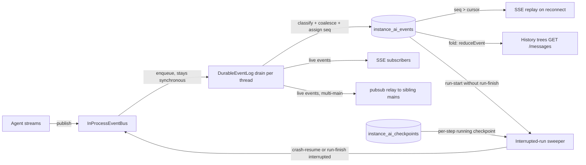

# Instance AI durable event log: technical documentation

The reference documentation for the system as implemented on `r00gm/durable-log-qa-section` (merge candidate) and `r00gm/durable-log-sunset-preview` (end state). Companions: [RFC](./rfc-instance-ai-durable-event-log.md), [evaluation report](./durable-log-evaluation-report.md) (all numbers cited here were measured there), [final status](./durable-log-final-status.md).

## What it is

Every fact the Instance AI UI renders (agent text, tool calls, sub-agent activity, confirmations, run lifecycle) is appended to a durable, per-thread, sequenced log table (`instance_ai_events`) the moment it happens. The UI, live and historical, is a fold of that log. Token deltas remain in-memory transport. The design rule underneath everything: **streaming granularity is not persistence granularity; deltas are transport, steps are state.**

## Architecture



**Write path.** `publish()` stays synchronous: events enqueue into a per-thread drain. The drain classifies each event (see taxonomy), closes open text/reasoning segments into block facts, assigns contiguous `seq` values from the DB (`MAX(seq)` seeded, re-seeded and retried on the `(threadId, seq)` PK conflict, bounded at 5 attempts), batch-INSERTs, then emits: durable facts enter the bus cache and SSE; ephemeral events go to SSE only, carrying **no `id:` line**, so the browser's replay cursor only ever points at durable facts. A shutdown flush persists open segments so streamed text survives a mid-segment stop.

**Read paths.** SSE reconnect replays `seq > cursor` from the table (valid across restarts and, since the table lives in the shared DB, across mains). History folds the log through the same shared reducer the frontend uses live (`reduceEvent`, `buildAgentTreeFromEvents`). The sweeper queries for runs with a `run-start` and no `run-finish`.

**The three stores, and why each is irreducible.** Each is the unique answer to one question; collapse any pair and you lose the property in the last column.

| Store | Question it answers | Content fidelity | Lost if merged away |
|---|---|---|---|
| `instance_ai_messages` | what does the model see next turn | provider fidelity: thinking signatures, provider tool-use ids, SDK bookkeeping | model replay validity (signatures can't be reconstructed from render facts) |
| `instance_ai_events` | what happened, in order, for anyone to render or replay at any moment | render fidelity: all agents, total order, cursors | mid-run durability, restart replay, multi-main correctness |
| `instance_ai_checkpoints` | where exactly does an interrupted run resume | full SDK state incl. pending tool calls, mid-step | HITL and crash resume |

## Event taxonomy

| Class | Types | Persisted | Live SSE | SSE `id:` |
|---|---|---|---|---|
| Ephemeral | `text-delta`, `reasoning-delta`, `status`, `filesystem-request` | never | yes | none |
| Coalesced | `text-block`, `reasoning-block` (one per streamed segment, closed at the next structural fact or on a `responseId` change) | yes | no (live clients already saw the deltas) | seq |
| Structural | `run-start/finish`, `tool-call/result/error/interrupted`, `agent-spawned/completed`, `confirmation-request`, `tasks-update`, `thread-title-updated`, `error` | yes | yes | seq |

Replace semantics make replay exact: a block carries its segment's `responseId`, and the shared reducer replaces the segment's streamed deltas instead of appending, so a client that reconnects mid-block never sees text or reasoning twice. Live stream = ephemeral + structural; replay stream = coalesced + structural; both are complete.

## The table, and the reasoning for a new one

```
instance_ai_events
  threadId  uuid   PK, FK -> instance_ai_threads ON DELETE CASCADE
  seq       int    PK   per-thread monotonic; the SSE replay cursor
  runId     varchar     indexed with threadId for run-scoped folds
  type      varchar     discriminator, duplicated out of the payload
  payload   text        JSON of the canonical InstanceAiEvent, raw values
```

Append-only: state transitions are new facts folded at read (one `run-finish{cancelled}` supersedes all in-flight items; nothing is ever UPDATEd). Retention is inherited, not separate policy: rows cascade with thread deletion under the existing thread TTL (default 90 days). Schema evolution is additive only; the fold is a tolerant reader.

Why a new table instead of reusing what existed, the definitive short version:

- **Not `instance_ai_messages`:** it is the model's store, with opposite fidelity in both directions. It carries provider metadata the UI never needs (thinking signatures, without which thinking blocks cannot be replayed to Anthropic, proven live in the evaluation) and it structurally cannot carry sub-agent activity, which by the delegation architecture never enters the orchestrator's context (verified empirically: a planner's 13 tool calls exist only as events). The write patterns are also incompatible: SDK-owned turn-delta writes versus append-only facts from concurrent producers across processes.
- **Not `instance_ai_run_snapshots`:** a snapshot is a view, and this project exists because making a view the durable record fails: it was assembled at run-finish from an evictable buffer, which shipped the empty-`agentTree` bug, loses everything on mid-run crash, and cannot answer a cursor. Views can always be cached from facts; facts can never be recovered from a view. The table is deleted at sunset.
- **Not one rich UI-message store with converters:** the in-progress record must be append-only rows with a sequence, because sub-agents and background tasks publish concurrently (across mains) and reconnect needs `seq > cursor`; a growing message row rewritten per event is the same log with O(n²) writes, lock contention, and no cursor. Any single table shaped to fix the actual bugs is this table under another name.
- **Not Redis:** n8n treats Redis as wipeable transport with no persistence guarantee; it would be a second, independently-regressable source of truth with no transactional link to the other stores, and stream trimming reintroduces eviction. Redis remains what it is here: the live-push relay.
- **Prior art:** Conductor/Claude Code, inspected on disk, converged on the same split independently: an append-only provider-fidelity log for the model plus a derived, indexed store for rendering, zero deltas persisted, raw at rest. Our additions (DB-assigned seq, conflict retry, cursor replay) map exactly to the two requirements it doesn't have: remote SSE clients and concurrent producers.

## Resilience layer

Per-step checkpoints (`stepCheckpoints` opt-in in `@n8n/agents`): one `running`-status checkpoint upserted per settled tool batch, so a crash loses only the in-flight step. The startup sweeper resolves every unfinished run: in-flight tool calls become `tool-interrupted` facts ("effect unverified; verify before retrying", never blind re-execution); with a running checkpoint the run is crash-resumed under its original runId (atomic compare-and-swap claim so two mains never double-drive; undrained steering corrections re-queued from the log-vs-checkpoint diff); otherwise one `run-finish{interrupted}` is appended. HITL-suspended runs are skipped (the pending-confirmation path owns them). Multi-main liveness needs no lease table: durable activity is the heartbeat (facts and checkpoint writes younger than a grace window mean a sibling is driving).

The invariants, all now held: every completed step is durable before the next starts; any client on any main can reconstruct any thread from the DB alone; every run reaches a terminal state recorded in the log; every suspension is resumable; the only thing a crash can lose is the in-flight step.

## What we gain at merge (measured, not projected)

| Before (shipped behavior) | After (measured) |
|---|---|
| Restart loses all replay state; cursors reset to 1 and replay wrongly | Replay exact across restarts; cursors permanently valid (real-process SIGTERM test) |
| Long runs evict their own history mid-run; the motivating incident rendered 16 of 60 tool calls | 60 of 60; eviction is now a cache bound, incapable of data loss |
| Empty/degenerate `agentTree` bug class (snapshot frozen from a truncated buffer) | Dead: history folds complete facts; degenerate-snapshot threads render 3/3 vs 0/3 |
| Crash mid-run loses the run; UI spins forever | `kill -9` proven: sweep terminates or crash-resumes; real-Anthropic resume completed under the original runId with zero provider signature errors |
| Duplicate text on mid-stream reconnect | Exact (replace semantics; deep-equal tree proof) |
| Multi-main replay only correct with lucky routing | Correct by construction: the log is in the shared DB; per-main id authority is moot |
| Steering corrections silently lost if queued at crash | Re-queued deterministically from the log-vs-checkpoint diff |
| Cost of all of the above | +1.1ms p50 delivery at realistic pacing; 4 rows / ~2KB per LLM step; flag-off byte-for-byte (5,700+ existing tests green) |

Beyond the bug ledger: one reconstruction path ("fold the log") replaces five compensation mechanisms; every fact carries attribution (`userId` rides `run-start`), the substrate shared threads and audit need; branching and lazy backfill of old threads are additive follow-ups the schema already permits; and at Gate B the sunset branch (already written, measured at −2,939) deletes the flag, the parser fallback ladder, the snapshot machinery, and the legacy bus internals, landing the render/replay path net smaller than before the project.

## Operations

Flag `N8N_INSTANCE_AI_DURABLE_LOG` (default off; byte-for-byte legacy when off). Watch: `append_failures_total` (expect 0), queue latency p95 (envelope ~2ms paced), `parser_fallbacks_total` for post-log threads (expect 0), sweep counters after restarts. Gate A (default on) requires one clean release cycle of those. Gate B (sunset) is NOT purely calendar-based, because the thread TTL is configurable (0 = never) and activity-based, so pre-log turns can survive any window (long-lived active threads keep their early, event-less turns forever). The sunset PR therefore ships with a backfill: runs without event rows get them synthesized once from the snapshot (else messages), marked `synthetic` and excluded from the sweeper and crash-resume; the snapshots table drops one release after the read paths, since backfill uses it as source. Rollback at any point before Gate B is a flag flip, not a migration.
