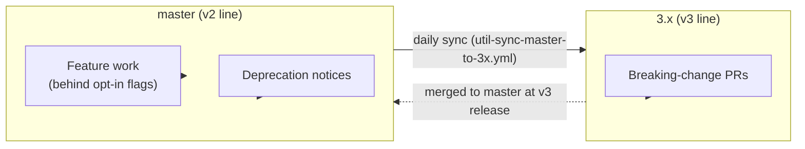

# Developing v3 features

n8n is preparing a **v3 major release** (~October 2026). v3 is an *operational*
release: breaking changes, removals, and legacy cleanup — not a big-bang feature
launch. From July until release we keep **two long-lived branches alive at once**,
and this guide explains how to develop against them without friction.

> **TL;DR**
> - Normal feature work → land on **`master`**, behind an **opt-in feature flag**.
> - Breaking changes → a separate PR targeting **`3.x`** directly. **Never on `master`.**
> - `master` is synced into `3.x` **daily**, automatically.

## The branch model

`3.x` is not a divergent fork — it is simply **"whatever is on `master`, plus the
breaking-change commits"**. Their histories stay in lockstep via a daily sync, so
merging `3.x` back into `master` at release time is painless.



| You want to… | Where it goes | How |
|--------------|---------------|-----|
| Ship a new feature/behavior | `master` | Behind an **opt-in flag** (see below) |
| Warn engineers a function is going away | `master` | Add a **deprecation notice** so usage drops before v3 |
| Create a migration | `master` | Create a non-destructive migration in master. After the release of v3, you can create the destructive part of migration if needed |
| Remove/change something in a breaking way | `3.x` | A **separate PR targeting `3.x`** directly |

## Developing a normal feature on `master` (behind an opt-in flag)

Land new implementations on `master` disabled by default, so they ride the daily
sync into `3.x` and can be trialed without affecting v2 users. n8n uses **PostHog**
for flags, evaluated server-side and bootstrapped to the frontend.

### Frontend (editor-ui)

1. Register the experiment in
   [`packages/frontend/editor-ui/src/app/constants/experiments.ts`](../packages/frontend/editor-ui/src/app/constants/experiments.ts)
   with `createExperiment`, using the next numeric index prefix:
   ```ts
   export const MY_V3_FEATURE_EXPERIMENT = createExperiment('0XX_my_v3_feature');
   ```
   Add its name to `EXPERIMENTS_TO_TRACK` if it should emit exposure telemetry.
2. Gate the code via the PostHog store — for a boolean opt-in flag use
   `isFeatureEnabled`:
   ```ts
   const posthog = usePostHogStore();
   if (posthog.isFeatureEnabled(MY_V3_FEATURE_EXPERIMENT.name)) {
     // new v3 behavior
   }
   ```
3. Put per-experiment code in its own folder under
   `packages/frontend/editor-ui/src/experiments/<name>/`.

The **`n8n:experiments` skill** ([`.agents/skills/experiments/`](../.agents/skills/experiments/SKILL.md))
is the authoritative, step-by-step procedure — including creating the disabled
PostHog flags in Staging/Production first.

### Backend (cli / config)

A backend opt-in flag is three small pieces (worked example: the
`084_eval_collections` flag):

1. **Flag key** constant in `@n8n/api-types`
   (e.g. `EVAL_COLLECTIONS_FLAG = '084_eval_collections'` in
   `packages/@n8n/api-types/src/schemas/eval-collections.schema.ts`).
2. **Env toggle** — an `@Env('N8N_...')` boolean defaulting to `false` in a
   `@n8n/config` config class
   (e.g. `N8N_EVAL_COLLECTIONS_ENABLED` in
   `packages/@n8n/config/src/configs/evaluation.config.ts`).
3. **Override wiring** in `PostHogClient.applyEnvOverrides()`
   ([`packages/cli/src/posthog/index.ts`](../packages/cli/src/posthog/index.ts)) —
   force-enable the flag when the env toggle is on:
   ```ts
   if (this.globalConfig.evaluation.collectionsEnabled) {
     overrides[EVAL_COLLECTIONS_FLAG] = true;
   }
   ```
   The override is **force-enable only**; `false` defers to PostHog.

Evaluated flags flow to the frontend through the login / current-user response,
so a single flag key can gate both backend and frontend behavior.

### Testing behind a flag

Override flags locally without touching PostHog:
- **Browser:** `window.featureFlags.override('0XX_my_v3_feature', true)`.
- **Playwright:** set the storage override in `TestRequirements`:
  ```ts
  test.use({ requirements: {
    storage: { N8N_EXPERIMENT_OVERRIDES: JSON.stringify({ '0XX_my_v3_feature': true }) },
  } });
  ```

## Introducing a breaking change (on `3.x`)

Breaking changes go **only on `3.x`**, via a PR that targets `3.x` directly
(branch off the latest `3.x`, open the PR against `3.x`). Do not land breaking
changes on `master` — the sync guarantees `master` stays releasable as v2.

- Track the change in the [v3 breaking-changes tracker](https://www.notion.so/n8n/1a75b6e0c94f802caca3ce378d0d8046)
  and the [Release v3 Linear project](https://linear.app/n8n/project/release-v3-7d7032bebbec/activity).
- Follow the `BREAKING CHANGE:` PR-title convention (see
  [`pull_request_title_conventions.md`](./pull_request_title_conventions.md)).

**Deprecations land on `master`.** If you plan to remove a function/class in v3,
add a deprecation notice on `master` first so other engineers reduce usage ahead
of the breaking removal on `3.x`.

## How the daily sync works

[`util-sync-master-to-3x.yml`](./workflows/util-sync-master-to-3x.yml) runs daily
and merges `master` into `3.x`:

1. **Fast-forward** when `3.x` hasn't diverged.
2. **Three-way merge** when it has.
3. On a **merge conflict** it opens a **draft conflict PR** (labeled
   `automation:v3-sync`) and posts to the **`#alerts-v3-sync`** Slack channel.
   **Syncs pause until that PR is resolved and merged** — so conflicts never pile
   up silently.

**Who gets pinged.** The conflict is attributed to the authors of the `3.x`
breaking commits touching the conflicted files (computed by
`.github/scripts/sync-conflict-owners.mjs`: the `master..HEAD` commits per
conflicted file, mapped to GitHub accounts). Those authors are **requested as
reviewers** on the conflict PR and listed in the `#alerts-v3-sync` message. So if you
authored the breaking commit that caused a conflict, you'll be nudged to resolve
it: fix the conflict markers on the `sync/master-to-3x` branch and merge the PR;
the next daily run then resumes normally.

## Trialing v3

`3.x` publishes nightly Docker images (see
[`build-v3-nightly.yml`](./workflows/build-v3-nightly.yml)):

```bash
docker pull n8nio/n8n:v3-nightly              # latest v3 nightly
docker pull n8nio/n8n:v3-nightly-20260625     # a specific build date
```

Use these to trial v3 in docker/kubernetes before release. Do **not** use them in
production.

## See also

- [`.github/WORKFLOWS.md`](./WORKFLOWS.md) — full CI/CD + release lifecycle.
- Root [`AGENTS.md`](../AGENTS.md) — general repo guidance.
- [Branching strategy & releases (Notion)](https://www.notion.so/n8n/Major-Release-v3-Branching-strategy-and-releases-38a5b6e0c94f800881deeb11e515f543).
