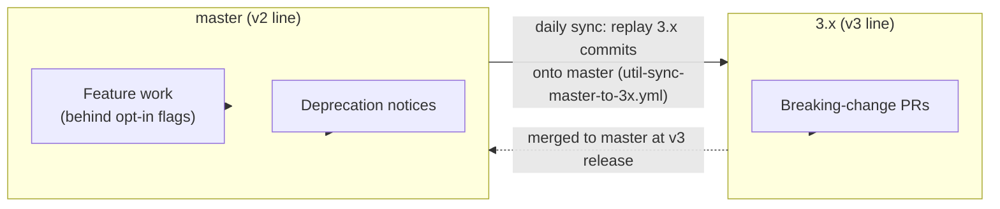

# Developing v3 features

n8n is preparing a **v3 major release** (~October 2026). v3 is an *operational*
release: breaking changes, removals, and legacy cleanup — not a big-bang feature
launch. From July until release we keep **two long-lived branches alive at once**,
and this guide explains how to develop against them without friction.

> **TL;DR**
> - Normal feature work → land on **`master`**, behind an **opt-in feature flag**.
> - Breaking changes → a separate PR targeting **`3.x`** directly. **Never on `master`.**
> - `master` is synced into `3.x` **daily**, automatically.

## The branch model

`3.x` is not a divergent fork — it is simply **"whatever is on `master`, plus the
breaking-change commits"**. A daily sync keeps that literally true by replaying those
commits on top of `master`, so merging `3.x` back into `master` at release time is painless.


```mermaid
flowchart LR
    subgraph master["master (v2 line)"]
        F["Feature work<br/>(behind opt-in flags)"]
        D["Deprecation notices"]
    end
    subgraph threex["3.x (v3 line)"]
        B["Breaking-change PRs"]
    end
    F --> master
    D --> master
    master -- "daily sync: replay 3.x commits<br/>onto master (util-sync-master-to-3x.yml)" --> threex
    B --> threex
    threex -. "merged to master at v3 release" .-> master
```

| You want to… | Where it goes | How |
|--------------|---------------|-----|
| Ship a new feature/behavior | `master` | Behind an **opt-in flag** (see below) |
| Warn engineers a function is going away | `master` | Add a **deprecation notice** so usage drops before v3 |
| Create a migration | `master` | Create a non-destructive migration in master. After the release of v3, you can create the destructive part of migration if needed |
| Remove/change something in a breaking way | `3.x` | A **separate PR targeting `3.x`** directly |

## Developing a normal feature on `master` (behind an opt-in flag)

Land new implementations on `master` disabled by default, so they ride the daily
sync into `3.x` and can be trialed without affecting v2 users. n8n uses **PostHog**
for flags, evaluated server-side and bootstrapped to the frontend.

### Frontend (editor-ui)

1. Register the experiment in
   [`packages/frontend/editor-ui/src/app/constants/experiments.ts`](../packages/frontend/editor-ui/src/app/constants/experiments.ts)
   with `createExperiment`, using the next numeric index prefix:
   ```ts
   export const MY_V3_FEATURE_EXPERIMENT = createExperiment('0XX_my_v3_feature');
   ```
   Add its name to `EXPERIMENTS_TO_TRACK` if it should emit exposure telemetry.
2. Gate the code via the PostHog store — for a boolean opt-in flag use
   `isFeatureEnabled`:
   ```ts
   const posthog = usePostHogStore();
   if (posthog.isFeatureEnabled(MY_V3_FEATURE_EXPERIMENT.name)) {
     // new v3 behavior
   }
   ```
3. Put per-experiment code in its own folder under
   `packages/frontend/editor-ui/src/experiments/<name>/`.

The **`n8n:experiments` skill** ([`.agents/skills/experiments/`](../.agents/skills/experiments/SKILL.md))
is the authoritative, step-by-step procedure — including creating the disabled
PostHog flags in Staging/Production first.

### Backend (cli / config)

A backend opt-in flag is three small pieces (worked example: the
`084_eval_collections` flag):

1. **Flag key** constant in `@n8n/api-types`
   (e.g. `EVAL_COLLECTIONS_FLAG = '084_eval_collections'` in
   `packages/@n8n/api-types/src/schemas/eval-collections.schema.ts`).
2. **Env toggle** — an `@Env('N8N_...')` boolean defaulting to `false` in a
   `@n8n/config` config class
   (e.g. `N8N_EVAL_COLLECTIONS_ENABLED` in
   `packages/@n8n/config/src/configs/evaluation.config.ts`).
3. **Override wiring** in `PostHogClient.applyEnvOverrides()`
   ([`packages/cli/src/posthog/index.ts`](../packages/cli/src/posthog/index.ts)) —
   force-enable the flag when the env toggle is on:
   ```ts
   if (this.globalConfig.evaluation.collectionsEnabled) {
     overrides[EVAL_COLLECTIONS_FLAG] = true;
   }
   ```
   The override is **force-enable only**; `false` defers to PostHog.

Evaluated flags flow to the frontend through the login / current-user response,
so a single flag key can gate both backend and frontend behavior.

### Testing behind a flag

Override flags locally without touching PostHog:
- **Browser:** `window.featureFlags.override('0XX_my_v3_feature', true)`.
- **Playwright:** set the storage override in `TestRequirements`:
  ```ts
  test.use({ requirements: {
    storage: { N8N_EXPERIMENT_OVERRIDES: JSON.stringify({ '0XX_my_v3_feature': true }) },
  } });
  ```

## Introducing a breaking change (on `3.x`)

Breaking changes go **only on `3.x`**, via a PR that targets `3.x` directly. Branch off
**latest `master`** and open the PR against `3.x` — since `3.x` is `master` plus the breaking
commits, such a PR merges cleanly and is immune to the daily force-push (see
[How the daily sync works](#how-the-daily-sync-works)). Do not land breaking changes on
`master` — the sync guarantees `master` stays releasable as v2.

- Track the change in the [v3 breaking-changes tracker](https://www.notion.so/n8n/1a75b6e0c94f802caca3ce378d0d8046)
  and the [Release v3 Linear project](https://linear.app/n8n/project/release-v3-7d7032bebbec/activity).
- Follow the `BREAKING CHANGE:` PR-title convention (see
  [`pull_request_title_conventions.md`](./pull_request_title_conventions.md)).

**Deprecations land on `master`.** If you plan to remove a function/class in v3,
add a deprecation notice on `master` first so other engineers reduce usage ahead
of the breaking removal on `3.x`.

## How the daily sync works

[`util-sync-master-to-3x.yml`](./workflows/util-sync-master-to-3x.yml) runs daily and
**replays the `3.x`-only commits on top of `master`** (a rebase), then force-pushes `3.x`:

1. **Nothing to do** when `3.x` already contains `master`.
2. **Replay + force-push** otherwise. A clean sync adds **no commit of its own** — `3.x`
   stays literally "master + the breaking commits", every replayed commit kept as-is with its
   original message and author. Nothing is ever squashed. Merge commits in the range (breaking
   PRs merged into `3.x`) are flattened away, and a breaking commit that also landed on
   `master` is dropped as empty.
3. Conflicts confined to **mechanical files** — tool-generated content with a deterministic
   resolution (`pnpm-lock.yaml`, `packages/frontend/editor-ui/data/node-popularity.json`,
   `.github/test-metrics/e2e-impact-map.json`) — are **auto-resolved during the replay**,
   exactly as a human resolver would: the lockfile is regenerated with
   `pnpm install --lockfile-only` (pnpm merges its own conflict markers), bot-maintained data
   files take `master`'s side. The resolution is folded into the stalled commit, so this
   still adds **no commit and no PR**. The list lives in `MECHANICAL_PATHS` in
   [`sync-master-to-3x.mjs`](./scripts/sync-master-to-3x.mjs).
4. On a **real code conflict**, `3.x` is left **untouched** and a **draft conflict PR**
   (labeled `automation:v3-sync`) carrying the conflict markers is opened on
   `sync/master-to-3x` — with the mechanical files already pre-resolved — plus a post to the
   **`#alerts-v3-sync`** Slack channel. **Syncs pause until that PR is merged** — so
   conflicts never pile up silently.

Whatever route it takes, the sync verifies that the content it is about to push is **exactly
the tree a merge of `3.x` and `master` produces** (`git merge-tree`), and that no conflict
markers are present. When mechanical files had to be regenerated, the exactness check applies
to every path **except** those files, and a regenerated lockfile must additionally be
consistent with the manifests in the pushed tree. Any check failing fails the run instead of
rewriting `3.x`.

> **`3.x` is force-pushed daily.** Branch breaking-change PRs off **`master`** and target
> `3.x` — then your merge-base is a `master` commit that survives every rewrite and your
> diff stays clean. If you branch off `3.x` itself, re-base after a sync
> (`git rebase --onto origin/3.x <old-3.x-tip> <your-branch>`). Commit links on
> already-merged `3.x` PRs keep working but point at commits no longer on any branch.

### Resolving a conflict PR

The conflict branch is `master` merged into `3.x` with the **conflict markers committed**, so
you see exactly what clashed — and the required checks stay red until they're gone, so the PR
can't be merged half-resolved. Mechanical files arrive **pre-resolved** (listed in the PR
under "Auto-resolved for you"), so only the real code conflicts need you:

```bash
git fetch origin sync/master-to-3x && git switch sync/master-to-3x
# fix the conflict markers, then commit them in ONE commit of your own
git push origin sync/master-to-3x
```

If the PR says the lockfile was **deferred** (a `package.json` / `pnpm-workspace.yaml` is
conflicted too), resolve the manifests first, then regenerate it with
`pnpm install --lockfile-only` and include the result in your fix commit.

Watch for the **"Deleted on one side, changed on the other"** section. Git leaves no markers
for a delete/modify, so the branch looks clean where it is not: the merge keeps `3.x`'s side
(its deletion, or its file when `master` deleted it). Confirm that is right, and check
whether `master`'s change has to be carried over by hand — when a breaking commit re-recorded
or renamed a file, `master`'s edit to the old one usually belongs on the replacement, and no
automation can find that for you. The PR names the `master` commit behind each conflicted
path so you can see what the change was.

Then **merge the PR with the normal merge button.** `master`'s commits arrive as-is and your
fix stays its own commit. **Never close a conflict PR unmerged** — closing resolves nothing and
the same conflict reopens on the next sync.

`3.x` never holds markers at its tip, so nightly images keep building; the merge commit that
carries them drops out of `3.x`'s history at the next sync (the replay takes the queue's
commits only).

The next sync then makes `3.x` linear again. The plain replay stalls at that point (a fix
recorded around a merge commit leaves no patch to replay), so it replays a second time with
`3.x`'s side favoured, and your fix commit — which is in the queue — does the real work.
Stalls that favouring cannot settle on its own (e.g. modify/delete, when `master` touched a
file a breaking commit deletes) are resolved toward `3.x`'s side during the replay. Nothing
is squashed, and the tree guard proves the result is exactly the merge of `3.x` and
`master`.

**Who gets pinged.** The conflict is attributed to the authors of the `3.x` commits behind the
conflicted files, plus the `master` commits that touched the same files
(`.github/scripts/sync-conflict-owners.mjs`, mapped to GitHub accounts). Both sides are named
in the PR body and the `#alerts-v3-sync` message. **Nobody is requested as a reviewer** — the
resolver picks the PR up themselves.

## Trialing v3

`3.x` publishes nightly Docker images (see
[`build-v3-nightly.yml`](./workflows/build-v3-nightly.yml)):

```bash
docker pull n8nio/n8n:v3-nightly              # latest v3 nightly
docker pull n8nio/n8n:v3-nightly-20260625     # a specific build date
docker pull n8nio/n8n:v3-rc                   # latest release candidate
docker pull n8nio/n8n:v3-rc-20260625          # latest RC of that day
docker pull n8nio/n8n:v3-rc-20260625.2        # one exact RC, never overwritten
```

Every Monday's nightly is also retagged as a release candidate, and a maintainer can
publish extra RCs any day (`force_rc` on a manual run). Each publish claims the next
rolling number for the day — `v3-rc-<date>.1`, `.2`, … — and moves `v3-rc` and
`v3-rc-<date>` onto it, so:

- **`v3-rc-<date>.N`** — pin this to hold a build still. Immutable.
- **`v3-rc` / `v3-rc-<date>`** — track the newest RC overall / of that day. These move.

The retag covers the whole set — `n8nio/n8n`, `n8nio/runners` and
`n8nio/runners:v3-rc[-<date>.N]-distroless` — so pinning one RC across a stack gives
images built from one `3.x` commit, unlike `v3-nightly`, which moves daily and can be
mid-build when you pull. The same tags exist on GHCR (`ghcr.io/n8n-io/…`).

Use these to trial v3 in docker/kubernetes before release. Do **not** use them in
production.

## See also

- [`.github/WORKFLOWS.md`](./WORKFLOWS.md) — full CI/CD + release lifecycle.
- Root [`AGENTS.md`](../AGENTS.md) — general repo guidance.
- [Branching strategy & releases (Notion)](https://www.notion.so/n8n/Major-Release-v3-Branching-strategy-and-releases-38a5b6e0c94f800881deeb11e515f543).
