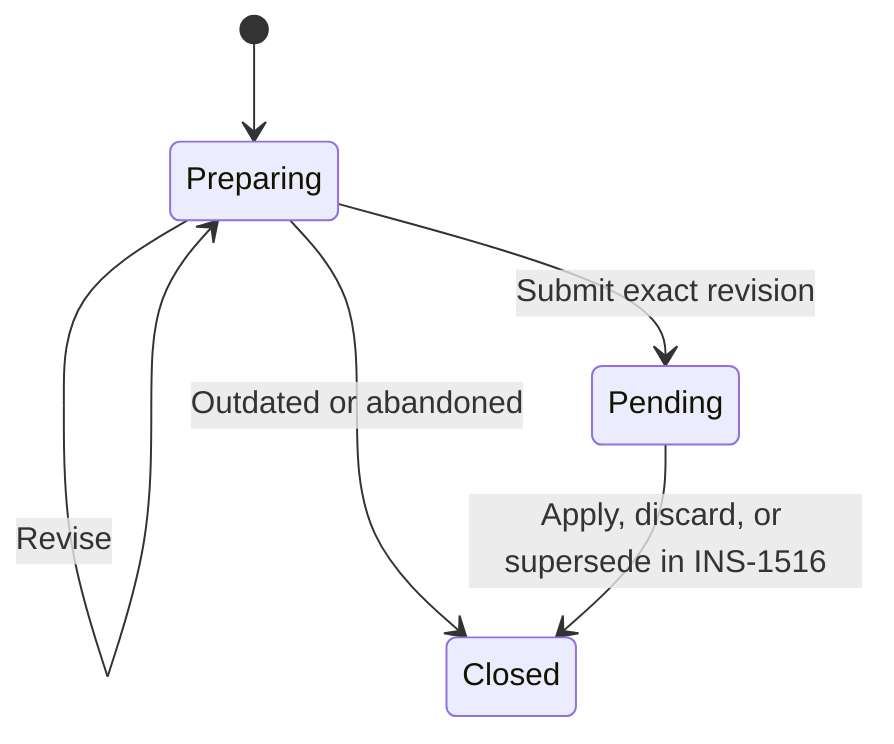

# INS-1515: Store isolated workflow drafts for review

[Linear ticket](https://linear.app/n8n/issue/INS-1515)

Status: implemented in this worktree. The pseudocode explains the design. See [the module README](packages/cli/src/modules/workflow-drafts/README.md) for the implemented APIs and feature gate.

Implementation details: draft revisions use a conditional database update. Required validation runs before storage. Configuration diagnostics and execution verification remain `not_run` until the later integration tickets. Historical identity columns have no foreign keys so receipts survive target deletion. Drafts retain their original project when a workflow moves.

## Goal

Let the Assistant prepare a workflow fix in separate storage. Let it revise the fix and submit one exact revision for human review.

Draft operations must leave the saved workflow, history, editor canvas, and production workflow unchanged. Build and test this with a sample fix before connecting the Assistant.

This service stores fix drafts and **Fix ready** proposals. M2 stores **Needs you** and **Could not fix** results without proposals. INS-1517 defines the shared three-kind inbox contract. M5 adds informational detail and private chat handoff. Automatic rollout waits until all three outcomes are visible.

## Agreed scope

| Choice | Decision |
| --- | --- |
| Editable content | Nodes and connections only. Preserve all other baseline fields. |
| Eligible target | A published workflow with no saved changes waiting to publish. |
| Original state | Store the original snapshot, saved version ID, published version ID, and existing workflow checksum. |
| Candidate | Keep the latest candidate and a revision number. Freeze that revision on submission. |
| Background identity | The person who enabled self-healing. Keep Assistant authorship and human review actions separate. |
| Review access | Current workflow editors. Losing publish permission alone does not remove review access. |
| Retention | Expire abandoned preparing drafts after 7 days of inactivity. Keep pending content. Remove closed content after 30 days. |
| Retry identity | Keep the source key and recorded result after content cleanup. |
| Availability | Support Community and Enterprise. Ship behind an opt-in feature gate. |

The checksum compares current content with the original content. It is not an edit-history log. Keep both original version IDs beside it. Use the existing checksum implementation; do not add a settings-history mechanism.

## Keep the implementation small

Use one feature module with these responsibilities. Keep the domain code under `packages/cli/src/modules/`. Put shared request and response types in `@n8n/api-types`. Put schema migrations in `@n8n/db`.

| Piece | Owns |
| --- | --- |
| `WorkflowDraftService` | Create, read, revise, and submit. Coordinate domain checks. |
| `WorkflowDraftRepository` | Draft and activity persistence. Conditional updates, uniqueness, and database locks. |
| Candidate preparation helper | Prepare a copy of the graph. Reuse existing structure and credential rules. Return the exact prepared graph and its validation report. |
| Access helpers | Check the background user or current reviewer through existing workflow permissions. |
| `WorkflowDraftCleanupTask` | Schedule bounded cleanup through the existing system-task infrastructure. |

Keep access helpers as functions or a small service where reuse requires it. Keep activity persistence in the draft repository initially. Add another class only when it has a distinct responsibility.

Keep create, revise, and submit as internal service operations. Expose proposal detail through a thin controller for the later review screen. Use the existing `@ProjectScope('workflow:update')` guard on a project-scoped route. The service must also check the target workflow and its project binding.

Use explicit inputs. Pass a small source identity from trusted backend code. Do not pass the full `InstanceAiContext` to draft storage. Keep the source identity separate from the database `OperationContext`.

```typescript
type DraftGraph = {
  nodes: INode[];
  connections: IConnections;
};

type ReviseDraftInput = {
  draftId: string;
  expectedRevision: number;
  graph: DraftGraph;
  explanation: string;
};

// Server-owned values. The model cannot select its identity or target.
type DraftSource = {
  sourceKey: string;
  workflowId: string;
  backgroundUserId: string;
  expectedBaseline: {
    savedVersionId: string;
    publishedVersionId: string;
    checksum: string;
  };
};
```

Validate these shapes at runtime. Reject extra workflow fields. The explanation is separate from workflow content.

## 1. Add the data model

Use one draft record through preparation and review. Submission changes its state. It does not copy the draft into another proposal system.



Store these groups of data:

- **Identity:** draft ID, source key, workflow ID, project ID, background user ID, and Assistant authorship.
- **Baseline identity:** original saved version ID, published version ID, and checksum.
- **Content:** original snapshot, latest candidate graph, explanation, and validation report.
- **Lifecycle:** state, current revision, submitted revision, activity time, closure time, and closure reason.
- **Error context:** a permitted error summary and evidence reference. Evidence retention belongs to M3.

Add a proposal-owned activity table. Record submission with the draft transition. Later actions record the human actor separately.

Keep snapshots independent of workflow history and private Assistant threads. History pruning or thread deletion must not remove the proposal. Make the content removable while keeping the identity and final result.

Use database constraints for a unique source key and at most one pending proposal per workflow. M2 owns the investigation claim; this ticket does not add a second investigation scheduler.

## 2. Create and read a preparing draft

M2 captures the expected IDs and checksum when it admits the investigation, before the Assistant starts reasoning. It passes those same values after queue waits or restarts. For the M1 sample, capture them immediately before creating the draft.

Resolve the target project on the server. Check the background user's current access. Compare all three expected baseline values with a consistent workflow read before storing its content. A settings edit between investigation admission and draft creation must reject the old baseline.

```typescript
async createDraft(source: DraftSource) {
  await access.requireBackgroundEditor(source);

  const existing = await drafts.findBySourceKey(source.sourceKey);
  if (existing) {
    assertSameSource(existing, source);
    return existing;
  }

  const baseline = await workflows.captureEligibleDraftBaseline(source);

  return drafts.createOnce({
    source,
    projectId: baseline.projectId,
    baseline,
    candidate: copyGraph(baseline.snapshot),
    revision: 1,
    state: 'preparing',
    validation: { status: 'unchecked' },
  });
}
```

`captureEligibleDraftBaseline` checks the expected saved ID, published ID, and `await calculateWorkflowChecksum(workflow)`. It also checks required publication state, archive state, and ownership.

`createOnce` handles concurrent requests through source-key uniqueness. A reused key must refer to the same source, actor, target, and expected baseline. An expired record must not create a replacement.

An internal draft read checks the source binding and current background-user access. It returns the latest candidate and revision. Preparing drafts stay out of the review inbox.

## 3. Revise the candidate

Prepare a copy. Validate the prepared graph. Store that exact result with the next revision.

```typescript
async reviseDraft(source: DraftSource, input: ReviseDraftInput) {
  const draft = await loadDraftForBackgroundUser(source, input.draftId);
  requirePreparingContent(draft);
  requireRevision(draft, input.expectedRevision);

  const prepared = await candidates.prepare({
    actorId: draft.backgroundUserId,
    projectId: draft.projectId,
    baseline: draft.originalSnapshot,
    graph: input.graph,
  });
  requirePassed(prepared.validation.requiredChecks);

  return drafts.reviseIfCurrent({
    draftId: draft.id,
    expectedRevision: input.expectedRevision,
    graph: prepared.graph,
    validation: prepared.validation,
    explanation: input.explanation,
  });
}
```

The repository updates only a preparing draft whose revision still matches. It increments the revision and attaches validation to that same revision in one write. A conflicting edit returns a revision conflict.

Keep the submission rules explicit:

- **Required checks:** supported fields, graph structure, credential access and preservation, credential-to-node restrictions, preserved node-group consistency, and applicable workflow-save policies. Every required check must pass.
- **Configuration diagnostics:** record parameter and connection issues. These do not block storage submission in INS-1515. INS-1479 connects shared diagnostics to Assistant tools. M2 uses those findings to choose the investigation outcome.
- **Execution verification:** record `not_run` unless the exact candidate was verified. Candidate execution is outside this ticket. The original failed execution is not a validation failure of the proposed graph.

M2 validates the final result on the server before it accepts Fix ready and submits the draft. The model selecting Fix ready is not sufficient proof that the candidate is valid.

Some existing credential rules can replace a submitted node with its stored version. Apply preparation against the captured baseline. Do not silently reload a newer workflow as the baseline. If preparation cannot produce an allowed graph, preserve the previous revision and return the errors.

Keep the helper close to the existing save order:

```typescript
async prepare(input: CandidateInput) {
  const candidate = copyBaselineWithGraph(input.baseline, input.graph);
  await resolveCredentialReferences(candidate, input.projectId);
  await applyCredentialProtection(candidate, input.baseline, input.actorId);
  addNodeIds(candidate);
  resolveNodeWebhookIds(candidate);
  const validation = await checkRequiredDraftRules(candidate, input);
  return { graph: graphOf(candidate), validation };
}
```

These names describe small adapters around existing helpers. Reuse `validateWorkflowCredentialUsage` with the captured baseline where sharing rules apply. Do not call `preventTampering`, which loads the current workflow. Preserve existing license behavior. Evaluate save policies without invoking workflow-save hooks or writing workflow content.

The exact prepared revision must have a changed graph and a passing required-check report before submission. Missing required checks cannot count as passing. Record optional checks as `not_run` when unavailable. Do not use the Assistant validator's broad `valid` flag as this gate.

Reuse backend helpers. Extract only the shared code that is needed. Compilation and Assistant-tool adaptation belong to INS-1479. Run remote diagnostics outside database transactions.

## 4. Submit one exact revision

Submission checks current access and the original baseline. It freezes the selected candidate and records activity together.

```typescript
async submitDraft(source: DraftSource, draftId: string, revision: number) {
  const checkedDraft = await loadDraftForBackgroundUser(source, draftId);
  if (checkedDraft.state === 'preparing') {
    requirePreparingContent(checkedDraft);
    requireRevision(checkedDraft, revision);
    requireValidatedChangedCandidate(checkedDraft);
    await candidates.assertStillAllowed(checkedDraft);
  }

  return txRunner.run({}, async (ctx) => {
    const submission = await drafts.loadForSubmission(draftId, ctx);
    const { draft, workflow } = submission;
    assertSameSource(draft, source);

    if (draft.state !== 'preparing') {
      return recordedResult(draft);
    }

    requirePreparingContent(draft);
    requireRevision(draft, revision);
    requireValidatedChangedCandidate(draft);

    if (!(await baselineMatches(draft, workflow, ctx))) {
      return drafts.closeAsOutdated(draft.id, ctx);
    }

    const proposal = await drafts.markPendingIfCurrent(draft.id, revision, ctx);
    await drafts.appendSubmittedActivity(proposal.id, revision, ctx);
    return recordedResult(proposal);
  });
}
```

The guarded load handles an existing submission or closed receipt before requiring retained content. Use a consistent lock order for pending mutations. All database reads and writes inside this transaction must use `ctx`.

`baselineMatches` requires:

1. The workflow still exists in the expected project and is not archived.
2. Its saved and published version IDs match the original IDs.
3. Its current checksum matches the original checksum.
4. Its publication state still permits submission.

The preflight checks current user access, credential rules, and applicable save policies for the selected revision. `assertStillAllowed` must not silently modify the candidate. If current rules require a different graph, return a conflict and require a new revision.

Existing access helpers do not share `OperationContext`. Run them immediately before the transaction. Inside it, require the same checked revision. This keeps baseline comparison, draft freezing, and submission activity atomic. It does not serialize permission changes. Recheck current permissions and policies at Apply. Do not refactor the authorization stack for this ticket.

An unchanged candidate cannot become a fix proposal. A retry returns the accepted proposal or closed result, even after content cleanup. It does not append another submission activity.

### Keep concurrency protection contained

Use `TransactionRunner` and repositories based on `BaseRepository`. Keep TypeORM operations in repositories.

- On PostgreSQL, lock the actual workflow row while checking and committing submission. Ordinary saves and explicit publication writes already update that row.
- The configured SQLite pooled driver already uses `BEGIN IMMEDIATE TRANSACTION`. Reuse that behavior.
- Use a conditional state-and-revision update to freeze the draft.
- Let the database enforce source-key and pending-workflow uniqueness. Convert expected conflicts to clear domain results.
- Read publication state through the same transaction. The current status reader needs a context-aware read for this use case.

These checks protect the submission boundary. They do not lock the workflow while the Assistant investigates. They do not freeze all runtime reconciliation. Keep the transaction short. The stronger guarded write that applies the fix belongs to INS-1516.

## 5. Read proposal details

Check the person opening the proposal, independently of the background identity.

Require an enabled user with both `workflow:read` and `workflow:update` on the target. Check disabled status in background operations too; those calls do not pass through HTTP authentication. Publish permission is not required to read a proposal.

```typescript
async getProposal(viewer: User, proposalId: string) {
  const proposal = await drafts.get(proposalId);
  await access.requireEnabledWorkflowEditor(viewer, proposal.workflowId);
  requireSubmittedRevision(proposal);

  if (proposal.contentExpired) {
    return toExpiredProposalDetail(proposal);
  }

  return toProposalDetail(proposal);
}
```

Return the original and proposed snapshots, explanation, validation report, error summary, status, and activity. Assemble the proposed snapshot from the stored baseline and frozen graph. Do not fetch its content from workflow history. Closed preparing drafts with no submitted revision are not review proposals.

Use the same access rule for later listing and count queries. Other current editors can review an existing proposal after the background user loses access. This does not transfer that user's identity or private thread. Publish permission is an additional check for the later Approve action.

Expose one small persisted result for M2's workflow claim and M3's evidence retention:

```typescript
type DraftLifecycleResult = {
  source: DraftSource;
  draftId: string;
  state: 'preparing' | 'pending' | 'closed';
  submittedRevision: number | null;
  closedReason: 'outdated' | 'abandoned' | 'applied' | 'discarded' | null;
  content: 'available' | 'expired';
};

async getLifecycleResult(source: DraftSource) {
  const draft = await drafts.findBySourceKey(source.sourceKey);
  if (!draft) return null;
  assertSameSource(draft, source);
  return recordedResult(draft);
}
```

This is an internal backend lookup. It returns no draft payload or private thread. M2 and M3 can recover after a restart or background-user access loss. Cleanup preserves the result. Events can prompt a refresh but are not the source of truth.

INS-1516 extends this result with the applied version and its publication outcome. `closed` alone does not mean published, recovered, or eligible for another investigation.

## 6. Clean up content in bounded batches

Use the existing system-task scheduler. Recheck state and activity before changing each selected record.

```typescript
async cleanup(now: Date) {
  const candidates = await drafts.findCleanupCandidates(now, { limit: 100 });

  for (const candidate of candidates) {
    await drafts.cleanupIfStillEligible(candidate.id, {
      abandonedBefore: subtractDays(now, 7),
      closedBefore: subtractDays(now, 30),
    });
  }
}
```

The conditional cleanup operation closes abandoned preparing drafts and removes their content. It removes closed content only after 30 days. It preserves pending content. Successful revisions refresh draft activity; an ordinary detail read does not keep abandoned work alive.

Remove expired payloads from activity details too. Retain the small source key, ID, submitted revision, and lifecycle result. Coordinate long-running preparation with M2 through the activity contract. Keep execution-evidence retention separate.

## 7. Build and verify in small steps

1. Add types, entities, constraints, and the database migration.
2. Implement create, read, and revise with a sample draft.
3. Add shared candidate preparation and explicit validation results.
4. Implement guarded submission and proposal detail.
5. Add cleanup and lifecycle-result reads.
6. Run focused checks and prepare one deployable PR behind the gate.

Confirm the concrete unit-test cases with the user before writing them, as required by `AGENTS.md`.

| Test area | Required evidence |
| --- | --- |
| Isolation | Create, revise, and submit leave workflow content, history, canvas notifications, and publication unchanged. |
| Original baseline | Reject settings or graph changes between investigation admission and draft creation. Bind source retries to the same original IDs and checksum. |
| Candidate preparation | Store the exact prepared graph. Preserve the baseline. Enforce credential access, binding restrictions, save policies, and node-group consistency. |
| Revisions | Two edits from one revision cannot overwrite each other. |
| Submission | Reject unchanged, unsupported, outdated, or required-check failures. Reject validation from another revision. Keep diagnostics and execution status separate. |
| Retries | Repeated source keys produce one proposal and one submission activity. Two sources cannot leave two pending proposals for one target. |
| Concurrent saves | Verify save-versus-submit behavior on SQLite and PostgreSQL. Keep the test focused on the submission boundary. |
| Permissions | Cover disabled users, lost edit access, retained edit access without publish access, and changed credential access. |
| Durability | History pruning and private-thread deletion do not remove proposal content. Cleanup preserves retry identity and the lifecycle result. |

Use isolated test storage. Set `N8N_USER_FOLDER` before imports that resolve user settings. Build before package lint and typecheck when shared types or package dependencies change. Use pnpm and run checks from the owning packages.

## Implementation verification

- The backend build and its dependencies pass.
- Lint and typecheck pass in `n8n`, `@n8n/db`, `@n8n/api-types`, and `@n8n/backend-common`.
- 147 focused unit tests pass, including the shared preparation and publication helpers.
- 12 integration tests pass on SQLite and PostgreSQL. These cover service isolation, retries, revision races, workflow-save locking, cleanup, and migration rollback and reapply.
- Schema documentation was regenerated for both databases.

Enable the module with `N8N_ENABLED_MODULES=workflow-drafts`. The Assistant, review UI, and Apply actions remain in the tickets below.

## Work delivered by other tickets

| Ticket | Owns |
| --- | --- |
| [INS-1516](https://linear.app/n8n/issue/INS-1516) | Apply, Approve and publish, Open in editor, discard, and pending-proposal supersession. Recheck the baseline at the actual workflow write. |
| [INS-1517](https://linear.app/n8n/issue/INS-1517) | Shared three-kind inbox contract, listing, counts, and refresh. |
| [INS-1518](https://linear.app/n8n/issue/INS-1518) | Review screen, diff, and action presentation. |
| [INS-1479](https://linear.app/n8n/issue/INS-1479) | Assistant draft tools, compilation, and shared diagnostic integration. |
| [INS-1480](https://linear.app/n8n/issue/INS-1480) | Investigation tracking, workflow claims, original baseline capture, and the three investigation outcomes. Only Fix ready submits a draft. |

## Code references

- [Workflow checksum](packages/workflow/src/workflow-checksum.ts)
- [Normal workflow preparation and save](packages/cli/src/workflows/workflow.service.ts)
- [Credential protection](packages/cli/src/workflows/workflow.service.ee.ts)
- [Workflow preparation helpers](packages/cli/src/workflow-helpers.ts)
- [Credential binding and local configuration checks](packages/cli/src/workflows/workflow-validation.service.ts)
- [Workflow-save policy enforcement](packages/cli/src/policy/policy-enforcement.service.ts)
- [Assistant configuration diagnostics](packages/@n8n/instance-ai/src/tools/workflows/validate-workflow.service.ts)
- [TransactionRunner](packages/@n8n/db/src/services/transaction.ts) and [BaseRepository](packages/@n8n/db/src/repositories/base-repository.ts)
- [SQLite transaction behavior](packages/@n8n/typeorm/src/driver/sqlite-pooled/SqliteReadWriteQueryRunner.ts)
- [Publication status reads](packages/cli/src/workflows/publication/workflow-publication-status.service.ts)
- [Existing cleanup task pattern](packages/cli/src/modules/instance-ai/instance-ai-checkpoint-pruning.task.ts)

Keep helpers specific to real operations. Prefer explicit types and ordinary functions. Keep database details in repositories. Reuse existing rules. Add abstractions only when they remove actual duplication or enforce a required boundary.
