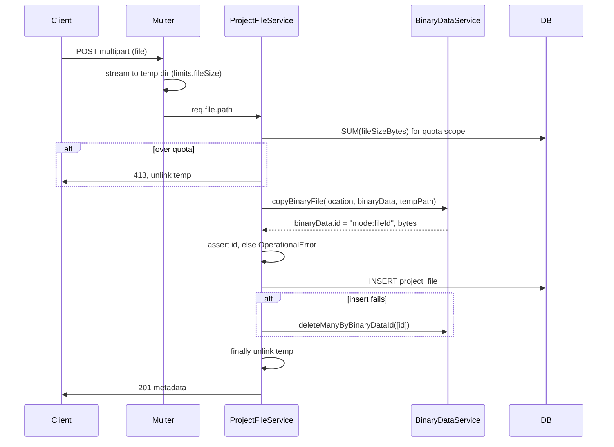

# Project Files — Phase 1 Implementation Plan

Persistent files (PDFs, CSVs, images, templates) attached directly to a Project,
as a first-class project asset alongside Data Tables.

**Phase 1 scope:** data layer, backend API, `BinaryDataService` integration, basic
UI management.

**Explicit non-goals:** workflow expression evaluation (`$projectFiles[...]`),
workflow node triggers ("On File Uploaded"), a "Project File" node, previews,
public API, source-control sync.

---

## Design decisions

| # | Decision | Rationale |
|---|---|---|
| 1 | **`n8n-core` is untouched.** Assert `stored.id` and throw `OperationalError` when the instance has no persistent binary mode | Mirrors [agent-chat-attachment.service.ts:79-83](packages/cli/src/modules/agents/agent-chat-attachment.service.ts#L79-L83), which hits the identical problem. `default` mode isn't in the shipped `availableModes` ([binary-data.config.ts:24](packages/core/src/binary-data/binary-data.config.ts#L24)), so an operator running it has already opted into binaries not surviving the process. Keeps a package community nodes compile against out of this feature entirely |
| 2 | Unique `(projectId, name)` + explicit `overwrite` flag | Predictable; keeps names viable as stable handles for a future expression layer |
| 3 | multipart → temp disk → `copyBinaryFile` | Streams to disk, flat memory for multi-MB files, existing precedent in the data-table module |
| 4 | **Compare-and-swap overwrite, no row locks** | `SELECT … FOR UPDATE` throws `LockNotSupportedOnGivenDriverError` on sqlite. Every pessimistic lock in this repo is Postgres-guarded ([instance-ai-checkpoint.repository.ts:44-46](packages/cli/src/modules/instance-ai/repositories/instance-ai-checkpoint.repository.ts#L44-L46)). CAS is portable *and* leaves zero orphans |
| 5 | Per-file cap · per-project quota · instance-wide personal-project quota | Personal projects are projects, so every user gets a file manager; the aggregate needs its own ceiling |
| 6 | Download is always `Content-Disposition: attachment` | `?action=view` would drag in the `ViewableMimeTypes` allowlist, `getHtmlSandboxCSP`, and a stored-XSS test matrix for a code path no Phase 1 UI calls |
| 8 | **No MIME or extension filtering on upload** | Nothing renders inline on the n8n origin (see #6), so no file type is dangerous to store. Drops the 415 path entirely and keeps the general-purpose framing intact |
| 9 | **One file per upload request** | `multer.single('file')`; the UI fires N parallel requests for a multi-file drop, giving per-file progress and per-file errors, and keeping quota overshoot bounded at `concurrency × maxFileSize` |
| 7 | Attribution columns defined now, written by the node PR later | Adding an **FK** later forces sqlite table recreation — more migration risk on a populated table than eight free lines in the `CREATE TABLE` |

No new storage driver. No new read path: `getAsStream`, `getMetadata`, and
`deleteManyByBinaryDataId` already parse the mode out of the `mode:fileId`
prefix, so they work unchanged for every backend.

### Precedents this follows

| Concern | Precedent |
|---|---|
| Non-execution binaries | `FileLocation.ofCustom` — [utils.ts:22](packages/core/src/binary-data/utils.ts#L22) |
| DB row + blob ref | `agent_chat_attachments` — [migration](packages/@n8n/db/src/migrations/common/1785255306000-CreateAgentChatAttachmentsTable.ts), [service](packages/cli/src/modules/agents/agent-chat-attachment.service.ts) |
| Project-scoped asset module | `data-table` — [entity](packages/cli/src/modules/data-table/data-table.entity.ts), [controller](packages/cli/src/modules/data-table/data-table.controller.ts), [module](packages/cli/src/modules/data-table/data-table.module.ts) |
| Multipart upload | [MulterUploadMiddleware](packages/cli/src/modules/data-table/multer-upload-middleware.ts) |
| Streaming download | [binary-data.controller.ts](packages/cli/src/controllers/binary-data.controller.ts) |
| Temp-file sweeper | [data-table-file-cleanup.service.ts](packages/cli/src/modules/data-table/data-table-file-cleanup.service.ts) |
| FE project tab | [dataTable/module.descriptor.ts](packages/frontend/editor-ui/src/features/core/dataTable/module.descriptor.ts) |
| Config shape | [data-table.config.ts](packages/@n8n/config/src/configs/data-table.config.ts) |

---

## 1. Database schema & data model

### Entity

`packages/cli/src/modules/project-files/project-file.entity.ts`

```ts
@Entity()
@Index(['projectId', 'name'], { unique: true })
export class ProjectFile extends WithTimestampsAndStringId {
  @Column({ length: 255 })
  name: string;                       // sanitized display name, unique per project

  @Column({ length: 255 })
  mimeType: string;

  /** Capped below 2 GiB by config validation — `int` is 2^31. */
  @Column('int')
  fileSizeBytes: number;

  /**
   * Opaque BinaryDataService reference, mode-prefixed (e.g. "filesystem-v2:<uuid>").
   *
   * Never leaves the server. `GET /rest/binary-data?id=` is authenticated but has
   * no ownership check, so a leaked ref is a cross-project file read for any user
   * on the instance.
   *
   * Not an FK: binary_data only has rows in `database` storage mode.
   */
  @Column('text')
  binaryDataId: string;

  @ManyToOne(() => Project)
  @JoinColumn({ name: 'projectId' })
  project: Project;

  @Column({ length: 36 })
  projectId: string;

  // --- attribution: nullable, FK ON DELETE SET NULL ---
  @Column({ type: 'uuid', nullable: true })
  createdById: string | null;

  /** Written by the Project File node (out of Phase 1 scope); defined now so the FK is free. */
  @Column({ length: 36, nullable: true })
  createdByWorkflowId: string | null;

  @Column({ type: 'uuid', nullable: true })
  updatedById: string | null;

  @Column({ length: 36, nullable: true })
  updatedByWorkflowId: string | null;
}
```

### Attribution semantics

Actor **type is derived, not stored**: `updatedByWorkflowId` set → workflow,
`updatedById` set → user, neither → render **"Unknown"**.

"Unknown" rather than "System": user FKs are `SET NULL`, so a deleted user leaves
both columns null. In Phase 1 that is the *only* way both are null, so "Unknown"
is accurate — and it stays accurate once `system`-authored files exist.

`updatedBy*` is rewritten on every mutation, so the row always answers who last
touched it. `updatedAt` (from `@UpdateDateColumn`) means **last touched**, not
*bytes changed* — a rename bumps it, matching Drive/Dropbox. "What kind of change
was this" is a history question that belongs to a revision table in a later
phase; flat columns can't express it however many you add.

Attribution is **display and filter only, never an authorization input**. Access
is purely project-scoped; an uploader gets no special rights over their own file.

### Uniqueness and collisions

- Unique `(projectId, name)`. Name is `sanitizeFilename()`-normalized and trimmed
  before insert.
- The service pre-checks `findByProjectIdAndName` for a friendly **409**; the DB
  unique violation is the race backstop.
- `overwrite: true` replaces in place via CAS (see §2).

> **Known accepted inconsistency:** the unique index is case-sensitive on
> Postgres, case-insensitive on SQLite/MySQL, so `Logo.png` vs `logo.png` behaves
> differently per driver. `DataTable` has the identical property. A proper fix
> needs a lowercased `nameKey` column; matching the sibling feature beats
> diverging.

### Migration — `CreateProjectFilesTable`

1. `createTable('project_file')` with the columns above, `.withTimestamps`, the
   unique index on `['projectId','name']`, and five FKs:
   - `projectId` → `project.id`, **CASCADE**
   - `createdById` / `updatedById` → `user.id`, **SET NULL**
   - `createdByWorkflowId` / `updatedByWorkflowId` → `workflow_entity.id`, **SET NULL**
2. Add `'project_file'` to `SourceTypeSchema` at
   [binary-data-file.ts:6](packages/@n8n/db/src/entities/binary-data-file.ts#L6).
3. Extend the `binary_data.sourceType` CHECK constraint:

```ts
// binary_data.sourceType carries a CHECK constraint; `database` binary mode
// rejects any value outside it. Uploads 500 on those instances without this.
await dropEnumCheck('binary_data', 'sourceType', { recreatesOnSqlite: true });
await addEnumCheck('binary_data', 'sourceType',
  [...sourceTypesBefore, 'project_file'], { recreatesOnSqlite: true });
```

Reversible `down()` drops the table, purges `sourceType = 'project_file'` rows,
and restores the prior check — copy
[1785255306000-CreateAgentChatAttachmentsTable.ts](packages/@n8n/db/src/migrations/common/1785255306000-CreateAgentChatAttachmentsTable.ts)
line for line.

The `projectId` CASCADE removes rows when a project is deleted, but **not the
blobs** — hence the ownership-transfer handler in §5, PR 1.

### Deliberately absent

- **`createdByExecutionId` / `updatedByExecutionId`** — executions are pruned by
  [ExecutionsPruningService](packages/cli/src/services/pruning/executions-pruning.service.ts),
  and knowing the workflow is enough.
- **`*ByType` enum columns** — derivable from which id column is set.
- **`contentVersion`** — nothing sets `Cache-Control` on the content route;
  `updatedAt` is already in the list DTO if it's ever needed.

---

## 2. `BinaryDataService` integration

### Location

```ts
FileLocation.ofCustom({
  pathSegments: ['projects', projectId, 'files'],
  sourceType: 'project_file',
  sourceId: projectFileId,   // pre-generated nanoid — see note
})
```

Yields `projects/<projectId>/files/binary_data/<uuid>` on FS/S3/Azure, and
`(sourceType, sourceId)` rows in `database` mode.

The `ProjectFile.id` must be **generated before the store call**, not left to
`WithTimestampsAndStringId`'s `@BeforeInsert`, so `sourceId` is attributable.

### Upload



`copyBinaryFile` takes a **path** and streams internally, so memory stays flat
for a 100 MB PDF — the same call Webhook/FTP/SSH nodes use for temp files.

No serialized quota promise-chain. Data-table needs one
([multer-upload-middleware.ts:112](packages/cli/src/modules/data-table/multer-upload-middleware.ts#L112))
because CSV import expands unboundedly *after* upload. Here `limits.fileSize`
bounds every request, so concurrent overshoot is at most
`concurrency × maxFileSize` — bounded and self-correcting. A plain `SUM` is
enough.

### Overwrite — compare-and-swap

```ts
// Portable across drivers, unlike SELECT … FOR UPDATE, and leaves zero orphans:
// whichever writer's UPDATE didn't land deletes its own blob.
const affected = await this.repo.updateBinaryRefIfUnchanged(id, previousRef, next);
const won = (affected ?? 0) > 0;   // `?? 0` — a null must not read as "lost"
await this.binaryDataService.deleteManyByBinaryDataId([won ? previousRef : next.binaryDataId]);
if (!won) throw new ConflictError('File was modified concurrently');
```

Walk two concurrent writers A and B, both reading `previousRef = P`:

| Step | A | B | Row | Blobs |
|---|---|---|---|---|
| store | B1 | B2 | → P | P, B1, B2 |
| A CAS `WHERE ref = P` | affected 1 | | → B1 | P, B1, B2 |
| B CAS `WHERE ref = P` | | affected 0 | → B1 | P, B1, B2 |
| A deletes P | | | → B1 | B1, B2 |
| B deletes B2 (its own) | | | → B1 | **B1** |

No interleaving produces a row pointing at deleted bytes, and no orphan survives.

Two notes:

- `(affected ?? 0) > 0` is load-bearing. A bare `affected ? … : …` mis-branches
  if a driver returns `null` and would delete the **live** ref. `?? 0` is the
  repo's dominant convention for exactly this reason;
  [database.manager.ts:166](packages/cli/src/binary-data/database.manager.ts#L166)
  confirms `affected` is reliable on both supported drivers.
- The **409 on a lost race** is deliberate: silently discarding a caller's write
  is worse than telling it. A bounded retry loop can be added if it ever bites a
  fan-out job.

### Download

`getAsStream(file.binaryDataId)` piped to the response.

- `Content-Type` from the stored `mimeType`, `Content-Length` from `fileSizeBytes`
- `Content-Disposition: attachment; filename="${encodeURIComponent(name)}"` —
  copy the escaping from
  [binary-data.controller.ts:100](packages/cli/src/controllers/binary-data.controller.ts#L100)
- `FileNotFoundError` → 404 (row survives a missing blob, e.g. after a storage
  migration)

### Delete

Row first inside a tx, blobs after commit, always **by binary data id**:

```ts
await this.txRunner.run(ctx, async (ctx) => await this.repo.deleteFileById(ctx, id));
await this.binaryDataService.deleteManyByBinaryDataId([file.binaryDataId]);
```

**Never `deleteMany(locations)`.** [types.ts:57](packages/core/src/binary-data/types.ts#L57)
documents prefix delete as "Present for `FileSystem`, absent for `ObjectStore`" —
it would silently no-op on S3/Azure and leak every file. `deleteManyByBinaryDataId`
groups ids by mode, which also means files written before a storage-mode switch
still delete correctly. Storing the full mode-prefixed ref is what buys that.

---

## 3. Storage limits

`packages/@n8n/config/src/configs/project-files.config.ts`, following
`DataTableConfig` naming (`*_BYTES`, `*_MS`, `Time` constants, `readonly
uploadDir` built in the constructor):

| Env var | Default | Purpose |
|---|---|---|
| `N8N_PROJECT_FILES_MAX_FILE_SIZE_BYTES` | 100 MiB | Per-file cap. **Validated `< 2 GiB`** — `fileSizeBytes` is `int` |
| `N8N_PROJECT_FILES_PROJECT_MAX_SIZE_BYTES` | 2 GiB | Per-project budget, team projects |
| `N8N_PROJECT_FILES_PERSONAL_TOTAL_MAX_SIZE_BYTES` | 1 GiB | **Instance-wide** budget across *all* personal projects combined |
| `N8N_PROJECT_FILES_CLEANUP_INTERVAL_MS` | 1 min | Temp-dir sweeper interval |
| `N8N_PROJECT_FILES_FILE_MAX_AGE_MS` | 2 min | Temp-file orphan age |
| `uploadDir` (derived) | `<tmp>/n8nProjectFileUploads` | Multer staging |

Quota scope is chosen by `project.type` ([project.ts:26](packages/@n8n/db/src/entities/project.ts#L26)
is `'personal' | 'team'`):

```ts
project.type === 'personal'
  ? sumSizeAcrossPersonalProjects()   // JOIN project ON type = 'personal'
  : sumSizeByProjectId(projectId)
```

Both sums are safe past 2^31: Postgres `SUM(int)` returns `bigint`, and SQLite
integers are 64-bit natively. Only the per-file column is bounded.

Over quota → **413** with a `formatBytes`-style message naming used and limit.
The personal-project message should name the instance-wide limit, not a personal
one, so users understand why they're blocked by someone else's usage.

---

## 4. Backend API

`@RestController('/projects/:projectId/files')`, with `validateProjectExists` and
`checkInstanceWriteAccess` copied from
[data-table.controller.ts:78-86](packages/cli/src/modules/data-table/data-table.controller.ts#L78-L86)
(404 on a bad project id rather than 403; writes refused when
`branchReadOnly`).

| Method | Path | Scope | Notes |
|---|---|---|---|
| `GET` | `/` | `projectFile:listProject` | `take`/`skip`, name search, `updatedAt DESC` with an `id` tiebreaker. Returns `{count, data, usage:{usedBytes, quotaBytes, scope}}` |
| `POST` | `/` | `projectFile:create` | multipart `file` (one per request), `?overwrite=true`. 201 · 400 · 409 · 413 |
| `GET` | `/:fileId/content` | `projectFile:read` | Streams as attachment |
| `PATCH` | `/:fileId` | `projectFile:update` | `{ name }` rename. **DB row only** — the blob key is a uuid, so `binaryDataService.rename()` is neither needed nor appropriate |
| `DELETE` | `/:fileId` | `projectFile:delete` | |

No `GET /:fileId` — the list endpoint returns every field and rename doesn't
read-first, so nothing calls it.

No sort-column or mimeType-filter parameters. Add them when someone has 500 files.

DTOs live in `packages/@n8n/api-types/src/dto/project-file/` as zod schemas,
mirroring the `data-table` folder, and **never include `binaryDataId`**.

The UI defaults to 409-plus-confirm; the future node passes `overwrite: true` to
upsert. Same index, same endpoint, different default — the node must not inherit
the UI's.

### RBAC

- `packages/@n8n/permissions/src/constants.ee.ts` → `RESOURCES.projectFile =
  [...DEFAULT_OPERATIONS]`
- `roles/scopes/project-scopes.ee.ts` — admin/editor full; viewer `read` +
  `listProject`. `roles/scopes/global-scopes.ee.ts` for owner/admin
- `roles/custom-role-scopes.ee.ts` — needs the `listProject` special case that
  `dataTable` carries at
  [line 180](packages/@n8n/permissions/src/roles/custom-role-scopes.ee.ts#L180)
- Refresh the `scope-information` snapshot test
- **No `projectFileId` resolver in `check-access.ts`** — every route is nested
  under `:projectId`, so `@ProjectScope` resolves from the URL. Meaningfully less
  machinery than `dataTable` needed
- No `API_KEY_RESOURCES` entry; public API is out of scope

### Module registration

A new backend module needs all four, or it never loads:

1. `@BackendModule({ name: 'project-files' })` with `entities()`, `init()`, and
   the `OwnershipTransferHandlerRegistry` registration
2. `'project-files'` in `MODULE_NAMES` —
   [modules.config.ts](packages/@n8n/backend-common/src/modules/modules.config.ts)
3. Wiring in `module-registry.ts`
4. `'project-files'` in the log-scope union —
   [logging.config.ts](packages/@n8n/config/src/configs/logging.config.ts)

---

## 5. Phase 1 UI

New frontend module at
`packages/frontend/editor-ui/src/features/core/projectFiles/`, structured like
the `dataTable` feature (`module.descriptor.ts`, `projectFiles.api.ts`,
`projectFiles.store.ts`, `constants.ts`, view + components).

Descriptor exposes `projectTabs.project` **only** — no `overview` tab, since a
cross-project view needs an aggregate endpoint that isn't in scope — plus
`resources: [{ key: 'projectFile', displayName: 'Project Files' }]` so
`getResourcePermissions()` works in templates. Route `PROJECT_FILES`, path
`files`, `meta: { projectRoute: true, middleware: ['authenticated','custom'] }`.

```
┌────────────────────────────────────────────────────────────────┐
│ Files                          [ Search…  ]   [ Upload file ]  │
│ 412 MB of 2 GB used  ▓▓▓▓▓▓░░░░░░░░░░░░░░░░                    │
├────────────────────────────────────────────────────────────────┤
│  Name                    Size     Uploaded by      When        │
│  📄 invoice-template.pdf 1.2 MB   Alex Kim       2 hours ago  ⋮ │
│  📊 leads.csv            842 KB   Dana Roy       Yesterday    ⋮ │
│  🖼️ logo.png             48 KB    Unknown        3 days ago   ⋮ │
├────────────────────────────────────────────────────────────────┤
│                    ⇱  Drop files here to upload                │
└────────────────────────────────────────────────────────────────┘
```

- Server-paginated table; row `⋮` → **Download · Rename · Delete**, each gated on
  its scope. "Upload file" disabled without
  `getResourcePermissions(project.scopes)?.projectFile?.create`
- Drag-and-drop over the panel plus a file picker; `FormData` POST with progress
- **409 flow:** *"A file named **logo.png** already exists. Replace it?"* → retry
  with `overwrite=true`. Worth a pass through the `n8n:content-design` skill
- **413 flow:** distinct copy for the personal-project instance-wide limit vs a
  team project's own budget
- Destructive confirm on delete via `useMessage`
- Empty state with the drop target and a one-line explainer
- Quota bar reads `usage` from the list response, so no extra round-trip
- All strings under `projectFiles.*` in `@n8n/i18n`; spacing via CSS variables
  only; single-value `data-testid`s

---

## 6. Roadmap — 3 PRs

### PR 1 · Data layer

- Migration (`project_file`, unique index, five FKs, `SourceTypeSchema` +=
  `project_file`, `binary_data` CHECK extension, reversible `down`)
- Entity
- `ProjectFileRepository` — use-case-named methods, **all TypeORM operators
  confined here** per the persistence boundary:
  `findManyByProjectId`, `findByProjectIdAndName`, `sumSizeByProjectId`,
  `sumSizeAcrossPersonalProjects`, `insertFile`, `updateBinaryRefIfUnchanged`,
  `renameFile`, `deleteFileById`, `findAllRefsByProjectId`
- `ProjectFileService` — store / get / rename / delete / quota. Takes an actor
  object (`{type:'user', id}` in Phase 1; `{type:'workflow', workflowId}` later)
  so the node lands with no signature change
- `ProjectFilesConfig` with `maxFileSize < 2 GiB` validated
- `@BackendModule({name:'project-files'})` + `OwnershipTransferHandlerRegistry`
  handler: `transferAll` re-points `projectId` inside the shared tx; `deleteAll`
  collects refs → deletes rows → deletes blobs
- Registration wiring: `MODULE_NAMES`, `module-registry.ts`, `logging.config.ts`

**Tests:** sqlite + filesystem integration; mixed-mode delete; and two parallel
overwrites of one name leaving exactly one row, one reachable blob, and zero
orphans.

### PR 2 · REST API, including upload

- `projectFile` scopes across `@n8n/permissions` (role maps, custom-role scopes,
  snapshot)
- `@n8n/api-types` DTOs
- Controller: list, **upload**, download, delete
- Multer middleware + quota enforcement (per-project and personal-aggregate)
- Temp-dir sweeper generalized from
  [data-table-file-cleanup.service.ts](packages/cli/src/modules/data-table/data-table-file-cleanup.service.ts)
  to take a configurable path instead of the hardcoded
  `globalConfig.dataTable.uploadDir`
- One telemetry event via the `@n8n/telemetry` registry (use the `n8n:telemetry`
  skill)

**Tests:** 200/201/400/403/404/409/413, viewer-vs-editor, branch-read-only,
personal-project aggregate quota, and a route-metadata guard asserting every
route carries a project-scoped `projectFile:*` check.

Upload lands here, not later: it's the riskiest code in the feature (multer,
quota, cleanup-on-failure, CAS overwrite), and without it there is **no seeding
path** — a reviewer can't get a single row into `project_file`. Rename can land
whenever.

### PR 3 · Frontend

Everything: descriptor, route, project tab, api client, Pinia store,
`ProjectFilesView.vue`, upload with drag-and-drop and progress, overwrite
confirm, quota bar, download, delete, i18n, unit tests, Playwright e2e in
`packages/testing/playwright/tests/e2e/project-files/`.

`n8n-core` is not touched by any of the three.

---

## 7. Risks

1. **Blob deletion isn't transactional.** CAS removes the concurrency orphan; the
   only remaining source is a crash between store and commit. **No reclamation
   job** — real orphan sweeping means paginating an S3/Azure/filesystem prefix and
   diffing it against the DB, which is slow on object stores and where a bug
   deletes live customer files. Add it if a metric ever shows orphans.
2. **Case-sensitive uniqueness varies by driver.** Accepted; matches `DataTable`.
3. **Source control doesn't sync project files.** A project pulled onto another
   instance has no file rows. Known limitation, worth stating on the ticket.

---

## 8. Deferred, with the trigger that unblocks each

| Deferred | Add when |
|---|---|
| `?action=view` + `ViewableMimeTypes` + sandbox CSP | A preview UI ships |
| `createdByWorkflowId` / `updatedByWorkflowId` **writes**, actor DTO, FE workflow chip | The Project File node lands (columns and FKs already exist) |
| Orphan-blob reclamation | A metric shows orphans |
| Sort columns, mimeType filter | Someone has 500 files |
| `contentVersion` / ETag | The content route gets `Cache-Control` |
| `GET /:fileId` | A caller needs it |
| Revision / audit table | History ("what kind of change was this") becomes a product requirement |
| Public API endpoints, expression layer, node triggers | Phase 2+ |

### Open question the node PR must answer

`createdByWorkflowId` may point at a workflow living in a **different project**
than `projectId`. Whether a workflow in Project A may write to Project B's files
is an authorization decision for that PR; the schema records it either way. An
index on `createdByWorkflowId` lands there too, not before.
