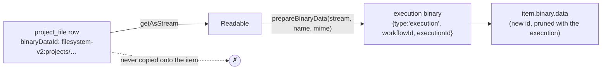

# Project File node — read · write · delete

Extends the shipped-on-this-branch node from one implicit action to three
operations on a project file.

Builds on [PROJECT_FILE_NODE_PLAN.md](PROJECT_FILE_NODE_PLAN.md) (the node,
the proxy, the module context) and [PROJECT_FILES_PLAN.md](PROJECT_FILES_PLAN.md)
(the data layer). No migration; no new REST endpoint.

---

## 0. What changes, in one line each

| Operation | Value | What it does |
|---|---|---|
| **Write** | `write` | Today's behavior, unchanged: binary on the item → project file |
| **Read** | `read` | Project file → binary on the item, plus metadata as JSON |
| **Delete** | `delete` | Removes the row and the bytes |

The node has **never shipped** — it exists only on this branch — so there is no
typeVersion bump, no parameter migration, and no compatibility burden. That is
worth stating up front, because it is what makes decisions #4 and #5 free.

---

## 1. Decisions

| # | Decision | Rationale |
|---|---|---|
| 1 | **Read copies the bytes into execution storage. It must never put the project file's `binaryDataId` on the item.** | `GET /rest/binary-data?id=` is authenticated but performs **no ownership check** ([binary-data.controller.ts:18-19](packages/cli/src/controllers/binary-data.controller.ts#L18-L19)). Aliasing the stored reference into run data hands a cross-project file-read primitive to anyone who can view that execution — exactly what the entity comment forbids. Copying also gets the lifecycle right: `setBinaryDataBuffer` stores under `{ type: 'execution', workflowId, executionId }` ([binary-helper-functions.ts:167-178](packages/core/src/execution-engine/node-execution-context/utils/binary-helper-functions.ts#L167-L178)), so the copy is pruned with the execution while the project file is untouched |
| 2 | Read stays **streaming end to end** | `prepareBinaryData` and `setBinaryDataBuffer` both accept `Buffer \| Readable`, and the service already exposes `getAsStream`. A 100 MiB file never lands in the execution's heap — symmetric with what write already does |
| 3 | File selection is a **`resourceLocator`** with `list` · `name` · `id` modes | Mirrors `dataTableId` ([fields.ts:18-36](packages/nodes-base/nodes/DataTable/common/fields.ts#L18-L36)). `name` is the mode that matters: names are the stable per-project handle, and a name is what a workflow knows — `rates-latest.csv`, not a nanoid |
| 4 | **No `resource` parameter** — `operation` only | Data Table needs `resource` because it has both rows and tables. Here there is one resource, so a resource dropdown is a click with no information in it |
| 5 | Rename the node to **"Project file"**, keep the type id `projectFile` | "Add file to project" stops being true once it reads and deletes. The type id is what saved workflows reference and it does not change |
| 6 | `operation` defaults to **`write`** | Even with no shipped version to protect, write is the operation the demo and the docs lead with, and a destructive default is a bad idea on principle |
| 7 | **`usableAsTool` stays off** | It was already off for write-only. With `delete` in the node, an agent holding this tool can destroy any file in its project by name. That needs its own authorization conversation |
| 8 | Split into `operations/{write,read,delete}.operation.ts` | The repo idiom (`DataTable/actions/**`), and it keeps each operation unit-testable in isolation instead of growing one 250-line `execute` |

---

## 2. Contract changes — `packages/workflow`

`IProjectFileWriteService` becomes `IProjectFileService`. The rename touches four
files, all on this branch: the type, the proxy, the node, and both test suites.

```ts
/** How the node points at an existing file. */
export type ProjectFileRef = { by: 'id'; id: string } | { by: 'name'; name: string };

export type ProjectFileReadResult = {
	file: ProjectFileNodeOutput;
	/** Bytes of the stored file. The caller copies them into execution storage. */
	stream: Readable;
};

export type IProjectFileService = {
	addFile(
		file: ProjectFileNodeInput,
		options?: { overwrite?: boolean },
	): Promise<ProjectFileNodeOutput>;
	getFile(ref: ProjectFileRef): Promise<ProjectFileReadResult>;
	deleteFile(ref: ProjectFileRef): Promise<Pick<ProjectFileNodeOutput, 'id' | 'name'>>;
	/** Backs the `list` mode of the resource locator. */
	listFiles(options?: { search?: string; take?: number; skip?: number }): Promise<{
		count: number;
		data: ProjectFileNodeOutput[];
	}>;
};
```

`ProjectFileNodeOutput` loses `overwritten` as a required field — it is only
meaningful for a write. Move it to the write result:
`type ProjectFileWriteResult = ProjectFileNodeOutput & { overwritten: boolean }`.

---

## 3. The `list` mode needs a second context wired

The node PR spread `getProjectFileHelperFunctions` into **`execute-context.ts`
only** — a deliberate choice at the time, since write needed no dynamic
parameters. A file picker changes that:

| File | Change |
|---|---|
| [load-options-context.ts:29-33](packages/core/src/execution-engine/node-execution-context/load-options-context.ts#L29-L33) | Add `...getProjectFileHelperFunctions(additionalData, workflow, node)` beside the data-table one |
| [interfaces.ts:1385](packages/workflow/src/interfaces.ts#L1385) | `ILoadOptionsFunctions['helpers']` gains `ProjectFileProxyFunctions` |

`supply-data-context.ts` stays untouched — that is the tool path, and decision #7
keeps this node off it.

The search method itself mirrors [tableSearch](packages/nodes-base/nodes/DataTable/common/methods.ts#L13-L43):

```ts
export async function fileSearch(
	this: ILoadOptionsFunctions,
	filterString?: string,
	prevPaginationToken?: string,
): Promise<INodeListSearchResult> {
	const proxy = await getProjectFileProxy(this);
	const skip = prevPaginationToken === undefined ? 0 : parseInt(prevPaginationToken, 10);
	const take = 100;

	const { data } = await proxy.listFiles({ search: filterString, take, skip });

	return {
		results: data.map((file) => ({ name: file.name, value: file.id })),
		paginationToken: data.length === take ? `${skip + take}` : undefined,
	};
}
```

No `url` on the results, unlike `tableSearch` — there is no per-file route in the
UI to deep-link to.

---

## 4. Backend — `packages/cli`

### 4.1 `ProjectFileService` — one thin addition

Everything read and delete need already exists (`getAsStream`, `delete`, `list`,
and `findByProjectIdAndName` on the repository). Only name resolution is missing:

```ts
/** Resolves a per-project name to a row, for callers that address files by name. */
async findByName(projectId: string, name: string): Promise<ProjectFile | null> {
	return await this.repository.findByProjectIdAndName(projectId, this.toStoredName(name), {});
}
```

Reusing `toStoredName` matters: a node passing `"Rates Latest.csv "` must resolve
to the same row that `sanitizeFilename` produced on write, or reads silently miss
files that are plainly visible in the UI.

### 4.2 `ProjectFileProxyService` — three new methods

```ts
const resolve = async (ref: ProjectFileRef): Promise<ProjectFile> => {
	const file =
		ref.by === 'id'
			? await this.projectFileService.findById(projectId, ref.id)
			: await this.projectFileService.findByName(projectId, ref.name);

	if (!file) throw new NodeOperationError(node, describeMissing(ref), {
		description: "Check the file name, or use 'From List' to pick an existing file.",
	});

	return file;
};
```

- `getFile` — `resolve` → `getAsStream` → `{ file: toNodeOutput(file), stream }`
- `deleteFile` — `checkInstanceWriteAccess()` → `resolve` → `service.delete` →
  `{ id, name }`
- `listFiles` — `service.list(projectId, options)` mapped through `toNodeOutput`

Both mutating paths keep the existing `checkInstanceWriteAccess()` guard; `getFile`
and `listFiles` do not, being reads. Project resolution and the node-type
allowlist are unchanged and still the only authorization boundary.

`toNodeError` gains no new branches — `ProjectFileNotFoundError` never surfaces,
because `resolve` produces a better-worded node error before the service can throw
it.

---

## 5. The node

```
nodes/ProjectFile/
  ProjectFile.node.ts          description + operation router
  ProjectFile.node.json        codex: aliases gain "read file", "delete file"
  common/methods.ts            fileSearch
  operations/write.operation.ts
  operations/read.operation.ts
  operations/delete.operation.ts
  test/
```

### Parameters

| Parameter | Operations | Default | Notes |
|---|---|---|---|
| `operation` | all | `write` | Options: *Write* · *Read* · *Delete* |
| `fileName` | write | `={{ $binary[$parameter.binaryPropertyName].fileName }}` | unchanged |
| `binaryPropertyName` | write | `data` | displayName *Input Binary Field*, unchanged |
| `overwrite` | write | `true` | unchanged |
| `file` | read, delete | `{ mode: 'list', value: '' }` | resourceLocator; `list` · `name` · `id` |
| `outputFieldName` | read | `data` | displayName *Put Output File in Field* |

`subtitle` becomes `={{$parameter["operation"] + ": " + ($parameter["fileName"] || $parameter["file"]["value"])}}`.

### Read — the shape that matters



```ts
const { file, stream } = await proxy.getFile(ref);
const binary = await this.helpers.prepareBinaryData(stream, file.name, file.mimeType);

returnData.push({
	json: file,           // metadata only — no binaryDataId, toNodeOutput drops it
	binary: { [outputFieldName]: binary },
	pairedItem: { item: i },
});
```

Read is the one operation whose output is **not** a passthrough of the input
binary: the input item's binary is replaced under `outputFieldName`. Write keeps
passing the input binary through, as today.

### Delete

Errors when the file does not exist. `continueOnFail` already covers the
"clean up whatever is there" case per item, so an `Ignore If Missing` option is
deferred until someone hits it.

---

## 6. Tests

### Node unit tests, per operation

- **write** — the eight existing cases, moved to `test/write.operation.test.ts`
  unchanged
- **read** — attaches binary under the configured field; passes the stream (not a
  buffer) to `prepareBinaryData`; resolves `name` and `id` locator modes;
  **asserts the output contains no `binaryDataId` and no `filesystem-v2:` string**
  — the decision-#1 regression guard
- **delete** — forwards the resolved ref; returns `{ id, name }`; no binary on the
  output; `continueOnFail` collects the error

### Proxy integration tests (extending `project-files.proxy.test.ts`)

- `getFile` returns the stored bytes, by id and by name
- a name with different surrounding whitespace/case-normalization resolves to the
  row written under the sanitized name
- `deleteFile` removes the row **and** the blob (assert via the existing
  `listStoredBlobs` helper — zero files left under the project prefix)
- a missing file, by either mode, raises `NodeOperationError`, not a raw
  `ProjectFileNotFoundError`
- `deleteFile` is refused on a `branchReadOnly` instance; `getFile` is not
- `listFiles` returns only the workflow's own project's files

### Load-options test

`fileSearch` paginates and passes the filter through — thin, but it is the only
coverage that the second context wiring actually happened.

---

## 7. Risks

1. **Read duplicates storage.** Every read writes a second copy under the
   execution prefix, living until the execution is pruned. With the 100 MiB
   per-file default, a loop reading ten large files puts 1 GiB into execution
   storage. Streaming keeps *memory* flat; it does not keep *disk* flat. This is
   the price of decision #1 and it is the right trade, but it belongs in the PR
   description.
2. **Delete from a workflow is destructive and has no per-file authorization.**
   The only boundary is "the workflow's own project" — same as write, but the
   blast radius is larger and irreversible: there is no revision table and no
   soft delete. This is the question a security reviewer should be pointed at
   directly.
3. **Case-sensitivity becomes user-visible.** The unique index is case-sensitive
   on Postgres and case-insensitive on SQLite/MySQL (a known, accepted
   inconsistency shared with `DataTable`). Name-mode reads make that divergence
   reachable from a workflow, not just from the UI.
4. **The picker degrades on a disabled module.** `list` mode calls the proxy from
   load-options; when `project-files` is disabled the helper is absent. Reuse the
   node's existing `undefined` check so the NDV shows a clear message instead of a
   stack trace.

---

## 8. Roadmap — one PR

| Step | Files |
|---|---|
| 1 | `packages/workflow`: `ProjectFileRef`, `IProjectFileService` rename, `ProjectFileProxyFunctions` on `ILoadOptionsFunctions` |
| 2 | `packages/core`: spread the helper into `load-options-context.ts` |
| 3 | `packages/cli`: `findByName` on the service; `getFile` / `deleteFile` / `listFiles` on the proxy |
| 4 | `packages/nodes-base`: operation split, resource locator, `fileSearch`, codex aliases |
| 5 | Tests: node per-operation, proxy integration, load-options |

Build between steps 1 and 3 — step 1 changes types `packages/cli` compiles
against.

Roughly ~400 lines net, and the storage, quota, CAS and cleanup logic stays
exactly where it already is.

---

## 9. Deferred

| Deferred | Add when |
|---|---|
| `Ignore If Missing` on delete | Someone writes an idempotent cleanup workflow and finds `continueOnFail` too blunt |
| Rename / move operations | A workflow needs to reorganize files, not just read and write them |
| `usableAsTool` | The authorization question in risk #2 has an answer |
| Read by URL / signed link instead of copying bytes | The content route grows an ownership check, which would make aliasing safe |
| List operation as a *node* action (not just the picker) | A workflow needs to iterate a project's files |
