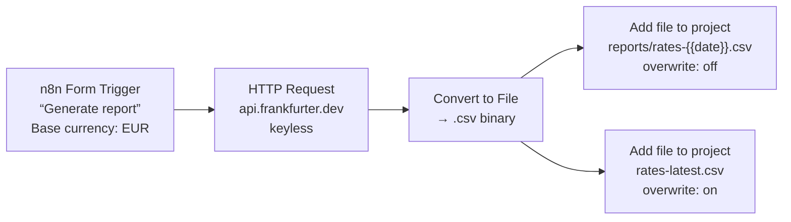
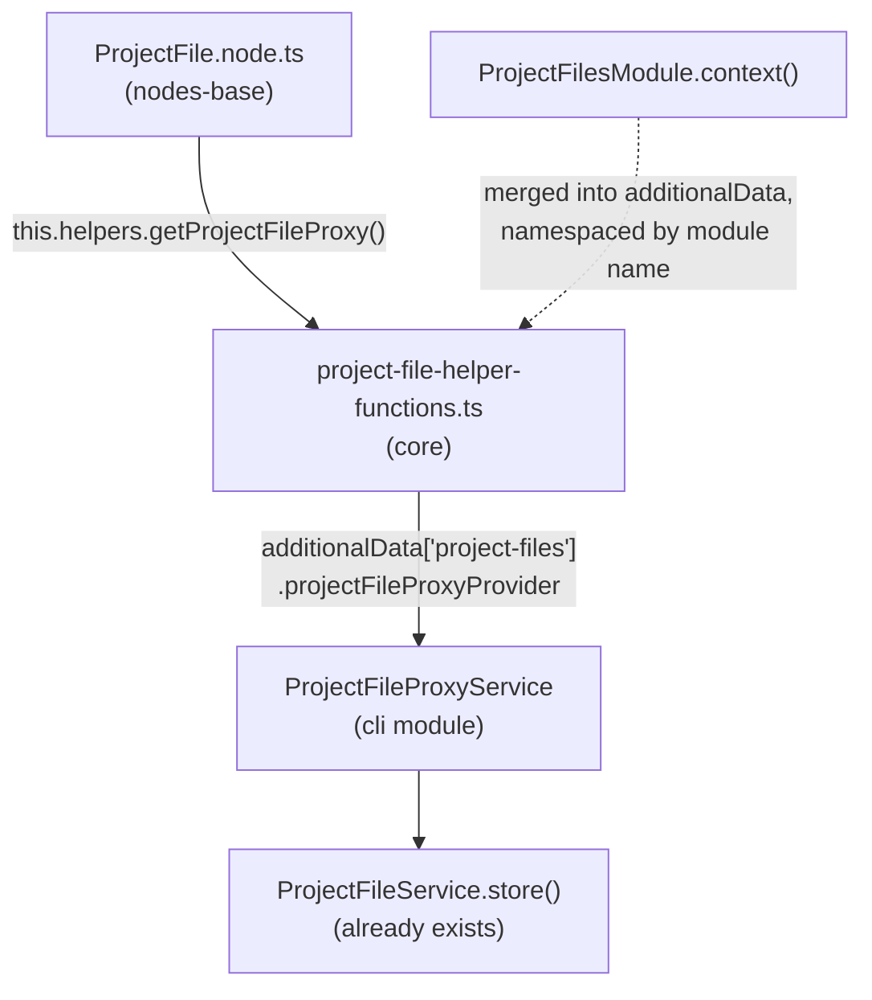

# Project File node — demo-scoped implementation plan

A single built-in node that writes a binary produced inside a workflow into the
current project's files. Scoped to exactly what the Form Trigger demo needs.

Builds on [PROJECT_FILES_PLAN.md](PROJECT_FILES_PLAN.md) phases 1–2, already
landed on this branch (`project_file` table, `ProjectFileService`, REST API).
Nothing here needs a migration.

---

## 0. The demo this exists for (and the acceptance criterion)



**Done when:** submitting the form three times leaves three dated rows plus one
`rates-latest.csv` row whose `updatedAt` moved each time, all attributed to the
workflow, in the project that owns the workflow — with no credentials, no
tunnel, and no manual upload.

---

## 1. Scope

| In | Out |
|---|---|
| One node, one operation: write a binary to the current project | Reading, listing, downloading, deleting files from a workflow |
| `overwrite` toggle (upsert vs conflict error) | `$projectFiles[...]` expression layer |
| Workflow attribution (`createdByWorkflowId` / `updatedByWorkflowId`) | "On file uploaded" trigger |
| Writes to the workflow's **own** project only | Cross-project writes, a project selector |
| Streams persisted binaries instead of buffering | `usableAsTool`, AI-agent exposure |
| Node output = file metadata, input binary passed through | Public API, source-control sync |

---

## 2. Architecture — how a `nodes-base` node reaches a `packages/cli` service

`nodes-base` cannot import from `packages/cli`. The Data Table node solved this
exact problem; copy its chain verbatim.



Four links, each with a named precedent:

| Link | Precedent |
|---|---|
| Module publishes a proxy into workflow context | [data-table.module.ts `context()`](packages/cli/src/modules/data-table/data-table.module.ts#L62-L66) |
| Context is typed | [`'data-table'?: {...}` in the `declare module` block](packages/core/src/execution-engine/index.ts#L51) |
| Core turns context into node helpers | [data-table-helper-functions.ts](packages/core/src/execution-engine/node-execution-context/utils/data-table-helper-functions.ts) |
| Proxy authorizes and narrows | [data-table-proxy.service.ts](packages/cli/src/modules/data-table/data-table-proxy.service.ts) |

`project-files` is already in `MODULE_NAMES` **and** in `defaultModules`
([module-registry.ts:48](packages/@n8n/backend-common/src/modules/module-registry.ts#L48)),
so nothing extra is needed to make the node work on a default `pnpm dev`
instance.

### 2.1 Why not call `ProjectFileService` directly?

The first review question this plan will get, so answering it up front: **the
storage logic is not being rewritten.** `store()` is called verbatim —
sanitizing, quota checks, CAS overwrite, orphan cleanup and blob deletion are all
reused untouched. What the new code buys is *reachability* and one authorization
decision.

Two cheaper-looking options, and why neither works:

| Option | Why not |
|---|---|
| `import { ProjectFileService }` inside the node | `packages/cli` depends on `n8n-nodes-base` (`workspace:*`), and nodes-base depends only on `n8n-workflow`, `n8n-core` and some `@n8n/*` packages — **not** on `n8n`. The import is a circular workspace dependency. It would also break the contract community nodes compile against, and any path where node execution is decoupled from the main process |
| HTTP Request node → `POST /rest/projects/:projectId/files` | Every route is gated by `@ProjectScope` ([project-files.controller.ts:96](packages/cli/src/modules/project-files/project-files.controller.ts#L96)), which resolves a scope for an authenticated *user*. A workflow execution has no user session, and project files have no Public API surface. It would mean pasting a browser cookie into a node |

So of the new backend code, only one file contains logic that doesn't exist
somewhere already:

| New code | Lines | Plumbing or new logic? |
|---|---|---|
| `packages/workflow` types | ~30 | Plumbing — a type-only contract |
| `packages/core` helper bridge + `declare module` | ~20 | Plumbing — copy of the data-table one |
| Module `context()` | ~5 | Plumbing |
| Stream source in `ProjectFileService` | ~6 | Small extension, no new path |
| `ProjectFileProxyService` | ~100 | **The only genuinely new logic** |

And that last file is not storage. It is the four things nothing answers today:
which project a workflow may write to (decision #1), who the actor is
(decision #2), whether the instance is `branchReadOnly`, and how a module error
becomes a `NodeOperationError`.

### 2.2 Nodes already on this pattern

This is a fifth entry in an existing mechanism, not a new mechanism:

| Node type | Relationship |
|---|---|
| `n8n-nodes-base.dataTable` | Owns the proxy; calls it across all 12 operation files |
| `n8n-nodes-base.dataTableTool` | Auto-generated tool variant of the above (`usableAsTool: true`), no separate file |
| `n8n-nodes-base.evaluationTrigger` | Consumer of the *same* proxy, different feature |
| `n8n-nodes-base.evaluation` | Same, via [evaluationUtils.ts:142-152](packages/nodes-base/nodes/Evaluation/utils/evaluationUtils.ts#L142-L152) |

All four are listed in `ALLOWED_NODES` at
[data-table-proxy.service.ts:37-42](packages/cli/src/modules/data-table/data-table-proxy.service.ts#L37-L42) —
the allowlist exists because the pattern was built to be shared, which is why
decision #5 below starts with a single entry rather than treating the node as a
special case.

The same transport carries three more module contexts whose consumer is
`packages/core` rather than a node — `oauth-jwe`
([oauth.ts:121](packages/core/src/execution-engine/node-execution-context/utils/request-helpers/oauth.ts#L121)),
`dynamic-credentials`
([credential-check-helper-functions.ts:6](packages/core/src/execution-engine/node-execution-context/utils/credential-check-helper-functions.ts#L6))
and `otel`. It is well-trodden in both directions.

---

## 3. Design decisions

| # | Decision | Rationale |
|---|---|---|
| 1 | **No `projectId` parameter.** The proxy resolves the project from the workflow's owner via `OwnershipService.getWorkflowProjectCached()` | Answers the open question at [PROJECT_FILES_PLAN.md §8](PROJECT_FILES_PLAN.md) in the narrowest safe way: a workflow can only write to its own project, so cross-project escalation is structurally impossible. Also means **zero RBAC surface** — no `projectFileId` resolver, no new scopes, no snapshot test churn. Mirrors `getDataTableProxy`, which likewise trusts project resolution over a per-execution scope check |
| 2 | Actor is `{ type: 'workflow', workflowId }` | `ProjectFileActor` already models it and the FK columns already exist ([project-files.types.ts:10-12](packages/cli/src/modules/project-files/project-files.types.ts#L10-L12)) — this is the write side phase 1 deliberately left unwired |
| 3 | **Stream, don't buffer.** Add a `{ type: 'stream' }` variant to `ProjectFileSource`; use it whenever the item's binary is persisted (`binaryData.id` present) | `BinaryDataService.store()` already accepts `Buffer \| Readable` ([binary-data.service.ts:102-104](packages/core/src/binary-data/binary-data.service.ts#L102-L104)), so this is ~4 lines and keeps a 100 MB file out of the execution's heap. In-memory items (no `id`) still buffer, bounded by `maxFileSize` |
| 4 | `overwrite` defaults to **`true`** on the node | [PROJECT_FILES_PLAN.md §4](PROJECT_FILES_PLAN.md): same endpoint, deliberately different default from the UI. A scheduled regeneration that 409s on its second run is useless |
| 5 | Node-type allowlist inside the proxy | Copies `isAllowedNode` — the context is reachable from every node's helpers, so the proxy, not the node, is where "only this node may write files" belongs. Starts with one entry; the data-table allowlist already carries four (§2.2) |
| 6 | Proxy maps module errors to `NodeOperationError` with a `description` | The service's errors are already `UserError` with good messages, but a node error needs node context and an actionable next step ("turn on Replace Existing File") |
| 7 | Single implicit operation — no resource/operation switcher, `version: 1` | Nothing to switch between yet. A `resource`/`operation` pair added later is additive and doesn't need a type-version bump |
| 8 | Output is the file metadata; the input binary is **passed through** | Lets the demo chain a second write node off the same item, which is exactly what the archive + latest pair does |
| 9 | Not `usableAsTool` | An agent that can overwrite arbitrary project files by name is a bigger authorization conversation than this node needs. Cheap to flip on later |

---

## 4. Backend — `packages/cli`

### 4.1 `project-file.service.ts` — accept a stream (~6 lines)

`ProjectFileSource` in [project-files.types.ts:15-17](packages/cli/src/modules/project-files/project-files.types.ts#L15-L17):

```ts
export type ProjectFileSource =
	| { type: 'path'; path: string }
	| { type: 'buffer'; buffer: Buffer }
	/** An open read stream, e.g. a persisted execution binary. Never fully buffered. */
	| { type: 'stream'; stream: Readable };
```

And in `writeBlob`, the ternary becomes a switch:

```ts
const stored =
	file.source.type === 'path'
		? await this.binaryDataService.copyBinaryFile(location, binaryData, file.source.path)
		: await this.binaryDataService.store(
				location,
				file.source.type === 'stream' ? file.source.stream : file.source.buffer,
				binaryData,
			);
```

Everything else in `store()` — sanitizing, the pre-flight size check, the quota
check, CAS overwrite, orphan cleanup — is reused untouched.

> One caveat worth a comment: with a stream source, `sizeBytes` is the
> *declared* size used for pre-flight quota rejection, and the authoritative
> post-write check at
> [project-file.service.ts:218](packages/cli/src/modules/project-files/project-file.service.ts#L218)
> is what actually enforces `maxFileSize`. For the node, `IBinaryData.fileSize`
> is a pretty-printed string, so pass `binaryData.bytes ?? 0` and let the
> post-write check do the real work.

### 4.2 `project-file-proxy.service.ts` — new

```ts
const ALLOWED_NODES = ['n8n-nodes-base.projectFile'] as const;

@Service()
export class ProjectFileProxyService implements ProjectFileProxyProvider {
	constructor(
		private readonly projectFileService: ProjectFileService,
		private readonly ownershipService: OwnershipService,
		private readonly sourceControlPreferencesService: SourceControlPreferencesService,
	) {}

	async getProjectFileProxy(workflow: Workflow, node: INode): Promise<IProjectFileWriteService> {
		if (!isAllowedNode(node.type)) {
			throw new Error('This proxy is only available for the Project File node');
		}

		const projectId = await this.resolveProjectId(workflow, node);
		const actor: ProjectFileActor = { type: 'workflow', workflowId: workflow.id };

		return {
			addFile: async (file, options) => {
				this.checkInstanceWriteAccess();

				try {
					const { file: stored, overwritten } = await this.projectFileService.store(
						projectId, actor, file, options,
					);
					return { ...toNodeOutput(stored), overwritten };
				} catch (error) {
					throw this.toNodeError(node, error);
				}
			},
		};
	}
}
```

Three private helpers:

- `resolveProjectId` — `getWorkflowProjectCached(workflow.id)`. It uses
  `findOneOrFail` ([ownership.service.ts:104](packages/cli/src/services/ownership.service.ts#L104)),
  so an **unsaved** workflow throws; catch it and rethrow as
  `NodeOperationError('Save this workflow before writing project files')`. Same
  behaviour as the Data Table node, now with a legible message. It also means the
  `createdByWorkflowId` FK can never be violated — an unpersisted workflow id
  never reaches an `INSERT`.
- `checkInstanceWriteAccess` — copy from
  [data-table-proxy.service.ts:62-69](packages/cli/src/modules/data-table/data-table-proxy.service.ts#L62-L69),
  wording changed to project files.
- `toNodeError` — maps the module's error classes onto `NodeOperationError`:

  | Error | Node message / description |
  |---|---|
  | `ProjectFileNameConflictError` | keep the message; description: *"Turn on 'Replace Existing File' to overwrite it, or use a unique name."* |
  | `ProjectFileQuotaExceededError` | keep the message (it already distinguishes personal-aggregate from per-project); description points at the project's Files tab |
  | `ProjectFileTooLargeError` | keep the message; description names `N8N_PROJECT_FILES_MAX_FILE_SIZE_BYTES` |
  | `ProjectFileConcurrentModificationError` | keep the message; description: *"Another write to this file landed first. Retry the node."* |
  | anything else | rethrow unchanged |

- `toNodeOutput` — `id`, `name`, `mimeType`, `fileSizeBytes`, `projectId`,
  `createdAt`, `updatedAt`. **Never `binaryDataId`** — same reasoning as
  [project-file-response.service.ts:11-12](packages/cli/src/modules/project-files/project-file-response.service.ts#L11-L12);
  the node's output JSON is visible in the NDV and in execution data.

### 4.3 `project-files.module.ts` — publish the context

```ts
async context() {
	const { ProjectFileProxyService } = await import('./project-file-proxy.service.js');

	return { projectFileProxyProvider: Container.get(ProjectFileProxyService) };
}
```

---

## 5. `packages/workflow` — the contract

New `packages/workflow/src/project-file.types.ts`, exported from `index.ts`:

```ts
export type ProjectFileNodeInput = {
	name: string;
	mimeType: string;
	sizeBytes: number;
	source: { type: 'buffer'; buffer: Buffer } | { type: 'stream'; stream: Readable };
};

export type ProjectFileNodeOutput = {
	id: string;
	name: string;
	mimeType: string;
	fileSizeBytes: number;
	projectId: string;
	createdAt: string;
	updatedAt: string;
	overwritten: boolean;
};

export type IProjectFileWriteService = {
	addFile(
		file: ProjectFileNodeInput,
		options?: { overwrite?: boolean },
	): Promise<ProjectFileNodeOutput>;
};
```

The `'path'` source variant is intentionally absent from the node-facing type —
only the multipart upload path produces temp files.

In `interfaces.ts`, next to the Data Table pair at
[interfaces.ts:1135-1153](packages/workflow/src/interfaces.ts#L1135-L1153):

```ts
export type ProjectFileProxyProvider = {
	getProjectFileProxy(workflow: Workflow, node: INode): Promise<IProjectFileWriteService>;
};

export type ProjectFileProxyFunctions = {
	// Optional: absent when the project-files module is disabled
	getProjectFileProxy?(): Promise<IProjectFileWriteService>;
};
```

Add `ProjectFileProxyFunctions` to the `IExecuteFunctions['helpers']`
intersection at [interfaces.ts:1277](packages/workflow/src/interfaces.ts#L1277).
**Not** to the `ISupplyDataFunctions` helpers at
[line 1374](packages/workflow/src/interfaces.ts#L1374) — that's the tool path,
and decision #9 keeps it out.

---

## 6. `packages/core` — the helper bridge

`packages/core/src/execution-engine/node-execution-context/utils/project-file-helper-functions.ts`,
a near-copy of the data-table one:

```ts
export function getProjectFileHelperFunctions(
	additionalData: IWorkflowExecuteAdditionalData,
	workflow: Workflow,
	node: INode,
): Partial<ProjectFileProxyFunctions> {
	const provider = additionalData['project-files']?.projectFileProxyProvider;
	if (!provider) return {};

	return {
		getProjectFileProxy: async () => await provider.getProjectFileProxy(workflow, node),
	};
}
```

Spread it into **`execute-context.ts` only** (alongside
[execute-context.ts:95](packages/core/src/execution-engine/node-execution-context/execute-context.ts#L95)) —
not `supply-data-context.ts` or `load-options-context.ts`, which exist for tools
and dynamic parameter loading respectively, neither of which this node uses.

Then extend the `declare module 'n8n-workflow'` block at
[execution-engine/index.ts:51](packages/core/src/execution-engine/index.ts#L51):

```ts
'project-files'?: { projectFileProxyProvider: ProjectFileProxyProvider };
```

---

## 7. The node — `packages/nodes-base/nodes/ProjectFile/`

```
ProjectFile.node.ts
ProjectFile.node.json
test/ProjectFile.node.test.ts
```

### Description

```ts
export class ProjectFile implements INodeType {
	description: INodeTypeDescription = {
		displayName: 'Add file to project',
		name: 'projectFile',          // stable type id; displayName can change if operations are added
		icon: 'fa:file-import',       // `node:` icons need a design-system entry — see §11
		iconColor: 'orange-red',      // matches Data Table, the sibling project asset
		group: ['output'],
		version: 1,
		subtitle: '={{$parameter["fileName"]}}',
		description: 'Save a file to this project so other workflows can use it',
		defaults: { name: 'Add file to project' },
		inputs: [NodeConnectionTypes.Main],
		outputs: [NodeConnectionTypes.Main],
		properties: [ /* below */ ],
	};
}
```

Three parameters, nothing else:

| Parameter | Type | Default | Notes |
|---|---|---|---|
| `binaryPropertyName` | string | `data` | displayName **Input Binary Field**, the repo-wide convention |
| `fileName` | string | `={{ $binary[$parameter.binaryPropertyName].fileName }}` | Required. The expression default means the demo's dated-archive node works with one edit and the naive case works with none |
| `overwrite` | boolean | `true` | displayName **Replace Existing File**, description: *"Whether to replace the file when one with the same name already exists. When off, the node fails instead."* |

Worth a pass through the `n8n:content-design` skill before merge — three
user-facing strings and one error description.

### `execute()`

```ts
async execute(this: IExecuteFunctions): Promise<INodeExecutionData[][]> {
	const items = this.getInputData();
	const returnData: INodeExecutionData[] = [];

	const getProxy = this.helpers.getProjectFileProxy;
	if (!getProxy) {
		throw new NodeOperationError(this.getNode(), 'Project files are not available on this instance', {
			description: 'The project-files module is disabled. Remove it from N8N_DISABLED_MODULES.',
		});
	}
	const proxy = await getProxy();

	for (let i = 0; i < items.length; i++) {
		try {
			const binaryPropertyName = this.getNodeParameter('binaryPropertyName', i) as string;
			const fileName = this.getNodeParameter('fileName', i) as string;
			const overwrite = this.getNodeParameter('overwrite', i) as boolean;

			const binaryData = this.helpers.assertBinaryData(i, binaryPropertyName);

			// A persisted binary streams straight through; only in-memory items are buffered.
			const source = binaryData.id
				? { type: 'stream' as const, stream: await this.helpers.getBinaryStream(binaryData.id) }
				: { type: 'buffer' as const, buffer: await this.helpers.getBinaryDataBuffer(i, binaryPropertyName) };

			const file = await proxy.addFile(
				{ name: fileName, mimeType: binaryData.mimeType, sizeBytes: binaryData.bytes ?? 0, source },
				{ overwrite },
			);

			returnData.push({
				json: file,
				binary: items[i].binary,   // pass through, so a second write can chain off the same item
				pairedItem: { item: i },
			});
		} catch (error) {
			if (this.continueOnFail()) {
				returnData.push({ json: { error: error.message }, pairedItem: { item: i } });
				continue;
			}
			throw error;
		}
	}

	return [returnData];
}
```

`assertBinaryData` already throws a good node error when the field is missing,
so there's no manual validation to write.

The `getProxy` guard is the shipped idiom rather than an invention here — the
Evaluation node opens with the same `undefined` check before using its proxy
([evaluationUtils.ts:142](packages/nodes-base/nodes/Evaluation/utils/evaluationUtils.ts#L142)).

### Registration

- `packages/nodes-base/package.json` → `n8n.nodes` gets
  `dist/nodes/ProjectFile/ProjectFile.node.js` (the list is alphabetical around
  [line 523](packages/nodes-base/package.json#L523)).
- `ProjectFile.node.json` codex: `categories: ["Core Nodes"]`,
  `subcategories: { "Core Nodes": ["Files"] }`, aliases
  `["file", "files", "project file", "storage", "save file", "attachment", "upload"]`,
  and the docs URL (which 404s until the docs PR lands — same as every new node).
- Nodes don't use `@n8n/i18n`; all copy lives in the description.

---

## 8. Tests

| Level | Location | Cases |
|---|---|---|
| Node unit | `packages/nodes-base/nodes/ProjectFile/test/` | Mirrors [DataTable's operations.test.ts](packages/nodes-base/nodes/DataTable/test/table/operations.test.ts): `mock<IExecuteFunctions>()` with a mocked proxy. Stream path when `binaryData.id` is set, buffer path when it isn't, `overwrite` forwarded, binary passed through, `pairedItem` set, `continueOnFail`, and the clear error when `getProjectFileProxy` is absent |
| Proxy integration | `packages/cli/src/modules/project-files/__tests__/project-file-proxy.service.integration.test.ts` | sqlite + filesystem, mirroring the existing data-table proxy integration test: writes from a stream and a buffer; `createdByWorkflowId`/`updatedByWorkflowId` persisted; second write with `overwrite: true` replaces content and keeps one row; `overwrite: false` raises the conflict as a `NodeOperationError`; quota and size errors mapped; a non-allowlisted node type rejected; a workflow in project A resolving to project A even when project B exists |
| E2E | skip | The existing [files.spec.ts](packages/testing/playwright/tests/e2e/project-files/files.spec.ts) covers the UI. Driving a form submission plus an execution through Playwright to assert one row is a lot of machinery for what the integration test already proves — revisit if the node grows operations |

---

## 9. Optional polish: make the attribution visible (~40 LOC)

Without this, the demo's files show **"Unknown"** in the *Uploaded by* column,
because `ProjectFileResponse` only carries user actors
([project-file-response.service.ts:34-35](packages/cli/src/modules/project-files/project-file-response.service.ts#L34-L35)).
The row data is correct; the API just doesn't expose it. This is the deferred
item [PROJECT_FILES_PLAN.md §8](PROJECT_FILES_PLAN.md) calls *"actor DTO, FE
workflow chip"*.

1. `ProjectFileResponse.createdBy` / `updatedBy` become a discriminated union:
   `{ type: 'user', ... } | { type: 'workflow', id, name } | null`.
2. `ProjectFileResponseService` resolves workflow names in one batched query per
   page, exactly as it already does for users.
3. The Files table renders a workflow chip linking to the workflow.

Recommended for the demo — it's the moment that lands "a workflow put this
here" — but strictly separable, and it's the only item in this plan that
touches the frontend.

---

## 10. Demo runbook

```
pnpm dev     # project-files is default-enabled; binary mode defaults to filesystem
```

1. New workflow **in a team project** (so the quota bar reads that project's
   own 2 GiB budget rather than the instance-wide personal one), then **save** it
   — the form URL and the ownership lookup both require a persisted workflow.
2. **n8n Form Trigger** — form title *Generate report*, one field
   `Base currency`, dropdown `EUR, USD, GBP`.
3. **HTTP Request** — GET
   `https://api.frankfurter.dev/v1/latest?base={{ $json['Base currency'] }}`.
4. **Convert to File** — *Convert to CSV*, since the response is a single
   object. Add a **Code** or **Edit Fields** node before it if you want one row
   per currency.
5. **Add file to project** (archive) — File Name
   `reports/rates-{{ $json.date }}-{{ $('n8n Form Trigger').item.json['Base currency'] }}.csv`,
   *Replace Existing File* **off**.
6. **Add file to project** (latest), wired off the same *Convert to File* output
   — File Name `rates-latest.csv`, *Replace Existing File* **on**.
7. Open the form URL, submit three times, and watch the project's **Files** tab:
   three archive rows appear, `rates-latest.csv` stays a single row with a moving
   `updatedAt`, and the quota bar creeps up.
8. Submit the same currency twice on the same day to see step 5's node fail with
   the conflict error and its "turn on Replace Existing File" hint.

---

## 11. Risks and known gaps

1. **Unsaved workflows can't write files.** Ownership resolution uses
   `findOneOrFail`. Same limitation as the Data Table node; mitigated only by a
   clear error message (§4.2).
2. **No read-back path.** There is no "get file from project" node and no
   expression layer, so `overwrite` demos must regenerate from a source of
   truth — an appending ledger is impossible in this scope. Worth saying out
   loud, because it's the first thing anyone asks for after seeing the node.
3. **Attribution is invisible until §9 lands.** Rows are correct; the API
   response isn't.
4. **In-memory binaries still buffer.** Bounded by `maxFileSize` (100 MiB
   default), so a wide fan-out of large in-memory items is the one memory
   scenario worth watching. The stream path covers everything persisted.
5. **Two nodes writing the same name in one execution** hit the CAS conflict and
   surface a retryable error rather than silently picking a winner. Correct, but
   it will look like a bug the first time someone does it by accident.
6. **`fa:file-import` is a placeholder icon.** A proper `node:project-file`
   entry means adding an SVG plus a name to
   [node-icon-names.ts](packages/frontend/@n8n/design-system/src/components/N8nIcon/node-icon-names.ts) —
   a design ask, not a blocker.

---

## 12. Roadmap

One PR, ~450 lines including tests. The pieces are too coupled to split
usefully: the workflow types, the core bridge, the proxy, and the node are all
dead code until the last one lands.

| Step | Files |
|---|---|
| 1 | `packages/workflow`: `project-file.types.ts`, `interfaces.ts`, `index.ts` |
| 2 | `packages/core`: helper functions + `declare module` augmentation + `execute-context.ts` |
| 3 | `packages/cli`: stream source on `ProjectFileService`, `ProjectFileProxyService`, module `context()` |
| 4 | `packages/nodes-base`: node, codex, `package.json`, unit tests |
| 5 | `packages/cli`: proxy integration tests |
| 6 | *(optional)* §9 attribution DTO + FE chip |

Build between steps 2 and 3 — step 2 changes types that `packages/cli` compiles
against.

### An even smaller variant, if the demo is all that matters

Two of the five pieces can be dropped, taking the new backend code under 100
lines and removing the `packages/cli` service change entirely:

| Drop | Effect | Cost |
|---|---|---|
| The stream source (decision #3) — use `getBinaryDataBuffer` only | `ProjectFileService` is untouched; the proxy just passes a buffer | A 100 MB file lands fully in the execution's heap. Bounded by `maxFileSize`, so it degrades rather than breaks |
| Error mapping (decision #6) | The proxy shrinks to project resolution + actor + allowlist + passthrough, ~40 lines | The module's `UserError` messages surface in the NDV as-is. They read fine, but a name conflict gives no hint that *Replace Existing File* is the fix — the single roughest edge in the demo, since step 8 of the runbook is built on triggering it |

Everything else in this plan is load-bearing for the demo and can't be cut:
project resolution is the authorization boundary, the workflow actor is the whole
point of the attribution story, and the `branchReadOnly` check is a correctness
gap if skipped.

Recommendation: keep error mapping, drop the stream source if you want the
smaller diff. The conflict hint is what makes the demo's failure path legible;
heap usage on a 100 MB CSV is not something a demo will notice.
