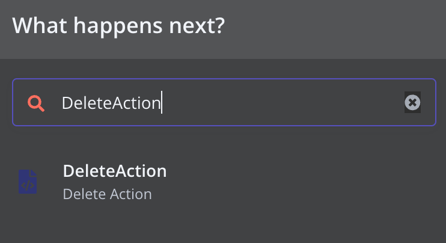
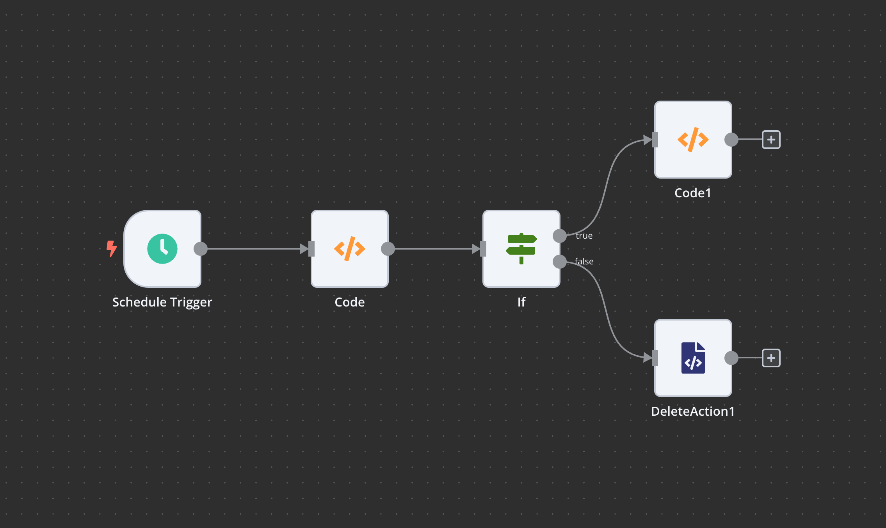
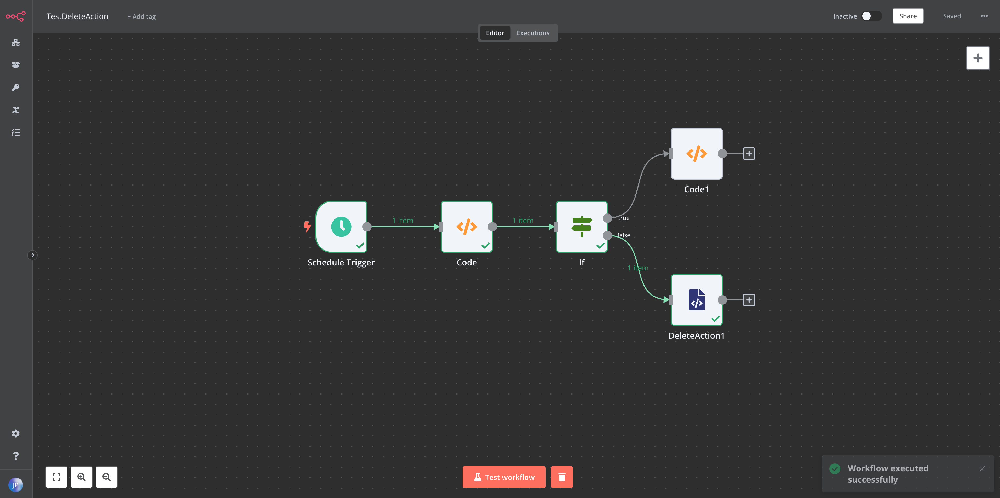

# Project Introduction
This project is based on the original n8n project and has added a node called `DeleteAction`. If this node is added to the workflow and executed during the workflow, it will not be recorded in the Execution list.

# Usage
Search for `DeleteAction` node
 

 
Make it the last node of WorkFlow
 

 
The `Execution` executed this time will not be retained.
 

# Code Description
- The 'execute' function of this node does not perform any operations and is only used as a marker.
- The original code will insert an `Execution` message into the database that does not include the end time and execution status when starting to execute `WorkFlow`, After the execution of `WorkFlow`, the code will update the information of the execution in the database.
- I have added some code in the project to check whether the node has been executed before updating information. If the node has been executed, the `Execution` of this row will be directly deleted from the database.

# Code Description
- `packages/cli/src/config/schema.ts`: Modify the database to postgresdb
- `packages/nodes-base/nodes/DeleteAction/DeleteAction.node.ts`: Configure the display information of WorkFlow in the `description` function, and the `execute` function will be called by WorkFlow when executing the node, without any logic, and used as a marker
- `packages/cli/src/databases/repositories/execution.repository.ts`: Lines 270 to 295 represent the completed processing logic. Parse the `runData` data from the parameter `execution`, and then determine whether the execution record of the `DeleteAction` node is included. If it is included, delete the already recorded 'execution' data. Otherwise, update information in tables 'execution_entity' and 'execution_data'. (`runData` does not contain node type information, so the node name is used as the condition here. The node needs to have `DeleteAction` as the name prefix, for example: `DeleteAction`, `DeleteAction1`, `DeleteActionOther`)

 

 
