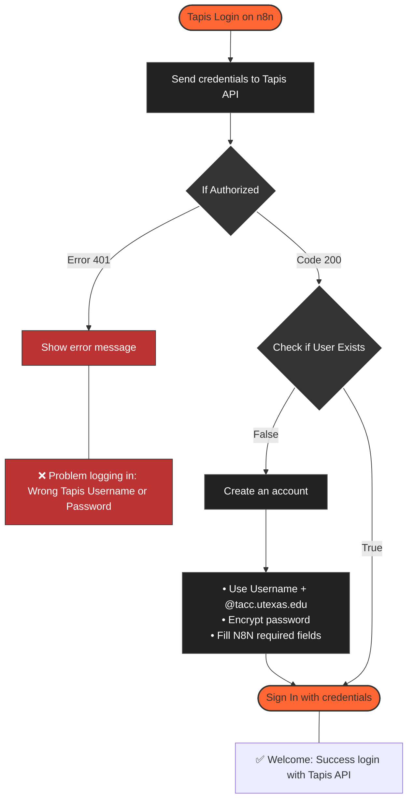

# n8n - Secure Workflow Automation for Technical Teams

n8n is a workflow automation platform that gives technical teams the flexibility of code with the speed of no-code. With 400+ integrations, native AI capabilities, and a fair-code license, n8n lets you build powerful automations while maintaining full control over your data and deployments.


## Key Capabilities

- **Code When You Need It**: Write JavaScript/Python, add npm packages, or use the visual interface
- **AI-Native Platform**: Build AI agent workflows based on LangChain with your own data and models
- **Full Control**: Self-host with our fair-code license or use our [cloud offering](https://app.n8n.cloud/login)
- **Enterprise-Ready**: Advanced permissions, SSO, and air-gapped deployments
- **Active Community**: 400+ integrations and 900+ ready-to-use [templates](https://n8n.io/workflows)

## Quick Start

Try n8n instantly with [npx](https://docs.n8n.io/hosting/installation/npm/) (requires [Node.js](https://nodejs.org/en/)):

```
npx n8n
```

Or deploy with [Docker](https://docs.n8n.io/hosting/installation/docker/):

```
docker volume create n8n_data
docker run -it --rm --name n8n -p 5678:5678 -v n8n_data:/home/node/.n8n docker.n8n.io/n8nio/n8n
```

Access the editor at http://localhost:5678

## Development Setup with TAPIS Authentication

This repository includes TAPIS (Texas Advanced Computing Center API Services) authentication integration. Follow these steps to set up the development environment:

### Prerequisites

1. **Node.js** (v22.16 or newer) 
   ```bash
   node --version  # Should be >= 22.16 (23.0 was tested and works)
   ```

2. **pnpm** (v10.22.0 or newer)
   
   Enable corepack (recommended):
   ```bash
   corepack enable
   corepack prepare pnpm@10.22.0 --activate
   ```
   
   Or install pnpm directly:
   ```bash
   npm install -g pnpm@10.22.0
   ```

### Step-by-Step Setup

#### 1. Clone the Repository

```bash
git clone <repository-url>
cd n8n-tapis-auth
```

#### 2. Install Dependencies

Install all dependencies for all packages in the monorepo:

```bash
pnpm install
```

This command installs all dependencies and links packages together using pnpm workspaces.

#### 3. Build the Project

Build all packages in the monorepo:

```bash
pnpm build
```

**Note:** It's recommended to redirect output to a file to check for errors:

```bash
pnpm build > build.log 2>&1
tail -n 20 build.log  # Check for errors
```

This builds all TypeScript code, processes assets, and prepares the application for running.

#### 4. Set Up Environment Variables

Create a `./packages/cli/bin/.env.tapis` file in the root directory with the following TAPIS configuration:

```bash
# TAPIS API Configuration
TAPIS_BASE_URL = 'https://portals.tapis.io'
TAPIS_AUTH_ENDPOINT = '/v3/oauth2/tokens'
```

**Environment Variables Description:**

- **`TAPIS_BASE_URL`** (Required): The base URL for the TAPIS API. This is where authentication and user information requests are sent. Default: `https://portals.tapis.io`
  
- **`TAPIS_AUTH_ENDPOINT`** (Required): TAPIS API Endpoint to verify the credentials.
  
**Quick Setup:**

You can create the `./packages/cli/bin/.env.tapis` file manually:

```bash
cat > .env << 'EOF'
TAPIS_BASE_URL = 'https://portals.tapis.io'
TAPIS_AUTH_ENDPOINT = '/v3/oauth2/tokens'
EOF
```


#### 5. Run the Application

**Option A: Production Mode** (using built code)

```bash
pnpm start
```

**Option B: Development Mode** (with hot reload)

```bash
pnpm dev
```

The development mode will:
- Automatically rebuild on code changes
- Restart the backend when backend files change
- Refresh the frontend when frontend files change

**Option C: Backend Only** (faster for backend development)

```bash
pnpm dev:be
```

**Option D: Frontend Only**

```bash
pnpm dev:fe
```

#### 6. Access the Application

Once started, access the n8n editor at:

```
http://localhost:5678
```

(Must be HTTPS or add the ENV `N8N_PROTOCOL=http` )

### TAPIS Authentication

With TAPIS authentication configured:

- Users can log in using their **TAPIS username and password** (not email/password)
- The system authenticates against the TAPIS API
- User records are automatically created/updated from TAPIS user information

**Login Flow:**
1. User enters username and password in the login form
2. System authenticates with TAPIS API using `TAPIS_BASE_URL`
3. If successful, retrieves user information from TAPIS
4. Creates or updates local user record
5. Stores TAPIS JWT token for session management
6. Falls back to email/password authentication if TAPIS fails (for backward compatibility)

### Troubleshooting

**Build Errors:**
```bash
# Check build log for errors
tail -n 50 build.log

# Clean and rebuild
pnpm clean
pnpm install
pnpm build
```

**Port Already in Use:**
```bash
# Use a different port
N8N_PORT=8080 pnpm start
```

**Type Checking:**
```bash
# Verify TypeScript compilation
pnpm typecheck
```

**Environment Variables Not Loading:**
- Ensure `./packages/cli/bin/.env.tapis` file is in the project root
- Check that variables are set correctly (no quotes needed for values)
- Restart the application after changing `./packages/cli/bin/.env.tapis`


**Changes Made Implementing TAPIS Authentication:**


```mermaid
graph TD
    %% Estilos de los nodos
    classDef start_end fill:#f63,stroke:#333,stroke-width:2px;
    classDef decision fill:#333,stroke:#fff,stroke-width:2px,color:#fff;
    classDef action fill:#222,stroke:#555,stroke-width:1px,color:#fff;
    classDef error fill:#b33,stroke:#333,stroke-width:1px,color:#fff;

    A([Tapis Login on n8n]) --> B[Send credentials to Tapis API]
    
    B --> C{If Authorized}
    
    %% Flujo de Error
    C -- "Error 401" --> D[Show error message]
    D --- D1["❌ Problem logging in: Wrong Tapis Username or Password"]
    
    %% Flujo de Éxito
    C -- "Code 200" --> E{Check if User Exists}
    
    E -- "False" --> F[Create an account]
    F --> F1["• Use Username + @tacc.utexas.edu<br>• Encrypt password<br>• Fill N8N required fields"]
    F1 --> G
    
    E -- "True" --> G([Sign In with credentials])
    
    G --- G1["✅ Welcome: Success login with Tapis API"]

    %% Aplicación de clases
    class A,G start_end;
    class C,E decision;
    class B,F,F1 action;
    class D,D1 error;
```


**TAPIS Authentication Issues:**
- Verify `TAPIS_BASE_URL` is correct
- Check that the TAPIS API is accessible from your network
- Review logs for detailed error messages
- Ensure username/password credentials are valid in your TAPIS instance

### Additional Commands

- **Run Tests**: `pnpm test`
- **Lint Code**: `pnpm lint`
- **Fix Linting Issues**: `pnpm lint:fix`
- **Type Check**: `pnpm typecheck`
- **Format Code**: `pnpm format`
- **Clean Build Artifacts**: `pnpm clean`

For more detailed development information, see [CONTRIBUTING.md](CONTRIBUTING.md).

## Resources

- 📚 [Documentation](https://docs.n8n.io)
- 🔧 [400+ Integrations](https://n8n.io/integrations)
- 💡 [Example Workflows](https://n8n.io/workflows)
- 🤖 [AI & LangChain Guide](https://docs.n8n.io/advanced-ai/)
- 👥 [Community Forum](https://community.n8n.io)
- 📖 [Community Tutorials](https://community.n8n.io/c/tutorials/28)

## Support

Need help? Our community forum is the place to get support and connect with other users:
[community.n8n.io](https://community.n8n.io)

## License

n8n is [fair-code](https://faircode.io) distributed under the [Sustainable Use License](https://github.com/n8n-io/n8n/blob/master/LICENSE.md) and [n8n Enterprise License](https://github.com/n8n-io/n8n/blob/master/LICENSE_EE.md).

- **Source Available**: Always visible source code
- **Self-Hostable**: Deploy anywhere
- **Extensible**: Add your own nodes and functionality

[Enterprise licenses](mailto:license@n8n.io) available for additional features and support.

Additional information about the license model can be found in the [docs](https://docs.n8n.io/sustainable-use-license/).

## Contributing

Found a bug 🐛 or have a feature idea ✨? Check our [Contributing Guide](https://github.com/n8n-io/n8n/blob/master/CONTRIBUTING.md) to get started.

## Join the Team

Want to shape the future of automation? Check out our [job posts](https://n8n.io/careers) and join our team!

## What does n8n mean?

**Short answer:** It means "nodemation" and is pronounced as n-eight-n.

**Long answer:** "I get that question quite often (more often than I expected) so I decided it is probably best to answer it here. While looking for a good name for the project with a free domain I realized very quickly that all the good ones I could think of were already taken. So, in the end, I chose nodemation. 'node-' in the sense that it uses a Node-View and that it uses Node.js and '-mation' for 'automation' which is what the project is supposed to help with. However, I did not like how long the name was and I could not imagine writing something that long every time in the CLI. That is when I then ended up on 'n8n'." - **Jan Oberhauser, Founder and CEO, n8n.io**
