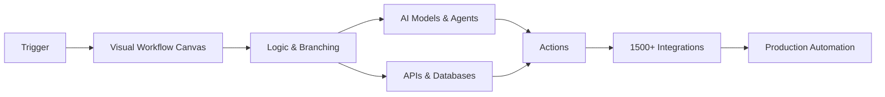

[](https://github.com/n8n-io/n8n/stargazers)
[](https://hub.docker.com/r/n8nio/n8n)
[](https://github.com/n8n-io/n8n/blob/master/LICENSE.md)
[](https://community.n8n.io)

# n8n – The Platform for AI Agents and Workflow Automation

Fair-code platform to build and deploy AI agents and workflows. Combine a visual canvas with custom code, run it self-hosted or in the [cloud](https://app.n8n.cloud/login), and connect to 1500+ integrations. AI automation you can trust with real work, from prototype to production.


## Table of Contents

- [How n8n Works](#how-n8n-works)
- [Core Concepts](#core-concepts)
- [Key Capabilities](#key-capabilities)
- [Example Use Cases](#example-use-cases)
- [Quick Start](#quick-start)
- [Your First Workflow](#your-first-workflow)
- [Ways to Run n8n](#ways-to-run-n8n)
- [Resources](#resources)
- [Learning Path](#learning-path)
- [Support](#support)
- [FAQ](#faq)
- [License](#license)
- [Contributing](#contributing)
- [Join the Team](#join-the-team)
- [What does n8n mean?](#what-does-n8n-mean)

## How n8n Works


```mermaid
flowchart LR
    A[Trigger] --> B[Visual Workflow Canvas]
    B --> C[Logic & Branching]
    C --> D[AI Models & Agents]
    C --> E[APIs & Databases]
    D --> F[Actions]
    E --> F
    F --> G[1500+ Integrations]
    G --> H[Production Automation]
```

n8n connects a trigger to a series of nodes. Each node can transform data, call an API, use an AI model, branch logic, wait for approval, or run custom code. The visual canvas shows the whole workflow, while code and integrations handle the details.

## Core Concepts

| Concept | What it means |
| --- | --- |
| Workflow | A sequence of nodes that starts with a trigger and performs actions. |
| Node | A single step in a workflow, such as an HTTP request, AI model call, or app action. |
| Trigger | The event that starts a workflow, such as a schedule, webhook, or app event. |
| Credential | Stored authentication for an integration or API. |
| Execution | One run of a workflow, including logs and status. |
| Canvas | The visual editor where you connect nodes. |
| AI Agent | A workflow that can reason, call tools, and use models to complete multi-step tasks. |

## Key Capabilities

- **AI-Native Automation Platform**: Build and operationalize AI workflows and multi-step agents using your own data, models, and tools
- **Model Flexibility, No Lock-In**: Connect to OpenAI, Anthropic, Google, or open-source models and switch providers without changing your architecture
- **From Prototype to Production**: Design multi-step AI workflows with logic, tool use, human approvals, and full observability
- **Code When You Need It**: Combine visual building with JavaScript, Python, and npm packages for advanced AI workflows
- **Enterprise-Ready AI**: Self-host or deploy securely with role-based access, audit trails, and support for sensitive data
- **Leverage What Already Exists**: 1500+ integrations and 9,000+ workflow [templates](https://n8n.io/workflows) to connect AI with your existing systems

## Example Use Cases

- AI support triage
- Lead enrichment and routing
- Document summarization and classification
- Scheduled data syncs
- Internal approval workflows
- Chatbot with tools and memory
- RAG pipelines over private data
- Multi-step agent workflows with human-in-the-loop review

## Quick Start

Try n8n instantly with our install script (requires [Docker](https://www.docker.com/)):

```sh
curl -fsSL https://get.n8n.io | sh
```

Or deploy manually with [Docker](https://docs.n8n.io/hosting/installation/docker/):

```
docker volume create n8n_data
docker run -it --rm --name n8n -p 5678:5678 -v n8n_data:/home/node/.n8n docker.n8n.io/n8nio/n8n
```

Access the editor at http://localhost:5678

## Your First Workflow

1. Open the editor at http://localhost:5678 or your cloud instance.
2. Select **Add first step**.
3. Choose a trigger, such as **Schedule Trigger** or **Webhook**.
4. Add an action node, such as **HTTP Request**, **OpenAI**, or any of the 1500+ integrations.
5. Connect the nodes and select **Execute workflow**.
6. Inspect the output, then activate the workflow.

## Ways to Run n8n

| Option | Best for | Link |
| --- | --- | --- |
| n8n Cloud | Managed hosting, quick start | [app.n8n.cloud](https://app.n8n.cloud/login) |
| Docker | Self-hosted, local or server | [Docker installation](https://docs.n8n.io/hosting/installation/docker/) |
| npm | Local development | [npm installation](https://docs.n8n.io/hosting/installation/npm/) |
| Source | Custom builds and contributions | [Contributing Guide](https://github.com/n8n-io/n8n/blob/master/CONTRIBUTING.md) |

## Resources

- 📚 [Documentation](https://docs.n8n.io)
- 🔧 [1500+ Integrations](https://n8n.io/integrations)
- 💡 [Example Workflows](https://n8n.io/workflows)
- 🤖 [AI & LangChain Guide](https://docs.n8n.io/advanced-ai/)
- 👥 [Community Forum](https://community.n8n.io)
- 📖 [Community Tutorials](https://community.n8n.io/c/tutorials/28)

## Learning Path

1. Read the [Documentation](https://docs.n8n.io).
2. Try an [Example Workflow](https://n8n.io/workflows).
3. Follow the [AI & LangChain Guide](https://docs.n8n.io/advanced-ai/).
4. Ask questions in the [Community Forum](https://community.n8n.io).
5. Watch [Community Tutorials](https://community.n8n.io/c/tutorials/28).

## Support

Need help? Our community forum is the place to get support and connect with other users:
[community.n8n.io](https://community.n8n.io)

## FAQ

**Do I need to know how to code?**  
No. You can build workflows visually. When you need custom logic, you can add JavaScript, Python, or npm packages.

**Can I self-host n8n?**  
Yes. n8n is self-hostable and source-available.

**Can I use my own AI models?**  
Yes. Connect OpenAI, Anthropic, Google, open-source models, or your own endpoints.

**Is there a free version?**  
n8n is fair-code. See the [License](#license) section for details.

## License

n8n is [fair-code](https://faircode.io) distributed under the [Sustainable Use License](https://github.com/n8n-io/n8n/blob/master/LICENSE.md) and [n8n Enterprise License](https://github.com/n8n-io/n8n/blob/master/LICENSE_EE.md).

- **Source Available**: Always visible source code
- **Self-Hostable**: Deploy anywhere
- **Extensible**: Add your own nodes and functionality

[Enterprise Licenses](mailto:license@n8n.io) available for additional features and support.

Additional information about the license model can be found in the [docs](https://docs.n8n.io/sustainable-use-license/).

## Contributing

Found a bug 🐛 or have a feature idea ✨? Check our [Contributing Guide](https://github.com/n8n-io/n8n/blob/master/CONTRIBUTING.md) for a setup guide & best practices.

## Join the Team

Want to shape the future of automation? Check out our [job posts](https://n8n.io/careers) and join our team!

## What does n8n mean?

**Short answer:** It means "nodemation" and is pronounced as n-eight-n.

**Long answer:** "I get that question quite often (more often than I expected) so I decided it is probably best to answer it here. While looking for a good name for the project with a free domain I realized very quickly that all the good ones I could think of were already taken. So, in the end, I chose nodemation. 'node-' in the sense that it uses a Node-View and that it uses Node.js and '-mation' for 'automation' which is what the project is supposed to help with. However, I did not like how long the name was and I could not imagine writing something that long every time in the CLI. That is when I then ended up on 'n8n'." - **Jan Oberhauser, Founder and CEO, n8n.io**
