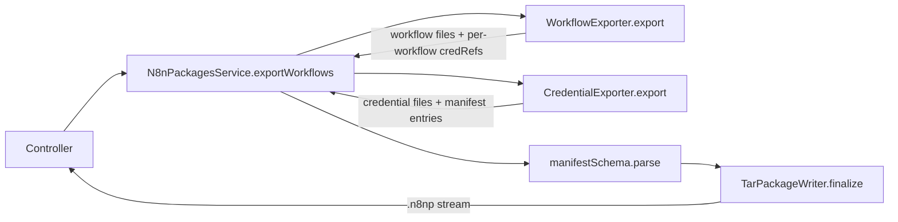

# SPEC: Credential Export in `.n8np` Packages

## 1. Objective

Extend the existing `n8n-packages` workflow exporter so that exporting a
workflow also exports the credentials it references. Credentials become
first-class entries in the `.n8np` tar bundle and in `manifest.json`, with no
secrets ever leaving the source instance.

**In scope:** export side only. Credentials are pulled into a package solely as
a consequence of workflow export — there is no standalone credential export
endpoint and no `credentialIds` request field. Import-side behaviour
(`credentialMatchingMode`, `credentialMissingMode`, stubs, bindings) is
specified separately and is out of scope here.

**Target users**
- Engineers building instance-to-instance promotion flows (export from staging,
  import to production).
- Engineers building backup / archive tooling on top of `.n8np`.
- Downstream import logic (a later spec) — this work defines the contract it
  reads.

**Non-goals**
- No exporting of encrypted credential `data` or any secret values, ever.
- No new CLI command — credentials ride along with the existing export request.
- No UI changes — the existing export endpoint already serves callers.
- No support for global / `isGlobal` credentials, resolvable credentials, or
  managed credentials beyond shipping `id` / `name` / `type`. Those flags are
  intentionally elided in v1.

### Acceptance criteria

1. `POST /n8n-packages/export` with workflows that reference credentials
   produces a tar containing a `credentials/<slug>/credential.json` file per
   unique referenced credential the caller can read.
2. Each `credential.json` contains **exactly** `id`, `name`, `type` — no
   `data`, no flags, no shared metadata.
3. `manifest.json` gains:
   - `credentials: ManifestEntry[]` listing the files actually written.
   - `requirements: { credentials: PackageCredentialRequirement[] }` listing
     every credential referenced by any exported workflow (including ones
     omitted from the file tree because they are orphaned), with each entry
     carrying `id`, `name`, `type`, and `usedByWorkflows: string[]`.
4. If the caller lacks `credential:read` on a credential referenced by an
   exported workflow, the export fails with a `UserError` describing the
   missing credential ids. The export is all-or-nothing — no partial bundles.
5. If a workflow references a credential that no longer exists in the DB
   (orphan), the credential is listed in `requirements.credentials` (using the
   `id` / `name` / `type` recorded on the node's `credentials` block) but **no
   file** is written and it does **not** appear in `manifest.credentials`.
6. Slug collisions across credentials (e.g. two credentials both named
   "Slack") resolve to `credentials/slack`, `credentials/slack-2`, … —
   identical strategy to `WorkflowExporter`.
7. The same credential referenced by two exported workflows produces one file
   and one `manifest.credentials` entry; its `requirements.credentials` entry
   lists both workflow ids in `usedByWorkflows`.

## 2. Commands

No new commands. The existing flow is the surface area:

```bash
# REST
POST /n8n-packages/export
Content-Type: application/json
{ "workflowIds": ["abc123"] }
# → application/gzip, filename=export.n8np
```

Verification commands while developing:

```bash
# From repo root
pnpm build > build.log 2>&1 && tail -n 20 build.log

# From packages/cli
cd packages/cli
pnpm test src/modules/n8n-packages
pnpm lint
pnpm typecheck
```

## 3. Project Structure

New files under `packages/cli/src/modules/n8n-packages/`:

```
entities/
  credential/
    credential.exporter.ts         # CredentialExporter service
    credential.serializer.ts       # Maps CredentialsEntity → SerializedCredential
    __tests__/
      credential.exporter.test.ts  # Unit tests (mocked finder)
spec/
  serialized/
    credential.schema.ts           # zod schema for credential.json contents
  requirements.schema.ts           # zod schema for manifest.requirements.*
```

New integration test file:

```
__tests__/export-workflow-with-credentials.integration.test.ts
                                    # All credential-export cases live here, not in
                                    # export-workflow.integration.test.ts. Future
                                    # slices add sibling files:
                                    #   export-workflow-with-variables.integration.test.ts
                                    #   export-workflow-with-data-tables.integration.test.ts
                                    #   export-workflow-with-sub-workflows.integration.test.ts
```

Modified files:

```
n8n-packages.service.ts            # Compose workflow + credential export, populate requirements
entities/workflow/workflow.exporter.ts
                                    # Return referenced credential ids per workflow (output extended)
spec/manifest.schema.ts            # Add credentials[] and requirements
```

`export-workflow.integration.test.ts` stays focused on workflow-only export
behaviour (manifest shape, slugging, permissions on workflows themselves).
Each "with X" requirement gets its own integration file so each slice owns
its own setup, fixtures, and assertions without cross-contaminating siblings.

### Manifest shape (v1, additive)

```jsonc
{
  "packageFormatVersion": "1",
  "exportedAt": "2026-05-26T12:00:00.000Z",
  "sourceN8nVersion": "1.x.y",
  "sourceId": "<instance-id>",
  "workflows": [
    { "id": "abc123", "name": "test-workflow", "target": "workflows/test-workflow" }
  ],
  "credentials": [
    { "id": "xyz789", "name": "Header credential", "target": "credentials/header-credential" }
  ],
  "requirements": {
    "credentials": [
      {
        "id": "xyz789",
        "name": "Header credential",
        "type": "httpHeaderAuth",
        "usedByWorkflows": ["abc123"]
      }
    ]
  }
}
```

`credentials` and `requirements` are both optional in the schema; an export
with no referenced credentials omits them entirely (or emits them empty —
serializer's choice, picked once and documented). `packageFormatVersion`
stays at `"1"` — this is an additive change.

### `credential.json` shape

```json
{
  "id": "xyz789",
  "name": "Header credential",
  "type": "httpHeaderAuth"
}
```

The schema rejects extra fields (`.strict()`) so future drift produces test
failures, not silent payload bloat.

### Data flow



The service is the orchestrator. `WorkflowExporter` is widened to surface the
credential references it saw (id + name + type from each node's `credentials`
record, plus the owning workflow id). The service hands that to
`CredentialExporter`, which:
1. Deduplicates by credential id.
2. Calls `CredentialsFinderService.findCredentialForUser(id, user,
   ['credential:read'])` per unique id.
3. For each found credential → write file, push to `credentials[]` and to
   `requirements.credentials`.
4. For each not-found credential (orphan) → push to `requirements.credentials`
   only.
5. If `findCredentialForUser` returns `null` because the credential **exists
   but is inaccessible** to the caller → collect into a missing-access list
   and `throw new UserError` once at the end with all offending ids.

> **Distinguishing orphan from forbidden:** `findCredentialForUser` returns
> `null` for both. We need a second probe via
> `CredentialsRepository.findOne({ where: { id } })` (or a finder helper) to
> tell them apart. The exporter does this lookup only for the null cases. This
> keeps the happy path one query per credential.

## 4. Code Style

Follows the conventions already established in `n8n-packages`:

- `@Service()` DI classes; constructor-injected dependencies.
- Zod schemas live under `spec/`; types are exported as `z.infer<>`.
- No `any`. No `as` casts in production code (test code may use `as`).
- Errors thrown to callers use `UserError` from `n8n-workflow`, never
  `ApplicationError`.
- File names: `kebab-case.ts`. Class names: `PascalCase`. Methods:
  `camelCase`.
- Slug helper: reuse `generateSlug` and the same private `allocateUniqueFileName`
  pattern as `WorkflowExporter`. If the function ends up duplicated verbatim,
  lift it into `io/slug.utils.ts` as a second helper — but only after the
  second call site exists, not pre-emptively.
- Comments: only where the *why* is non-obvious. The orphan-vs-forbidden probe
  is one such case.
- No new top-level package; everything lives in the existing `n8n-packages`
  module.

### Key types (illustrative — final names land in PR)

```ts
// spec/requirements.schema.ts
export const packageCredentialRequirementSchema = z.object({
  id: z.string().min(1),
  name: z.string().min(1),
  type: z.string().min(1),
  usedByWorkflows: z.array(z.string().min(1)).min(1),
});

export const packageRequirementsSchema = z.object({
  credentials: z.array(packageCredentialRequirementSchema).optional(),
});

// entities/credential/credential.exporter.ts
export interface CredentialExportRequest {
  user: User;
  references: CredentialReferenceFromWorkflow[]; // emitted by WorkflowExporter
  writer: PackageWriter;
}

export interface CredentialExportResult {
  entries: ManifestEntry[];                            // → manifest.credentials
  requirements: PackageCredentialRequirement[];        // → manifest.requirements.credentials
}
```

The reference carries `{ workflowId, credentialId, credentialName, credentialType }`
straight from each workflow node's `credentials` map — so even orphan
references have enough metadata for the requirements block without a DB hit.

## 5. Testing Strategy

Two layers, both required.

### Unit: `entities/credential/__tests__/credential.exporter.test.ts`

Mock `CredentialsFinderService` (and the orphan-vs-forbidden helper). Cases:

| # | Case | Expectation |
|---|------|-------------|
| 1 | No references | Returns empty `entries` and `requirements`; writes no files. |
| 2 | Single reference, caller has read | Writes one file with `id`/`name`/`type` only; emits one entry; emits one requirement with `usedByWorkflows: [wfId]`. |
| 3 | Same credential referenced by two workflows | Writes one file; one entry; one requirement with both workflow ids in `usedByWorkflows`. |
| 4 | Two credentials with same name | Files land at `credentials/slack` and `credentials/slack-2`. |
| 5 | Orphan reference (exists in node, missing in DB) | No file; no `entries`; one `requirements` entry built from the node's reference data. |
| 6 | Caller lacks `credential:read` on one credential | `UserError` thrown, message lists the offending id; no partial writes (verify writer was not called for any credential). |
| 7 | Mix of accessible + orphan | One file written, both appear in requirements. |
| 8 | Credential payload contains stray fields on the entity | Serialized output still contains exactly `id`/`name`/`type` (schema `.strict()` enforces). |

### Integration: new file `__tests__/export-workflow-with-credentials.integration.test.ts`

Real DB, real tar output via `readExport`. Lives alongside (not inside)
`export-workflow.integration.test.ts` so each "with X" requirement gets its
own file as the RFC features land. Cases:

1. **Bundles credentials**: Create owner + workflow that references a real
   credential the owner can read. Export. Assert tar has
   `credentials/<slug>/credential.json` with the right body, manifest has
   matching `credentials[]` entry and a `requirements.credentials` entry with
   `usedByWorkflows: [wfId]`.
2. **Dedupes across workflows**: Two workflows share one credential. Export
   both. Assert one credential file, one manifest entry, one requirement with
   two workflow ids.
3. **Orphan credential reference**: Workflow node has a `credentials` block
   pointing at id `does-not-exist`. Export. Assert no `credentials/` file for
   that id, no manifest entry, but `requirements.credentials` includes it with
   the name/type from the node.
4. **Forbidden credential blocks export**: Member without sharing on the
   workflow's credential attempts export (after the workflow itself is shared
   with them). Assert `UserError`, no tar emitted to the response (the
   service throws before any stream is opened).
5. **No-credentials workflow still works**: Existing tests must keep passing
   — manifest may include `credentials: []` and `requirements: { credentials:
   [] }` or omit them; lock that decision in one place and assert both forms
   only as documented.

### Skipped layers

- No new Playwright test — the UI surface is unchanged. Browser coverage waits
  until there's UI for selecting/inspecting an export bundle.
- No new schema-only test file — schema validation is exercised through both
  unit and integration tests.

## 6. Boundaries

### Always do

- Strip credential payloads to exactly `id` / `name` / `type` via the zod
  schema (use `.strict()` so unintended fields fail tests immediately).
- Require `credential:read` for every credential referenced by an exported
  workflow. Fail fast and noisily.
- Reuse `CredentialsFinderService` for permission checks — do not write
  parallel access logic.
- Reuse `generateSlug` + the workflow exporter's collision-suffix algorithm
  for credential file paths.
- Run `pnpm typecheck` and `pnpm lint` from `packages/cli` before pushing.
- Add zod schemas for any new on-disk shape (`credential.json`, requirements
  block) and parse on the way out, not just in.

### Ask first before

- Renaming or restructuring anything in the existing manifest. Treat
  `packageFormatVersion: "1"` as a contract: this slice is additive only.
- Changing the public DTO `ExportWorkflowsRequestDto` (e.g. adding a
  `includeCredentials` flag). The RFC's behaviour is "always include"; only
  introduce a knob if a concrete consumer asks for it.
- Touching `WorkflowSerializer` to alter how node `credentials` blocks are
  emitted. The current shape is the source of truth that the importer will
  read.
- Bumping `packageFormatVersion`. If the additive plan fails for any reason,
  surface that as a decision point rather than silently moving to `"2"`.

### Never do

- Never include encrypted `data`, decrypted values, or any field derived from
  `CredentialsEntity.data` in the export.
- Never include `isGlobal`, `isManaged`, `isResolvable`, `resolverId`,
  `resolvableAllowFallback`, `shared`, `createdAt`, or `updatedAt` in
  `credential.json` for this slice. Adding those is a future spec.
- Never silently drop a credential the caller can't access — that's an error,
  not a feature. Silent drops corrupt the import contract.
- Never let one bad credential leak partial output. The service must complete
  validation/permission checks before any tar bytes are streamed back.
- Never special-case the `Authorization` controller path with logic that
  belongs in the service. The controller stays a thin handler.
- Never store the offending credential ids in user-visible logs in a form
  that leaks names — ids are fine, names are PII-adjacent depending on user
  naming hygiene. Log ids; surface names only in the response body to the
  authenticated caller.

---

## Open assumptions to confirm

1. **Manifest backwards compatibility:** This change keeps
   `packageFormatVersion: "1"` because adding optional fields is additive. If
   downstream consumers (none in-tree yet) treat unknown fields as errors,
   we'll need to bump. Flagging now so it's a deliberate call, not a
   discovery during review.
2. **Empty arrays vs omission:** When a workflow has no credentials, manifest
   could emit `credentials: []` + `requirements: { credentials: [] }` or omit
   both. Recommend emitting omitted (smaller, matches today's behaviour for
   the workflow-only case). One-line decision; locking it in code + tests.
3. **`requirements.credentials.name`:** For orphan references, the only name
   we have is whatever was on the workflow node when it was last saved — it
   may be stale. We use it anyway; import-side matching modes can do better.

Correct me on any of these before I start implementing, or accept and I'll
proceed.
