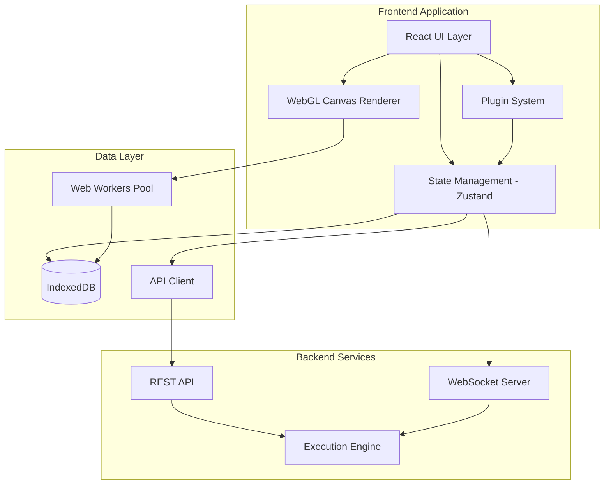
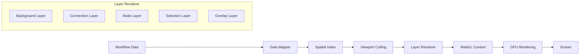
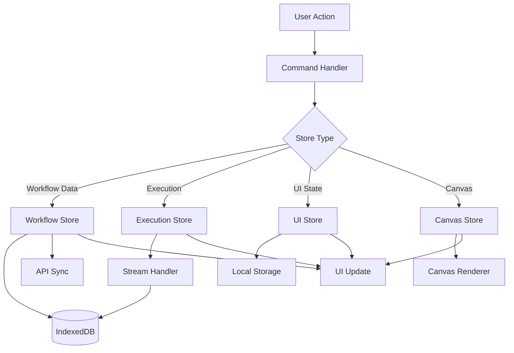
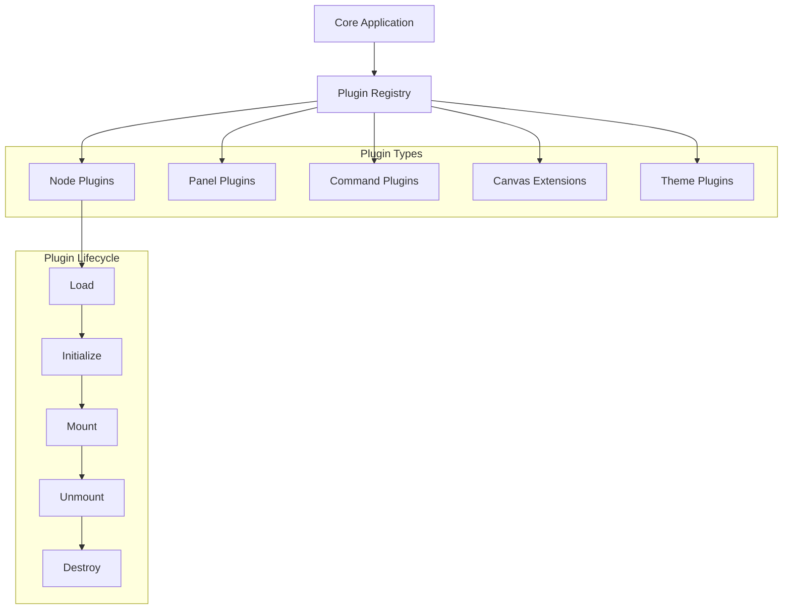
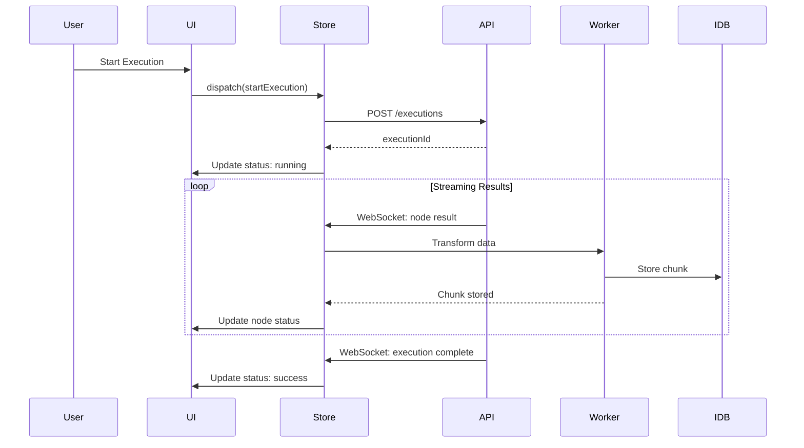
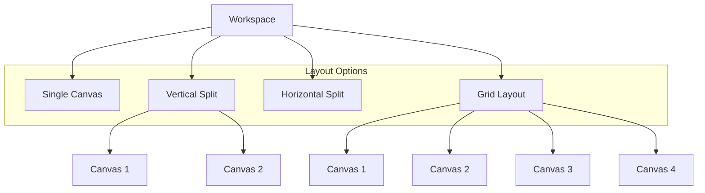

# Next-Gen Workflow UI - Technical Specification

## Table of Contents
1. [Architecture Diagrams](#architecture-diagrams)
2. [Component Specifications](#component-specifications)
3. [State Management](#state-management)
4. [Plugin System](#plugin-system)
5. [Canvas Renderer](#canvas-renderer)
6. [Data Management](#data-management)
7. [API Specifications](#api-specifications)
8. [Performance Optimizations](#performance-optimizations)

---

## 1. Architecture Diagrams

### 1.1 High-Level System Architecture



### 1.2 Canvas Rendering Pipeline



### 1.3 State Management Flow



### 1.4 Plugin System Architecture



### 1.5 Data Flow for Execution



### 1.6 Multi-Canvas Layout System



---

## 2. Component Specifications

### 2.1 Canvas Component

```typescript
/**
 * Main canvas component for workflow visualization
 *
 * Responsibilities:
 * - Render workflow graph using WebGL
 * - Handle user interactions (pan, zoom, select)
 * - Manage viewport state
 * - Coordinate with layout engine
 */
interface CanvasProps {
  /** Workflow to display */
  workflowId: string;

  /** Canvas dimensions */
  width: number;
  height: number;

  /** Read-only mode */
  readonly?: boolean;

  /** Event handlers */
  onNodeClick?: (nodeId: string) => void;
  onNodeDoubleClick?: (nodeId: string) => void;
  onSelectionChange?: (nodeIds: string[]) => void;
  onViewportChange?: (viewport: Viewport) => void;

  /** Customization */
  theme?: CanvasTheme;
  plugins?: CanvasPlugin[];
}

interface Viewport {
  x: number;
  y: number;
  zoom: number;
}

interface CanvasTheme {
  backgroundColor: string;
  gridColor: string;
  nodeColors: {
    default: string;
    selected: string;
    hover: string;
    error: string;
    success: string;
  };
  connectionColors: {
    default: string;
    selected: string;
    executing: string;
  };
}
```

### 2.2 Node Detail View (NDV) Component

```typescript
/**
 * Node configuration panel
 *
 * Responsibilities:
 * - Display node parameters
 * - Show input/output data
 * - Handle parameter updates
 * - Provide inline data preview
 */
interface NDVProps {
  /** Node to configure */
  nodeId: string;

  /** Display mode */
  mode: 'modal' | 'panel' | 'inline';

  /** Position (for inline mode) */
  position?: { x: number; y: number };

  /** Callbacks */
  onClose?: () => void;
  onSave?: (updates: Partial<WorkflowNode>) => void;
  onExecuteNode?: (nodeId: string) => void;
}

interface NDVLayout {
  /** Left side: Input data */
  input: {
    mode: 'schema' | 'table' | 'json';
    data: NodeExecutionData[];
  };

  /** Center: Parameters */
  parameters: {
    groups: ParameterGroup[];
  };

  /** Right side: Output data */
  output: {
    mode: 'schema' | 'table' | 'json';
    data: NodeExecutionData[];
  };
}
```

### 2.3 Command Palette

```typescript
/**
 * Global command palette for keyboard-first navigation
 *
 * Responsibilities:
 * - Fuzzy search all commands
 * - Context-aware suggestions
 * - Keyboard navigation
 * - Recent commands history
 */
interface CommandPaletteProps {
  /** Visibility */
  isOpen: boolean;
  onClose: () => void;

  /** Context for filtering */
  context?: CommandContext;
}

interface Command {
  id: string;
  label: string;
  description?: string;
  icon?: string;
  shortcut?: string;
  category: string;
  keywords: string[];

  /** Execute command */
  execute: (context: CommandContext) => void | Promise<void>;

  /** Conditional visibility */
  isVisible?: (context: CommandContext) => boolean;
}

interface CommandContext {
  /** Current view */
  view: 'canvas' | 'settings' | 'execution';

  /** Selected nodes */
  selectedNodes: string[];

  /** Active workflow */
  workflowId?: string;

  /** User permissions */
  permissions: string[];
}
```

### 2.4 Execution Panel

```typescript
/**
 * Panel for viewing and managing workflow executions
 *
 * Responsibilities:
 * - List execution history
 * - Display execution details
 * - Time-travel debugging
 * - Export execution data
 */
interface ExecutionPanelProps {
  /** Workflow context */
  workflowId: string;

  /** Selected execution */
  executionId?: string;

  /** Panel size */
  size: 'compact' | 'normal' | 'expanded';
}

interface ExecutionView {
  /** Timeline view */
  timeline: {
    nodes: ExecutionTimelineNode[];
    currentTime: number;
    totalDuration: number;
  };

  /** Node results */
  results: Map<string, NodeExecutionResult>;

  /** Execution metadata */
  metadata: {
    startTime: Date;
    endTime?: Date;
    status: ExecutionStatus;
    trigger: string;
  };
}
```

---

## 3. State Management

### 3.1 Store Architecture

```typescript
/**
 * Minimal, focused stores using Zustand
 */

// 1. Workflow Store
interface WorkflowStore {
  // State
  currentWorkflowId: string | null;
  workflows: Map<string, Workflow>;
  nodes: Map<string, WorkflowNode>;
  connections: Map<string, WorkflowConnection>;

  // Computed (derived via selectors, not stored)
  // Use: const selectedNodes = useWorkflowStore(state =>
  //   state.getNodesByIds(state.selectedNodeIds))

  // Actions
  loadWorkflow: (id: string) => Promise<void>;
  createNode: (node: Omit<WorkflowNode, 'id'>) => string;
  updateNode: (id: string, updates: Partial<WorkflowNode>) => void;
  deleteNode: (id: string) => void;
  createConnection: (conn: Omit<WorkflowConnection, 'id'>) => string;
  deleteConnection: (id: string) => void;

  // Persistence
  saveWorkflow: () => Promise<void>;
  exportWorkflow: () => WorkflowExport;
  importWorkflow: (data: WorkflowExport) => Promise<string>;
}

// 2. Execution Store
interface ExecutionStore {
  // State
  executions: Map<string, Execution>;
  currentExecutionId: string | null;
  runData: Map<string, NodeRunData>; // nodeId -> run data

  // Actions
  startExecution: (workflowId: string, options?: ExecutionOptions) => Promise<string>;
  stopExecution: (executionId: string) => Promise<void>;
  loadExecution: (executionId: string) => Promise<void>;

  // Streaming
  subscribeToExecution: (executionId: string, callback: (update: ExecutionUpdate) => void) => () => void;
}

// 3. UI Store
interface UIStore {
  // State
  activePanel: 'canvas' | 'ndv' | 'execution' | null;
  selectedNodeIds: Set<string>;
  hoveredNodeId: string | null;
  viewport: Viewport;

  // Actions
  setActivePanel: (panel: string | null) => void;
  selectNodes: (nodeIds: string[]) => void;
  setViewport: (viewport: Viewport) => void;

  // Preferences (persisted to localStorage)
  preferences: {
    theme: 'light' | 'dark' | 'system';
    gridSnap: boolean;
    autoLayout: boolean;
  };
  updatePreferences: (updates: Partial<UIStore['preferences']>) => void;
}

// 4. Canvas Store
interface CanvasStore {
  // State
  dragState: DragState | null;
  connectionInProgress: ConnectionDraft | null;
  layout: WorkflowLayout | null;

  // Actions
  startDrag: (dragState: DragState) => void;
  updateDrag: (position: { x: number; y: number }) => void;
  endDrag: () => void;

  startConnection: (sourceNodeId: string, outputIndex: number) => void;
  updateConnection: (position: { x: number; y: number }) => void;
  completeConnection: (targetNodeId: string, inputIndex: number) => void;
  cancelConnection: () => void;

  // Layout
  requestLayout: () => Promise<void>;
}

// Store creation with Zustand
import { create } from 'zustand';
import { persist, devtools } from 'zustand/middleware';

const useWorkflowStore = create<WorkflowStore>()(
  devtools(
    persist(
      (set, get) => ({
        // Initial state
        currentWorkflowId: null,
        workflows: new Map(),
        nodes: new Map(),
        connections: new Map(),

        // Actions
        loadWorkflow: async (id) => {
          const workflow = await api.getWorkflow(id);
          set({
            currentWorkflowId: id,
            workflows: new Map(get().workflows).set(id, workflow),
            nodes: new Map(workflow.nodes.map(n => [n.id, n])),
            connections: new Map(workflow.connections.map(c => [c.id, c]))
          });
        },

        createNode: (nodeData) => {
          const id = generateId();
          const node = { ...nodeData, id };
          set({
            nodes: new Map(get().nodes).set(id, node)
          });
          return id;
        },

        updateNode: (id, updates) => {
          const nodes = new Map(get().nodes);
          const node = nodes.get(id);
          if (node) {
            nodes.set(id, { ...node, ...updates });
            set({ nodes });
          }
        },

        deleteNode: (id) => {
          const nodes = new Map(get().nodes);
          nodes.delete(id);

          // Also delete connected connections
          const connections = new Map(get().connections);
          for (const [connId, conn] of connections) {
            if (conn.sourceNodeId === id || conn.targetNodeId === id) {
              connections.delete(connId);
            }
          }

          set({ nodes, connections });
        },

        // ... other actions
      }),
      {
        name: 'workflow-storage',
        partialize: (state) => ({
          // Only persist essential data
          currentWorkflowId: state.currentWorkflowId,
          preferences: state.preferences
        })
      }
    )
  )
);
```

### 3.2 Selectors and Derived State

```typescript
/**
 * Selectors for efficient derived state
 *
 * Benefits:
 * - Only recompute when dependencies change
 * - Avoid storing derived data
 * - Better performance than computed properties
 */

// Get nodes by IDs
const selectNodesByIds = (nodeIds: string[]) => (state: WorkflowStore) => {
  return nodeIds.map(id => state.nodes.get(id)).filter(Boolean);
};

// Get connections for a node
const selectNodeConnections = (nodeId: string) => (state: WorkflowStore) => {
  const connections = Array.from(state.connections.values());
  return {
    inputs: connections.filter(c => c.targetNodeId === nodeId),
    outputs: connections.filter(c => c.sourceNodeId === nodeId)
  };
};

// Get downstream nodes
const selectDownstreamNodes = (nodeId: string) => (state: WorkflowStore) => {
  const visited = new Set<string>();
  const queue = [nodeId];

  while (queue.length > 0) {
    const current = queue.shift()!;
    if (visited.has(current)) continue;
    visited.add(current);

    const connections = Array.from(state.connections.values());
    const outputs = connections.filter(c => c.sourceNodeId === current);
    queue.push(...outputs.map(c => c.targetNodeId));
  }

  visited.delete(nodeId); // Remove starting node
  return Array.from(visited);
};

// Usage in components
function NodeComponent({ nodeId }: { nodeId: string }) {
  // Only re-render when this specific node changes
  const node = useWorkflowStore(state => state.nodes.get(nodeId));

  // Only re-render when connections change
  const connections = useWorkflowStore(selectNodeConnections(nodeId));

  return <div>{/* ... */}</div>;
}
```

---

## 4. Plugin System

### 4.1 Plugin API

```typescript
/**
 * Core plugin interface
 */
interface WorkflowPlugin {
  /** Unique identifier */
  id: string;

  /** Display name */
  name: string;

  /** Version (semver) */
  version: string;

  /** Description */
  description?: string;

  /** Author */
  author?: string;

  /** Dependencies */
  dependencies?: {
    [pluginId: string]: string; // version range
  };

  /** Lifecycle hooks */
  onLoad?: () => void | Promise<void>;
  onUnload?: () => void | Promise<void>;
  onError?: (error: Error) => void;

  /** Extensions */
  nodes?: NodePluginDefinition[];
  panels?: PanelPluginDefinition[];
  commands?: CommandPluginDefinition[];
  canvasExtensions?: CanvasExtensionDefinition[];
  themes?: ThemeDefinition[];
}

/**
 * Plugin registry and lifecycle management
 */
class PluginRegistry {
  private plugins = new Map<string, WorkflowPlugin>();
  private loadedPlugins = new Set<string>();

  /** Register a plugin */
  register(plugin: WorkflowPlugin): void {
    if (this.plugins.has(plugin.id)) {
      throw new Error(`Plugin ${plugin.id} already registered`);
    }

    // Validate dependencies
    this.validateDependencies(plugin);

    this.plugins.set(plugin.id, plugin);
  }

  /** Load and activate a plugin */
  async load(pluginId: string): Promise<void> {
    const plugin = this.plugins.get(pluginId);
    if (!plugin) {
      throw new Error(`Plugin ${pluginId} not found`);
    }

    if (this.loadedPlugins.has(pluginId)) {
      return; // Already loaded
    }

    // Load dependencies first
    if (plugin.dependencies) {
      for (const depId of Object.keys(plugin.dependencies)) {
        await this.load(depId);
      }
    }

    // Call lifecycle hook
    try {
      await plugin.onLoad?.();
      this.loadedPlugins.add(pluginId);

      // Register extensions
      this.registerExtensions(plugin);
    } catch (error) {
      plugin.onError?.(error as Error);
      throw error;
    }
  }

  /** Unload a plugin */
  async unload(pluginId: string): Promise<void> {
    const plugin = this.plugins.get(pluginId);
    if (!plugin) return;

    // Check if other plugins depend on this
    const dependents = this.getDependents(pluginId);
    if (dependents.length > 0) {
      throw new Error(`Cannot unload ${pluginId}: required by ${dependents.join(', ')}`);
    }

    await plugin.onUnload?.();
    this.loadedPlugins.delete(pluginId);

    // Unregister extensions
    this.unregisterExtensions(plugin);
  }

  private validateDependencies(plugin: WorkflowPlugin): void {
    // Check all dependencies are registered
    // Check version compatibility
    // Detect circular dependencies
  }

  private registerExtensions(plugin: WorkflowPlugin): void {
    // Register nodes, panels, commands, etc.
  }

  private unregisterExtensions(plugin: WorkflowPlugin): void {
    // Cleanup
  }

  private getDependents(pluginId: string): string[] {
    return Array.from(this.plugins.values())
      .filter(p => p.dependencies?.[pluginId])
      .map(p => p.id);
  }
}
```

### 4.2 Node Plugin

```typescript
/**
 * Plugin for adding custom nodes
 */
interface NodePluginDefinition {
  /** Node type identifier */
  type: string;

  /** Display name */
  displayName: string;

  /** Description */
  description: string;

  /** Icon */
  icon: string;

  /** Category for grouping */
  category: string;

  /** Input/output configuration */
  inputs: NodeIODefinition[];
  outputs: NodeIODefinition[];

  /** Parameter definitions */
  parameters: ParameterDefinition[];

  /** Custom renderer (optional) */
  render?: (node: WorkflowNode, context: NodeRenderContext) => React.ReactNode;

  /** Configuration UI */
  configure: (node: WorkflowNode, context: NodeConfigContext) => React.ReactNode;

  /** Execution logic */
  execute: (input: NodeExecutionInput, context: NodeExecutionContext) => Promise<NodeExecutionOutput>;

  /** Validation */
  validate?: (node: WorkflowNode) => ValidationError[];
}

interface NodeIODefinition {
  name: string;
  type: 'main' | 'ai' | 'trigger';
  displayName?: string;
  required?: boolean;
  multiple?: boolean; // Can connect multiple connections
}

interface ParameterDefinition {
  name: string;
  type: 'string' | 'number' | 'boolean' | 'json' | 'select' | 'credential';
  displayName: string;
  description?: string;
  default?: any;
  required?: boolean;
  options?: Array<{ value: any; label: string }>;

  // Conditional display
  displayOptions?: {
    show?: { [param: string]: any[] };
    hide?: { [param: string]: any[] };
  };
}

// Example: HTTP Request Node Plugin
const httpNodePlugin: NodePluginDefinition = {
  type: 'http.request',
  displayName: 'HTTP Request',
  description: 'Make HTTP requests to any URL',
  icon: 'globe',
  category: 'Core',

  inputs: [
    { name: 'main', type: 'main', required: false }
  ],

  outputs: [
    { name: 'main', type: 'main' }
  ],

  parameters: [
    {
      name: 'method',
      type: 'select',
      displayName: 'Method',
      default: 'GET',
      required: true,
      options: [
        { value: 'GET', label: 'GET' },
        { value: 'POST', label: 'POST' },
        { value: 'PUT', label: 'PUT' },
        { value: 'DELETE', label: 'DELETE' }
      ]
    },
    {
      name: 'url',
      type: 'string',
      displayName: 'URL',
      default: '',
      required: true
    },
    {
      name: 'body',
      type: 'json',
      displayName: 'Body',
      default: '',
      displayOptions: {
        show: {
          method: ['POST', 'PUT', 'PATCH']
        }
      }
    }
  ],

  configure: (node, context) => {
    return <HTTPNodeConfig node={node} context={context} />;
  },

  execute: async (input, context) => {
    const { method, url, body } = input.parameters;

    const response = await fetch(url, {
      method,
      body: body ? JSON.stringify(body) : undefined,
      headers: {
        'Content-Type': 'application/json'
      }
    });

    const data = await response.json();

    return {
      json: data,
      statusCode: response.status
    };
  },

  validate: (node) => {
    const errors: ValidationError[] = [];

    if (!node.parameters.url) {
      errors.push({
        parameter: 'url',
        message: 'URL is required'
      });
    }

    return errors;
  }
};
```

### 4.3 Panel Plugin

```typescript
/**
 * Plugin for adding custom panels
 */
interface PanelPluginDefinition {
  /** Unique identifier */
  id: string;

  /** Display title */
  title: string;

  /** Icon */
  icon: string;

  /** Position */
  position: 'left' | 'right' | 'bottom';

  /** Default size */
  defaultSize: number;

  /** Render function */
  render: (context: PanelContext) => React.ReactNode;

  /** Keyboard shortcut to toggle */
  shortcut?: string;

  /** Show in menu */
  showInMenu?: boolean;
}

interface PanelContext {
  /** Current workflow */
  workflowId: string | null;

  /** Selected nodes */
  selectedNodes: WorkflowNode[];

  /** Current execution */
  executionId: string | null;

  /** Panel controls */
  close: () => void;
  resize: (size: number) => void;
}

// Example: Variables Panel Plugin
const variablesPanelPlugin: PanelPluginDefinition = {
  id: 'variables',
  title: 'Variables',
  icon: 'variable',
  position: 'right',
  defaultSize: 300,
  shortcut: 'Ctrl+Shift+V',
  showInMenu: true,

  render: (context) => {
    const variables = useWorkflowStore(state => state.variables);

    return (
      <div className="p-4">
        <h2>Workflow Variables</h2>
        <VariableList variables={variables} />
        <Button onClick={() => {/* Add variable */}}>
          Add Variable
        </Button>
      </div>
    );
  }
};
```

### 4.4 Command Plugin

```typescript
/**
 * Plugin for adding custom commands
 */
interface CommandPluginDefinition {
  /** Unique identifier */
  id: string;

  /** Display label */
  label: string;

  /** Description */
  description?: string;

  /** Icon */
  icon?: string;

  /** Category */
  category: string;

  /** Keywords for search */
  keywords: string[];

  /** Keyboard shortcut */
  shortcut?: string;

  /** Conditional visibility */
  isVisible?: (context: CommandContext) => boolean;

  /** Execute command */
  execute: (context: CommandContext) => void | Promise<void>;
}

// Example: Auto-layout command
const autoLayoutCommand: CommandPluginDefinition = {
  id: 'workflow.autoLayout',
  label: 'Auto Layout Workflow',
  description: 'Automatically arrange nodes',
  icon: 'layout',
  category: 'Workflow',
  keywords: ['layout', 'arrange', 'organize', 'tidy'],
  shortcut: 'Ctrl+L',

  isVisible: (context) => {
    return context.view === 'canvas' && context.workflowId !== null;
  },

  execute: async (context) => {
    const canvasStore = useCanvasStore.getState();
    await canvasStore.requestLayout();
  }
};
```

---

## 5. Canvas Renderer

### 5.1 WebGL Rendering Architecture

```typescript
/**
 * Custom WebGL renderer for high-performance canvas
 */
class CanvasRenderer {
  private gl: WebGL2RenderingContext;
  private layers: RenderLayer[];
  private spatialIndex: SpatialIndex;
  private viewport: Viewport;

  constructor(canvas: HTMLCanvasElement) {
    this.gl = canvas.getContext('webgl2')!;
    this.layers = [
      new BackgroundLayer(this.gl),
      new ConnectionLayer(this.gl),
      new NodeLayer(this.gl),
      new SelectionLayer(this.gl),
      new OverlayLayer(this.gl)
    ];
    this.spatialIndex = new QuadTree();
  }

  /** Update viewport */
  setViewport(viewport: Viewport): void {
    this.viewport = viewport;
    this.updateProjectionMatrix();
  }

  /** Render frame */
  render(nodes: WorkflowNode[], connections: WorkflowConnection[]): void {
    // Clear canvas
    this.gl.clear(this.gl.COLOR_BUFFER_BIT);

    // Update spatial index
    this.spatialIndex.clear();
    nodes.forEach(node => this.spatialIndex.insert(node));

    // Viewport culling: Get visible nodes
    const visibleNodes = this.spatialIndex.query(this.viewport.bounds);

    // Render layers
    for (const layer of this.layers) {
      layer.render({
        nodes: visibleNodes,
        connections,
        viewport: this.viewport,
        spatialIndex: this.spatialIndex
      });
    }
  }

  /** Hit testing */
  hitTest(x: number, y: number): WorkflowNode | null {
    const worldPos = this.screenToWorld({ x, y });
    const candidates = this.spatialIndex.query({
      x: worldPos.x - 5,
      y: worldPos.y - 5,
      width: 10,
      height: 10
    });

    // Return closest node
    return candidates[0] ?? null;
  }

  private updateProjectionMatrix(): void {
    // Calculate projection matrix based on viewport
    const matrix = mat4.create();
    mat4.ortho(
      matrix,
      this.viewport.x,
      this.viewport.x + this.viewport.width,
      this.viewport.y + this.viewport.height,
      this.viewport.y,
      -1,
      1
    );

    // Update all layers
    this.layers.forEach(layer => layer.setProjection(matrix));
  }

  private screenToWorld(screen: { x: number; y: number }): { x: number; y: number } {
    return {
      x: this.viewport.x + (screen.x / this.viewport.zoom),
      y: this.viewport.y + (screen.y / this.viewport.zoom)
    };
  }
}
```

### 5.2 Spatial Indexing

```typescript
/**
 * Quadtree for efficient spatial queries
 */
class QuadTree {
  private root: QuadNode;
  private maxDepth = 8;
  private maxItems = 16;

  constructor(bounds: Bounds) {
    this.root = new QuadNode(bounds, 0);
  }

  insert(node: WorkflowNode): void {
    this.root.insert(node, this.maxDepth, this.maxItems);
  }

  query(bounds: Bounds): WorkflowNode[] {
    return this.root.query(bounds);
  }

  clear(): void {
    this.root.clear();
  }
}

class QuadNode {
  private items: WorkflowNode[] = [];
  private children: QuadNode[] | null = null;

  constructor(
    private bounds: Bounds,
    private depth: number
  ) {}

  insert(node: WorkflowNode, maxDepth: number, maxItems: number): void {
    if (!this.intersects(node.position, node.size)) {
      return;
    }

    if (this.children === null) {
      this.items.push(node);

      if (this.items.length > maxItems && this.depth < maxDepth) {
        this.subdivide();
      }
    } else {
      for (const child of this.children) {
        child.insert(node, maxDepth, maxItems);
      }
    }
  }

  query(bounds: Bounds): WorkflowNode[] {
    const result: WorkflowNode[] = [];

    if (!this.intersectsBounds(bounds)) {
      return result;
    }

    result.push(...this.items.filter(node =>
      this.nodeIntersectsBounds(node, bounds)
    ));

    if (this.children) {
      for (const child of this.children) {
        result.push(...child.query(bounds));
      }
    }

    return result;
  }

  private subdivide(): void {
    const { x, y, width, height } = this.bounds;
    const hw = width / 2;
    const hh = height / 2;

    this.children = [
      new QuadNode({ x, y, width: hw, height: hh }, this.depth + 1),
      new QuadNode({ x: x + hw, y, width: hw, height: hh }, this.depth + 1),
      new QuadNode({ x, y: y + hh, width: hw, height: hh }, this.depth + 1),
      new QuadNode({ x: x + hw, y: y + hh, width: hw, height: hh }, this.depth + 1)
    ];

    // Redistribute items
    for (const item of this.items) {
      for (const child of this.children) {
        child.insert(item, Infinity, Infinity);
      }
    }

    this.items = [];
  }

  // ... intersection helpers
}
```

### 5.3 Level of Detail (LOD)

```typescript
/**
 * Reduce detail for zoomed-out nodes
 */
class NodeLayer extends RenderLayer {
  render(context: RenderContext): void {
    const { nodes, viewport } = context;

    for (const node of nodes) {
      const lod = this.calculateLOD(node, viewport);

      switch (lod) {
        case 'high':
          this.renderHighDetail(node);
          break;
        case 'medium':
          this.renderMediumDetail(node);
          break;
        case 'low':
          this.renderLowDetail(node);
          break;
      }
    }
  }

  private calculateLOD(node: WorkflowNode, viewport: Viewport): 'high' | 'medium' | 'low' {
    const zoom = viewport.zoom;

    if (zoom >= 1.0) return 'high';
    if (zoom >= 0.5) return 'medium';
    return 'low';
  }

  private renderHighDetail(node: WorkflowNode): void {
    // Full detail: icon, text, badges, handles
    this.renderNodeBackground(node);
    this.renderNodeIcon(node);
    this.renderNodeText(node);
    this.renderNodeBadges(node);
    this.renderNodeHandles(node);
  }

  private renderMediumDetail(node: WorkflowNode): void {
    // Reduced detail: icon, text (no badges, handles)
    this.renderNodeBackground(node);
    this.renderNodeIcon(node);
    this.renderNodeText(node);
  }

  private renderLowDetail(node: WorkflowNode): void {
    // Minimal: just colored rectangle
    this.renderNodeBackground(node);
  }
}
```

---

## 6. Data Management

### 6.1 IndexedDB Schema

```typescript
/**
 * IndexedDB for local persistence
 */
interface WorkflowDB {
  workflows: {
    key: string; // workflowId
    value: {
      id: string;
      name: string;
      nodes: WorkflowNode[];
      connections: WorkflowConnection[];
      settings: WorkflowSettings;
      updatedAt: Date;
    };
  };

  executions: {
    key: string; // executionId
    value: {
      id: string;
      workflowId: string;
      status: ExecutionStatus;
      startTime: Date;
      endTime?: Date;
      trigger: string;
    };
  };

  executionData: {
    key: [string, string]; // [executionId, nodeId]
    value: {
      executionId: string;
      nodeId: string;
      data: NodeExecutionData[];
      createdAt: Date;
    };
  };

  cache: {
    key: string;
    value: {
      key: string;
      data: any;
      expiresAt: Date;
    };
  };
}

class IndexedDBManager {
  private db: IDBDatabase;

  async init(): Promise<void> {
    return new Promise((resolve, reject) => {
      const request = indexedDB.open('workflow-ui', 1);

      request.onerror = () => reject(request.error);
      request.onsuccess = () => {
        this.db = request.result;
        resolve();
      };

      request.onupgradeneeded = (event) => {
        const db = (event.target as IDBOpenDBRequest).result;

        // Create object stores
        if (!db.objectStoreNames.contains('workflows')) {
          db.createObjectStore('workflows', { keyPath: 'id' });
        }

        if (!db.objectStoreNames.contains('executions')) {
          const execStore = db.createObjectStore('executions', { keyPath: 'id' });
          execStore.createIndex('workflowId', 'workflowId');
        }

        if (!db.objectStoreNames.contains('executionData')) {
          const dataStore = db.createObjectStore('executionData', { keyPath: ['executionId', 'nodeId'] });
          dataStore.createIndex('executionId', 'executionId');
        }

        if (!db.objectStoreNames.contains('cache')) {
          const cacheStore = db.createObjectStore('cache', { keyPath: 'key' });
          cacheStore.createIndex('expiresAt', 'expiresAt');
        }
      };
    });
  }

  async getWorkflow(id: string): Promise<Workflow | null> {
    return this.get('workflows', id);
  }

  async saveWorkflow(workflow: Workflow): Promise<void> {
    return this.put('workflows', workflow);
  }

  async getExecutionData(executionId: string, nodeId: string): Promise<NodeExecutionData[] | null> {
    const data = await this.get('executionData', [executionId, nodeId]);
    return data?.data ?? null;
  }

  async saveExecutionData(executionId: string, nodeId: string, data: NodeExecutionData[]): Promise<void> {
    return this.put('executionData', {
      executionId,
      nodeId,
      data,
      createdAt: new Date()
    });
  }

  // Generic CRUD operations
  private async get<T>(storeName: string, key: any): Promise<T | null> {
    return new Promise((resolve, reject) => {
      const tx = this.db.transaction(storeName, 'readonly');
      const store = tx.objectStore(storeName);
      const request = store.get(key);

      request.onsuccess = () => resolve(request.result ?? null);
      request.onerror = () => reject(request.error);
    });
  }

  private async put(storeName: string, value: any): Promise<void> {
    return new Promise((resolve, reject) => {
      const tx = this.db.transaction(storeName, 'readwrite');
      const store = tx.objectStore(storeName);
      const request = store.put(value);

      request.onsuccess = () => resolve();
      request.onerror = () => reject(request.error);
    });
  }
}
```

### 6.2 Streaming Data Handler

```typescript
/**
 * Handle streaming execution data
 */
class ExecutionStreamHandler {
  private db: IndexedDBManager;
  private streams = new Map<string, ReadableStream>();

  /**
   * Stream execution results as they arrive
   */
  async streamExecution(executionId: string): Promise<ReadableStream<ExecutionUpdate>> {
    const stream = new ReadableStream<ExecutionUpdate>({
      start: async (controller) => {
        // Connect to WebSocket
        const ws = new WebSocket(`wss://api/executions/${executionId}/stream`);

        ws.onmessage = async (event) => {
          const update: ExecutionUpdate = JSON.parse(event.data);

          // Store in IndexedDB
          if (update.type === 'node_result') {
            await this.db.saveExecutionData(
              executionId,
              update.nodeId,
              update.data
            );
          }

          // Push to stream
          controller.enqueue(update);
        };

        ws.onerror = (error) => {
          controller.error(error);
        };

        ws.onclose = () => {
          controller.close();
          this.streams.delete(executionId);
        };
      }
    });

    this.streams.set(executionId, stream);
    return stream;
  }

  /**
   * Get execution data with pagination
   */
  async getExecutionDataPaged(
    executionId: string,
    nodeId: string,
    offset: number,
    limit: number
  ): Promise<{ data: NodeExecutionData[]; total: number }> {
    const allData = await this.db.getExecutionData(executionId, nodeId);

    if (!allData) {
      return { data: [], total: 0 };
    }

    return {
      data: allData.slice(offset, offset + limit),
      total: allData.length
    };
  }
}
```

---

## 7. API Specifications

### 7.1 REST API

```typescript
/**
 * API client with type-safe endpoints
 */
class APIClient {
  private baseURL: string;
  private token: string;

  // Workflows
  async getWorkflows(filters?: WorkflowFilters): Promise<Workflow[]> {
    return this.get('/workflows', { params: filters });
  }

  async getWorkflow(id: string): Promise<Workflow> {
    return this.get(`/workflows/${id}`);
  }

  async createWorkflow(data: CreateWorkflowDTO): Promise<Workflow> {
    return this.post('/workflows', data);
  }

  async updateWorkflow(id: string, updates: UpdateWorkflowDTO): Promise<Workflow> {
    return this.patch(`/workflows/${id}`, updates);
  }

  async deleteWorkflow(id: string): Promise<void> {
    return this.delete(`/workflows/${id}`);
  }

  // Executions
  async startExecution(workflowId: string, options?: ExecutionOptions): Promise<Execution> {
    return this.post(`/workflows/${workflowId}/execute`, options);
  }

  async getExecution(id: string): Promise<Execution> {
    return this.get(`/executions/${id}`);
  }

  async stopExecution(id: string): Promise<void> {
    return this.post(`/executions/${id}/stop`);
  }

  async getExecutionData(executionId: string, nodeId: string): Promise<NodeExecutionData[]> {
    return this.get(`/executions/${executionId}/nodes/${nodeId}/data`);
  }

  // Node types
  async getNodeTypes(): Promise<NodeType[]> {
    return this.get('/node-types');
  }

  // Generic request methods
  private async get<T>(path: string, options?: RequestOptions): Promise<T> {
    // Implementation
  }

  private async post<T>(path: string, data?: any, options?: RequestOptions): Promise<T> {
    // Implementation
  }

  private async patch<T>(path: string, data?: any, options?: RequestOptions): Promise<T> {
    // Implementation
  }

  private async delete<T>(path: string, options?: RequestOptions): Promise<T> {
    // Implementation
  }
}
```

### 7.2 WebSocket Protocol

```typescript
/**
 * WebSocket for real-time updates
 */
class WebSocketClient {
  private ws: WebSocket;
  private handlers = new Map<string, Set<(data: any) => void>>();

  connect(url: string): Promise<void> {
    return new Promise((resolve, reject) => {
      this.ws = new WebSocket(url);

      this.ws.onopen = () => resolve();
      this.ws.onerror = (error) => reject(error);

      this.ws.onmessage = (event) => {
        const message: WebSocketMessage = JSON.parse(event.data);
        this.handleMessage(message);
      };
    });
  }

  subscribe(channel: string, handler: (data: any) => void): () => void {
    if (!this.handlers.has(channel)) {
      this.handlers.set(channel, new Set());
      this.send({ type: 'subscribe', channel });
    }

    this.handlers.get(channel)!.add(handler);

    // Return unsubscribe function
    return () => {
      this.handlers.get(channel)?.delete(handler);
      if (this.handlers.get(channel)?.size === 0) {
        this.send({ type: 'unsubscribe', channel });
        this.handlers.delete(channel);
      }
    };
  }

  private handleMessage(message: WebSocketMessage): void {
    const handlers = this.handlers.get(message.channel);
    if (handlers) {
      handlers.forEach(handler => handler(message.data));
    }
  }

  private send(data: any): void {
    this.ws.send(JSON.stringify(data));
  }
}

// Message types
interface WebSocketMessage {
  channel: string;
  type: string;
  data: any;
}

// Execution updates
interface ExecutionUpdate {
  type: 'execution_started' | 'node_started' | 'node_completed' | 'execution_completed' | 'execution_failed';
  executionId: string;
  nodeId?: string;
  data?: any;
  error?: string;
  timestamp: Date;
}
```

---

## 8. Performance Optimizations

### 8.1 Web Worker Pool

```typescript
/**
 * Pool of Web Workers for parallel processing
 */
class WorkerPool {
  private workers: Worker[] = [];
  private queue: WorkerTask[] = [];
  private busy = new Set<Worker>();

  constructor(private size: number, workerScript: string) {
    for (let i = 0; i < size; i++) {
      const worker = new Worker(workerScript);
      worker.onmessage = (event) => this.handleWorkerResult(worker, event.data);
      this.workers.push(worker);
    }
  }

  async execute<T>(task: WorkerTask): Promise<T> {
    return new Promise((resolve, reject) => {
      const worker = this.getAvailableWorker();

      if (worker) {
        this.runTask(worker, { ...task, resolve, reject });
      } else {
        this.queue.push({ ...task, resolve, reject });
      }
    });
  }

  private getAvailableWorker(): Worker | null {
    return this.workers.find(w => !this.busy.has(w)) ?? null;
  }

  private runTask(worker: Worker, task: WorkerTask & { resolve: Function; reject: Function }): void {
    this.busy.add(worker);
    worker.postMessage({ id: task.id, type: task.type, data: task.data });

    // Store resolve/reject for later
    (worker as any).__currentTask = task;
  }

  private handleWorkerResult(worker: Worker, result: WorkerResult): void {
    const task = (worker as any).__currentTask;
    this.busy.delete(worker);

    if (result.error) {
      task.reject(new Error(result.error));
    } else {
      task.resolve(result.data);
    }

    // Process next task in queue
    const nextTask = this.queue.shift();
    if (nextTask) {
      this.runTask(worker, nextTask);
    }
  }

  terminate(): void {
    this.workers.forEach(w => w.terminate());
  }
}

// Usage
const layoutWorkerPool = new WorkerPool(2, '/workers/layout.worker.js');

async function calculateLayout(nodes: WorkflowNode[], connections: WorkflowConnection[]): Promise<WorkflowLayout> {
  return layoutWorkerPool.execute({
    id: generateId(),
    type: 'calculate_layout',
    data: { nodes, connections }
  });
}
```

### 8.2 Incremental Updates

```typescript
/**
 * Efficiently update only changed nodes
 */
class IncrementalUpdateManager {
  private previousState = new Map<string, WorkflowNode>();

  getChanges(currentNodes: WorkflowNode[]): NodeChanges {
    const changes: NodeChanges = {
      added: [],
      updated: [],
      removed: []
    };

    const currentIds = new Set(currentNodes.map(n => n.id));

    // Detect added and updated nodes
    for (const node of currentNodes) {
      const prev = this.previousState.get(node.id);

      if (!prev) {
        changes.added.push(node);
      } else if (!this.nodesEqual(prev, node)) {
        changes.updated.push({ old: prev, new: node });
      }
    }

    // Detect removed nodes
    for (const [id, node] of this.previousState) {
      if (!currentIds.has(id)) {
        changes.removed.push(node);
      }
    }

    // Update previous state
    this.previousState = new Map(currentNodes.map(n => [n.id, n]));

    return changes;
  }

  private nodesEqual(a: WorkflowNode, b: WorkflowNode): boolean {
    // Deep equality check (or use fast deep equal library)
    return JSON.stringify(a) === JSON.stringify(b);
  }
}
```

### 8.3 Virtual Scrolling for Data Viewers

```typescript
/**
 * Virtual scrolling for large datasets
 */
function VirtualTable<T>({
  data,
  rowHeight,
  containerHeight,
  renderRow
}: VirtualTableProps<T>) {
  const [scrollTop, setScrollTop] = useState(0);

  // Calculate visible range
  const startIndex = Math.floor(scrollTop / rowHeight);
  const endIndex = Math.min(
    startIndex + Math.ceil(containerHeight / rowHeight) + 1,
    data.length
  );

  const visibleData = data.slice(startIndex, endIndex);

  // Calculate offset for positioning
  const offsetY = startIndex * rowHeight;

  // Total height
  const totalHeight = data.length * rowHeight;

  return (
    <div
      className="overflow-auto"
      style={{ height: containerHeight }}
      onScroll={(e) => setScrollTop(e.currentTarget.scrollTop)}
    >
      <div style={{ height: totalHeight, position: 'relative' }}>
        <div style={{ transform: `translateY(${offsetY}px)` }}>
          {visibleData.map((item, index) => (
            <div key={startIndex + index} style={{ height: rowHeight }}>
              {renderRow(item, startIndex + index)}
            </div>
          ))}
        </div>
      </div>
    </div>
  );
}
```

---

## 9. Testing Strategy

### 9.1 Unit Tests

```typescript
/**
 * Unit tests for stores
 */
describe('WorkflowStore', () => {
  beforeEach(() => {
    // Reset store
    useWorkflowStore.setState({
      currentWorkflowId: null,
      nodes: new Map(),
      connections: new Map()
    });
  });

  test('should create node', () => {
    const store = useWorkflowStore.getState();
    const nodeId = store.createNode({
      type: 'http.request',
      name: 'HTTP Request',
      position: { x: 0, y: 0 },
      parameters: {}
    });

    expect(store.nodes.has(nodeId)).toBe(true);
    expect(store.nodes.get(nodeId)?.type).toBe('http.request');
  });

  test('should delete node and connected connections', () => {
    const store = useWorkflowStore.getState();

    const node1 = store.createNode({ /* ... */ });
    const node2 = store.createNode({ /* ... */ });
    const conn = store.createConnection({
      sourceNodeId: node1,
      targetNodeId: node2,
      sourceOutput: 0,
      targetInput: 0
    });

    store.deleteNode(node1);

    expect(store.nodes.has(node1)).toBe(false);
    expect(store.connections.has(conn)).toBe(false);
  });
});
```

### 9.2 Integration Tests

```typescript
/**
 * Integration tests for canvas interactions
 */
describe('Canvas Interactions', () => {
  test('should create connection by dragging', async () => {
    const { container } = render(<Canvas workflowId="test" />);

    // Get node handles
    const sourceHandle = container.querySelector('[data-handle="output-0"]');
    const targetHandle = container.querySelector('[data-handle="input-0"]');

    // Simulate drag
    fireEvent.mouseDown(sourceHandle!);
    fireEvent.mouseMove(targetHandle!);
    fireEvent.mouseUp(targetHandle!);

    // Verify connection created
    const store = useWorkflowStore.getState();
    const connections = Array.from(store.connections.values());
    expect(connections).toHaveLength(1);
  });
});
```

### 9.3 Performance Tests

```typescript
/**
 * Performance benchmarks
 */
describe('Canvas Performance', () => {
  test('should render 1000 nodes at 60fps', async () => {
    const nodes = generateNodes(1000);

    const startTime = performance.now();
    const { rerender } = render(<Canvas nodes={nodes} />);
    const renderTime = performance.now() - startTime;

    expect(renderTime).toBeLessThan(16); // 60fps = 16ms frame time
  });

  test('should handle viewport culling efficiently', () => {
    const nodes = generateNodes(10000);
    const renderer = new CanvasRenderer(canvas);

    const startTime = performance.now();
    renderer.render(nodes, []);
    const renderTime = performance.now() - startTime;

    expect(renderTime).toBeLessThan(16);
  });
});
```

---

## Conclusion

This technical specification provides a complete blueprint for implementing the next-generation workflow UI. The architecture is designed for:

1. **Performance**: Handle 10,000+ nodes smoothly
2. **Extensibility**: Plugin system for customization
3. **Maintainability**: Minimal state management, clear separation of concerns
4. **User Experience**: Smooth 60fps interactions, progressive enhancement

Next steps:
1. Set up project structure
2. Implement core rendering engine
3. Build plugin system
4. Develop example plugins
5. Iterate based on user feedback

---

*Version: 1.0*
*Last Updated: 2025-11-05*
