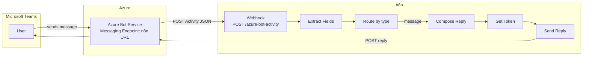

# Teams Bot Agent

Connects Microsoft Teams to n8n using **Azure Bot Service** and the
**Bot Framework REST API**. The n8n workflow acts as the bot's messaging
endpoint: it receives Bot Framework Activity JSON, processes messages, and
sends replies back via the Bot Connector API.

A companion **Teams bot app** (separate repository: `teams-azure-bot`) provides
the Azure-side infrastructure — an Express server with the Bot Framework SDK
adapter — so you can run it locally or deploy it to Azure App Service / Container
Apps before pointing Azure Bot Service at the n8n webhook.

---

## Architecture



---

## Prerequisites

| Requirement | Details |
|---|---|
| n8n instance | Self-hosted or cloud, reachable via public HTTPS URL |
| Azure subscription | For Bot Service resource |
| Microsoft 365 tenant | For Teams channel |
| Node.js ≥ 18 | For the companion Teams bot app |

---

## n8n Workflow Setup

### 1. Import the workflow

Import [workflow_template.json](./workflow_template.json) into your n8n instance:

1. Open n8n → **Workflows** → **Import from file**
2. Select `agents/teams-bot/workflow_template.json`
3. Save the workflow (do **not** activate yet)

### 2. Configure credentials

In n8n → **Settings** → **Variables**, add:

| Name | Value |
|---|---|
| `BOT_APP_ID` | Your Azure Bot's Microsoft App ID |
| `BOT_APP_PASSWORD` | Your Azure Bot's client secret |

### 3. Activate and copy the webhook URL

1. Click **Activate** on the workflow
2. Open the **Receive Bot Activity** node
3. Copy the production **Webhook URL** (e.g. `https://your-n8n.example.com/webhook/azure-bot-activity`)

---

## Azure Bot Service Setup

### 1. Create the Bot resource

```
Azure Portal → Create a resource → Azure Bot
```

- **Microsoft App ID type**: Single tenant (recommended) or Multi-tenant
- Note the **App ID** and create a **client secret** under App Registrations

### 2. Set the messaging endpoint

In the Bot resource → **Configuration**:

```
Messaging endpoint: https://your-n8n.example.com/webhook/azure-bot-activity
```

### 3. Enable the Teams channel

**Bot resource → Channels → Microsoft Teams → Save**

---

## Companion Teams Bot App

The `teams-azure-bot` repository provides an Express/TypeScript app that acts
as the Azure Bot Service app registration server. It handles:

- JWT verification via `botbuilder` SDK
- Forwarding activities to the n8n webhook (optional bridge mode)
- Local testing with Bot Framework Emulator

See the companion repo's `README.md` for setup and deployment instructions.

---

## Customising the Reply Logic

Open the **Compose Reply** node in n8n and replace the echo logic:

```javascript
// Current: echo user's text
const replyText = `Hello, ${activity.fromName}! You said: "${activity.text}"`;

// Example: route to different responses
let replyText;
if (activity.text.toLowerCase().startsWith('/help')) {
  replyText = 'Available commands: /status, /help';
} else {
  replyText = `Processing: "${activity.text}"`;
}
```

### Adaptive Cards

Replace the `text` field with an `attachments` array:

```javascript
const replyActivity = {
  type: 'message',
  attachments: [{
    contentType: 'application/vnd.microsoft.card.adaptive',
    content: {
      type: 'AdaptiveCard',
      version: '1.4',
      body: [{ type: 'TextBlock', text: replyText, wrap: true }]
    }
  }]
};
```

---

## Testing

### Bot Framework Emulator (local)

1. Start the companion Teams bot app locally: `npm run dev`
2. Open Bot Framework Emulator → Connect to `http://localhost:3978/api/messages`
3. Send a test message — the app forwards it to your n8n webhook

### Teams (staging)

1. Sideload the Teams app manifest (see companion repo `/manifest/`)
2. Install in a Teams channel or personal scope
3. Send a message to the bot

---

## Troubleshooting

| Symptom | Check |
|---|---|
| 400 from webhook | `serviceUrl` missing or not HTTPS — check Bot Service config |
| 401 on Send Reply | `BOT_APP_ID` or `BOT_APP_PASSWORD` incorrect |
| Bot silent in Teams | Workflow not activated, or messaging endpoint URL wrong |
| Token fetch fails | Bot App Registration missing `https://api.botframework.com/.default` scope |
