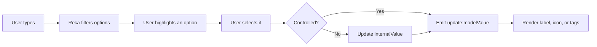

```text
N8nCombobox2
│
├── Public contract
│   └── Combobox.types.ts
│       ├── Props and events
│       ├── Single or multiple string values
│       ├── Option, group, and separator item shapes
│       └── Custom item and label slots
│
├── Field
│   └── ComboboxAnchor
│       ├── Selected item icon or fallback icon
│       │
│       ├── Single selection
│       │   └── ComboboxInput
│       │
│       ├── Multiple selection
│       │   └── N8nTagsInput2
│       │       └── ComboboxInput
│       │           └── TagsInputInput
│       │
│       ├── Clear button, when clearable and not empty
│       └── ComboboxTrigger
│           └── Chevron icon
│
└── Portaled popup
    └── ComboboxContent [role=listbox]
        └── ComboboxViewport [scrollable]
            ├── ComboboxEmpty
            ├── ComboboxGroup
            │   ├── ComboboxLabel
            │   └── N8nCombobox2Item
            │       ├── Leading icon or slot
            │       ├── Label or slot
            │       ├── Trailing slot
            │       └── Selected check indicator
            └── ComboboxSeparator
```

### Data flow

```text
props.items
  sections computed
    validate each option
      require non-empty value
      require non-empty label
      default textValue to label
    batch top-level options into groups
    preserve explicit groups and separators
  optionItems computed
    flatten selectable options
      display selected label
      display selected icon
      filter typed text and keywords
```

### Selection flow



### Main file responsibilities

```text
Combobox/
├── Combobox.vue             # State, item normalization, field, and popup
├── ComboboxItem.vue         # One accessible selectable row
├── Combobox.types.ts        # Public API
├── reka-ui.ts               # Local Reka UI re-export shim
├── Combobox.test.ts         # Component behavior tests
├── Combobox.stories.ts      # Storybook examples
├── component-combobox.md    # Full usage specification
└── index.ts                 # Public exports
```

Key boundary: `Combobox.vue` owns the data and selection behavior. Reka UI owns listbox semantics,
filtering, highlighting, and keyboard interaction. `ComboboxItem.vue` preserves the required option
semantics while allowing visual customization.
