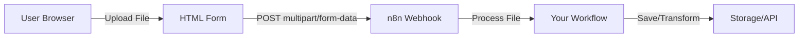

# File Upload Module - Complete Guide

## Overview

This guide demonstrates how to create a public file upload URL using n8n's built-in Webhook node. Users can drag-and-drop or select files through a web form, which are then processed by your n8n workflow.

## Architecture



## Features

- ✅ Drag-and-drop file upload
- ✅ Multiple file support
- ✅ File type validation
- ✅ Progress indicators
- ✅ Mobile-friendly
- ✅ Automatic binary data handling
- ✅ Custom authentication support

## Setup Instructions

### Step 1: Create Webhook Workflow

1. Create a new workflow in n8n
2. Add a **Webhook** node as the trigger
3. Configure the Webhook:
   - **HTTP Method**: `POST`
   - **Path**: `file-upload` (or your custom path)
   - **Authentication**: Choose based on your needs
   - **Response Mode**: `On Received` or `Using Respond to Webhook Node`

4. Your webhook URLs will be:
   - **Test URL**: `http://your-n8n-domain/webhook-test/file-upload`
   - **Production URL**: `http://your-n8n-domain/webhook/file-upload`

### Step 2: Configure File Handling

The Webhook node automatically detects and handles:

- **multipart/form-data** requests (standard file uploads)
- **Binary data streams** (direct file POSTs)
- Multiple files in single request

Output structure:
```json
{
  "headers": {},
  "params": {},
  "query": {},
  "body": {
    "field1": "value1"
  },
  "binary": {
    "file": {
      "data": "base64...",
      "mimeType": "image/png",
      "fileName": "example.png",
      "fileSize": 12345
    }
  }
}
```

### Step 3: Process Files in Workflow

Add nodes after the Webhook to process uploaded files:

**Example workflow:**
```
Webhook (trigger)
  ↓
[Optional] Validate file type/size
  ↓
[Choose one or more:]
  • Save to cloud storage (S3, Google Drive, Dropbox)
  • Process with AI (OpenAI Vision, text extraction)
  • Transform (resize images, convert formats)
  • Store metadata in database
  • Send notifications
```

### Step 4: Deploy HTML Upload Form

Use the provided HTML form template (see `file-upload-form.html`) or integrate with your existing frontend.

## HTML Upload Form

### Basic Form

```html
<!DOCTYPE html>
<html lang="en">
<head>
    <meta charset="UTF-8">
    <meta name="viewport" content="width=device-width, initial-scale=1.0">
    <title>File Upload</title>
    <style>
        * { margin: 0; padding: 0; box-sizing: border-box; }
        body {
            font-family: -apple-system, BlinkMacSystemFont, 'Segoe UI', Roboto, sans-serif;
            background: linear-gradient(135deg, #667eea 0%, #764ba2 100%);
            min-height: 100vh;
            display: flex;
            align-items: center;
            justify-content: center;
            padding: 20px;
        }
        .upload-container {
            background: white;
            border-radius: 16px;
            box-shadow: 0 20px 60px rgba(0,0,0,0.3);
            padding: 40px;
            max-width: 500px;
            width: 100%;
        }
        h1 {
            color: #333;
            margin-bottom: 10px;
            font-size: 28px;
        }
        .subtitle {
            color: #666;
            margin-bottom: 30px;
        }
        .drop-zone {
            border: 3px dashed #cbd5e0;
            border-radius: 12px;
            padding: 60px 20px;
            text-align: center;
            transition: all 0.3s ease;
            cursor: pointer;
            background: #f7fafc;
        }
        .drop-zone:hover, .drop-zone.dragover {
            border-color: #667eea;
            background: #edf2f7;
        }
        .drop-zone-icon {
            font-size: 48px;
            margin-bottom: 20px;
        }
        .drop-zone-text {
            color: #4a5568;
            font-size: 16px;
            margin-bottom: 10px;
        }
        .drop-zone-hint {
            color: #a0aec0;
            font-size: 14px;
        }
        input[type="file"] { display: none; }
        .file-list {
            margin-top: 20px;
        }
        .file-item {
            display: flex;
            align-items: center;
            justify-content: space-between;
            padding: 12px;
            background: #edf2f7;
            border-radius: 8px;
            margin-bottom: 10px;
        }
        .file-info {
            display: flex;
            align-items: center;
            gap: 10px;
        }
        .file-name {
            color: #2d3748;
            font-weight: 500;
        }
        .file-size {
            color: #718096;
            font-size: 14px;
        }
        .remove-btn {
            background: #fc8181;
            color: white;
            border: none;
            border-radius: 6px;
            padding: 6px 12px;
            cursor: pointer;
            font-size: 14px;
        }
        .remove-btn:hover {
            background: #f56565;
        }
        .upload-btn {
            width: 100%;
            padding: 14px;
            background: #667eea;
            color: white;
            border: none;
            border-radius: 8px;
            font-size: 16px;
            font-weight: 600;
            cursor: pointer;
            margin-top: 20px;
            transition: background 0.3s ease;
        }
        .upload-btn:hover:not(:disabled) {
            background: #5a67d8;
        }
        .upload-btn:disabled {
            background: #cbd5e0;
            cursor: not-allowed;
        }
        .progress-bar {
            width: 100%;
            height: 8px;
            background: #e2e8f0;
            border-radius: 4px;
            margin-top: 20px;
            overflow: hidden;
            display: none;
        }
        .progress-fill {
            height: 100%;
            background: #667eea;
            transition: width 0.3s ease;
            width: 0%;
        }
        .status-message {
            margin-top: 15px;
            padding: 12px;
            border-radius: 8px;
            text-align: center;
            display: none;
        }
        .status-success {
            background: #c6f6d5;
            color: #22543d;
        }
        .status-error {
            background: #fed7d7;
            color: #742a2a;
        }
    </style>
</head>
<body>
    <div class="upload-container">
        <h1>📤 File Upload</h1>
        <p class="subtitle">Upload your files securely to our server</p>

        <form id="uploadForm">
            <div class="drop-zone" id="dropZone">
                <div class="drop-zone-icon">📁</div>
                <div class="drop-zone-text">Drag & drop files here</div>
                <div class="drop-zone-hint">or click to browse</div>
            </div>
            <input type="file" id="fileInput" multiple>

            <div class="file-list" id="fileList"></div>

            <button type="submit" class="upload-btn" id="uploadBtn" disabled>
                Upload Files
            </button>

            <div class="progress-bar" id="progressBar">
                <div class="progress-fill" id="progressFill"></div>
            </div>

            <div class="status-message" id="statusMessage"></div>
        </form>
    </div>

    <script>
        // ⚠️ IMPORTANT: Replace this URL with your n8n webhook URL
        const WEBHOOK_URL = 'http://your-n8n-domain/webhook/file-upload';

        const dropZone = document.getElementById('dropZone');
        const fileInput = document.getElementById('fileInput');
        const fileList = document.getElementById('fileList');
        const uploadForm = document.getElementById('uploadForm');
        const uploadBtn = document.getElementById('uploadBtn');
        const progressBar = document.getElementById('progressBar');
        const progressFill = document.getElementById('progressFill');
        const statusMessage = document.getElementById('statusMessage');

        let selectedFiles = [];

        // Click to browse
        dropZone.addEventListener('click', () => fileInput.click());

        // Drag and drop handlers
        dropZone.addEventListener('dragover', (e) => {
            e.preventDefault();
            dropZone.classList.add('dragover');
        });

        dropZone.addEventListener('dragleave', () => {
            dropZone.classList.remove('dragover');
        });

        dropZone.addEventListener('drop', (e) => {
            e.preventDefault();
            dropZone.classList.remove('dragover');
            handleFiles(e.dataTransfer.files);
        });

        // File input change
        fileInput.addEventListener('change', (e) => {
            handleFiles(e.target.files);
        });

        function handleFiles(files) {
            selectedFiles = [...selectedFiles, ...Array.from(files)];
            updateFileList();
            uploadBtn.disabled = selectedFiles.length === 0;
        }

        function formatFileSize(bytes) {
            if (bytes === 0) return '0 Bytes';
            const k = 1024;
            const sizes = ['Bytes', 'KB', 'MB', 'GB'];
            const i = Math.floor(Math.log(bytes) / Math.log(k));
            return Math.round(bytes / Math.pow(k, i) * 100) / 100 + ' ' + sizes[i];
        }

        function updateFileList() {
            fileList.innerHTML = '';
            selectedFiles.forEach((file, index) => {
                const fileItem = document.createElement('div');
                fileItem.className = 'file-item';
                fileItem.innerHTML = `
                    <div class="file-info">
                        <div>
                            <div class="file-name">${file.name}</div>
                            <div class="file-size">${formatFileSize(file.size)}</div>
                        </div>
                    </div>
                    <button type="button" class="remove-btn" onclick="removeFile(${index})">
                        Remove
                    </button>
                `;
                fileList.appendChild(fileItem);
            });
        }

        function removeFile(index) {
            selectedFiles.splice(index, 1);
            updateFileList();
            uploadBtn.disabled = selectedFiles.length === 0;
        }

        uploadForm.addEventListener('submit', async (e) => {
            e.preventDefault();

            if (selectedFiles.length === 0) return;

            const formData = new FormData();
            selectedFiles.forEach((file, index) => {
                formData.append(`file${index}`, file);
            });

            // Hide previous messages
            statusMessage.style.display = 'none';
            progressBar.style.display = 'block';
            uploadBtn.disabled = true;
            uploadBtn.textContent = 'Uploading...';

            try {
                const xhr = new XMLHttpRequest();

                // Progress tracking
                xhr.upload.addEventListener('progress', (e) => {
                    if (e.lengthComputable) {
                        const percentComplete = (e.loaded / e.total) * 100;
                        progressFill.style.width = percentComplete + '%';
                    }
                });

                // Response handler
                xhr.addEventListener('load', () => {
                    if (xhr.status === 200) {
                        showStatus('success', 'Files uploaded successfully! ✅');
                        selectedFiles = [];
                        updateFileList();
                        fileInput.value = '';
                    } else {
                        showStatus('error', `Upload failed: ${xhr.statusText}`);
                    }
                    resetUploadState();
                });

                xhr.addEventListener('error', () => {
                    showStatus('error', 'Upload failed. Please check your connection.');
                    resetUploadState();
                });

                xhr.open('POST', WEBHOOK_URL);
                xhr.send(formData);

            } catch (error) {
                showStatus('error', 'Upload failed: ' + error.message);
                resetUploadState();
            }
        });

        function showStatus(type, message) {
            statusMessage.className = `status-message status-${type}`;
            statusMessage.textContent = message;
            statusMessage.style.display = 'block';
        }

        function resetUploadState() {
            uploadBtn.disabled = selectedFiles.length === 0;
            uploadBtn.textContent = 'Upload Files';
            progressBar.style.display = 'none';
            progressFill.style.width = '0%';
        }

        // Make removeFile globally accessible
        window.removeFile = removeFile;
    </script>
</body>
</html>
```

**To use this form:**
1. Replace `WEBHOOK_URL` with your actual n8n webhook URL
2. Host this HTML file on any web server
3. Or embed in your existing application

## Advanced Configurations

### File Type Validation

Add to your workflow after the Webhook node:

```javascript
// Add an "IF" node with this expression
{{ $json.binary.file0.mimeType.startsWith('image/') }}
```

### File Size Limits

Configure in n8n settings or validate in workflow:

```javascript
// Check file size (in bytes)
{{ $json.binary.file0.fileSize <= 10485760 }}  // 10MB limit
```

### Authentication

Add authentication to your webhook:

**Options:**
- Header Auth: Require specific header value
- Basic Auth: Username/password
- JWT: Token-based authentication

Example with header auth:
```javascript
// In HTML form, add header:
xhr.setRequestHeader('X-API-Key', 'your-secret-key');

// In webhook, configure Authentication > Header Auth
```

### Multiple File Processing

The webhook automatically handles multiple files:

```javascript
// Access files in workflow:
// $json.binary.file0 - First file
// $json.binary.file1 - Second file
// etc.

// Loop through all files using a Code node:
const files = Object.keys($input.item.binary)
  .filter(key => key.startsWith('file'))
  .map(key => $input.item.binary[key]);

return files.map((file, index) => ({
  json: {
    fileName: file.fileName,
    mimeType: file.mimeType,
    fileSize: file.fileSize,
    index
  },
  binary: {
    data: file
  }
}));
```

## Example Workflows

### 1. Save to Cloud Storage

```
Webhook (file upload)
  ↓
Google Drive (upload file)
  ↓
Respond to Webhook (success message)
```

### 2. Image Processing Pipeline

```
Webhook (image upload)
  ↓
Cloudinary (resize/optimize)
  ↓
PostgreSQL (save metadata)
  ↓
Slack (notify team)
  ↓
Respond to Webhook (return processed image URL)
```

### 3. Document Analysis

```
Webhook (PDF upload)
  ↓
OpenAI Vision (extract text/data)
  ↓
Airtable (store results)
  ↓
Email (send analysis report)
```

## Testing

### Test with curl

```bash
curl -X POST http://your-n8n-domain/webhook/file-upload \
  -F "file=@/path/to/your/file.pdf" \
  -F "description=Test upload"
```

### Test with Postman

1. Set method to `POST`
2. Enter your webhook URL
3. Go to Body > form-data
4. Add key `file` with type `File`
5. Choose your file
6. Send request

## Troubleshooting

### Files not appearing in workflow

- Verify webhook is activated (not just test mode)
- Check the `responseMode` setting
- Ensure form uses `multipart/form-data` encoding

### Large file uploads failing

- Increase n8n's payload size limit in environment variables:
  ```bash
  N8N_PAYLOAD_SIZE_MAX=50
  ```

### CORS issues

- Enable CORS in webhook node settings
- Or add CORS headers in your server configuration

### Authentication errors

- Verify authentication credentials match
- Check request headers are properly set
- Test with authentication disabled first

## Security Best Practices

1. **Always use HTTPS** in production
2. **Enable authentication** on public webhooks
3. **Validate file types** and sizes
4. **Scan for malware** if accepting from untrusted sources
5. **Rate limit** uploads to prevent abuse
6. **Use temporary storage** and clean up after processing
7. **Don't expose internal paths** in responses

## Performance Tips

1. **Stream large files** directly to storage (S3, etc.)
2. **Process files asynchronously** for large batches
3. **Use CDN** for serving uploaded files
4. **Compress before upload** when possible
5. **Implement chunked uploads** for very large files

## API Reference

### Webhook Request Format

```
POST /webhook/file-upload
Content-Type: multipart/form-data

--boundary
Content-Disposition: form-data; name="file"; filename="example.pdf"
Content-Type: application/pdf

<binary data>
--boundary--
```

### Workflow Output Format

```json
{
  "headers": {
    "content-type": "multipart/form-data; boundary=----...",
    "user-agent": "Mozilla/5.0..."
  },
  "params": {},
  "query": {},
  "body": {
    "additionalField": "value"
  },
  "binary": {
    "file": {
      "data": "base64encodeddata...",
      "mimeType": "application/pdf",
      "fileName": "example.pdf",
      "fileSize": 524288,
      "fileExtension": "pdf"
    }
  }
}
```

## Support

For issues or questions:
- n8n Documentation: https://docs.n8n.io
- Community Forum: https://community.n8n.io
- GitHub Issues: https://github.com/n8n-io/n8n

## License

This module and documentation are part of the n8n project.
