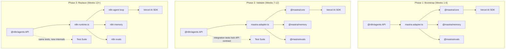

# SDK Implementation Strategy: Build vs Wrap vs Progressive Replacement

**Date:** 2026-02-26
**Status:** Draft
**Scope:** Evaluate three implementation strategies for `@n8n/agents` — using Mastra
as permanent runtime, building everything from scratch, or starting with Mastra and
progressively replacing it with an n8n-owned engine

**Prerequisite reading:**
- [AI Agent Framework Comparison](./2026-02-24-ai-agent-framework-comparison.md)
- [@n8n/agents SDK Design](../plans/2026-02-25-n8n-agents-sdk-design.md)

---

## Context

The [SDK design document](../plans/2026-02-25-n8n-agents-sdk-design.md) establishes
`@n8n/agents` as a stable API surface with Mastra as the runtime backend. This
document examines whether that architecture should be permanent, temporary, or
unnecessary — and specifically evaluates a **progressive replacement strategy** where
Mastra is used to accelerate initial development, then systematically replaced with
an n8n-owned engine once the SDK contract is proven.

---

## The Three Paths

### Path 1: Mastra as Permanent Runtime

Use Mastra long-term. `@n8n/agents` is a thin facade over `@mastra/core`,
`@mastra/memory`, `@mastra/evals`, and `@mastra/observability`. The facade
translates n8n's builder API into Mastra's config-object API and shields users
from Mastra's types.

### Path 2: Home-Roll Everything

Build the entire agent runtime from scratch on top of Vercel AI SDK primitives
(`generateText`, `streamText`, provider system). No Mastra dependency at any
point.

### Path 3: Progressive Replacement (Recommended)

Start with Mastra as the runtime to ship quickly and prove the SDK contract.
Once the API surface is validated through real usage, incrementally replace
Mastra's internals with n8n-owned implementations while maintaining the same
public API and test suite.

---

## Path 1: Mastra as Permanent Runtime

### Architecture

```
@n8n/agents (public API)
    |
    v
@mastra/core + @mastra/memory + @mastra/evals + @mastra/observability
    |
    v
Vercel AI SDK (provider layer)
```

### Pros

| Advantage | Detail |
|-----------|--------|
| **Fastest time to market** | Full runtime from day one: memory (three-tier), evals (12+ scorers), guardrails, observability. |
| **Battle-tested infrastructure** | Mastra handles streaming edge cases, nested agent calls, tool retry logic, memory persistence — all production-hardened. |
| **Active maintenance** | YC W25, ex-Gatsby team, 21.3k stars, 437k npm/week. Frequent releases. |
| **Apache 2.0** | No licensing risk. |
| **Provider coverage** | 79+ providers, 2,146+ models through unified `"provider/model"` string. |

### Cons

| Risk | Detail | Severity |
|------|--------|----------|
| **API instability** | Mastra v0→v1 introduced 14+ breaking change areas. All `@mastra/*` packages must upgrade simultaneously. Even with a facade, internal breakage requires adaptation work on every Mastra release. | **High** |
| **Architectural coupling** | Mastra's agent runtime now controls its own agent loop and tool calling (since v0.14.0), with a custom streaming protocol. The "thin facade" may not stay thin — Mastra's internal model has opinions about execution flow that may conflict with n8n's engine cooperation model. | **High** |
| **Engine overlap** | Mastra has its own workflow engine, storage system (12 domains), and state management. These overlap with n8n's execution runtime team. Avoiding them requires careful surgical use of Mastra — taking agent+memory+evals but not workflows+storage. | **Medium** |
| **Memory model assumptions** | Mastra's memory uses `SaveQueueManager` for write batching, its own thread storage, and observational memory with PostgreSQL-specific optimizations. Replacing the storage backend with n8n's engine-provided storage means fighting Mastra's assumptions. | **Medium** |
| **Dependency weight** | Mastra is a large monorepo. Depending on `@mastra/core` pulls in significant transitive dependencies including Hono (server framework), storage adapters, and MCP protocol handlers that n8n doesn't need. | **Medium** |
| **Upgrade treadmill** | The AI agent space is evolving rapidly. Mastra's architecture may diverge from n8n's needs over time, but staying current is required for security patches and provider support. | **Medium** |

### Verdict

Good for prototyping, risky for permanent use. The v0→v1 migration demonstrated that
Mastra's API is still stabilizing. Coupling n8n's production system to a fast-moving
dependency creates ongoing maintenance burden. The facade mitigates user-facing risk
but not internal maintenance cost.

---

## Path 2: Home-Roll Everything

### Architecture

```
@n8n/agents (public API + full runtime)
    |
    v
Vercel AI SDK (provider layer only)
```

### Pros

| Advantage | Detail |
|-----------|--------|
| **Total control** | Every architectural decision is n8n's. No fighting upstream opinions about execution flow, storage, or streaming protocols. |
| **Engine-native** | The agent runtime can be designed from the ground up to cooperate with n8n's durable execution engine — checkpointing, resource limits, credential injection all first-class. |
| **Minimal dependencies** | Only Vercel AI SDK for provider abstraction. No transitive dependency bloat. |
| **No upgrade treadmill** | n8n controls the release cycle. No forced migrations from upstream breaking changes. |
| **Tailored streaming** | Can build streaming that natively supports the Run event system and engine state machine without translation layers. |

### Cons

| Risk | Detail | Severity |
|------|--------|----------|
| **Months of foundation work** | Memory (three-tier with semantic recall + working memory), evals (12+ scorers), guardrails (PII, injection, moderation), observability (auto-tracing with exporter packages) — all must be built. | **Critical** |
| **Edge case iceberg** | Mastra's streaming rewrite (v0.14.0→v0.19.0) took months to handle nested agent calls, long-running tool progress reporting, and format flexibility. These edge cases are invisible until you hit them. | **High** |
| **Provider abstraction complexity** | Even using AI SDK, handling 79+ provider quirks for tool calling, structured output, and streaming across different model capabilities requires significant integration work. | **High** |
| **Opportunity cost** | Engineering time spent on infrastructure is time not spent on the SDK API, developer experience, and n8n-specific features. | **High** |
| **Reinventing what exists** | Much of what needs to be built already exists in Mastra (Apache 2.0). Building it again produces functionally identical code with n8n-specific bugs. | **Medium** |

### Verdict

The right long-term architecture but wrong starting point. The foundation work is
substantial and delays shipping a usable SDK by months. However, the end state — an
n8n-owned runtime tailored to the execution engine — is clearly superior for a
production platform.

---

## Path 3: Progressive Replacement (Recommended)

### Strategy

Use Mastra to bootstrap the runtime, but treat it as scaffolding — not foundation.
The `@n8n/agents` public API is the real product. Mastra accelerates proving that
API contract through real usage. Once validated, systematically replace Mastra's
internals with n8n-owned implementations.

### Architecture Evolution



### How It Works

**Phase 1 — Bootstrap with Mastra (Weeks 1-6)**

Ship `@n8n/agents` with Mastra as the runtime. The `mastra-adapter.ts` module
translates between n8n's builder pattern and Mastra's config objects. Users write
code against `@n8n/agents` — they never import from `@mastra/*`.

Key deliverables:
- Agent, Tool, Memory, Guardrail, Scorer, Network builders
- Run object with event system and state machine
- Integration with n8n execution engine via `engine-bridge.ts`
- Working examples and documentation

**Phase 2 — Validate the API Contract (Weeks 7-12)**

Ship to real users (internal teams, design partners, AI coding agents). Collect
feedback on the API surface. Write comprehensive integration tests that exercise
every public API path. These tests are the **real asset** — they define the contract
that must survive the replacement.

Key deliverables:
- Integration test suite covering all public API surfaces
- Performance benchmarks (latency, memory, token efficiency)
- API refinements based on real usage feedback
- Documentation of Mastra-specific behaviours that leaked through the facade

**Phase 3 — Progressive Replacement (Weeks 13+)**

Replace Mastra internals module by module. Each replacement must pass the existing
test suite. The replacement order is driven by two factors: (a) where Mastra's
opinions conflict most with n8n's engine, and (b) where n8n can add the most value.

Suggested replacement order:

| Order | Module | Rationale |
|-------|--------|-----------|
| 1 | **Agent loop + streaming** | Mastra controls its own agent loop since v0.14.0. Replacing this with an n8n-owned loop that natively supports the Run state machine eliminates the biggest translation layer. Vercel AI SDK's `generateText`/`streamText` provide the LLM primitives — what we build is the orchestration above them. |
| 2 | **Engine bridge** | Once the agent loop is n8n-owned, integrate deeply with the execution engine for checkpointing, resource limits, and credential injection. This is impossible while Mastra controls the loop. |
| 3 | **Memory** | Replace Mastra's three-tier memory with an implementation backed by n8n's engine-provided storage. Keep the same `Memory` builder API. Semantic recall and working memory are well-understood patterns; the implementation is straightforward with a vector store. |
| 4 | **Guardrails** | Replace Mastra's built-in processors with n8n-owned implementations. PII detection, prompt injection, and moderation are well-documented patterns. Consider using open-source libraries directly (e.g., `presidio` for PII) rather than Mastra's wrappers. |
| 5 | **Evals** | Replace Mastra's scorers last — they're the most self-contained module and add the least coupling risk. The scorer patterns (LLM-as-judge with structured output) are simple to implement on AI SDK primitives. |
| 6 | **Observability** | Replace Mastra's tracing with direct OpenTelemetry integration. This is largely configuration, not complex logic. |

### Pros

| Advantage | Detail |
|-----------|--------|
| **Ship in weeks, not months** | Mastra provides the full runtime from day one. The team focuses on the API design and developer experience, not infrastructure plumbing. |
| **API-first validation** | Real users validate the `@n8n/agents` API before significant engineering investment in the runtime. API mistakes caught early are cheap to fix; caught after building a custom runtime, they're expensive. |
| **Test suite as migration safety net** | The integration tests written against Mastra become the acceptance criteria for each replacement module. If the tests pass with the new implementation, the replacement is correct. |
| **Risk-ordered replacement** | Replace the highest-friction modules first (agent loop, engine bridge). Lower-friction modules (evals, observability) can stay on Mastra longer or indefinitely if they work well. |
| **Zero user impact** | Users import from `@n8n/agents` only. Every internal replacement is invisible to them. The public API is the stable contract; the runtime is an implementation detail. |
| **Learn from Mastra's design** | Using Mastra first reveals which abstractions are genuinely useful vs over-engineered. This knowledge directly informs the n8n-owned replacements. |
| **Escape hatch** | If n8n's needs diverge significantly from Mastra's direction, the path to full replacement is already planned and partially executed. No emergency migration needed. |

### Cons

| Risk | Detail | Severity |
|------|--------|----------|
| **Temporary coupling cost** | While Mastra is in the stack, n8n must track Mastra releases and handle breaking changes in the adapter layer. The v0→v1 migration showed this can be significant. | **Medium** |
| **Incomplete replacement temptation** | It's easy to stop replacing modules once "good enough" is reached. This leaves a permanent dependency on modules that may cause problems later. | **Medium** |
| **Adapter complexity** | The `mastra-adapter.ts` layer must translate between n8n's builder-pattern types and Mastra's config-object types. During replacement, some modules use Mastra and some use n8n-owned code — the adapter must handle this hybrid state. | **Medium** |
| **Mastra's streaming protocol** | Mastra replaced AI SDK's streaming with its own custom protocol (v0.14.0+). During Phase 1-2, the adapter must work with this protocol. During Phase 3, replacing it is the highest-priority task but also the most complex. | **Medium** |
| **Pin version risk** | To avoid the upgrade treadmill during Phase 1-2, pinning Mastra to a specific version is tempting but means missing security patches and provider updates. | **Low** |

### Mitigations

| Risk | Mitigation |
|------|------------|
| Temporary coupling | Pin Mastra to a known-good v1.x release. Accept adapter maintenance as a time-boxed cost. Set a hard deadline for Phase 3 start. |
| Incomplete replacement | Define replacement completion criteria upfront. Track Mastra dependencies as tech debt with a visible burn-down. |
| Adapter complexity | Keep the adapter thin — translate types, don't add logic. Each replacement module eliminates adapter code rather than adding to it. |
| Streaming protocol | Replace the agent loop first (replacement #1). Once n8n controls the loop, streaming is built against AI SDK's native primitives. |
| Pin version risk | Pin to v1.x, monitor Mastra releases for security patches only. Provider updates come from AI SDK which n8n controls directly. |

---

## Comparison Matrix

| Dimension | Path 1: Mastra Permanent | Path 2: Home-Roll | Path 3: Progressive |
|-----------|--------------------------|--------------------|--------------------|
| **Time to first ship** | 4-6 weeks | 4-6 months | 4-6 weeks |
| **Long-term maintenance** | High (upstream dependency) | Low (fully owned) | Low (fully owned once complete) |
| **Engine integration depth** | Limited by Mastra's opinions | Native | Native (after Phase 3) |
| **API validation speed** | Fast (ship early, iterate) | Slow (build first, then validate) | Fast (ship early, iterate) |
| **Risk of API design mistakes** | Low (fast feedback) | High (late feedback) | Low (fast feedback) |
| **Dependency risk** | Permanent | None | Temporary (time-boxed) |
| **Engineering investment** | Low upfront, ongoing maintenance | Very high upfront | Medium (spread over time) |
| **Control over internals** | Low | Total | Total (after Phase 3) |
| **Test suite value** | Tests coupled to Mastra behaviour | Tests validate owned code | Tests transfer from Mastra to owned code |

---

## Why Path 3 Is Recommended

The core insight is that **the most valuable artifact is the API contract, not the
runtime implementation**. Path 3 optimises for validating that contract as quickly as
possible.

Path 2 (home-roll) builds the runtime first, then discovers API problems through
usage — expensive iteration. Path 1 (permanent Mastra) ships quickly but accepts
permanent dependency risk and limits engine integration depth.

Path 3 gets the best of both: ship quickly with Mastra, validate the API with real
users, then replace the runtime with full knowledge of what the API actually needs to
support. The test suite written during validation becomes the migration safety net.

**The key discipline required:** treat Mastra as scaffolding with a defined removal
timeline, not as a permanent convenience. The replacement schedule should be committed
to before Phase 1 begins, with clear milestones and a hard deadline for Phase 3
completion.

---

## Feasibility Assessment: Can Mastra Actually Be Replaced?

This is the critical question. If the facade leaks or Mastra's abstractions are too
deeply embedded, progressive replacement becomes a rewrite in disguise.

### What Makes Replacement Feasible

1. **Mastra delegates LLM calls to AI SDK.** The provider layer (`generateText`,
   `streamText`, tool calling protocol) stays constant across all three paths.
   Replacing Mastra means replacing the orchestration above AI SDK, not the
   AI SDK integration itself.

2. **Mastra's agent loop is well-defined.** Since v0.14.0, Mastra controls:
   agent loop iteration, tool calling orchestration, retry logic, and streaming.
   These are the exact responsibilities n8n needs to own for engine cooperation.
   The scope is known and bounded.

3. **Memory is pattern-based, not magic.** Mastra's three-tier memory (history
   window + semantic recall + working memory) uses standard patterns: message
   arrays, vector similarity search, and structured JSON. These are straightforward
   to implement against n8n's storage backends.

4. **Evals are self-contained.** Each scorer is an LLM-as-judge call with
   structured output. The pattern is: construct a judge prompt, call AI SDK, parse
   the score. No complex state or coupling.

5. **The facade enforces isolation.** Nothing from `@mastra/*` is exposed to user
   code. The `mastra-adapter.ts` module is the only file that imports Mastra. Each
   replacement eliminates imports from this single file.

### What Makes Replacement Hard

1. **Mastra's custom streaming protocol.** Since v0.19.0, Mastra uses its own
   streaming implementation with nested agent support and format flexibility. This
   is the most complex module to replace. However, it's also the highest-priority
   replacement (module #1) precisely because n8n needs its own streaming that
   integrates with the Run event system.

2. **Implicit behaviours.** Mastra's `SaveQueueManager`, write batching, and
   message format conversions are invisible until you remove them. The integration
   test suite must capture these behaviours before replacement begins.

3. **Thread storage schema.** Mastra's memory persists threads in a specific
   schema. Migration of existing thread data to n8n's storage backend requires a
   data migration plan.

### Conclusion

Replacement is feasible. The hardest part (streaming + agent loop) is also the
highest-value replacement because it enables native engine cooperation. The
remaining modules (memory, evals, guardrails, observability) are pattern
implementations with bounded complexity.

---

## Open Questions

1. **Mastra version pinning.** Should we pin to the latest v1.x at Phase 1 start
   and never upgrade, or track v1.x patch releases? Pinning is simpler but risks
   missing provider support updates.

2. **Phase 3 deadline.** What is the hard deadline for starting Phase 3? Suggest
   no later than 3 months after Phase 1 ships to prevent normalisation of the
   Mastra dependency.

3. **Thread data migration.** When memory is replaced (module #3), existing
   thread data in Mastra's storage format must be migrated. Should the new memory
   implementation support reading Mastra's format, or is a one-time migration
   acceptable?

4. **Observability permanence.** Mastra's observability is thin (OpenTelemetry
   span generation + exporter packages). It may not be worth replacing if it
   works well. Should some modules be allowed to stay on Mastra permanently?

5. **Vercel AI SDK stability.** All three paths depend on Vercel AI SDK for the
   provider layer. What is the contingency if AI SDK introduces breaking changes
   or becomes unmaintained?
