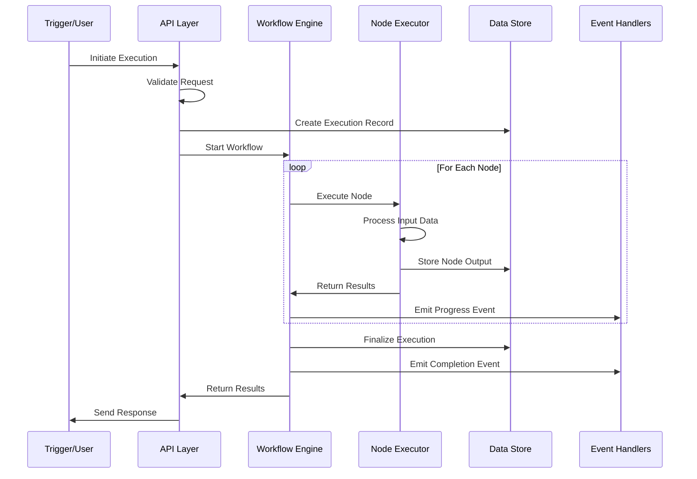
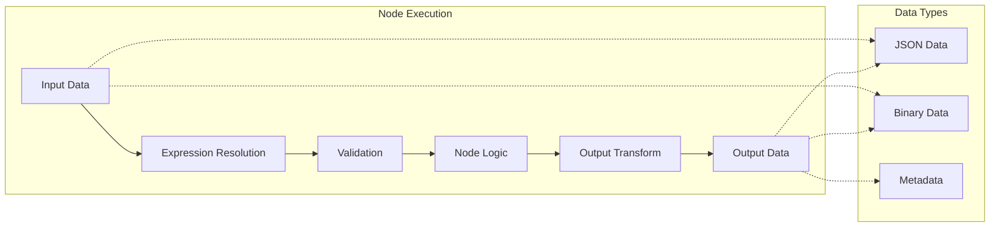
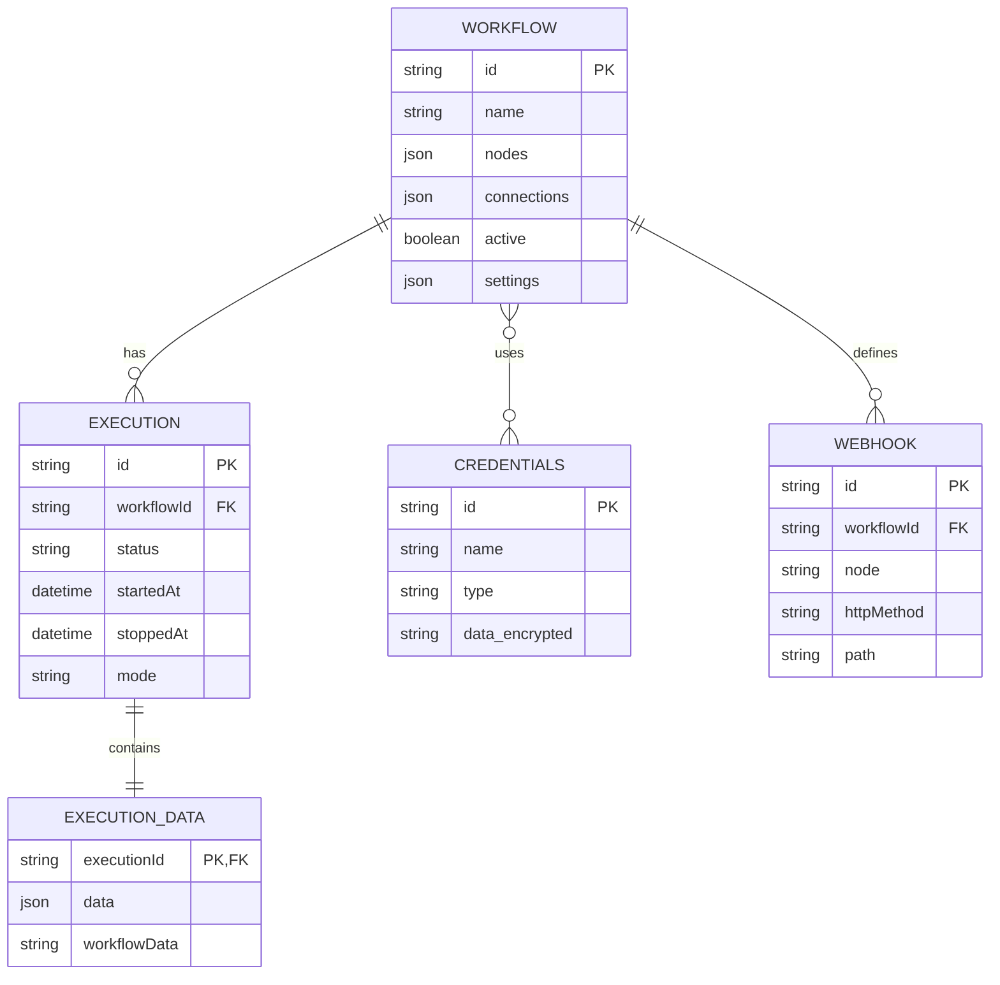
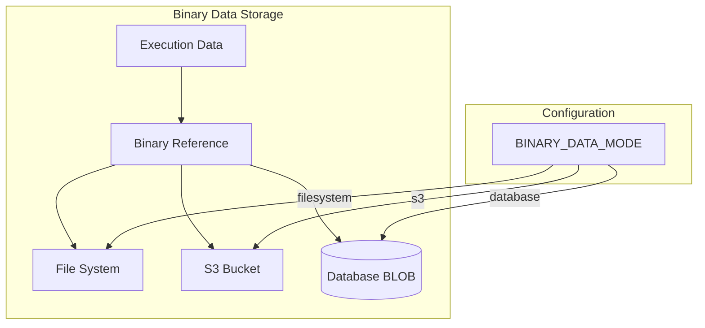
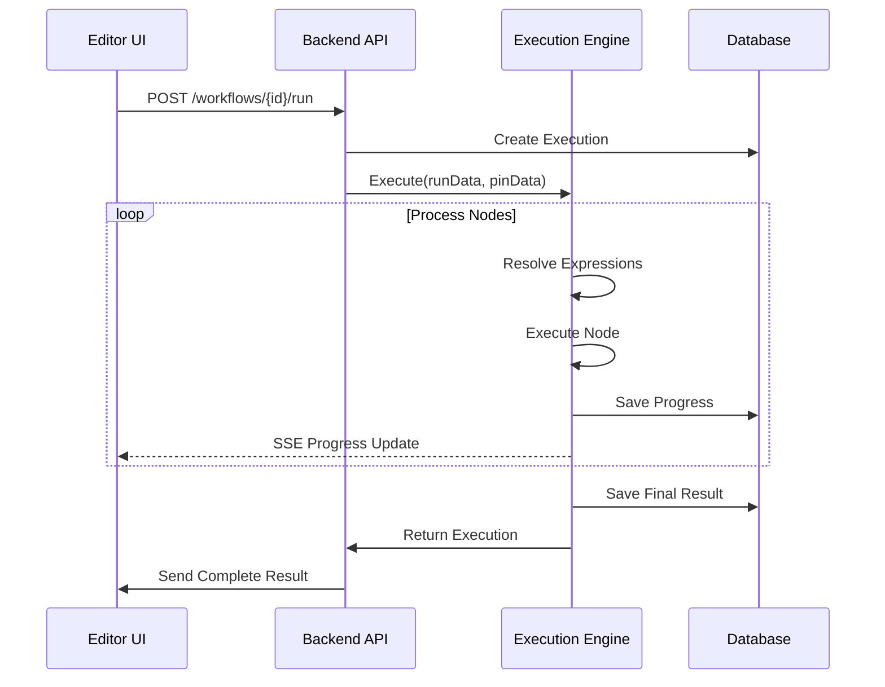
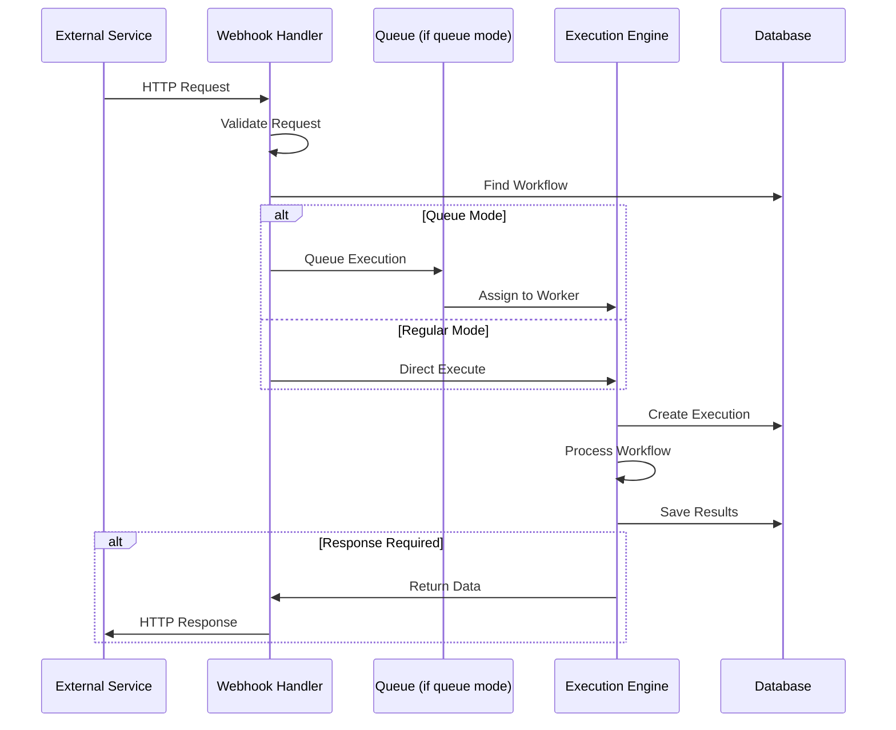
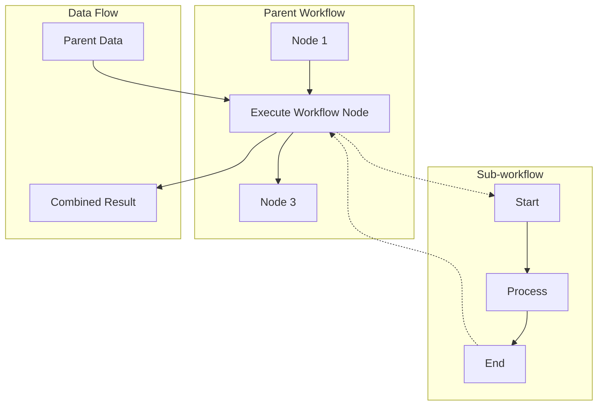
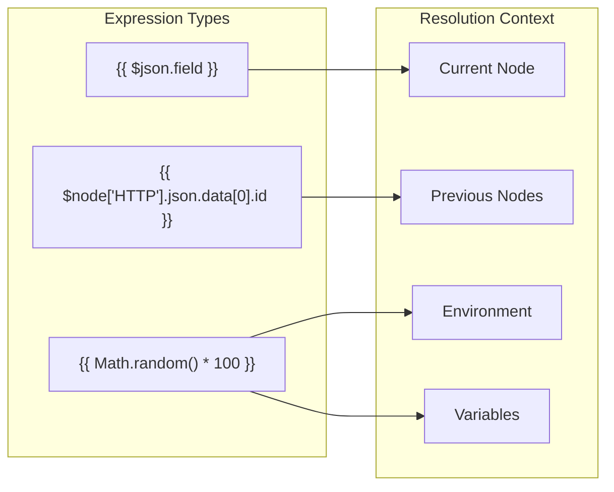
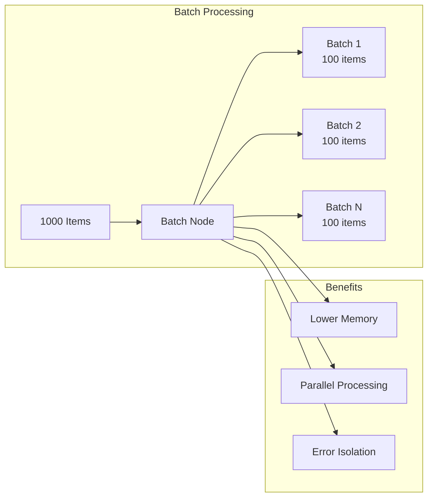
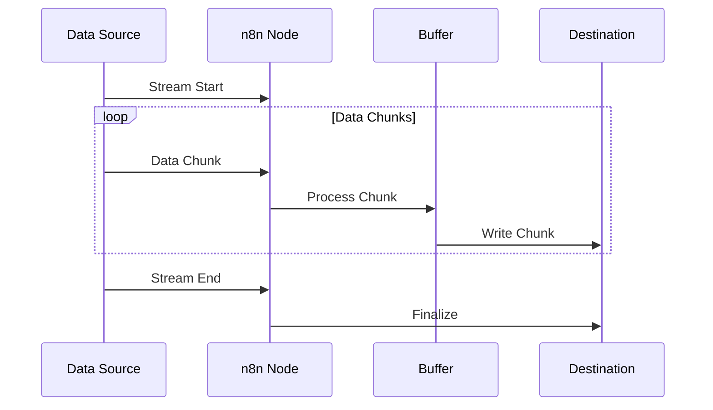

# n8n Data Flow Architecture

> **⚠️ Notice**: This document was created by AI and not properly reviewed by the team yet.

This document explains how data flows through n8n, from workflow creation to execution completion, including data storage, transformation, and security considerations.

## Overview

Data in n8n flows through several layers:
1. **Input Layer**: Triggers, webhooks, manual starts
2. **Processing Layer**: Workflow engine, node execution
3. **Storage Layer**: Database, file system, external storage
4. **Output Layer**: Results, webhooks, integrations

## Workflow Execution Data Flow

### Execution Lifecycle



### Data Transformation Pipeline

Each node in a workflow transforms data through several stages:



## Data Storage Architecture

### Database Schema Overview



### Data Types

#### 1. Workflow Data
- **Storage**: JSON in database
- **Contains**: Node definitions, connections, settings
- **Size**: Typically 10KB-1MB

#### 2. Execution Data
- **Storage**: Separate execution_data table
- **Contains**: Input/output for each node
- **Retention**: Configurable (default: 14 days)
- **Pruning**: Automatic based on age/count

#### 3. Binary Data
- **Storage Options**:
  - File system (default)
  - S3/MinIO
  - Database (not recommended)
- **Reference**: Stored as pointers in execution data
- **Cleanup**: Linked to execution lifecycle



## Execution Flow Patterns

### 1. Manual Execution



### 2. Trigger-Based Execution



### 3. Sub-workflow Execution



## Expression Resolution

n8n's expression engine resolves data references during execution:



### Data Access Patterns

```typescript
// Current node input
{{ $json }}              // Current item
{{ $input.all() }}       // All input items
{{ $input.first() }}     // First input item
{{ $input.last() }}      // Last input item
{{ $input.item }}        // Current item (alias)

// Previous node data
{{ $node["NodeName"].json }}     // Specific node output
{{ $("NodeName").all() }}        // All items from node
{{ $("NodeName").first() }}      // First item from node
{{ $("NodeName").last() }}       // Last item from node

// Execution context
{{ $execution.id }}              // Execution ID
{{ $workflow.id }}               // Workflow ID
{{ $workflow.name }}             // Workflow name
{{ $now }}                       // Current timestamp
{{ $today }}                     // Today's date

// Environment and variables
{{ $env.VARIABLE_NAME }}         // Environment variable
{{ $vars.myVariable }}           // n8n variable
```

## Data Security

For comprehensive security architecture including authentication, authorization, and encryption details, see [System Overview - Security Architecture](./system-overview.md#security-architecture).

### Key Security Measures in Data Flow

1. **Credential Encryption**: AES-256-GCM encryption at rest
2. **Data Privacy**: Execution data sanitization and PII handling
3. **Access Control**: RBAC via `@n8n/permissions` package
4. **Audit Trail**: Event-based logging for data access

## Performance Optimization

### Data Batching



### Streaming Support

For large data processing, n8n supports streaming:



## Data Retention and Cleanup

### Execution Data Lifecycle

```mermaid
stateDiagram-v2
    [*] --> Created: Execution Starts
    Created --> Running: Processing
    Running --> Success: Completed
    Running --> Error: Failed
    Success --> Pruned: After X Days
    Error --> Pruned: After Y Days
    Pruned --> [*]: Deleted

    note right of Pruned
        Configurable via:
        - EXECUTIONS_DATA_MAX_AGE
        - EXECUTIONS_DATA_SAVE_ON_SUCCESS
        - EXECUTIONS_DATA_SAVE_ON_ERROR
    end
```

### Pruning Configuration

```bash
# Execution data retention
EXECUTIONS_DATA_SAVE_ON_ERROR=all
EXECUTIONS_DATA_SAVE_ON_SUCCESS=all
EXECUTIONS_DATA_SAVE_ON_PROGRESS=true
EXECUTIONS_DATA_SAVE_MANUAL_EXECUTIONS=true

# Pruning settings
EXECUTIONS_DATA_MAX_AGE=336  # 14 days in hours
EXECUTIONS_DATA_PRUNE_MAX_COUNT=10000
```

## Monitoring Data Flow

### Key Metrics

1. **Execution Metrics**:
   - Start/completion rate
   - Average execution time
   - Data volume processed
   - Error rates

2. **Storage Metrics**:
   - Database size growth
   - Binary data storage usage
   - Execution retention counts

3. **Performance Metrics**:
   - Node execution times
   - Expression resolution time
   - Data transformation overhead

### Data Flow Debugging

Use these tools to debug data flow issues:

1. **Execution History**: View input/output for each node
2. **Expression Editor**: Test expressions with live data
3. **Binary Data Inspector**: Examine file contents
4. **Workflow Variables**: Track data through execution

## Best Practices

### 1. Data Minimization
- Process only required fields
- Remove unnecessary data early in workflow
- Use pagination for large datasets

### 2. Error Handling
- Implement error branches
- Use try-catch nodes for critical operations
- Log errors appropriately

### 3. Performance
- Batch operations when possible
- Use streaming for large files
- Implement caching where appropriate

### 4. Security
- Never log credentials
- Sanitize user input
- Use webhook authentication
- Implement rate limiting

### 5. Monitoring
- Set up execution alerts
- Monitor storage growth
- Track performance metrics
- Regular cleanup schedules
