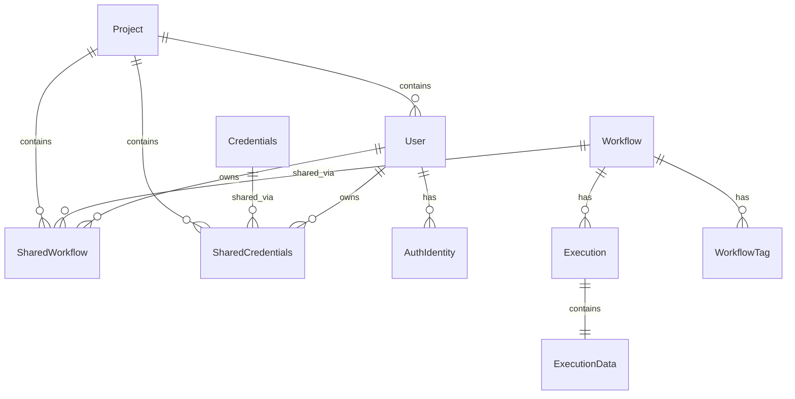

# Database Architecture

> **⚠️ Notice**: This documentation was created by AI and not properly reviewed by the team yet.

## Overview

n8n uses TypeORM for database abstraction, supporting PostgreSQL, MySQL/MariaDB, and SQLite. This document covers the entity relationships, repository patterns, migration strategies, and performance considerations.

## TODO: Document the Following

### Database Support

#### Supported Databases
- **PostgreSQL**: Recommended for production
- **MySQL/MariaDB**: Full support with some limitations
- **SQLite**: Development and small deployments
- **Database-specific features and limitations**

### Entity Architecture

#### Core Entities

##### WorkflowEntity
- **Location**: `/packages/@n8n/db/src/entities/workflow.entity.ts`
- **Key relationships**: Executions, Tags, SharedWorkflow
- **Important fields**: nodes, connections, settings, active
- **Indexes and constraints**

##### ExecutionEntity
- **Location**: `/packages/@n8n/db/src/entities/execution.entity.ts`
- **Relationships**: Workflow, ExecutionData
- **Lifecycle**: Creation, updates, deletion
- **Performance considerations**

##### CredentialsEntity
- **Location**: `/packages/@n8n/db/src/entities/credentials.entity.ts`
- **Encryption**: Data field encryption
- **Sharing**: SharedCredentials relationship
- **Access control**

##### User & AuthIdentity
- **Location**: `/packages/@n8n/db/src/entities/user.entity.ts`
- **Authentication**: Email/password, LDAP, SAML, OAuth2
- **Relationships**: Workflows, Credentials, Projects
- **Role management**

#### Relationship Diagram

### Repository Pattern

#### Repository Architecture
- **Location**: `/packages/@n8n/db/src/repositories/`
- **Base repository**: Common functionality
- **Custom repositories**: Business logic
- **Query builders**: Complex queries

#### Common Patterns
- Soft deletes
- Eager loading strategies
- Transaction management
- Query optimization

### Data Lifecycle

#### Execution Data Management
- Storage strategies
- Retention policies
- Pruning mechanisms
- Binary data handling

#### Workflow Versioning
- Version history storage
- Diff generation
- Rollback capabilities
- Storage optimization

### Migration System

#### Migration Structure
- **Location**: `/packages/@n8n/db/src/databases/migrations/`
- **Naming convention**: Timestamp-based
- **Database-specific migrations**
- **Rollback support**

#### Migration Best Practices
- Data migration strategies
- Zero-downtime migrations
- Testing migrations
- Performance impact

### Performance Optimization

#### Indexing Strategy
- Primary indexes
- Composite indexes
- Full-text search indexes
- Index maintenance

#### Query Optimization
- N+1 query prevention
- Eager vs lazy loading
- Query result caching
- Connection pooling

#### Large Dataset Handling
- Pagination strategies
- Streaming results
- Batch operations
- Memory management

### Data Security

#### Encryption
- Credentials encryption (AES-256-GCM)
- Encryption key management
- Field-level encryption
- Encryption migration

#### Access Control
- Row-level security
- Column-level permissions
- Audit logging
- Data privacy

### Scaling Considerations

#### Read Replicas
- Configuration
- Load balancing
- Consistency guarantees
- Failover strategies

#### Sharding
- Horizontal partitioning
- Shard key selection
- Cross-shard queries
- Future considerations

## Key Questions to Answer

1. How are entity relationships managed efficiently?
2. What are the migration best practices?
3. How is execution data pruned?
4. What indexes are critical for performance?
5. How is credential encryption implemented?
6. What are the transaction boundaries?
7. How does sharing (workflows/credentials) work?
8. What are the scaling limitations?

## Related Documentation

- [System Overview](./system-overview.md) - Database in system context
- [Data Flow](./data-flow.md) - Data lifecycle
- [Execution Modes](./execution-modes.md) - Database usage patterns

## Code Locations to Explore

- `/packages/@n8n/db/src/entities/` - All entity definitions
- `/packages/@n8n/db/src/repositories/` - Repository implementations
- `/packages/@n8n/db/src/databases/migrations/` - Migration files
- `/packages/@n8n/db/src/databases/` - Database-specific code
- `/packages/@n8n/db/src/subscriber/` - TypeORM subscribers
- `/packages/cli/src/databases/` - Database service layer
