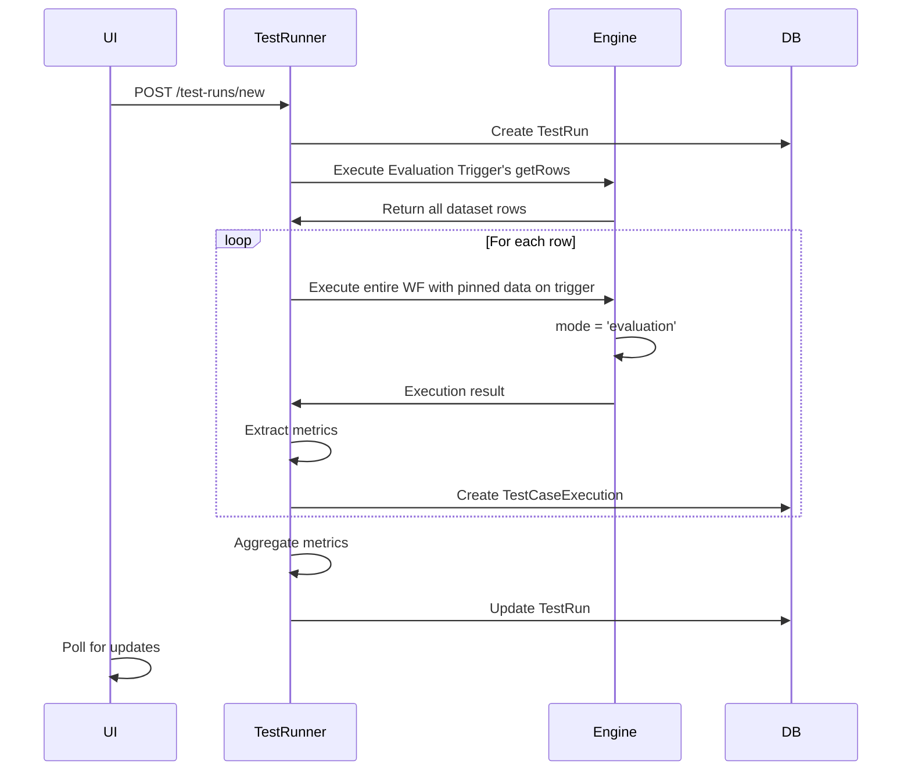
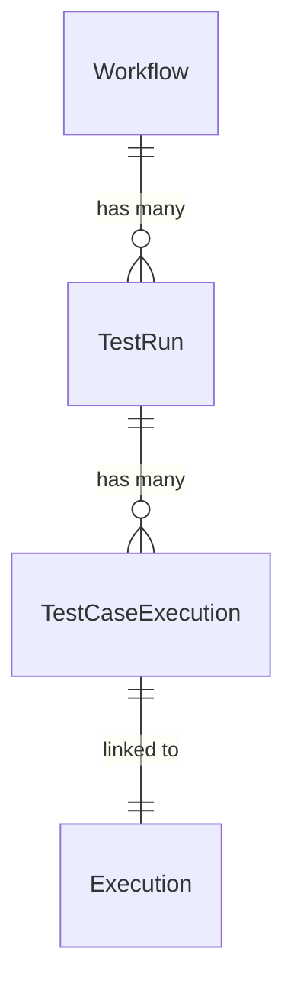

# Evaluation Feature - Technical Architecture

> **⚠️ Notice**: This document was created by AI and not properly reviewed by the team yet.

## Overview

The evaluation feature allows systematic testing of n8n workflows against datasets. It implements two distinct execution modes with different architectures and capabilities.

## Execution Modes

### 1. Canvas Mode (Light Evaluation)

Canvas mode implements a workaround to simulate looping behavior without true loop support in the workflow engine. This mode is used for light evaluation - testing with a small dataset without formal metrics.


**Implementation Details:**
- Frontend orchestration happens in the `executionFinished` event handler:
  - Location: `packages/frontend/editor-ui/src/composables/usePushConnection/handlers/executionFinished.ts`
  - The `continueEvaluationLoop()` function is called when execution status is 'success'
  - Only the trigger node's output data is passed between iterations:
  ```typescript
  // From executionFinished.ts:146-157
  const rowsLeft = mainData ? (mainData[0]?.json?._rowsLeft as number) : 0;
  if (rowsLeft && rowsLeft > 0) {
    const { runWorkflow } = useRunWorkflow({ router });
    void runWorkflow({
      triggerNode: evaluationTrigger.name,
      // pass output of previous trigger run to next iteration
      nodeData: triggerRunData[0],
      rerunTriggerNode: true,
    });
  }
  ```
- Each execution is independent, passing only the trigger node's previous output as input (NOT the entire workflow output)
- No metrics collection or test run records

### 2. Test Runner Mode (Metric-based Evaluation)

Test runner mode uses a dedicated service to orchestrate metric-based evaluations. This mode creates test runs with test cases and collects metrics for each execution.



**Key Implementation:**
- At the start of the test run, the test runner fetches the entire dataset using a custom operation on the EvaluationTrigger node
- For each test case, the test runner executes the entire workflow with pinned data on the trigger node

## Core Components

### Evaluation Nodes

#### EvaluationTrigger Node
Location: `packages/nodes-base/nodes/Evaluation/EvaluationTrigger/EvaluationTrigger.node.ee.ts`

Two execution paths:
1. **Normal execution (`execute` method)**:
   - Returns single row per execution
   - Tracks `row_number` and `_rowsLeft`
   - Used in canvas mode

2. **Custom operation (`customOperations.dataset.getRows`)**:
   - Returns entire dataset at once
   - Only accessible via `forceCustomOperation`
   - Used by test runner

#### Evaluation Node
Location: `packages/nodes-base/nodes/Evaluation/Evaluation.node.ee.ts`

Operations:
- `setInputs` (Set inputs): Captures input data fields for display in evaluation results (not saved to data source)
- `setOutputs` (Set outputs): Updates data source (Data Table or Google Sheets) using trigger's row_number AND captures output data
- `setMetrics` (Set metrics): Flags metrics for test runner extraction
- `checkIfEvaluating` (Check if evaluating): Routes based on execution context

### Test Runner Service

Location: `packages/cli/src/evaluation.ee/test-runner/test-runner.service.ee.ts`

Key methods:
- `runTest()`: Main orchestration
- `runDatasetTrigger()`: Fetches dataset using forceCustomOperation
- `runTestCase()`: Executes single test with pinned data
- `extractMetrics()`: Collects user-defined and predefined metrics
- `getEvaluationData()`: Extracts input/output data from Evaluation nodes

### Database Schema



**Metrics Storage:**
- `TestCaseExecution.metrics`: JSON object storing individual test case metrics (e.g., `{"correctness": 0.8, "latency": 1200}`)
- `TestCaseExecution.inputs`: JSON object storing captured input data from evaluation
- `TestCaseExecution.outputs`: JSON object storing captured output data from evaluation
- `TestRun.metrics`: JSON object storing aggregated metrics across all test cases, same structure as individual metrics
- Metrics format: `{ [metricName: string]: number }`
- Inputs/Outputs format: `{ [fieldName: string]: any }`

### Frontend State Management

Pinia store: `packages/frontend/editor-ui/src/stores/evaluation.store.ee.ts`

Key features:
- Polling mechanism for running tests:
  ```typescript
  startPollingTestRun(testRunId: string) {
    const pollFn = async () => {
      await this.getTestRun(workflowId, testRunId);
      if (testRun.status === 'running') {
        this.pollingTimeouts[testRunId] = setTimeout(pollFn, 1000);
      }
    };
  }
  ```
- Manages test runs and test case executions separately
- Provides computed properties for workflow-specific runs

## Execution Mode: 'evaluation'

The `evaluation` execution mode is a special mode added to the execution engine.

Key characteristics:
- Defined in `packages/workflow/src/interfaces.ts`
- Supports pinned data like 'manual' mode
- Has separate concurrency control:
  ```typescript
  // packages/cli/src/config/schema.ts
  executions: {
    concurrency: {
      evaluationLimit: {
        env: 'N8N_CONCURRENCY_EVALUATION_LIMIT'
      }
    }
  }
  ```
- Counted as production executions in statistics
- Uses separate queue type in Bull/Redis

## Input/Output Data Tracking

The evaluation feature supports capturing and displaying input/output data for each test case execution. This feature was added in July 2025 to provide better visibility into what data was processed and what results were generated.

### How It Works

1. **Input Data Capture**: The `setInputs` operation in Evaluation nodes allows capturing specific fields from the dataset
   - These fields are displayed in the evaluation results UI
   - They are NOT written back to the data source (Data Table or Google Sheets)
   - Useful for tracking context like prompts, test descriptions, or reference data

2. **Output Data Capture**: The `setOutputs` operation serves dual purposes:
   - Writes results back to the data source (Data Table or Google Sheets)
   - Captures output data for display in the UI
   - Both actions happen in the same operation

3. **Data Extraction**: During test execution, the test runner:
   - Calls `getEvaluationData()` to find all Evaluation nodes with `setInputs` or `setOutputs`
   - Extracts the `evaluationData` field from their execution results
   - Stores this data in the `TestCaseExecution` entity

4. **Storage**: The data is stored as JSON objects:
   ```typescript
   TestCaseExecution {
     inputs: { prompt: "Hello", context: "..." },  // From setInputs nodes
     outputs: { response: "Hi!", score: 0.95 }     // From setOutputs nodes
   }
   ```

5. **Display**: The frontend can display these inputs/outputs in the test run detail view, providing full visibility into each test case's execution

### Use Cases

- **Prompt Engineering**: Track which prompts were used and what responses were generated
- **Data Validation**: See the exact input data that caused a test to fail
- **Result Analysis**: Compare outputs across different test cases
- **Debugging**: Understand what data flowed through the evaluation

## Implementation Quirks

### Canvas Mode Loop Workaround
- The loop mechanism is a workaround because each "iteration" is a complete workflow execution
- Frontend coordinates the loop through the `executionFinished` event handler, not the backend
- `_rowsLeft` is a hidden communication channel embedded in the trigger node's output
- The loop only continues if the execution was successful and there's no `destinationNode` specified

### Dataset Fetching
The test runner can't use normal node execution because:
- It needs all rows at once for orchestration
- Normal execution returns one row at a time (in canvas mode, manual execution)

### Concurrency and Queue Management
- Evaluation executions use a separate queue to support different concurrency limits depending on the license
- Queue type mapping in `packages/cli/src/scaling/queue/queue.constants.ts`

## API Endpoints

Controller: `packages/cli/src/evaluation.ee/test-runs.controller.ee.ts`

| Endpoint | Method | Description |
|----------|--------|-------------|
| `/workflows/:workflowId/test-runs` | GET | List test runs |
| `/workflows/:workflowId/test-runs/:id` | GET | Get test run details |
| `/workflows/:workflowId/test-runs/:id/test-cases` | GET | Get test cases |
| `/workflows/:workflowId/test-runs/new` | POST | Start evaluation |
| `/workflows/:workflowId/test-runs/:id/cancel` | POST | Cancel running evaluation |
| `/workflows/:workflowId/test-runs/:id` | DELETE | Delete test run |

## Configuration

Environment variables:
- `N8N_CONCURRENCY_EVALUATION_LIMIT`: Max concurrent evaluation executions

License Quotas:
- `quota:evaluations:maxWorkflows`: Max number of workflows having evaluations

## Data Source Options

The evaluation feature supports two data source options for test datasets:

### 1. Data Tables (Default since v4.7+)

- **Local storage**: Data is stored in n8n's database
- **Better performance**: No external API calls during execution
- **Simpler setup**: No need for Google Sheets credentials
- **UI**: Uses the Data Table node for dataset management

### 2. Google Sheets (Legacy)

- **External storage**: Data stored in Google Sheets
- **Requires credentials**: Google Sheets API access needed
- **Collaborative editing**: Multiple users can edit the dataset
- **UI**: Dataset managed via Google Sheets interface

**Version Behavior:**
- **v4.7+**: Data Tables is the default source
- **v4.6 and earlier**: Google Sheets is the default source
- Both nodes support a "source" parameter to switch between options

## Known Limitations

1. **Sequential execution**: Both canvas mode and test runner mode execute rows sequentially, not in parallel
2. **No recovery**: Interrupted test runs can't be resumed
3. **Numeric metrics only**: Metrics must be numbers; boolean or string metrics are not supported
   - Note: Non-numeric data columns can be displayed in test results using the `setInputs` and `setOutputs` operations
   - These appear in the test case details but cannot be used for metric calculations
4. **Average-only aggregation**: Test run metrics are calculated as simple averages of test case metrics
