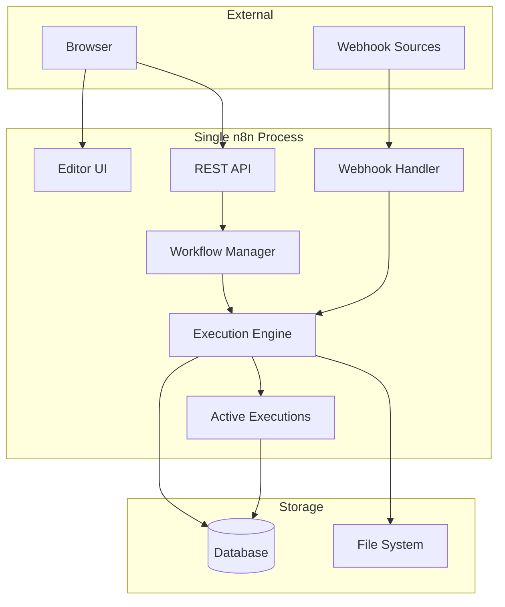

# n8n Execution Modes

> **⚠️ Notice**: This document was created by AI and not properly reviewed by the team yet.

## Overview

n8n can run in two execution modes:
- **Regular Mode**: Single process handles everything (default)
- **Queue Mode**: Distributed processes with Redis-based job queue

These modes are configured via the `EXECUTIONS_MODE` environment variable:
```bash
# Regular mode (default)
EXECUTIONS_MODE=regular

# Queue mode
EXECUTIONS_MODE=queue
```


For detailed queue mode implementation, see [Queue Mode Architecture](./queue-mode.md).

## Regular Mode

In regular mode, a single n8n process handles all responsibilities:

- All functionality in one process
- Direct execution without queue overhead
- Simpler deployment and debugging

### Configuration

```bash
# Set execution mode (default is regular)
EXECUTIONS_MODE=regular

# Start n8n
n8n start
```

### Architecture



### Execution Flow

1. Workflow triggered (manual, webhook, or schedule)
2. Execution registered in ActiveExecutions
3. WorkflowExecute processes nodes directly
4. Results saved to database
5. UI updated via polling or events

### Performance Considerations

**Concurrency Control:**
```bash
# Limit concurrent executions (default: -1 = unlimited)
N8N_CONCURRENCY_PRODUCTION_LIMIT=5
```

**Limitations:**
- All executions share process memory
- CPU-bound workflows can block UI
- Memory leaks affect entire application
- Single process limits total throughput

### Process Communication

- Direct function calls within single process
- Shared memory for state
- Node.js EventEmitter for internal events
- No inter-process communication needed

## Queue Mode Overview

Queue mode distributes n8n functionality across multiple specialized processes, enabling horizontal scaling and high availability.

### Key Characteristics
- Multi-process architecture with specialized roles
- Redis-based job queue using Bull library
- Horizontal scalability across machines
- Process isolation for reliability
- Real-time communication via Redis pub/sub

### Process Types
1. **Main Process**: Editor UI, REST API, workflow management
2. **Worker Process**: Workflow execution
3. **Webhook Process**: Production webhook handling

## Related Documentation

- [Queue Mode Architecture](./queue-mode.md) - Detailed queue mode implementation
- Execution engine: `/packages/core/src/workflow-execute.ts`
- Active executions: `/packages/cli/src/active-executions.ts`
- Configuration schema: `/packages/cli/src/config/schema.ts`
