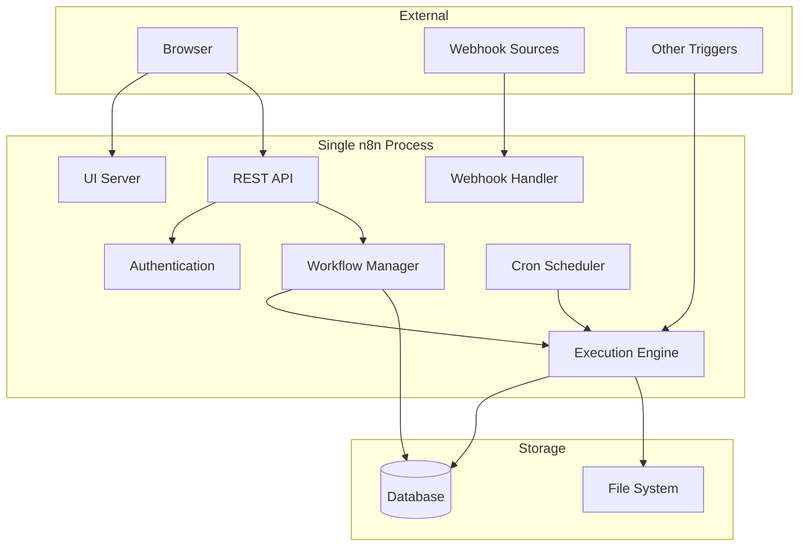
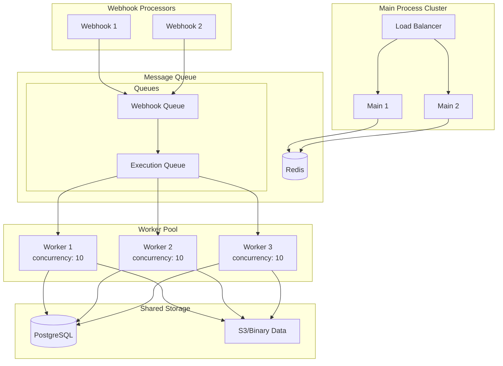
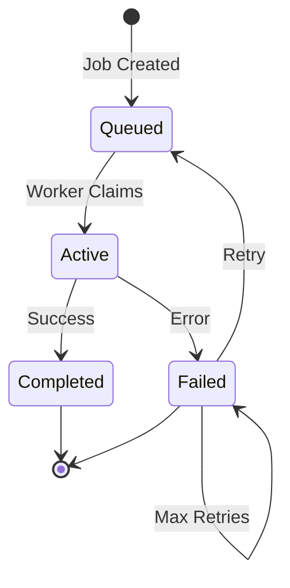
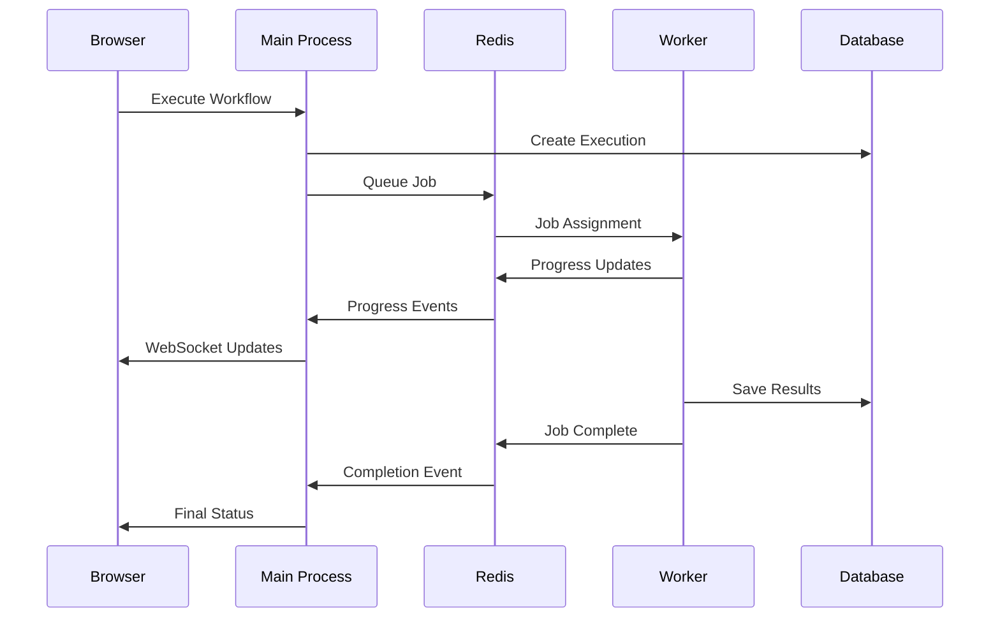

# n8n Execution Modes

n8n supports different execution modes to accommodate various deployment scenarios, from simple single-instance setups to highly scalable distributed systems.

## Overview

n8n can run in two primary modes:
- **Regular Mode**: Single process handles everything (default)
- **Queue Mode**: Distributed processes with Redis-based job queue

Additionally, n8n has three process types:
- **Main Process**: UI, API, and orchestration
- **Worker Process**: Workflow execution (queue mode only)
- **Webhook Process**: Webhook handling (queue mode only)

## Process Types

### Main Process (`n8n start`)

The main process is the heart of n8n, serving the web UI and API.

**Responsibilities:**
- Serve the editor UI (default port: 5678)
- Handle API requests (REST API)
- Manage workflow activation/deactivation
- Handle test webhooks
- In regular mode: Execute workflows
- In queue mode: Orchestrate execution via Redis

**Key Components:**
```typescript
// packages/cli/src/commands/start.ts
export class Start extends BaseCommand {
  // Initializes:
  - Server (Express application)
  - ActiveWorkflowManager
  - WebhookService
  - EventBus
  - Database connections
}
```

**Configuration:**
```bash
# Basic start
n8n start

# With tunnel for webhook development
n8n start --tunnel

# Custom port
N8N_PORT=8080 n8n start
```

### Worker Process (`n8n worker`)

Workers execute workflows in queue mode, enabling horizontal scaling.

**Responsibilities:**
- Pull jobs from Redis queue
- Execute workflows
- Report execution status
- Handle execution timeouts
- No UI or API serving

**Key Components:**
```typescript
// packages/cli/src/commands/worker.ts
export class Worker extends BaseCommand {
  // Initializes:
  - ScalingService (job processing)
  - Queue connection (Bull/Redis)
  - Node types and credentials
  - Execution hooks
}
```

**Configuration:**
```bash
# Start worker with concurrency limit
n8n worker --concurrency=10

# Environment configuration
N8N_CONCURRENCY_PRODUCTION_LIMIT=20 n8n worker
```

**Scaling Considerations:**
- Workers are stateless and can be scaled horizontally
- Each worker processes `concurrency` number of jobs simultaneously
- Workers compete for jobs using Redis atomic operations
- Health endpoint available at `/healthz`

### Webhook Process (`n8n webhook`)

Dedicated process for handling production webhooks in queue mode.

**Responsibilities:**
- Listen for webhook HTTP requests
- Validate webhook authenticity
- Queue webhook executions
- Minimal memory footprint
- No workflow execution

**Key Components:**
```typescript
// packages/cli/src/commands/webhook.ts
export class Webhook extends BaseCommand {
  // Initializes:
  - WebhookServer (Express application)
  - Minimal webhook routing
  - Queue publisher
  - No execution engine
}
```

**Why Separate Webhook Process?**
- Webhook endpoints must be highly available
- Prevents execution bottlenecks from affecting webhook reception
- Allows independent scaling of webhook capacity
- Smaller memory footprint than full n8n instance

## Regular Mode Architecture

In regular mode, a single process handles all responsibilities:



**Advantages:**
- Simple deployment
- No additional infrastructure (Redis)
- Easy debugging
- Lower latency

**Limitations:**
- Single point of failure
- Limited scalability
- Memory constraints
- Webhook processing affects execution

## Queue Mode Architecture

Queue mode separates concerns across multiple process types:



### Queue Mode Configuration

**Required Environment Variables:**
```bash
# Enable queue mode
EXECUTIONS_MODE=queue

# Redis configuration
QUEUE_BULL_REDIS_HOST=localhost
QUEUE_BULL_REDIS_PORT=6379
QUEUE_BULL_REDIS_DB=0

# Optional: Redis password
QUEUE_BULL_REDIS_PASSWORD=yourpassword

# Optional: Redis TLS
QUEUE_BULL_REDIS_TLS=true
```

### Job Queue Details

n8n uses Bull (Redis-based queue) for job management:

**Queue Features:**
- Automatic retries with exponential backoff
- Job priority levels
- Delayed job scheduling
- Job progress tracking
- Graceful shutdown handling

**Job Lifecycle:**


## Process Communication

### Regular Mode
- Direct function calls
- Shared memory
- Event emitters

### Queue Mode
- Redis pub/sub for real-time updates
- Job queues for work distribution
- Database for persistent state
- WebSocket for UI updates



## Choosing the Right Mode

### Use Regular Mode When:
- Running n8n for personal use
- Low to medium workflow volume
- Simple deployment is priority
- Testing and development
- Memory and CPU are not constraints

### Use Queue Mode When:
- High workflow volume
- Need high availability
- Horizontal scaling required
- Webhook reliability is critical
- Running resource-intensive workflows
- Multi-tenant environments

## Health Monitoring

Each process type exposes health endpoints:

**Main Process:**
- `GET /healthz` - Basic health
- `GET /healthz/readiness` - Ready to serve traffic

**Worker Process:**
- `GET /healthz` - Worker health
- Includes queue connection status
- Reports current job count

**Webhook Process:**
- `GET /healthz` - Webhook server health
- Minimal dependencies check

## Best Practices

### Regular Mode
1. Monitor memory usage
2. Set execution timeouts
3. Use execution pruning
4. Limit concurrent executions

### Queue Mode
1. **Redis Configuration:**
   - Use Redis persistence (AOF or RDB)
   - Configure appropriate memory limits
   - Monitor Redis memory usage

2. **Worker Scaling:**
   - Start with concurrency = CPU cores
   - Monitor job wait times
   - Scale workers based on queue depth

3. **Process Distribution:**
   - Run main processes behind load balancer
   - Distribute workers across nodes
   - Separate webhook processes for reliability

4. **Monitoring:**
   - Queue depth metrics
   - Worker utilization
   - Job failure rates
   - Execution times

## Migration Between Modes

### Regular to Queue Mode

1. Install and configure Redis
2. Update environment variables:
   ```bash
   EXECUTIONS_MODE=queue
   QUEUE_BULL_REDIS_HOST=your-redis-host
   ```
3. Start main process: `n8n start`
4. Start workers: `n8n worker`
5. (Optional) Start webhook process: `n8n webhook`

### Queue to Regular Mode

1. Ensure no jobs in queue
2. Stop all workers and webhook processes
3. Update configuration:
   ```bash
   EXECUTIONS_MODE=regular
   ```
4. Restart main process
5. Remove Redis (optional)

## Troubleshooting

### Common Issues

**Queue Mode: Jobs not processing**
- Check Redis connectivity
- Verify worker processes are running
- Check worker logs for errors
- Ensure queue names match

**High Memory Usage**
- Limit workflow data size
- Enable execution pruning
- Reduce worker concurrency
- Use external binary data storage

**Webhook Delays**
- Scale webhook processes
- Check webhook process health
- Monitor Redis queue depth
- Verify network connectivity