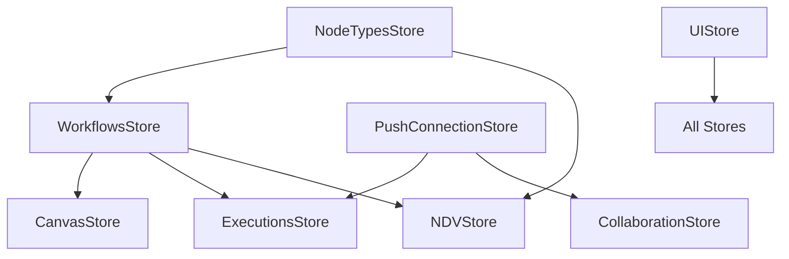

# Frontend State Management

> **⚠️ Notice**: This documentation was created by AI and not properly reviewed by the team yet.

## Overview

n8n's frontend uses Pinia for state management, with multiple interconnected stores managing different aspects of the application. This document explains the store architecture, state flow, and how real-time updates are handled.

## TODO: Document the Following

### Store Architecture

#### Core Stores

##### WorkflowsStore
- **Location**: `/packages/frontend/editor-ui/src/stores/workflows.store.ts`
- **Responsibilities**:
  - Current workflow state
  - Node connections and positions
  - Workflow metadata
- **Key state**: activeWorkflow, workflow, workflowExecutionData

##### NodeTypesStore
- **Location**: `/packages/frontend/editor-ui/src/stores/nodeTypes.store.ts`
- **Purpose**: Available node types and their definitions
- **Caching**: Node type information caching
- **Dynamic loading**: Community nodes handling

##### CanvasStore
- **Location**: `/packages/frontend/editor-ui/src/stores/canvas.store.ts`
- **Responsibilities**:
  - Node positions and visual state
  - Canvas zoom and pan state
  - Selection management
  - Drag and drop state

##### NDVStore (Node Details View)
- **Location**: `/packages/frontend/editor-ui/src/stores/ndv.store.ts`
- **Purpose**: Node parameter editing state
- **Features**: Parameter validation, dynamic options

##### ExecutionsStore
- **Location**: `/packages/frontend/editor-ui/src/stores/executions.store.ts`
- **Manages**: Execution history and current execution state
- **Real-time updates**: Live execution progress

#### Supporting Stores

##### UIStore
- **Location**: `/packages/frontend/editor-ui/src/stores/ui.store.ts`
- **Responsibilities**: UI state (modals, sidebars, notifications)
- **Global UI state**: Theme, language, layout preferences

##### PushConnectionStore
- **Location**: `/packages/frontend/editor-ui/src/stores/pushConnection.store.ts`
- **Purpose**: WebSocket connection management
- **Real-time events**: Execution updates, collaboration events

##### CollaborationStore
- **Location**: `/packages/frontend/editor-ui/src/stores/collaboration.store.ts`
- **Features**: Multi-user editing support
- **State sync**: Cursor positions, active users

### Store Relationships

### State Management Patterns

#### Workflow State vs UI State
- **Workflow State**: Persisted data (nodes, connections, settings)
- **UI State**: Temporary view state (zoom, selection, modals)
- **Separation strategies**: What goes where
- **Synchronization**: Keeping states consistent

#### Computed Properties
- Performance considerations
- Dependency tracking
- Common patterns

#### Actions and Mutations
- Async operations handling
- Error state management
- Optimistic updates

### Real-time Updates

#### WebSocket Integration
- Event types and handlers
- State synchronization
- Conflict resolution
- Reconnection strategies

#### Server-Sent Events (SSE)
- Execution progress updates
- One-way data flow
- Error handling

### Data Flow Patterns

#### Loading States
- Initial data fetching
- Lazy loading strategies
- Loading indicators
- Error boundaries

#### Form State Management
- Node parameter forms
- Validation states
- Dirty checking
- Auto-save functionality

#### Undo/Redo Implementation
- State snapshots
- Action history
- Memory optimization

### Performance Optimization

#### Store Subscriptions
- Minimizing re-renders
- Selective subscriptions
- Memoization strategies

#### Large Workflow Handling
- Virtualization for many nodes
- Incremental updates
- Memory management

## Key Questions to Answer

1. How do stores communicate with each other?
2. What triggers workflow state saves?
3. How are real-time updates merged with local changes?
4. What's the lifecycle of execution state?
5. How is undo/redo implemented efficiently?
6. What are the performance bottlenecks with large workflows?
7. How does collaborative editing maintain consistency?
8. What patterns exist for form state management?

## Related Documentation

- [Frontend Architecture](./frontend-architecture.md) - Overall frontend structure
- [WebSocket & Real-time](./websocket-realtime.md) - Real-time communication details
- [API Architecture](./api-architecture.md) - Backend API integration

## Code Locations to Explore

- `/packages/frontend/editor-ui/src/stores/` - All Pinia stores
- `/packages/frontend/editor-ui/src/composables/` - Shared store logic
- `/packages/frontend/editor-ui/src/plugins/` - Store initialization
- `/packages/frontend/@n8n/stores/` - Shared store utilities
- Store test files for usage patterns
