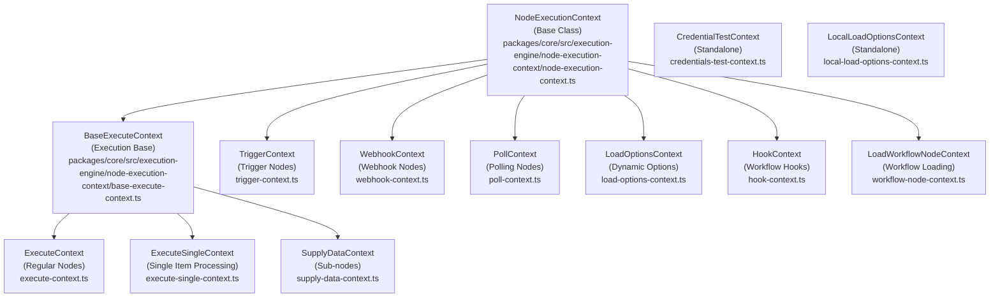

# Node Execution Contexts

> **⚠️ Notice**: This documentation was created by AI and not properly reviewed by the team yet.

## Overview

n8n provides different execution contexts for nodes depending on their type and execution phase. Each context provides specific APIs and capabilities tailored to the node's requirements. These contexts form a hierarchy that encapsulates the complexity of workflow execution, credential management, and data processing.

## Context Hierarchy

The node execution context system follows a clear inheritance pattern that provides progressively specialized functionality:



## Context Types

### NodeExecutionContext (Base Class)

**Location**: `/packages/core/src/execution-engine/node-execution-context/node-execution-context.ts`

The foundation class that provides core functionality shared across all contexts. It handles basic workflow operations, parameter resolution, and credential access.

**Key APIs**:
- `getNode()`: Returns a deep copy of the current node
- `getWorkflow()`: Returns workflow metadata (id, name, active status)
- `getMode()`: Returns the current execution mode
- `getNodeParameter()`: Resolves and returns node parameters with expression evaluation
- `evaluateExpression()`: Evaluates workflow expressions
- `getWorkflowStaticData()`: Access persistent data between executions
- `getChildNodes()`: Get all downstream nodes
- `getParentNodes()`: Get all upstream nodes
- `getTimezone()`: Returns workflow timezone
- `_getCredentials()`: Protected method for credential access

**Example Usage**:
```typescript
// Inside any context
const parameter = this.getNodeParameter('operation', 'create') as string;
const timezone = this.getTimezone();
const staticData = this.getWorkflowStaticData('node');
```

### BaseExecuteContext

**Location**: `/packages/core/src/execution-engine/node-execution-context/base-execute-context.ts`

Extends NodeExecutionContext for nodes that execute with data. Adds execution-specific functionality like data handling, workflow execution, and cancellation support.

**Key APIs**:
- `getExecuteData()`: Returns current execution data
- `continueOnFail()`: Determines error handling behavior
- `getCredentials()`: Public method for credential access with item index
- `putExecutionToWait()`: Pauses execution until specified time
- `executeWorkflow()`: Execute sub-workflows
- `getInputSourceData()`: Get source information for input data
- `getWorkflowDataProxy()`: Access workflow data proxy for expressions
- `sendMessageToUI()`: Send console messages in manual mode
- `logAiEvent()`: Log AI-related events
- `setMetadata()`: Set execution metadata
- `getContext()`: Get execution context by type
- `onExecutionCancellation()`: Register cancellation handlers
- `getExecutionCancelSignal()`: Get AbortSignal for cancellation

**Example Usage**:
```typescript
// In ExecuteContext
if (this.continueOnFail()) {
    // Handle error gracefully
}

await this.putExecutionToWait(new Date(Date.now() + 5000));
this.sendMessageToUI('Processing item', itemIndex);
```

### ExecuteContext

**Location**: `/packages/core/src/execution-engine/node-execution-context/execute-context.ts`

Used by regular nodes during standard execution. Processes all items at once and provides comprehensive helper functions.

**Key APIs**:
- `getInputData()`: Get all input items from a specific input
- `getNodeParameter()`: Get parameters for specific item indices
- `returnJsonArray()`: Convert data to JSON array format
- `normalizeItems()`: Normalize input data structure
- `constructExecutionMetaData()`: Build execution metadata
- `copyInputItems()`: Create copies of input items

**Helper Functions**:
- Request helpers (`httpRequest`, `requestWithAuthentication`)
- Binary data helpers (`getBinaryDataBuffer`, `prepareBinaryData`, `copyBinaryFile`)
- File system helpers (read/write operations)
- SSH tunnel functions
- Deduplication helpers

**Example Usage**:
```typescript
async execute(this: IExecuteFunctions): Promise<INodeExecutionData[][]> {
    const items = this.getInputData();
    const operation = this.getNodeParameter('operation', 0) as string;
    
    for (let i = 0; i < items.length; i++) {
        if (operation === 'create') {
            const response = await this.helpers.httpRequest({
                method: 'POST',
                url: 'https://api.example.com/resource',
                body: items[i].json,
            });
            items[i].json = response;
        }
    }
    
    return [items];
}
```

### ExecuteSingleContext

**Location**: `/packages/core/src/execution-engine/node-execution-context/execute-single-context.ts`

Processes one item at a time, ideal for memory-efficient processing of large datasets or when items need isolated processing.

**Key APIs**:
- `getInputData()`: Get single item at current index
- `getItemIndex()`: Get current item index
- `getNodeParameter()`: Parameters for current item

**Example Usage**:
```typescript
async executeSingle(this: IExecuteSingleFunctions): Promise<INodeExecutionData> {
    const item = this.getInputData();
    const itemIndex = this.getItemIndex();
    const value = this.getNodeParameter('value', '') as string;
    
    // Process single item
    item.json.processed = true;
    item.json.value = value;
    
    return item;
}
```

### TriggerContext

**Location**: `/packages/core/src/execution-engine/node-execution-context/trigger-context.ts`

Used by trigger nodes that initiate workflow execution based on events or schedules.

**Key APIs**:
- `emit()`: Emit data to start workflow execution
- `emitError()`: Emit error to workflow
- `getActivationMode()`: Get activation mode (init, create, update)
- `getMode()`: Get execution mode

**Helper Functions**:
- Scheduling functions (for cron-based triggers)
- Request helpers
- Binary data helpers
- SSH tunnel functions

**Example Usage**:
```typescript
async trigger(this: ITriggerFunctions): Promise<ITriggerResponse> {
    const interval = this.getNodeParameter('interval', 60) as number;
    
    const executeTrigger = () => {
        this.emit([this.helpers.returnJsonArray([{ timestamp: Date.now() }])]);
    };
    
    const intervalObj = setInterval(executeTrigger, interval * 1000);
    
    async function closeFunction() {
        clearInterval(intervalObj);
    }
    
    return {
        closeFunction,
    };
}
```

### WebhookContext

**Location**: `/packages/core/src/execution-engine/node-execution-context/webhook-context.ts`

Handles incoming HTTP requests for webhook trigger nodes.

**Key APIs**:
- `getRequestObject()`: Access Express request object
- `getResponseObject()`: Access Express response object
- `getHeaderData()`: Get request headers
- `getBodyData()`: Get request body
- `getQueryData()`: Get query parameters
- `getParamsData()`: Get URL parameters
- `getWebhookName()`: Get webhook name

**Example Usage**:
```typescript
async webhook(this: IWebhookFunctions): Promise<IWebhookResponseData> {
    const req = this.getRequestObject();
    const resp = this.getResponseObject();
    const headers = this.getHeaderData();
    const body = this.getBodyData();
    
    // Validate webhook signature
    const signature = headers['x-webhook-signature'];
    if (!this.validateSignature(signature, body)) {
        resp.status(401).send('Invalid signature');
        return { noWebhookResponse: true };
    }
    
    return {
        workflowData: [this.helpers.returnJsonArray([body])],
    };
}
```

### PollContext

**Location**: `/packages/core/src/execution-engine/node-execution-context/poll-context.ts`

Used by polling trigger nodes that periodically check for new data.

**Key APIs**:
- `__emit()`: Internal emit function
- `__emitError()`: Internal error emit
- `getActivationMode()`: Get activation mode
- `getMode()`: Get execution mode

**Static Data Usage**:
```typescript
async poll(this: IPollFunctions): Promise<INodeExecutionData[][] | null> {
    const staticData = this.getWorkflowStaticData('node');
    const lastId = staticData.lastId as string || '0';
    
    const newItems = await this.helpers.httpRequest({
        url: `https://api.example.com/items?since=${lastId}`,
    });
    
    if (newItems.length) {
        staticData.lastId = newItems[newItems.length - 1].id;
        return [this.helpers.returnJsonArray(newItems)];
    }
    
    return null;
}
```

### LoadOptionsContext

**Location**: `/packages/core/src/execution-engine/node-execution-context/load-options-context.ts`

Loads dynamic options for node parameters (dropdown values, etc.).

**Key APIs**:
- `getCurrentNodeParameters()`: Get current parameter values
- `getNodeParameter()`: Get specific parameter value
- `getCredentials()`: Access credentials for loading options

**Example Usage**:
```typescript
async loadOptions(this: ILoadOptionsFunctions): Promise<INodePropertyOptions[]> {
    const credentials = await this.getCredentials('apiKey');
    
    const response = await this.helpers.httpRequest({
        url: 'https://api.example.com/options',
        headers: { Authorization: `Bearer ${credentials.apiKey}` },
    });
    
    return response.map((item: any) => ({
        name: item.label,
        value: item.id,
    }));
}
```

### SupplyDataContext

**Location**: `/packages/core/src/execution-engine/node-execution-context/supply-data-context.ts`

Used by sub-nodes and special execution nodes that provide data to other nodes.

**Key APIs**:
- All BaseExecuteContext APIs
- `inputData`: Direct access to input connections
- `connectionType`: Type of connection supplying data
- `closeFunctions`: Cleanup functions

**Use Cases**:
- Loop nodes providing iteration data
- Sub-workflow nodes
- Code nodes with custom outputs

### HookContext

**Location**: `/packages/core/src/execution-engine/node-execution-context/hook-context.ts`

Used for workflow lifecycle hooks (workflow.preExecute, workflow.postExecute).

**Key APIs**:
- `getNodeParameter()`: Access hook parameters
- `getWorkflowStaticData()`: Access workflow static data
- `getWebhookName()`: Get webhook name if applicable

### Additional Contexts

#### CredentialTestContext
**Location**: `/packages/core/src/execution-engine/node-execution-context/credentials-test-context.ts`

Standalone context for testing credentials without workflow execution.

#### LocalLoadOptionsContext
**Location**: `/packages/core/src/execution-engine/node-execution-context/local-load-options-context.ts`

Lightweight context for loading options in local/development scenarios.

## Helper Functions

Helper functions are categorized utilities available through the `helpers` property in most contexts:

### Request Helpers
**Location**: `/packages/core/src/execution-engine/node-execution-context/utils/request-helper-functions.ts`

- `httpRequest()`: Make HTTP requests with automatic proxy support
- `requestWithAuthentication()`: HTTP requests with credential-based auth
- `httpRequestWithAuthentication()`: Modern HTTP request with auth
- `requestOAuth1()`: OAuth 1.0 authenticated requests
- `requestOAuth2()`: OAuth 2.0 authenticated requests

### Binary Data Helpers
**Location**: `/packages/core/src/execution-engine/node-execution-context/utils/binary-helper-functions.ts`

- `getBinaryDataBuffer()`: Get binary data as Buffer
- `prepareBinaryData()`: Prepare binary data for storage
- `copyBinaryFile()`: Copy binary file to workflow storage
- `assertBinaryData()`: Validate binary data exists
- `detectBinaryEncoding()`: Detect encoding of binary data

### File System Helpers
**Location**: `/packages/core/src/execution-engine/node-execution-context/utils/file-system-helper-functions.ts`

- `readFile()`: Read file from filesystem
- `writeFile()`: Write file to filesystem
- `readDirectory()`: List directory contents
- `createDirectory()`: Create directory

### SSH Tunnel Helpers
**Location**: `/packages/core/src/execution-engine/node-execution-context/utils/ssh-tunnel-helper-functions.ts`

- `getSSHTunnelFunctions()`: Create SSH tunnels for database connections

### Scheduling Helpers
**Location**: `/packages/core/src/execution-engine/node-execution-context/utils/scheduling-helper-functions.ts`

- `registerCron()`: Register cron jobs
- `unregisterCron()`: Remove cron jobs

### Deduplication Helpers
**Location**: `/packages/core/src/execution-engine/node-execution-context/utils/deduplication-helper-functions.ts`

- `deduplicateItems()`: Remove duplicate items based on key
- `summarize()`: Create execution summaries
- `validateFieldType()`: Validate data types

## State Management

### Static Data

Static data persists between node executions and workflow runs:

```typescript
const staticData = this.getWorkflowStaticData('node');

// Store state
staticData.lastProcessedId = 12345;
staticData.counter = (staticData.counter as number || 0) + 1;

// Retrieve in next execution
const lastId = staticData.lastProcessedId as number;
```

**Use Cases**:
- Tracking last processed item in polling triggers
- Maintaining counters across executions
- Storing temporary tokens or session data

**Limitations**:
- Data is stored in memory (lost on restart unless using database)
- Should not store large amounts of data
- Not shared between workflow instances

### Workflow Data Proxy

The WorkflowDataProxy provides access to workflow data in expressions:

```typescript
const dataProxy = this.getWorkflowDataProxy(itemIndex);
// Access in expressions: $input, $json, $node, $workflow, etc.
```

## Context Selection Guide

| Context Type | When to Use | Key Features |
|-------------|------------|--------------|
| **ExecuteContext** | Regular nodes processing data | Full helper access, batch processing |
| **ExecuteSingleContext** | Memory-intensive operations | Process one item at a time |
| **TriggerContext** | Event-based workflow starts | Emit functions, activation modes |
| **WebhookContext** | HTTP endpoint triggers | Request/response handling |
| **PollContext** | Periodic data checking | Static data for state tracking |
| **LoadOptionsContext** | Dynamic dropdown options | Parameter access, credentials |
| **SupplyDataContext** | Providing data to other nodes | Sub-workflows, loops |
| **HookContext** | Workflow lifecycle events | Pre/post execution hooks |

## Security Considerations

### Credential Access

Credentials are protected through multiple layers:
- Node type must declare required credentials
- Credentials must be explicitly granted to nodes
- Special nodes (HTTP Request) have full access
- Credentials are decrypted only when needed

```typescript
// Credential access validation in NodeExecutionContext
if (!fullAccess && !node.credentials?.[type]) {
    if (nodeCredentialDescription?.required === true) {
        throw new NodeOperationError(node, 'Node does not have any credentials set');
    }
}
```

### Expression Evaluation

Expressions are evaluated in a sandboxed environment with controlled access to:
- Workflow data through the data proxy
- Additional keys for special functions
- Node parameters and metadata

## Performance Implications

### Memory Management

1. **ExecuteContext**: Loads all items in memory
   - Best for: Small to medium datasets
   - Concern: Memory usage with large arrays

2. **ExecuteSingleContext**: Processes one item at a time
   - Best for: Large datasets, streaming operations
   - Concern: Slight overhead per item

3. **Context Creation**: Lightweight operation
   - Contexts are created per node execution
   - Minimal overhead for context instantiation

### Best Practices

1. **Use ExecuteSingleContext for**:
   - Processing files larger than 100MB
   - Operations that don't need access to all items
   - Memory-constrained environments

2. **Cache expensive operations**:
   ```typescript
   const staticData = this.getWorkflowStaticData('node');
   if (!staticData.cachedData) {
       staticData.cachedData = await expensiveOperation();
   }
   ```

3. **Clean up resources**:
   ```typescript
   // In trigger/webhook contexts
   async function closeFunction() {
       // Clean up intervals, connections, etc.
   }
   ```

## Testing Strategies

### Unit Testing Contexts

```typescript
import { mock } from 'jest-mock-extended';
import { ExecuteContext } from '@/execution-engine/node-execution-context';

describe('ExecuteContext', () => {
    it('should get node parameters', () => {
        const context = new ExecuteContext(
            mockWorkflow,
            mockNode,
            mockAdditionalData,
            'manual',
            mockRunExecutionData,
            0,
            mockConnectionInputData,
            mockInputData,
            mockExecuteData,
        );
        
        const param = context.getNodeParameter('test', 'default');
        expect(param).toBe('expected-value');
    });
});
```

### Integration Testing

Test contexts with actual node implementations:

```typescript
const helpers = new TriggerContext(
    workflow,
    node,
    additionalData,
    'trigger',
    'create',
);

const response = await node.trigger.call(helpers);
expect(response.closeFunction).toBeDefined();
```

## Adding Custom Helpers

Custom helpers can be added through the helper function files:

```typescript
// In packages/core/src/execution-engine/node-execution-context/utils/custom-helper-functions.ts
export function getCustomHelperFunctions() {
    return {
        myCustomHelper: async (data: any) => {
            // Custom implementation
            return processedData;
        },
    };
}

// Add to context constructor
this.helpers = {
    ...getCustomHelperFunctions(),
    // ... other helpers
};
```

## Common Patterns and Examples

### Handling Pagination

```typescript
async execute(this: IExecuteFunctions): Promise<INodeExecutionData[][]> {
    const returnData: INodeExecutionData[] = [];
    let hasNextPage = true;
    let page = 1;
    
    while (hasNextPage) {
        const response = await this.helpers.httpRequest({
            url: `https://api.example.com/items?page=${page}`,
        });
        
        returnData.push(...this.helpers.returnJsonArray(response.items));
        hasNextPage = response.hasMore;
        page++;
    }
    
    return [returnData];
}
```

### Error Handling with Continue on Fail

```typescript
async execute(this: IExecuteFunctions): Promise<INodeExecutionData[][]> {
    const items = this.getInputData();
    const returnData: INodeExecutionData[] = [];
    
    for (let i = 0; i < items.length; i++) {
        try {
            const result = await this.helpers.httpRequest({
                url: this.getNodeParameter('url', i) as string,
            });
            returnData.push({ json: result });
        } catch (error) {
            if (this.continueOnFail()) {
                returnData.push({
                    json: { error: error.message },
                    error,
                });
            } else {
                throw error;
            }
        }
    }
    
    return [returnData];
}
```

### Using Static Data for Rate Limiting

```typescript
async poll(this: IPollFunctions): Promise<INodeExecutionData[][] | null> {
    const staticData = this.getWorkflowStaticData('node');
    const now = Date.now();
    const lastRun = staticData.lastRun as number || 0;
    const minInterval = 60000; // 1 minute
    
    if (now - lastRun < minInterval) {
        return null; // Skip this poll
    }
    
    staticData.lastRun = now;
    // Perform actual polling
    const items = await this.helpers.httpRequest({ url: 'https://api.example.com/updates' });
    
    return items.length ? [this.helpers.returnJsonArray(items)] : null;
}
```

## Related Documentation

- [Workflow Execution Engine](./workflow-execution-engine.md) - How contexts fit into execution
- [Node Development](./node-development.md) - Using contexts in custom nodes
- [Expression System](./expression-system.md) - Expression evaluation in contexts
- [Binary Data Handling](./binary-data.md) - Working with files and binary data

## Code Locations

- **Context Implementations**: `/packages/core/src/execution-engine/node-execution-context/`
- **Helper Functions**: `/packages/core/src/execution-engine/node-execution-context/utils/`
- **Interface Definitions**: `/packages/workflow/src/interfaces.ts`
- **Factory Functions**: `/packages/core/src/node-execute-functions.ts`
- **Test Files**: `/packages/core/src/execution-engine/node-execution-context/__tests__/`