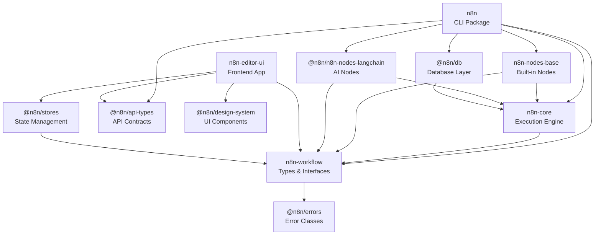

# n8n Package Architecture

> **⚠️ Notice**: This document was created by AI and not properly reviewed by the team yet.

n8n uses a monorepo structure with pnpm workspaces. This document describes the package organization and their relationships.

## Package Overview

### Core Runtime Packages
- **`n8n` (cli)** - Main server process, REST API, and CLI commands
- **`n8n-core` (core)** - Workflow execution engine and node execution context
- **`n8n-workflow` (workflow)** - Data structures, interfaces, and expression language
- **`n8n-nodes-base` (nodes-base)** - Built-in nodes and credentials
- **`@n8n/n8n-nodes-langchain` (nodes-langchain)** - AI and LangChain nodes

### Frontend Packages
- **`n8n-editor-ui` (editor-ui)** - Vue.js workflow editor application
- **`@n8n/design-system`** - Reusable UI components and design tokens
- **`@n8n/stores`** - Pinia state management stores
- **`@n8n/composables`** - Shared Vue composables
- **`@n8n/chat`** - Chat UI components
- **`@n8n/i18n`** - Internationalization and localization
- **`@n8n/rest-api-client`** - API client for frontend-backend communication
- **`@n8n/storybook`** - Storybook configuration for component development

### Infrastructure Packages
- **`@n8n/db`** - Database entities and repositories (TypeORM)
- **`@n8n/di`** - Dependency injection container
- **`@n8n/config`** - Configuration management
- **`@n8n/permissions`** - Role-based access control
- **`@n8n/task-runner`** - Isolated JavaScript/Python execution
- **`@n8n/api-types`** - Shared TypeScript interfaces between frontend and backend
- **`@n8n/backend-common`** - Shared backend utilities
- **`@n8n/constants`** - Shared constants across packages
- **`@n8n/errors`** - Error types and utilities
- **`@n8n/utils`** - General utility functions

### Development & Build Tools
- **`n8n-node-dev`** - CLI tool for developing custom nodes
- **`@n8n/node-cli`** - Node development CLI utilities
- **`@n8n/create-node`** - Node creation templates and scaffolding
- **`@n8n/extension-sdk`** - SDK for building n8n extensions
- **`@n8n/eslint-config`** - Shared ESLint configuration
- **`@n8n/eslint-plugin-community-nodes`** - ESLint plugin for community nodes
- **`@n8n/stylelint-config`** - Shared Stylelint configuration
- **`@n8n/typescript-config`** - Shared TypeScript configuration
- **`@n8n/vitest-config`** - Shared Vitest test configuration
- **`@n8n/backend-test-utils`** - Backend testing utilities

### Specialized Packages
- **`@n8n/client-oauth2`** - OAuth2 client implementation
- **`@n8n/imap`** - IMAP email protocol support
- **`@n8n/codemirror-lang`** - CodeMirror language support for n8n expressions
- **`@n8n/codemirror-lang-sql`** - CodeMirror SQL language support
- **`@n8n/json-schema-to-zod`** - JSON Schema to Zod conversion utilities
- **`@n8n/decorators`** - TypeScript decorators for various features

### Testing & Quality
- **`n8n-playwright` (testing/playwright)** - E2E tests using Playwright
- **`n8n-containers` (testing/containers)** - Container test utilities
- **`@n8n/n8n-benchmark` (benchmark)** - Performance benchmarking tools
- **`@n8n/scan-community-package`** - Community package security scanner

### Enterprise & Extensions
- **`@n8n/ai-workflow-builder`** - AI-powered workflow builder (EE)
- **`@n8n/n8n-extension-insights`** - Insights extension

## Core Package Dependencies

This diagram shows core packages and their key dependencies:



### Key Relationships

1. **`n8n-workflow` is the foundation**
   - Contains all core interfaces and types
   - Minimal dependencies (only `@n8n/errors`)
   - Used by both frontend and backend
   - No dependencies on other n8n packages

2. **`n8n-core` provides execution**
   - Depends on `n8n-workflow` for types
   - Implements the execution engine
   - Provides node execution context
   - Uses DI container and backend utilities

3. **`n8n` (cli) orchestrates everything**
   - Main application entry point
   - Loads nodes from `n8n-nodes-base`
   - Uses `n8n-core` for execution
   - Manages database via `@n8n/db`
   - Integrates all infrastructure packages

4. **Frontend packages are modular**
   - `n8n-editor-ui` is the main Vue application
   - UI components isolated in `@n8n/design-system`
   - State management in `@n8n/stores`
   - Shared logic in `@n8n/composables`
   - API communication via `@n8n/rest-api-client`

## Major Package Details

### CLI Package (n8n)

The `n8n` package is the main application server with multiple process types:

**Location**: `/packages/cli`

**Architecture:**
- **Commands**: Process entry points (`start`, `worker`, `webhook`)
- **Controllers**: HTTP request handlers for REST API
- **Services**: Business logic layer (workflows, executions, auth)
- **Middleware**: Request processing (auth, CORS, parsing)

### Core Package (n8n-core)

The `n8n-core` package provides the workflow execution runtime.

**Location**: `/packages/core`

**Key Components:**
- `WorkflowExecute` - Main execution orchestrator
- `NodeExecuteFunctions` - Helpers available to nodes during execution
- `BinaryDataManager` - Handles file storage for binary data
- `CredentialsHelper` - Manages credential encryption/decryption

### Workflow Package (n8n-workflow)

The `n8n-workflow` package contains shared data structures.

**Location**: `/packages/workflow`

**Core Classes:**
- `Workflow` - Main workflow class with nodes and connections
- `Expression` - Parses and evaluates n8n expressions
- `WorkflowDataProxy` - Provides `$json`, `$node`, etc. in expressions

**Key Interfaces:**
- `INode` - Node instance in a workflow
- `INodeType` - Node type definition
- `IExecuteFunctions` - Node execution context
- `IWorkflowExecuteAdditionalData` - Execution metadata

### Frontend Architecture

The `n8n-editor-ui` package is a Vue 3 application.

**Location**: `/packages/frontend/editor-ui`

**Key Frontend Packages:**
- **`@n8n/stores`** (`/packages/frontend/@n8n/stores`) - Pinia stores for state management
- **`@n8n/design-system`** (`/packages/frontend/@n8n/design-system`) - Vue component library
- **`@n8n/composables`** (`/packages/frontend/@n8n/composables`) - Reusable Vue composition functions
- **`@n8n/rest-api-client`** (`/packages/frontend/@n8n/rest-api-client`) - Type-safe API client

**Key Stores:**
- `WorkflowStore` - Current workflow state
- `NodeTypesStore` - Available node types
- `ExecutionsStore` - Execution history
- `UserStore` - User session and settings

## Dependency Injection

n8n uses `@n8n/di` for dependency injection across the codebase:

```typescript
@Service()
export class WorkflowService {
  constructor(
    private readonly workflowRepository: WorkflowRepository,
    private readonly credentialsService: CredentialsService,
  ) {}
}

// Usage
const service = Container.get(WorkflowService);
```

This pattern enables:
- Loose coupling between components
- Easy testing with mock dependencies
- Clear dependency visibility

## Node System

Nodes are defined in the `n8n-nodes-base` and `@n8n/n8n-nodes-langchain` packages and implement the `INodeType` interface:

```typescript
export class HttpRequest implements INodeType {
  description: INodeTypeDescription = { /* node metadata */ };

  async execute(this: IExecuteFunctions): Promise<INodeExecutionData[][]> {
    // Node implementation
  }
}
```

**Node Types:**
- **Regular nodes** - Implement `execute()` method
- **Trigger nodes** - Implement `trigger()` for polling or `webhook()` for webhooks

**File Convention:**
- `[NodeName].node.ts` - Node implementation
- `[NodeName].node.json` - Metadata and documentation

## Extension Points

### Community Nodes

External nodes can be installed via npm:
- Must follow the `n8n-nodes-*` naming convention
- Loaded dynamically at startup
- Isolated from core node packages

### Extensions

The extension system allows adding functionality:
- **`@n8n/extension-sdk`** - SDK for building extensions
- **`@n8n/n8n-extension-insights`** - Example extension for analytics

## Build System

The monorepo uses Turbo for build orchestration:
- **pnpm workspaces** - Package management
- **Turbo** - Parallel builds and caching
- **TypeScript** - Project references for incremental compilation
- **Vite** - Frontend bundling
- **tsc** - Backend compilation

## Architecture Principles

1. **Package Independence**
   - Lower-level packages (like `n8n-workflow`) have no dependencies on higher-level ones
   - Shared types and interfaces live in `@n8n/api-types` or `n8n-workflow`
   - Infrastructure packages (`@n8n/di`, `@n8n/db`) are isolated

2. **Clear Boundaries**
   - `n8n` (cli) is the only package that brings everything together
   - Frontend and backend share only `n8n-workflow` and `@n8n/api-types`
   - Nodes access the system only through defined interfaces

3. **Extensibility**
   - Nodes can be added without modifying core
   - Authentication methods are pluggable
   - Database support is abstracted via TypeORM

4. **Modularity**
   - Frontend features are split into focused packages
   - Backend utilities are shared via `@n8n/backend-common`
   - Development tools are isolated from runtime packages
