# n8n Package Architecture

This document provides a detailed overview of n8n's package structure, dependencies, and architectural patterns used across the codebase.

## Package Overview

n8n follows a monorepo structure using pnpm workspaces. Packages are organized into functional groups:

```
n8n/
├── packages/
│   ├── cli/                        # Main server and CLI commands
│   ├── core/                       # Core execution engine
│   ├── workflow/                   # Workflow logic and expressions
│   ├── nodes-base/                 # Built-in nodes
│   ├── node-dev/                   # Node development tools
│   └── @n8n/                       # Scoped packages
│       ├── ai-workflow-builder/    # AI-powered workflow generation
│       ├── api-types/              # Shared API type definitions
│       ├── backend-common/         # Common backend utilities
│       ├── backend-test-utils/     # Backend testing utilities
│       ├── benchmark/              # Performance benchmarking tools
│       ├── client-oauth2/          # OAuth2 client implementation
│       ├── codemirror-lang/        # CodeMirror n8n expression language
│       ├── config/                 # Configuration management
│       ├── constants/              # Shared constants
│       ├── db/                     # Database abstraction layer
│       ├── decorators/             # TypeScript decorators
│       ├── di/                     # Dependency injection container
│       ├── eslint-config/          # ESLint configuration
│       ├── extension-sdk/          # SDK for building extensions
│       ├── imap/                   # IMAP email handling
│       ├── json-schema-to-zod/     # JSON Schema to Zod converter
│       ├── nodes-langchain/        # LangChain integration nodes
│       ├── permissions/            # RBAC permissions system
│       ├── storybook/              # Storybook configuration
│       ├── task-runner/            # Task execution runtime
│       ├── typescript-config/      # TypeScript configuration
│       ├── utils/                  # Shared utilities
│       └── vitest-config/          # Vitest testing configuration
├── packages/frontend/
│   ├── editor-ui/                  # Main Vue.js application
│   └── @n8n/
│       ├── chat/                   # Chat UI component
│       ├── composables/            # Vue composables
│       ├── design-system/          # UI component library
│       ├── i18n/                   # Internationalization
│       ├── rest-api-client/        # Frontend API client
│       └── stores/                 # Pinia state management
└── packages/extensions/
    └── insights/                   # Analytics and insights extension
```

## Dependency Matrix

### Core Dependencies

```mermaid
graph TD
    subgraph "Application Layer"
        CLI[cli]
        EDITOR[editor-ui]
    end
    
    subgraph "Business Logic Layer"
        CORE[core]
        WF[workflow]
        NODES[nodes-base]
    end
    
    subgraph "Infrastructure Layer"
        DB[@n8n/db]
        DI[@n8n/di]
        CONFIG[@n8n/config]
        CONST[@n8n/constants]
        PERM[@n8n/permissions]
    end
    
    CLI --> CORE
    CLI --> WF
    CLI --> NODES
    CLI --> DB
    CLI --> DI
    CLI --> CONFIG
    
    CORE --> WF
    CORE --> DI
    CORE --> CONFIG
    
    NODES --> CORE
    NODES --> WF
    
    EDITOR --> WF
    EDITOR --> CONST
    
    DB --> DI
    PERM --> DI
```

### Detailed Package Dependencies

| Package | Direct Dependencies | Used By | Purpose |
|---------|-------------------|---------|----------|
| `workflow` | `lodash`, `luxon` | `cli`, `core`, `nodes-base`, `editor-ui` | Workflow data structures, expressions |
| `core` | `workflow`, `axios` | `cli`, `nodes-base` | Execution engine, node functions |
| `cli` | `core`, `workflow`, `db`, `nodes-base` | - | Main application server |
| `nodes-base` | `core`, `workflow` | `cli` | Built-in node implementations |
| `@n8n/db` | `typeorm`, `@n8n/di` | `cli` | Database entities and repositories |
| `@n8n/di` | `reflect-metadata` | Most packages | Dependency injection container |
| `editor-ui` | `vue`, `pinia`, `workflow` | - | Frontend application |

## Package Architecture Patterns

### 1. CLI Package (`packages/cli`)

The CLI package serves as the main application entry point and orchestrator.

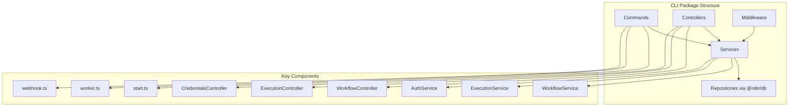

**Key Services:**
- `WorkflowService`: Workflow CRUD and management
- `ExecutionService`: Execution lifecycle management
- `CredentialsService`: Credential encryption and access
- `ProjectService`: Multi-user collaboration
- `CommunityPackagesService`: External node management

### 2. Core Package (`packages/core`)

The core package contains the execution engine and node interfaces.

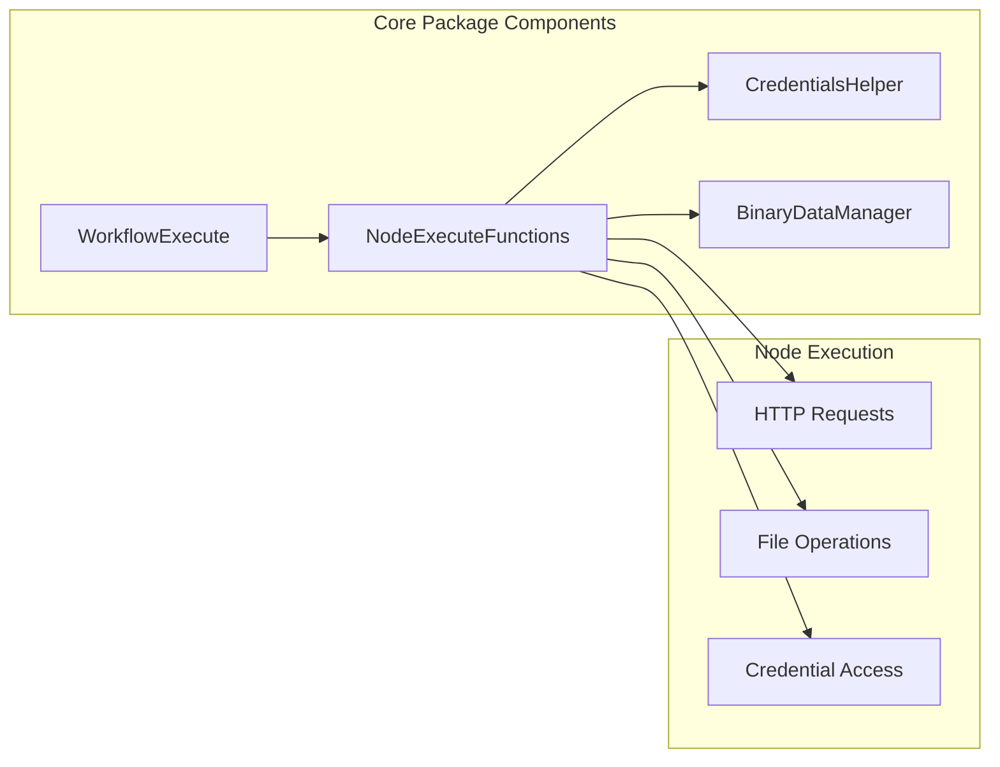

**Core Responsibilities:**
- Workflow execution orchestration
- Node execution context
- Binary data management
- Credential decryption
- Expression evaluation hooks

### 3. Workflow Package (`packages/workflow`)

The workflow package defines data structures and business logic.

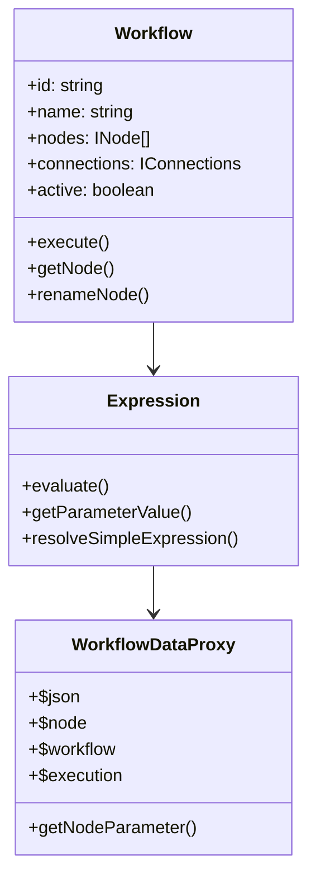

### 4. Database Package (`packages/@n8n/db`)

Database abstraction using TypeORM with repository pattern.

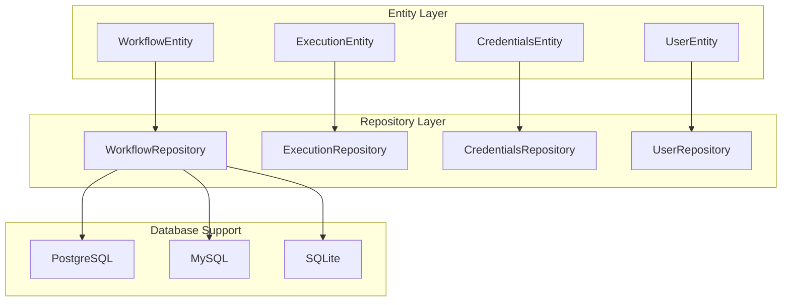

### 5. Frontend Architecture (`packages/editor-ui`)

Vue 3 application with Pinia state management.

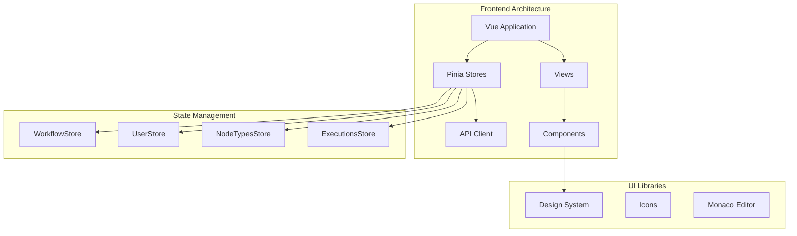

## Service Layer Architecture

### Service Registration

Services use dependency injection for loose coupling:

```typescript
// Service definition
@Service()
export class WorkflowService {
  constructor(
    private readonly workflowRepository: WorkflowRepository,
    private readonly credentialsService: CredentialsService,
    private readonly nodeTypes: NodeTypes,
  ) {}
}

// Usage
const workflowService = Container.get(WorkflowService);
```

### Common Service Patterns

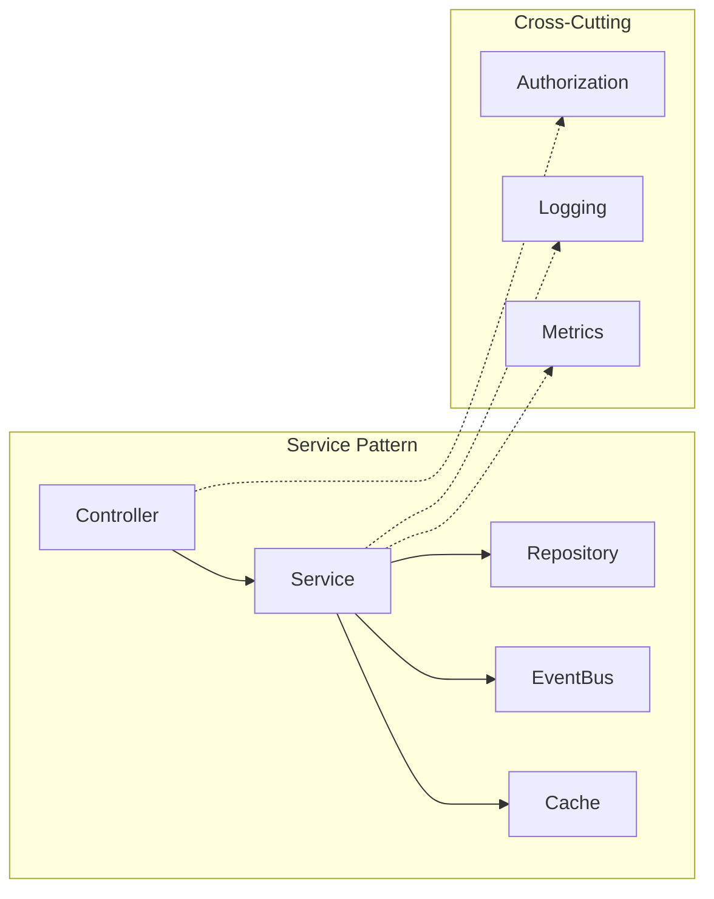

## Node System Architecture

### Node Package Structure

```
nodes-base/
├── nodes/
│   ├── [NodeName]/
│   │   ├── [NodeName].node.ts       # Node implementation
│   │   ├── [NodeName].node.json     # Node metadata
│   │   ├── [NodeName]Trigger.node.ts # Trigger variant
│   │   └── descriptions/            # Parameter descriptions
│   └── ...
├── credentials/
│   ├── [ServiceName]Api.credentials.ts
│   └── ...
└── utils/
    └── utilities.ts                  # Shared utilities
```

### Node Interface

```typescript
interface INodeType {
  description: INodeTypeDescription;
  execute?(context: IExecuteFunctions): Promise<INodeExecutionData[][]>;
  trigger?(context: ITriggerFunctions): Promise<ITriggerResponse>;
  webhook?(context: IWebhookFunctions): Promise<IWebhookResponseData>;
}
```

## Configuration Architecture

### Configuration Layers

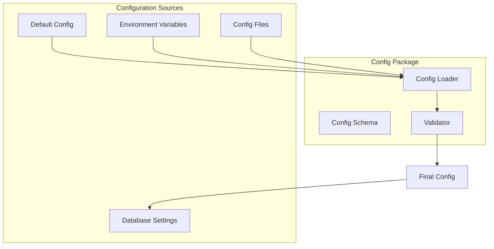

## Build and Development

### Build Pipeline

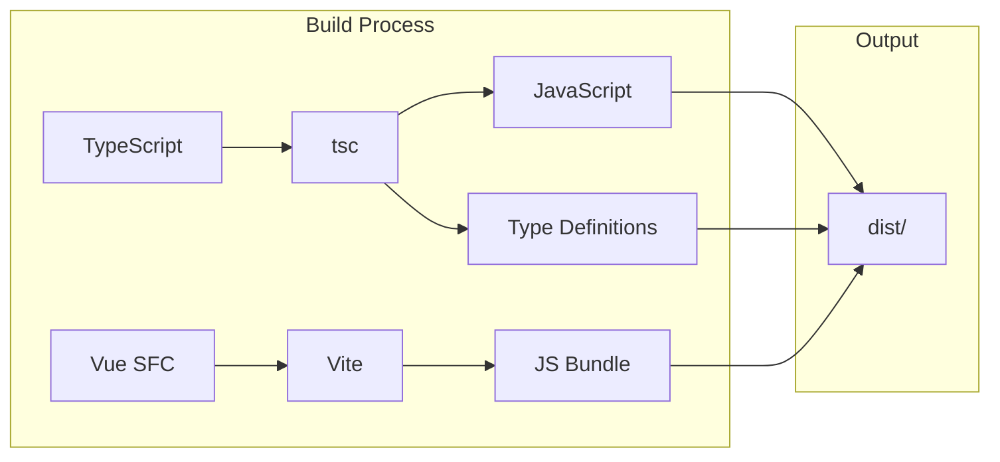

### Development Workflow

```bash
# Root level commands
pnpm install          # Install all dependencies
pnpm build           # Build all packages
pnpm dev             # Start dev mode
pnpm test            # Run all tests

# Package level
pnpm --filter cli dev         # Dev mode for CLI
pnpm --filter editor-ui dev   # Dev mode for frontend
```

## Testing Architecture

### Test Organization

```
package/
├── src/
│   ├── services/
│   │   ├── workflow.service.ts
│   │   └── __tests__/
│   │       └── workflow.service.test.ts
│   └── ...
└── test/
    ├── integration/
    └── e2e/
```

### Test Infrastructure

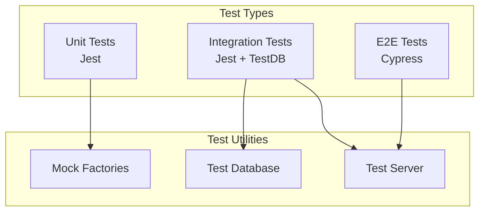

## Security Patterns

### Authentication Flow

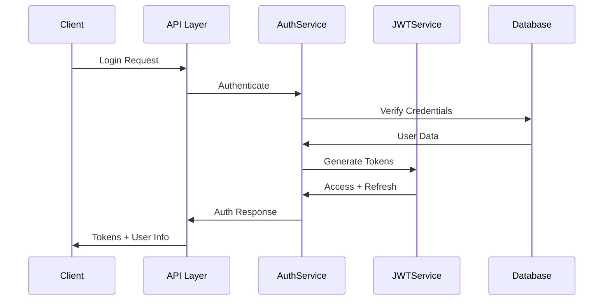

### Credential Encryption

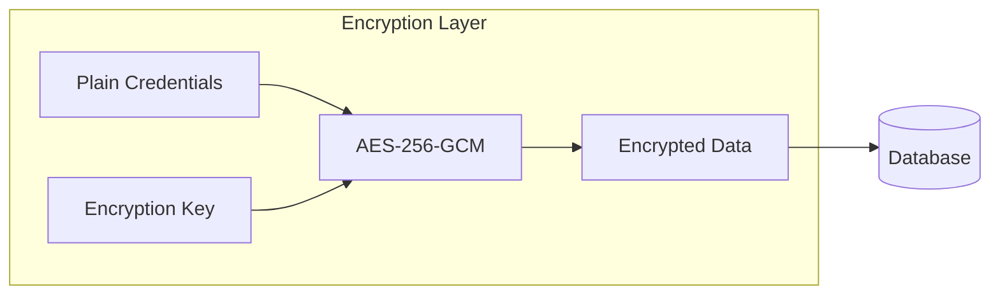

## Performance Considerations

### Caching Strategy

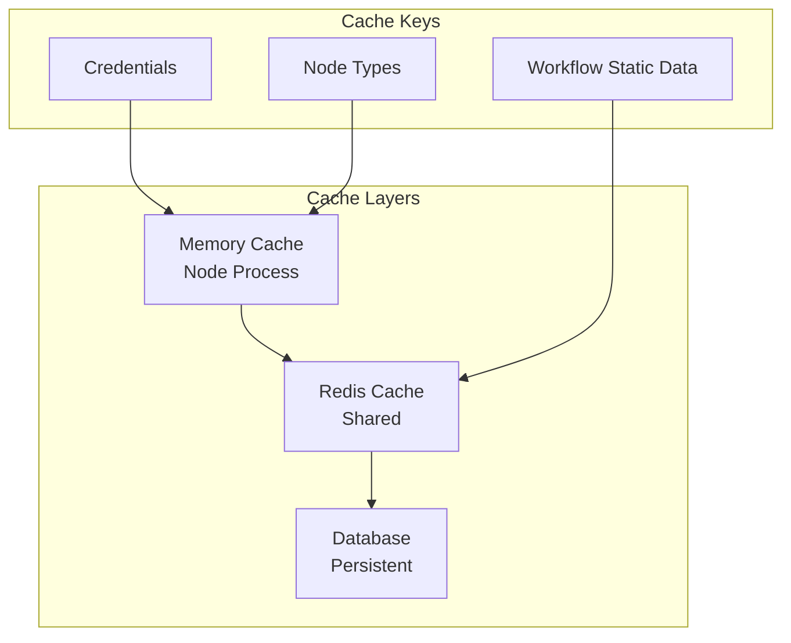

## Future Architecture Considerations

### Planned Improvements

1. **Microservices Migration**
   - Separate execution service
   - Independent webhook service
   - Dedicated authentication service

2. **Plugin System**
   - Dynamic node loading
   - Extension points
   - Custom UI components

3. **Performance Optimization**
   - Workflow compilation
   - Expression caching
   - Parallel node execution

4. **Scalability Enhancements**
   - Horizontal scaling improvements
   - Better resource isolation
   - Multi-region support