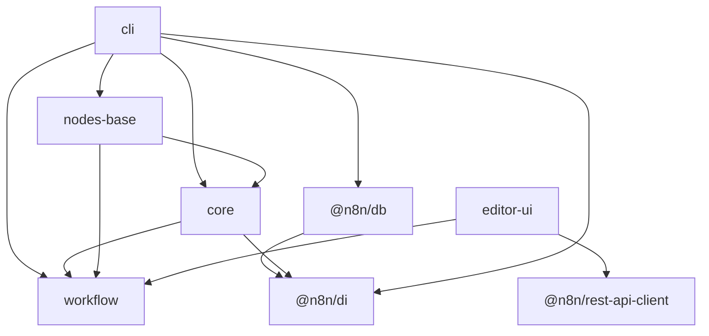
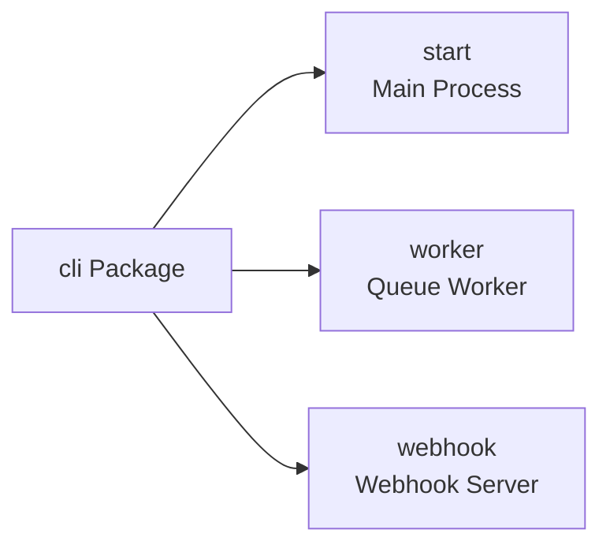
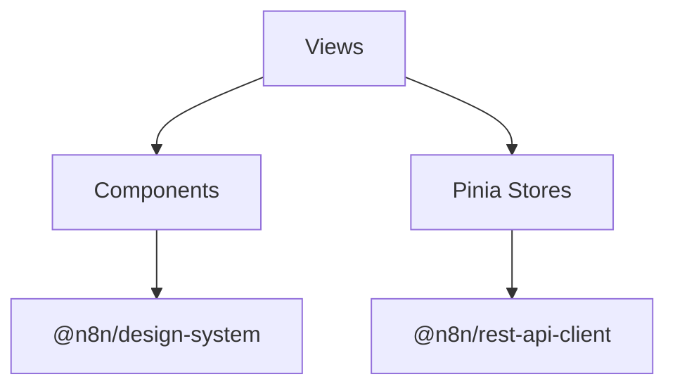

# n8n Package Architecture

n8n uses a monorepo structure with pnpm workspaces. This document describes the package organization and their relationships.

## Package Overview

### Core Runtime Packages
- **`cli`** - Main server process, REST API, and CLI commands
- **`core`** - Workflow execution engine and node execution context
- **`workflow`** - Data structures, interfaces, and expression language
- **`nodes-base`** - Built-in nodes and credentials

### Frontend Packages
- **`editor-ui`** - Vue.js workflow editor application
- **`@n8n/design-system`** - Reusable UI components
- **`@n8n/stores`** - Pinia state management stores

### Infrastructure Packages
- **`@n8n/db`** - Database entities and repositories (TypeORM)
- **`@n8n/di`** - Dependency injection container
- **`@n8n/config`** - Configuration management
- **`@n8n/permissions`** - Role-based access control
- **`@n8n/task-runner`** - Isolated JavaScript/Python execution

## Package Dependencies



### Key Relationships

1. **`workflow` is the foundation**
   - Contains all interfaces and types
   - No dependencies on other n8n packages
   - Used by both frontend and backend

2. **`core` provides execution**
   - Depends on `workflow` for types
   - Implements the execution engine
   - Provides node execution context

3. **`cli` orchestrates everything**
   - Main application entry point
   - Loads nodes from `nodes-base`
   - Uses `core` for execution
   - Manages database via `@n8n/db`

## Major Package Details

### CLI Package

The `cli` package is the main application server with multiple process types:



**Architecture:**
- **Commands**: Process entry points (`start`, `worker`, `webhook`)
- **Controllers**: HTTP request handlers for REST API
- **Services**: Business logic layer (workflows, executions, auth)
- **Middleware**: Request processing (auth, CORS, parsing)

### Core Package

The `core` package provides the workflow execution runtime:

**Key Components:**
- `WorkflowExecute` - Main execution orchestrator
- `NodeExecuteFunctions` - Helpers available to nodes during execution
- `BinaryDataManager` - Handles file storage for binary data
- `CredentialsHelper` - Manages credential encryption/decryption

### Workflow Package

The `workflow` package contains shared data structures:

**Core Classes:**
- `Workflow` - Main workflow class with nodes and connections
- `Expression` - Parses and evaluates n8n expressions
- `WorkflowDataProxy` - Provides `$json`, `$node`, etc. in expressions

**Key Interfaces:**
- `INode` - Node instance in a workflow
- `INodeType` - Node type definition
- `IExecuteFunctions` - Node execution context
- `IWorkflowExecuteAdditionalData` - Execution metadata

### Frontend Architecture

The `editor-ui` package is a Vue 3 application:



**Key Stores:**
- `WorkflowStore` - Current workflow state
- `NodeTypesStore` - Available node types
- `ExecutionsStore` - Execution history
- `UserStore` - User session and settings

## Dependency Injection

n8n uses `@n8n/di` for dependency injection across the codebase:

```typescript
@Service()
export class WorkflowService {
  constructor(
    private readonly workflowRepository: WorkflowRepository,
    private readonly credentialsService: CredentialsService,
  ) {}
}

// Usage
const service = Container.get(WorkflowService);
```

This pattern enables:
- Loose coupling between components
- Easy testing with mock dependencies
- Clear dependency visibility

## Node System

Nodes are defined in the `nodes-base` package and implement the `INodeType` interface:

```typescript
export class HttpRequest implements INodeType {
  description: INodeTypeDescription = { /* node metadata */ };
  
  async execute(this: IExecuteFunctions): Promise<INodeExecutionData[][]> {
    // Node implementation
  }
}
```

**Node Types:**
- **Regular nodes** - Implement `execute()` method
- **Trigger nodes** - Implement `trigger()` for polling or `webhook()` for webhooks
- **Credentials** - Define authentication schemas for services

**File Convention:**
- `[NodeName].node.ts` - Node implementation
- `[NodeName].node.json` - Metadata and documentation
- `[ServiceName]Api.credentials.ts` - Service authentication

## Extension Points

### Community Nodes

External nodes can be installed via npm:
- Must follow the `n8n-nodes-*` naming convention
- Loaded dynamically at startup
- Isolated from core node packages

### Task Runner

The `@n8n/task-runner` provides isolated code execution:
- Runs JavaScript/Python code in separate processes
- Communicates via WebSocket with main process
- Provides controlled access to n8n helpers and libraries

## Architecture Principles

1. **Package Independence**
   - Lower-level packages (like `workflow`) have no dependencies on higher-level ones
   - Shared types and interfaces live in `workflow`
   - Infrastructure packages (`di`, `db`) are isolated

2. **Clear Boundaries**
   - `cli` is the only package that brings everything together
   - Frontend and backend share only the `workflow` package
   - Nodes access the system only through defined interfaces

3. **Extensibility**
   - Nodes can be added without modifying core
   - Authentication methods are pluggable
   - Database support is abstracted via TypeORM