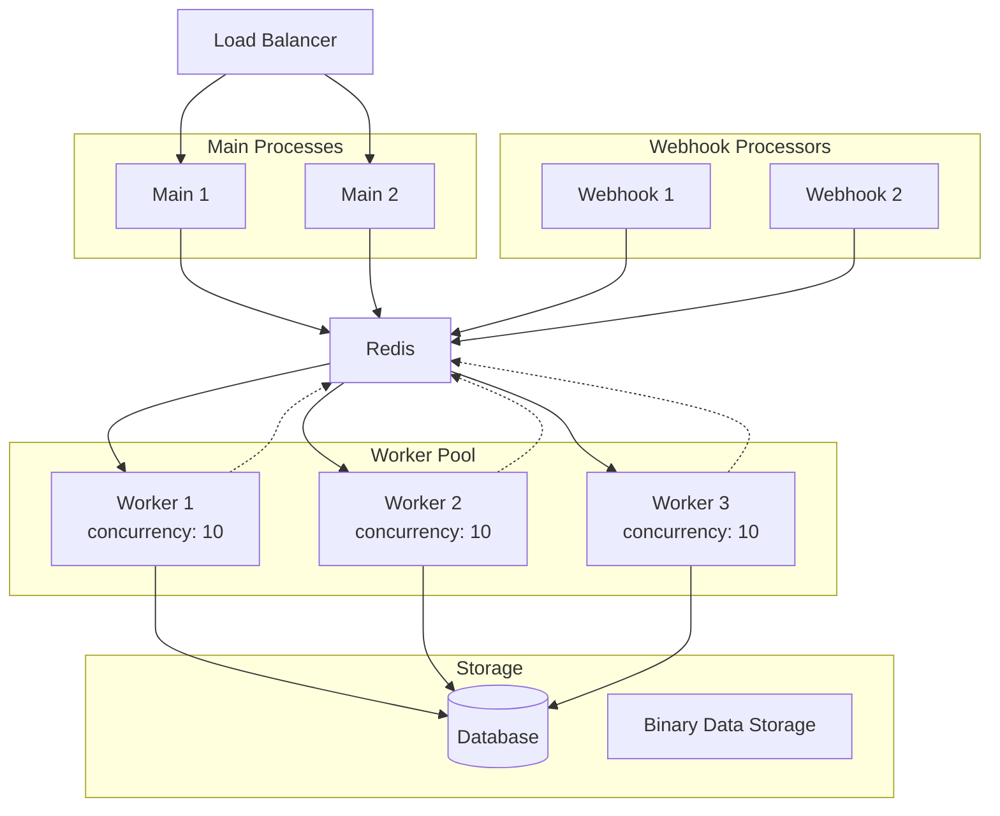
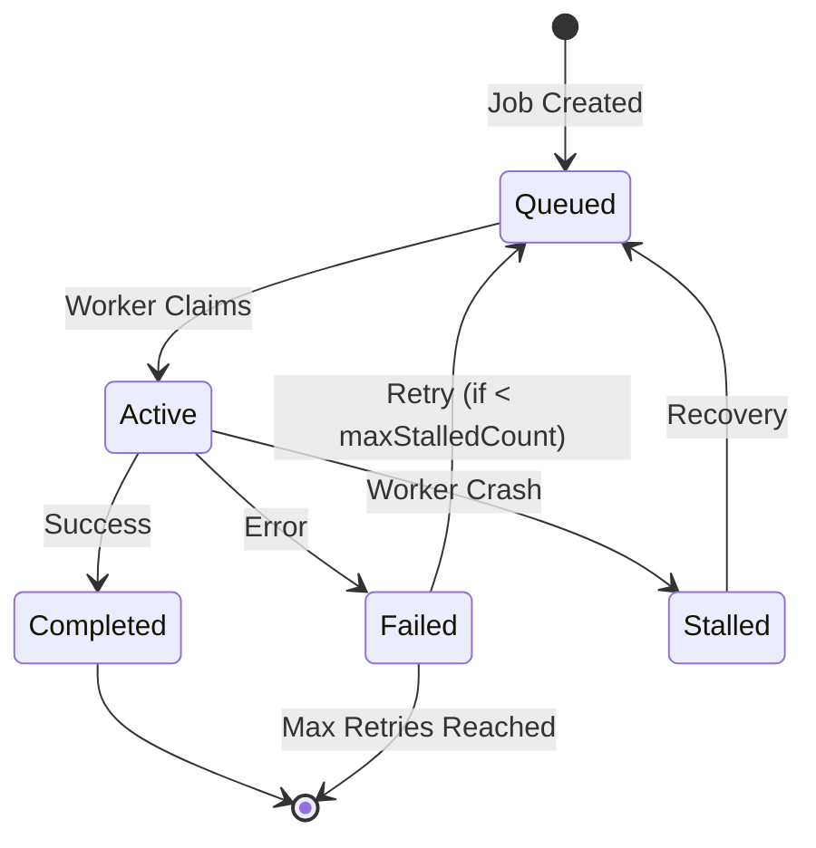
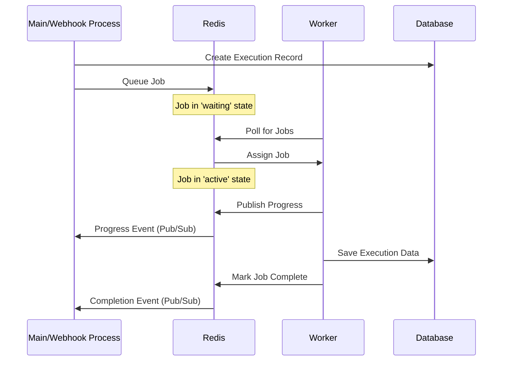

# Queue Mode Architecture

> **⚠️ Notice**: This document was created by AI and not properly reviewed by the team yet.

## Overview

Queue mode is n8n's distributed execution architecture that enables horizontal scaling and high availability by separating workflow execution across specialized processes using Redis as a job queue.

## Quick Start

Minimal setup requires Redis running and two processes:

```bash
# Terminal 1: Start main process
EXECUTIONS_MODE=queue n8n start

# Terminal 2: Start worker process
EXECUTIONS_MODE=queue n8n worker
```

For Redis configuration and advanced setup, see [Redis Configuration](#redis-configuration) below.

## Architecture

Queue mode distributes n8n functionality across multiple specialized process types:



## Process Types

### 1. Main Process (`n8n start`)

**Responsibilities:**
- Serve the editor UI (default port: 5678)
- Handle REST API requests
- Manage workflow activation/deactivation
- Queue workflow executions
- Handle test webhooks
- WebSocket connections for real-time updates

**Configuration:**
```bash
# Required: Enable queue mode
EXECUTIONS_MODE=queue

# Start main process
n8n start
```

### 2. Worker Process (`n8n worker`)

**Responsibilities:**
- Pull jobs from Redis queue
- Execute workflows
- Report execution progress and results
- Handle execution timeouts
- Process binary data

**Configuration:**
```bash
# Start worker with concurrency setting
n8n worker --concurrency=10

# Or use environment variable (overrides --concurrency flag)
N8N_CONCURRENCY_PRODUCTION_LIMIT=20 n8n worker
```

**Concurrency:**
- Default: 10 concurrent executions per worker
- Set via `--concurrency` flag or `N8N_CONCURRENCY_PRODUCTION_LIMIT`
- Each worker can process multiple executions simultaneously
- Scale horizontally by adding more worker processes

**Health Monitoring:**
```bash
# Enable worker health endpoints
QUEUE_HEALTH_CHECK_ACTIVE=true
QUEUE_HEALTH_CHECK_PORT=5678

# Health endpoints:
# GET /healthz - Basic health check
# GET /healthz/readiness - Database and Redis connectivity
```

### 3. Webhook Process (`n8n webhook`)

**Responsibilities:**
- Handle production webhook requests
- Validate webhook signatures
- Queue webhook-triggered executions
- Minimal resource footprint

**Note:** Webhook process REQUIRES queue mode and will error if started in regular mode.

**Configuration:**
```bash
# Same Redis configuration as main process
EXECUTIONS_MODE=queue

# Start webhook process
n8n webhook
```

**Benefits:**
- Isolates webhook handling from execution load
- Ensures webhook availability during high execution load
- Allows independent scaling of webhook capacity
- Smaller memory footprint than main process

## Redis Configuration

### Basic Configuration

```bash
# Enable queue mode
EXECUTIONS_MODE=queue

# Redis connection
QUEUE_BULL_REDIS_HOST=localhost
QUEUE_BULL_REDIS_PORT=6379
QUEUE_BULL_REDIS_DB=0

# Authentication
QUEUE_BULL_REDIS_PASSWORD=yourpassword
QUEUE_BULL_REDIS_USERNAME=default  # Redis 6.0+

# TLS/SSL
QUEUE_BULL_REDIS_TLS=true

# Connection options
QUEUE_BULL_REDIS_TIMEOUT_THRESHOLD=10000  # Max retry timeout (ms)
QUEUE_BULL_REDIS_DUALSTACK=true  # Enable IPv4/IPv6
```

### Redis Cluster Configuration

```bash
# Comma-separated list of cluster nodes
QUEUE_BULL_REDIS_CLUSTER_NODES=redis-1:6379,redis-2:6379,redis-3:6379
```

### Bull Queue Settings

```bash
# Queue key prefix in Redis
QUEUE_BULL_PREFIX=bull  # Results in keys like 'bull:jobs:*'

# Job processing settings
QUEUE_WORKER_LOCK_DURATION=30000      # Job lease time (ms)
QUEUE_WORKER_LOCK_RENEW_TIME=15000    # Lease renewal interval (ms)
QUEUE_WORKER_STALLED_INTERVAL=30000   # Check for stalled jobs (ms)
QUEUE_WORKER_MAX_STALLED_COUNT=1      # Max stalled job retries
```

## Job Queue Implementation

n8n uses Bull (Redis-based queue library) for job management. Jobs represent workflow executions that need to be processed.

### Job Structure

```typescript
interface JobData {
  executionId: string;
  loadStaticData: boolean;
}
```

### Job Lifecycle



### Queue Features

1. **Stalled Job Recovery**: Jobs are marked as stalled if a worker crashes or fails to renew the lock
2. **Progress Updates**: Workers send real-time progress via Redis pub/sub
3. **Graceful Shutdown**: Workers wait for active executions to complete (configurable timeout)
4. **Queue Recovery**: Leader process periodically checks for orphaned executions
5. **Concurrency Control**: Each worker limits concurrent executions

## Process Communication

Queue mode uses multiple communication channels:

1. **Bull Queue (Redis)**: Job distribution
2. **Redis Pub/Sub**: Real-time event broadcasting
3. **Database**: Persistent state and results
4. **WebSocket**: UI real-time updates



### Pub/Sub Channels

n8n uses Redis pub/sub for:
- `n8n.commands`: Command broadcasting (e.g., reload credentials)
- `n8n.worker-status`: Worker health updates
- Execution progress events

## Execution Flow

1. Workflow triggered via main or webhook process
2. Job queued in Redis with execution data
3. Worker pulls job from queue
4. Worker executes workflow
5. Progress updates sent via Redis pub/sub
6. Results saved to database
7. Main process notifies UI via WebSocket

## Scaling Strategy

### Horizontal Scaling

1. **Monitor Queue Metrics:**
   - Queue depth (pending jobs)
   - Job wait time
   - Worker utilization
   - Failed job rate

2. **Scale Workers:**
   ```bash
   # Add more workers when queue depth increases
   n8n worker --concurrency=10  # Worker 1
   n8n worker --concurrency=10  # Worker 2
   n8n worker --concurrency=20  # Worker 3 (higher capacity)
   ```

3. **Scale Main Processes:**
   - Use load balancer for multiple main processes
   - Ensures UI/API availability
   - Distributes webhook load

4. **Scale Webhook Processes:**
   - Add webhook processes for high webhook volume
   - Lightweight processes with minimal overhead

## Recovery and Reliability

### Stalled Job Recovery

When workers crash or lose connection, jobs can become stalled:

```bash
# Configure stalled job handling
QUEUE_WORKER_STALLED_INTERVAL=30000   # Check interval (ms)
QUEUE_WORKER_MAX_STALLED_COUNT=1      # Max recovery attempts
```

### Execution Recovery

The leader main process periodically checks for orphaned executions:

```bash
# Queue recovery settings
N8N_EXECUTIONS_QUEUE_RECOVERY_INTERVAL=180  # Minutes between checks
N8N_EXECUTIONS_QUEUE_RECOVERY_BATCH=100     # Executions per batch
```

### Graceful Shutdown

```bash
# Worker shutdown timeout (seconds)
N8N_GRACEFUL_SHUTDOWN_TIMEOUT=30

# Deprecated (still works but use above instead)
QUEUE_WORKER_TIMEOUT=30
```

During shutdown:
1. Worker stops accepting new jobs
2. Waits for active executions to complete
3. Force terminates after timeout


## Related Documentation

- [Execution Modes Overview](./execution-modes.md) - Comparison with regular mode
- Worker implementation: `/packages/cli/src/commands/worker.ts`
- Queue management: `/packages/cli/src/queue.ts`
- Bull configuration: `/packages/cli/src/config/schema.ts`
