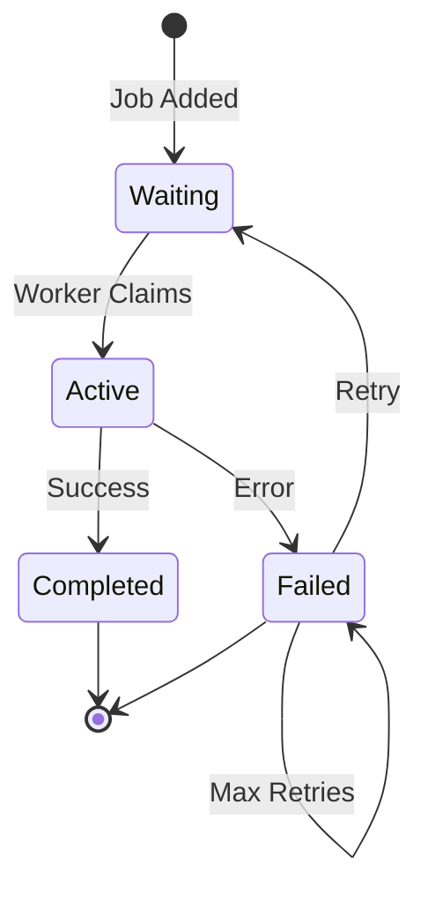

# Queue Processing Architecture

> **⚠️ Notice**: This document was created by AI and not properly reviewed by the team yet.

## Overview

n8n's queue mode uses Bull (Redis-based queue) to distribute workflow executions across multiple worker processes. This document covers the queue architecture, job processing, scaling strategies, and error handling mechanisms.

## TODO: Document the Following

### Queue System Overview

#### Bull Queue Implementation
- **Package**: Bull (Redis-backed)
- **Location**: `/packages/cli/src/scaling/`
- **Redis requirements**: Version, configuration
- **Queue naming**: Conventions and namespaces

#### Queue Types

##### Jobs Queue
- **Name**: `bull:jobs`
- **Purpose**: Regular workflow executions
- **Job data structure**
- **Priority handling**

##### Webhook Queue
- **Name**: `bull:webhook`
- **Purpose**: Webhook-triggered executions
- **Response handling**
- **Timeout management**

### Job Lifecycle



### Queue Architecture

#### ScalingService
- **Location**: `/packages/cli/src/scaling/scaling.service.ts`
- **Responsibilities**:
  - Queue initialization
  - Job management
  - Worker coordination
  - Health monitoring

#### Job Structure
```typescript
interface JobData {
  executionId: string;
  workflowId: string;
  executionData: IRunExecutionData;
  executionMode: WorkflowExecuteMode;
  pushRef?: string;
  responsePromise?: IDeferredPromise<IExecuteResponsePromiseData>;
}
```

### Worker Architecture

#### Worker Process
- **Command**: `n8n worker`
- **Concurrency**: Configuration and limits
- **Job claiming**: Polling vs push
- **Graceful shutdown**

#### Job Processing
```typescript
// Worker job processing
async processJob(job: Job<JobData>) {
  const { executionId, workflowId } = job.data;

  // Load workflow
  const workflow = await loadWorkflow(workflowId);

  // Execute
  const result = await workflowExecute.run();

  // Update execution
  await updateExecution(executionId, result);

  return result;
}
```

### Communication Patterns

#### Main <-> Worker Communication
- Job queuing
- Progress updates
- Result delivery
- Error propagation

#### Redis Pub/Sub
- Real-time notifications
- Worker status updates
- Execution events
- System messages

### Scaling Strategies

#### Horizontal Scaling
- Adding worker processes
- Load distribution algorithms
- Queue partitioning
- Worker specialization

#### Concurrency Control
- Per-worker concurrency
- Global concurrency limits
- Resource-based throttling
- Priority queues

#### Auto-scaling
- Metrics for scaling decisions
- Queue depth monitoring
- Worker utilization
- Response time tracking

### Error Handling

#### Retry Mechanisms
```typescript
interface RetryConfiguration {
  attempts: number;
  backoff: {
    type: 'exponential' | 'fixed';
    delay: number;
  };
}
```

#### Dead Letter Queue
- Failed job storage
- Manual intervention
- Analysis capabilities
- Reprocessing strategies

#### Error Types
- Transient errors (retry)
- Permanent errors (fail)
- System errors (escalate)
- Timeout errors

### Performance Optimization

#### Job Batching
- Batch size optimization
- Memory considerations
- Throughput vs latency
- Batch error handling

#### Queue Optimization
- Redis configuration
- Connection pooling
- Pipeline commands
- Memory management

#### Monitoring Metrics
- Queue depth
- Processing time
- Error rates
- Worker utilization

### High Availability

#### Redis Clustering
- Sentinel configuration
- Failover handling
- Data persistence
- Backup strategies

#### Worker Redundancy
- Multiple worker instances
- Health checks
- Automatic replacement
- Load balancing

### Queue Management

#### Admin Operations
- Queue inspection
- Job manipulation
- Bulk operations
- Maintenance mode

#### Monitoring Tools
- Bull Dashboard integration
- Custom metrics
- Alerting rules
- Performance tracking

### Configuration

#### Environment Variables
```bash
# Queue configuration
QUEUE_BULL_REDIS_HOST=localhost
QUEUE_BULL_REDIS_PORT=6379
QUEUE_BULL_REDIS_DB=0
QUEUE_WORKER_CONCURRENCY=10
QUEUE_WORKER_TIMEOUT=60000
```

#### Advanced Settings
- Job timeout configuration
- Retry policies
- Priority weights
- Resource limits

## Key Questions to Answer

1. How are jobs distributed among workers?
2. What happens when a worker crashes mid-execution?
3. How is job priority implemented?
4. What's the maximum queue size and how is it managed?
5. How are long-running executions handled?
6. What monitoring is available for queue health?
7. How does webhook response handling work in queue mode?
8. What are the Redis memory requirements?

## Related Documentation

- [Execution Modes](./execution-modes.md) - Queue mode overview
- [System Overview](./system-overview.md) - Queue in architecture
- [Database Architecture](./database-architecture.md) - Execution storage

## Code Locations to Explore

- `/packages/cli/src/scaling/` - Queue implementation
- `/packages/cli/src/scaling/worker.ts` - Worker process
- `/packages/cli/src/scaling/scaling.service.ts` - Queue service
- `/packages/cli/src/commands/worker.ts` - Worker command
- `/packages/cli/src/config/` - Queue configuration
