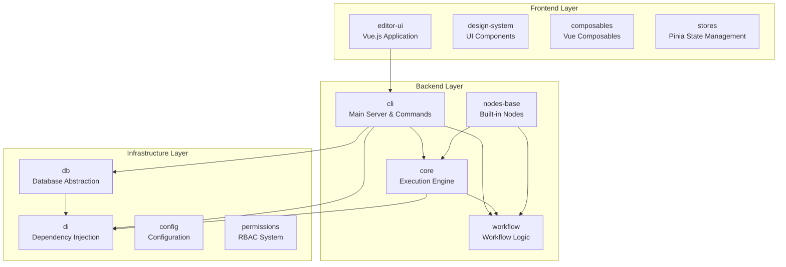
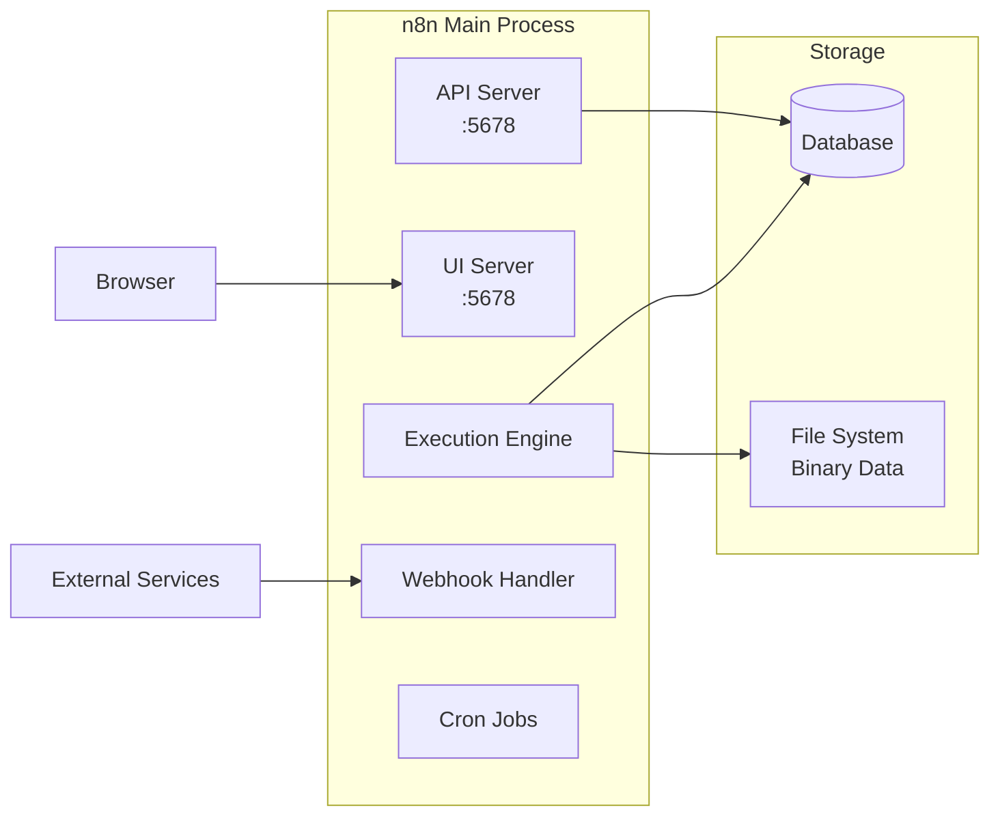
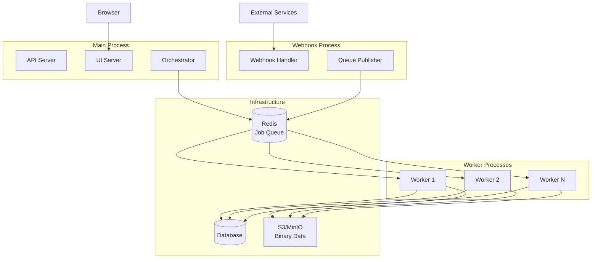
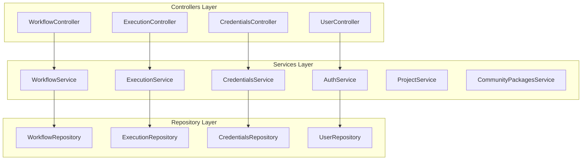
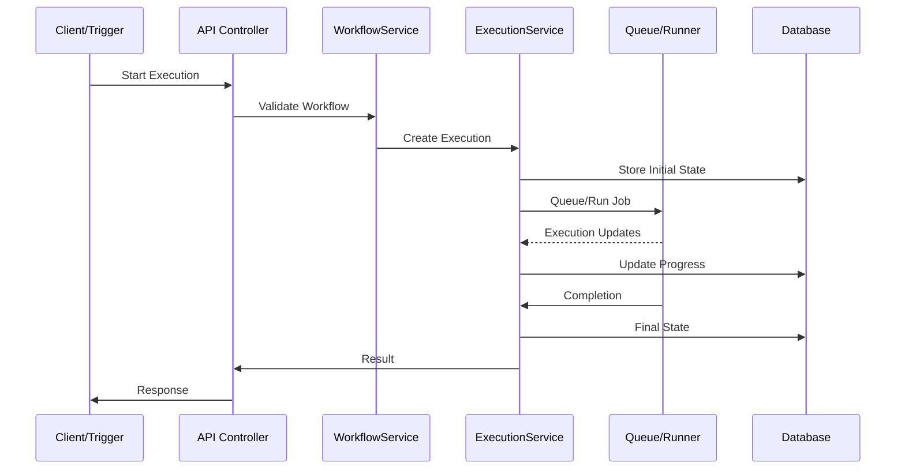

# n8n System Architecture Overview

## Introduction

n8n is a workflow automation platform built with a modular, scalable architecture. This document provides a high-level overview of the system components and their interactions.

## Core Architecture Principles

- **Modular Design**: Functionality is separated into focused packages
- **Dependency Injection**: Uses TypeDI-based container for loose coupling
- **Event-Driven**: Components communicate through event buses
- **Repository Pattern**: Clean separation between business logic and data access
- **Scalable Execution**: Supports both single-process and distributed queue modes

## System Components

### Core Packages

### Package Responsibilities

| Package | Purpose | Key Components |
|---------|---------|----------------|
| `cli` | Main server process, API endpoints, command-line interface | Server, Controllers, Services, Commands |
| `core` | Workflow execution engine, node handling, credentials | WorkflowExecute, NodeExecuteFunctions |
| `workflow` | Workflow data structures, expression evaluation | Workflow class, Expression parser |
| `nodes-base` | Collection of built-in nodes | 400+ node implementations |
| `editor-ui` | Web-based workflow editor | Vue.js components, stores, views |
| `db` | Database abstraction and repositories | TypeORM entities, repositories |

## Deployment Modes

n8n supports two primary deployment modes to accommodate different scale and reliability requirements:

### 1. Regular Mode (Default)

Single process handles all responsibilities:

**Characteristics:**
- Simple deployment
- All components in one process
- Suitable for small to medium workloads
- Port 5678 serves both API and UI

### 2. Queue Mode (Scalable)

Distributed architecture with specialized processes:

**Characteristics:**
- Horizontally scalable workers
- Fault tolerance
- Better resource utilization
- Suitable for high-volume production workloads

## Service Architecture

n8n uses a service-oriented architecture within the main process:

### Key Services

1. **WorkflowService**: Manages workflow CRUD operations, sharing, and activation
2. **ExecutionService**: Handles workflow execution lifecycle, recovery, and pruning
3. **CredentialsService**: Manages encrypted credentials and access control
4. **AuthService**: Handles authentication, JWT tokens, and session management
5. **ProjectService**: Manages team collaboration and resource organization

## Data Flow

### Execution Request Flow

## Configuration & Environment

n8n uses a layered configuration system:

1. **Default Config**: Built-in defaults in `@n8n/config`
2. **Environment Variables**: Override defaults (e.g., `N8N_*`)
3. **Config Files**: JSON/JS configuration files
4. **Runtime Config**: Dynamic settings stored in database

## Security Architecture

- **Authentication**: JWT-based with refresh tokens
- **Authorization**: RBAC with projects and resource permissions
- **Credentials**: AES-256 encryption at rest
- **API Security**: API key support, rate limiting
- **Network**: HTTPS support, webhook signature validation

## Monitoring & Observability

- **Logging**: Winston-based structured logging
- **Metrics**: Prometheus metrics endpoint
- **Health Checks**: `/healthz` endpoints for each process type
- **Event Bus**: Internal event system for audit and monitoring

## Next Steps

- [Execution Modes](./execution-modes.md) - Detailed explanation of each deployment mode
- [Data Flow](./data-flow.md) - How data moves through the system
- [Package Architecture](./package-architecture.md) - Deep dive into package structure