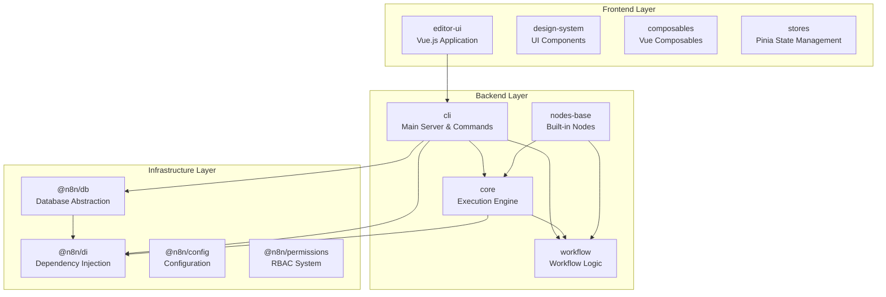
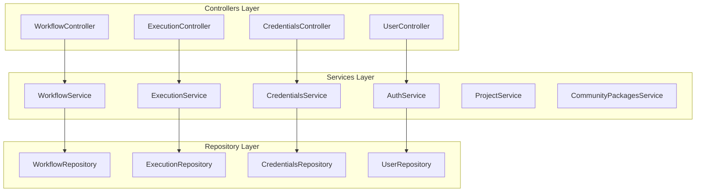
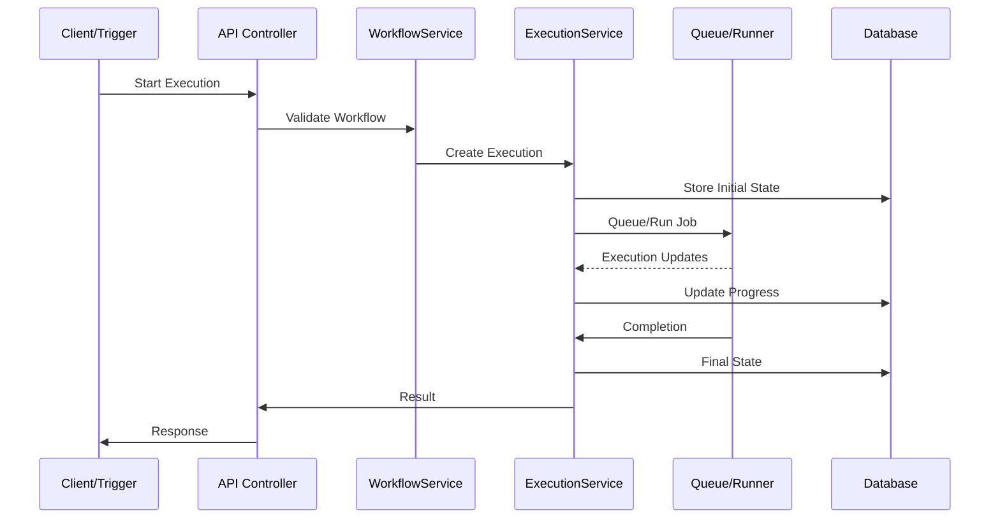

# n8n System Architecture Overview

> **⚠️ Notice**: This documentation was created by AI and not properly reviewed by the team yet.

## Introduction

n8n is a workflow automation platform built with a modular, scalable architecture. This document provides a high-level overview of the system components and their interactions.

## Core Architecture Principles

- **Modular Design**: Functionality is separated into focused packages
- **Dependency Injection**: Uses TypeDI-based container for loose coupling
- **Event-Driven**: Components communicate through event buses
- **Repository Pattern**: Clean separation between business logic and data access
- **Scalable Execution**: Supports both single-process and distributed queue modes

## System Components

### Core Packages

For detailed package responsibilities, dependencies, and architectural patterns, see [Package Architecture](./package-architecture.md).

## Deployment Modes

n8n supports two primary deployment modes to accommodate different scale and reliability requirements:

### 1. Regular Mode (Default)
A single process handles all responsibilities - API server, UI, execution engine, and webhook handling. This mode is ideal for personal use, small teams, and development environments where simplicity is preferred over scalability.

### 2. Queue Mode (Scalable)
A distributed architecture with specialized processes (main, worker, webhook) communicating via Redis. This mode enables horizontal scaling, fault tolerance, and high availability for production workloads.

For detailed architecture diagrams, configuration options, and migration guides between modes, see [Execution Modes](./execution-modes.md).

## Service Architecture

n8n uses a service-oriented architecture within the main process:

### Key Services

1. **WorkflowService**: Manages workflow CRUD operations, sharing, and activation
2. **ExecutionService**: Handles workflow execution lifecycle, recovery, and pruning
3. **CredentialsService**: Manages encrypted credentials and access control
4. **AuthService**: Handles authentication, JWT tokens, and session management
5. **ScalingService**: Manages queue mode operations and job distribution (Bull)
6. **CommunityPackagesService**: Handles external node package installation
7. **ProjectService**: Manages team collaboration and resource organization (Enterprise Edition)

## Data Flow

### Execution Request Flow

## Configuration & Environment

n8n uses a layered configuration system:

1. **Default Config**: Built-in defaults in `@n8n/config`
2. **Environment Variables**: Override defaults (e.g., `N8N_*`)
3. **Config Files**: JSON/JS configuration files
4. **Runtime Config**: Dynamic settings stored in database

## Security Architecture

- **Authentication**: JWT-based with refresh tokens (implemented in `AuthService`)
- **Authorization**: RBAC with projects and resource permissions via `@n8n/permissions`
- **Credentials**: AES-256-GCM encryption at rest (see `packages/core/src/Cipher.ts`)
- **API Security**: API key support, rate limiting
- **Network**: HTTPS support, webhook signature validation
- **Task Isolation**: Sandboxed execution for user code via `@n8n/task-runner`

## Monitoring & Observability

- **Logging**: Winston-based structured logging
- **Metrics**: Prometheus metrics endpoint
- **Health Checks**: `/healthz` and `/healthz/readiness` endpoints (implemented in `abstract-server.ts`)
- **Event Bus**: Internal event system for audit and monitoring

