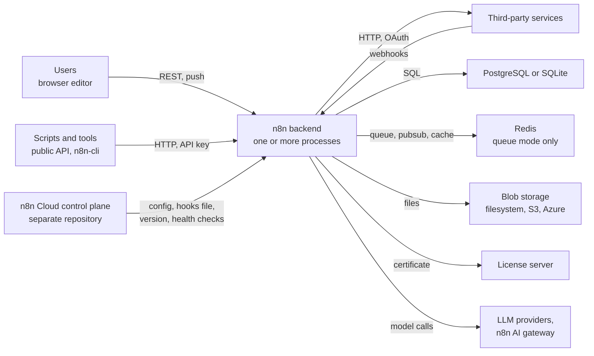

# Introduction

This document is for an experienced TypeScript engineer who joined n8n and will work on the backend. It assumes Node.js, Express, an ORM, and a monorepo are familiar. It assumes nothing about n8n. Its job is to give you a map, a reading order, the reasons behind the shapes you will see, and the direction the code is moving. It does not teach you the backend. You will learn that by working on it, and this document tells you where to look when you do.

It is not a setup guide. `CONTRIBUTING.md` is.

**How to read.** If you arrive with a question, jump to the reading plan and skip the order. To read these pages as a site with rendered diagrams, run `pnpm docs:backend`.

## What the backend is, in one paragraph

n8n is a workflow automation platform. A **workflow** is a graph of **nodes**. A **trigger** node starts a run when something happens: an HTTP request, a schedule, a message. Each following node receives **items**, JSON objects with optional binary references, and produces items. One run of a workflow is an **execution**, stored in the database with its status and its data. The backend is the Node.js server that stores workflows, registers triggers, runs executions, talks to the browser editor, and exposes a REST API. It is one npm package, `n8n`, built from a monorepo of about sixty packages, and the same code runs for a self-hoster on one machine and for n8n Cloud across thousands of instances.

## Vocabulary

Read these once. Every document in this folder uses them without definition. Renamed terms carry their old name so that you can read older code and tickets.

**Domain terms.**

- **Workflow**: a graph of nodes and connections, stored as JSON in `workflow_entity`. It has a **draft**, the latest saved version, and optionally a **published** version whose triggers are live.
- **Node**: one step in a workflow. Its **node type** is a class that ships in a package. `typeVersion` on a node pins which version of the class runs.
- **Item**: `{ json, binary?, pairedItem? }`. Nodes take items in and put items out.
- **Execution**: one run of one workflow. Status is `new`, `running`, `waiting`, `success`, `error`, `canceled`, `crashed`, or `unknown`.
- **Execution mode**: why the run started: `webhook`, `trigger`, `manual`, `integrated` (a sub-workflow), `error`, `retry`, `cli`, `evaluation`, `chat`, `agent`, `internal`.
- **Expression**: a parameter value starting with `=` that contains `{{ }}` JavaScript over the workflow data.
- **Pinned data**: fixed items that replace a node's real output during manual runs.
- **Production and manual execution**: a run started by a trigger in the world, or a run started from the editor's test buttons. Manual runs use pinned data and stream results to the browser.
- **Webhook, poller, trigger**: the three kinds of trigger node. A webhook answers HTTP. A poller asks a third party on a schedule. A trigger holds a live resource such as a connection or a timer. The Schedule Trigger is a trigger.
- **Waiting execution**: an execution paused on a Wait node, a form, or a send-and-wait, resumed later by time or by a resume URL.
- **Credential**: an encrypted secret a node uses, owned by a project, decrypted only at execution time.
- **Project**: the owner of workflows and credentials. Every user has a personal project. Team projects are licensed.
- **Scope and role**: a scope is `resource:operation`. A role bundles scopes. Users have a global role and, per project, a project role.

**Runtime terms.**

- **Regular mode and queue mode**: `EXECUTIONS_MODE`. Regular runs executions in the main process. Queue sends them as jobs through Redis to workers.
- **Main, worker, webhook process**: the three process roles. The main serves the editor, the API, and triggers. Workers run executions. Webhook processes receive production webhooks and enqueue. Type comes from the CLI command.
- **Multi-main**: several mains behind a load balancer, licensed. One is the **leader**, elected through a Redis key, and the others are **followers**. Leader-only duties include in-memory triggers, the wait tracker, pruning, and license renewal.
- **Task runner**: a separate process that runs Code node user code, JavaScript or Python, matched to requests by a **task broker** inside the main or worker.
- **Push**: the server-to-browser channel over WebSocket or SSE, keyed by a **push reference** per browser tab.
- **Pubsub**: Redis messages between processes in queue mode, on the channel `n8n.commands`.
- **Durable scheduler**: the flag-gated scheduler that stores upcoming runs in the database so that any main can fire them, replacing timers in the leader's memory.
- **Outbox**: a table of pending workflow publications that the leader drains, behind the publication service flag.
- **Instance**: one n8n deployment. On Cloud, one customer. Its **instance id** is fixed. A **host id** is per process.

**Code terms.**

- **Module**: a backend feature folder under `packages/cli/src/modules/<name>` with a `<name>.module.ts` entrypoint, loaded when enabled and initialized only when licensed. 36 exist.
- **Server subsystem**: a folder or a top-level file under `packages/cli/src` that predates modules and loads with the process. The inventory lists 79, of which 49 are folders.
- **`.ee`**: the suffix on Enterprise code. The license decides whether it runs. The suffix itself gates nothing.
- **License flag**: `feat:<name>` or `quota:<name>` in `@n8n/constants`, granted by the license certificate.
- **Lifecycle hooks**: callbacks around a workflow and around each node, where everything persistent happens.
- **Renamed**: data store became **data table**. Inbound secrets became **runtime credentials**. The distributed scheduler became the **durable scheduler**. Instance AI is **AI Assistant** in the UI. The AI gateway is **Gateway credits** in the UI.

## The system in context

*Everything inside the box is this repository. Redis is required in queue mode and optional otherwise. The control plane exists only on Cloud, and touches the backend through a small set of contracts described in [Cloud coupling points](cloud-coupling.md).*

## The inventory

The [inventory](inventory.md) is the generated, complete map: every package with its status label and its owning team, every module with its flag and its instance types, and every server subsystem by group. Read it once for shape, then use it as a lookup.

## The same code, many shapes

The backend runs in several shapes at once, and most confusion in the first weeks comes from not knowing which shape a piece of code assumes. Ask three questions of any code path. Which process runs it? Does it run on every main or only on the leader? Does it change on Cloud or under a license?

| Behavior | Regular, one main | Queue, main | Queue, worker | Webhook process | Multi-main leader | Multi-main follower |
|---|---|---|---|---|---|---|
| Serve the editor and the REST API | yes | yes | no | no | yes | yes |
| Receive production webhooks | yes | yes, unless disabled | no | yes | yes | yes |
| Receive test webhooks | yes | yes | no | no | yes | yes |
| Run executions | yes | manual only, unless offloaded | yes | no | manual only | manual only |
| Hold in-memory triggers, pollers, schedules | yes | yes | no | no | yes | no |
| Resume waiting executions by time | yes | yes | no | no | yes | no |
| Prune executions, renew the license | yes | yes | no | no | yes | no |

Two more columns cut across all of these. **License**: multi-main, S3 and Azure storage, SSO, log streaming, source control, and about fifty more features require a flag in the certificate. [Enterprise gating](enterprise-gating.md) explains the three layers. **Cloud**: `N8N_DEPLOYMENT_TYPE=cloud` changes a handful of behaviors, and the control plane sets about eighty environment variables. [Cloud coupling points](cloud-coupling.md) lists what you can break from here.

## What is moving

The backend is in the middle of several transitions. You will meet all of them in your first month. This table is the short form. [Legacy and new](legacy-and-new.md) is the long form, with the old shape and the new shape side by side.

| Transition | Stage as of September 2026 | Flag or signal |
|---|---|---|
| Expressions run in a V8 isolate | Shipped, default | `N8N_EXPRESSION_ENGINE=vm`, `legacy` opts out |
| Durable scheduler replaces leader timers | Shipped behind a flag, rolling out on Cloud | `N8N_SCHEDULER_ENABLED`, requires the publication service |
| Workflow publication through an outbox | Shipped behind a flag, rolling out on Cloud | `N8N_USE_WORKFLOW_PUBLICATION_SERVICE` |
| Engine 2.0, a new execution engine with its own database | Opt-in module, manual runs only, in development | `N8N_ENABLED_MODULES=engine-v2`, `settings.engineType` |

## The four toggle systems

Four different switches decide what an instance does: license flags from the certificate, module enablement from two environment variables, PostHog flags evaluated per user at runtime, and Cloud instance feature flags that the control plane maps to environment variables. Never set module variables by hand on a Cloud instance. [Cloud coupling points](cloud-coupling.md#the-four-toggle-systems) has the comparison table.

## The people

The **owning team** of a path is in `OWNERS` at the repository root, and the inventory shows it per package and module. Reviewers are requested from that team automatically. When you have a question that this folder does not answer, ask in your team channel or the backend-wide channel, and then propose the answer as a change to this folder.

## Reading plan

**Day 1, about an hour.** This page, then [Recurring patterns](patterns.md). Skim the [inventory](inventory.md) for shape. Run the local stack from `CONTRIBUTING.md` and, if you can, the multi-main stack from `packages/testing/containers/README.md`, so that the process roles above are real.

**Week 1, about two and a half hours.** Read in this order.

1. [Life of a workflow publish](life-of-a-workflow-publish.md). An HTTP request through the controller, the service, and trigger registration, with the multi-main and publication service variants.
2. [Life of a webhook execution](life-of-a-webhook-execution.md). A production execution through lookup, the engine, hooks, persistence, and the response, with the queue mode and waiting variants.
3. [Legacy and new](legacy-and-new.md). Each transition, old shape and new shape, and where to put new code today.
4. [Cloud coupling points](cloud-coupling.md) and [Enterprise gating](enterprise-gating.md). The two homes of the code, and the three layers of licensing.

**Month 1, on demand.** One page per subsystem in `subsystems/`, each readable in five to eight minutes. Each page starts with a line that says when to read it. They are lookups, not lessons, so they carry no self-check. Start with the ones your team owns.

## Where the existing documents are

Most of what a joiner needs already exists, scattered. This folder does not repeat it. It points at it.

| Document | Read this when |
|---|---|
| `AGENTS.md` at the root | Before your first PR. Conventions, error classes, the TypeORM boundary, security hygiene, PR titles |
| `packages/cli/AGENTS.md`, `packages/@n8n/db/AGENTS.md` | You write a query or a transaction |
| `scripts/backend-module/backend-module-guide.md` | You create a module. Note that it predates the `nodeLoaders()` and `commands()` methods |
| `.github/DEVELOPING_V3.md` | You touch anything that changes behavior for users |
| `.agents/skills/` | You do a recurring task: protect endpoints, write a migration, add telemetry, add a public API endpoint |
| `.agents/review-rules/` | You want to know what the automated reviewer enforces |
| `docs/db.md` and `docs/generated/` | You need the schema rule or a table's columns |
| docs.n8n.io, hosting section | You want the operator's view of queue mode, scaling, task runners, and environment variables |

## How this folder stays current

When you find something wrong or stale here, fix it. That is a good first PR, and every joiner who did it made the next one's first week shorter.

## Self-check

You can answer these from this page. If one stays open, read the section again.

1. Name the three process roles and say which one holds in-memory triggers.
2. A workflow has a draft and a published version. What is the difference, and which one has live triggers?
3. What is the difference between a webhook, a poller, and a trigger node?
4. Where do you find the owning team of a package or a module?
5. Which four switches can decide whether a feature is on, and which one must never be set by hand on Cloud?
6. What does the `.ee` suffix promise, and what does it not do?
