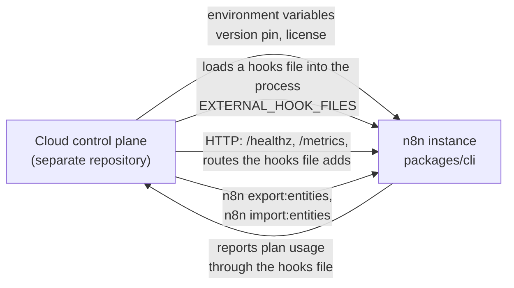

# Cloud coupling points

The same n8n backend runs in two very different homes. A **self-hoster** installs n8n, sets environment variables, chooses the version, and upgrades when they decide to. **n8n Cloud** runs one n8n instance per customer, sets the environment variables from the customer's plan, pins the version, and upgrades on a schedule. The **Cloud control plane** that does this lives in a separate, private repository. You will not work in it. You can break it from here.

This document names the places where the backend and Cloud touch. It exists so that you recognize a coupling point when you edit near one. The design rule is short. **A backend change must not break an instance that Cloud manages, and Cloud manages instances through a small set of contracts that the backend must keep.**

## How Cloud drives an instance



*Cloud never edits the database of an instance directly for normal operation. It configures, injects, calls, and runs CLI commands. Every arrow is a contract.*

Cloud does four things to an instance.

- **It configures.** About eighty environment variables per instance come from the plan and the version. `N8N_DEPLOYMENT_TYPE=cloud` is one of them.
- **It injects.** A compiled hooks file is mounted into the container and loaded through `EXTERNAL_HOOK_FILES`. That file registers external hooks and mounts extra HTTP routes on the Express app. It is how plan limits, usage reporting, and support tooling reach the instance.
- **It calls.** Kubernetes health checks call `/healthz` and `/healthz/readiness`. Monitoring scrapes `/metrics`. Support tooling calls the routes the hooks file added.
- **It upgrades.** Versions come from the npm dist-tags `stable` and `beta`. Each instance is pinned. An upgrade is a container restart with a new image. Database migrations run inside n8n at boot. Cloud runs no migration itself.

## The coupling points, from strongest to weakest

### 1. External hooks

`ExternalHooks` in `packages/cli/src/external-hooks.ts` loads the files named in `EXTERNAL_HOOK_FILES` and runs registered functions at named moments. The hook names and their argument shapes are a contract. The Cloud hooks file registers, among others, `n8n.ready`, `workflow.activate`, `workflow.postExecute`, `user.profile.beforeUpdate`, and `oauth2.callback`.

One detail of `run` matters for Cloud. When a hook throws, the original error is rethrown so that the hook decides what the user sees:

```ts
			} catch (cause) {
				this.logger.error(`There was a problem running hook "${hookName}"`);

				const error = new UnexpectedError(`External hook "${hookName}" failed`, { cause });
				this.errorReporter.error(error, { level: 'fatal' });

				// Throw original error, so that hooks control the error returned to use
				// For example on Cloud we return upgrade message when user reaches max executions or activations
				throw cause;
			}
```

This is how a plan limit becomes an upgrade message in the editor. If you wrap or replace that error, the message disappears.

**What breaks it.** Renaming a hook, changing the arguments a hook receives, or moving where a hook fires. The `n8n.ready` hook receives the server, and the hooks file uses the Express app on it to mount routes. Replacing that HTTP layer breaks every route Cloud added.

### 2. Compiled file paths and `HooksService`

The hooks file is compiled against n8n's published package. It imports compiled files by path, such as `n8n/dist/auth/jwt`, `n8n/dist/services/hooks.service`, `n8n/dist/license`, `n8n/dist/concurrency/concurrency-control.service`, and `n8n/dist/events/event.service`. Moving or renaming one of those source files breaks every Cloud instance at startup, with the error "Problem loading external hook file".

`HooksService` in `packages/cli/src/services/hooks.service.ts` exists for this reason. It is a stable surface the hooks file calls into, and its header says so:

```ts
 * DO NOT DELETE or RENAME any of the methods without making sure this is not used in cloud BE hooks.
 */
@Service()
export class HooksService {
```

The same marker sits on a deprecated function in `packages/cli/src/auth/jwt.ts`:

```ts
// This method is still used by cloud hooks.
// DO NOT DELETE until the hooks have been updated
/** @deprecated Use `AuthService` instead */
export function issueCookie(res: Response, user: User) {
	return Container.get(AuthService).issueCookie(res, user, user.mfaEnabled);
}
```

**What breaks it.** Deleting a method on `HooksService`, renaming a file the hooks bundle imports, or changing the npm package layout of `n8n`.

### 3. The legacy `convict` configuration

Four of the five settings left in `packages/cli/src/config/schema.ts` exist because the hooks file still reads them. The fifth, `authenticationMethod`, is internal state. See [Patterns](patterns.md#2-configuration) for the excerpt. `userManagement.isInstanceOwnerSetUp` and `endpoints.rest` carry explicit "do not remove" comments.

### 4. Environment variable names

Cloud sets environment variables by name. A renamed variable is an unannounced behavior change on every Cloud instance until the control plane catches up. The right way to retire a variable is `DeprecationService` in `packages/cli/src/deprecation/deprecation.service.ts`, which warns at boot and points at the replacement, while the old name keeps working for a release.

The variables Cloud sets fall into these groups.

| Group | Examples |
|---|---|
| Identity and plan | `N8N_DEPLOYMENT_TYPE`, the webhook URL, proxy hops |
| Hooks | `EXTERNAL_HOOK_FILES` |
| Licensing | `N8N_LICENSE_CERT`, or an activation key with a tenant id |
| Execution limits and pruning | `EXECUTIONS_*`, `N8N_CONCURRENCY_PRODUCTION_LIMIT` |
| Storage and database | `DB_*`, `N8N_DEFAULT_BINARY_DATA_MODE`, `N8N_EXECUTION_DATA_STORAGE_MODE` |
| Queue mode | `EXECUTIONS_MODE`, `QUEUE_BULL_REDIS_*`, `N8N_MULTI_MAIN_SETUP_ENABLED` |
| Security hardening | `NODES_EXCLUDE`, `N8N_BLOCK_ENV_ACCESS_IN_NODE`, `N8N_RESTRICT_FILE_ACCESS_TO` |
| Product surface | `N8N_HIDE_USAGE_PAGE`, `N8N_DIAGNOSTICS_*`, the version notification endpoints |
| Modules and flags | `N8N_ENABLED_MODULES`, `N8N_DISABLED_MODULES`, `N8N_SCHEDULER_ENABLED`, `N8N_USE_WORKFLOW_PUBLICATION_SERVICE`, `N8N_EXPRESSION_ENGINE` |

Cloud configures instances per **version band**, a range of n8n versions that receive the same configuration. When a default changes in n8n, the band boundary moves on the Cloud side.

### 5. Module names and defaults

Cloud enables and disables modules per version band through `N8N_ENABLED_MODULES` and `N8N_DISABLED_MODULES`. Two failures are fatal at boot. A name in both lists throws `ModuleConfusionError`. A name that is not in `MODULE_NAMES` throws `UnknownModuleError`. Renaming a module, or moving a module from opt-in to default, changes what a given version band does on Cloud. One version boundary, where Instance AI became a default module, is encoded on the Cloud side in three places. Treat `MODULE_NAMES` and `defaultModules` as public contract.

### 6. License feature keys

Cloud maps a plan to a set of `feat:*` strings and quotas from `packages/@n8n/constants/src/index.ts`. It also reads the boolean methods on `LicenseState` to build targeting properties for product analytics. Renaming a flag or a method drops a property without an error. See [Enterprise gating](enterprise-gating.md).

### 7. Health and metrics endpoints

`/healthz` answers liveness on mains and webhook processes, and on workers when `QUEUE_HEALTH_CHECK_ACTIVE` is set. `/healthz/readiness` answers readiness, which requires a connected and migrated database and a server that has marked itself ready. `/metrics` on the main port serves Prometheus metrics and is scraped fleet-wide. Kubernetes health checks, support tooling, and the sleep and wake logic for idle instances all depend on these paths and their status codes.

### 8. CLI commands

`n8n export:entities` and `n8n import:entities` move a whole database between deployment shapes, for example from SQLite to PostgreSQL. Cloud runs them with `kubectl exec`. Their flags and their output layout are a contract.

### 9. Table names

Backup tooling for SQLite instances copies specific tables by name: workflows, credentials, users, projects, annotations, and the per-table data table storage. It never copies execution tables. A migration that renames one of those tables breaks backups without an error in n8n. Ops tooling also counts `execution_entity` rows by name. The migration guidance in `.agents/skills/db-migrations/SKILL.md` already asks for one release between stopping writes and dropping a column. Renames of the tables above need coordination with the Cloud Platform team.

### 10. Upgrades and migrations

Cloud upgrades instances through a queue, restarts the container, and treats a restart that exceeds a timeout as failed. Migrations run at that boot. A slow migration on a large instance presents as a failed upgrade. Two consequences for you. Migrations must be fast and batched for large tables. Migrations must be backward compatible for one release, because a rollback restarts the previous image against the migrated schema.

## What `N8N_DEPLOYMENT_TYPE=cloud` changes inside n8n

The flag is one string in `packages/@n8n/config/src/configs/deployment.config.ts`:

```ts
@Config
export class DeploymentConfig {
	/** Deployment type identifier (for example, `default`, `cloud`). Used for telemetry and feature behavior. */
	@Env('N8N_DEPLOYMENT_TYPE')
	type: string = 'default';
}
```

The backend branches on it in a handful of places. Telemetry stamps events with the deployment type and, on Cloud, identifies the user through the id the hooks file injects. Concurrency limit telemetry is reported on Cloud only. The instance section of the security audit is skipped on Cloud. Two v2 breaking-change rules about file permissions and the runner image are suppressed on Cloud because Cloud controls both. Task runner error messages differ because a self-hoster can act on them and a Cloud user cannot. The Instance AI module marks its settings as managed by Cloud and rejects edits to them. The frontend hides the SAML settings route, shows the admin panel link, and disables session recording only on Cloud.

The list is short on purpose. Almost everything else is the same code. When you add a branch on `deployment.type`, ask whether a license flag or a configuration value would express the same intent for a self-hoster too.

## The four toggle systems

New joiners confuse four different switches. They differ in where they are defined, who evaluates them, and when they change.

| System | Defined in | Evaluated by | Changes when | On Cloud |
|---|---|---|---|---|
| **License flags** `feat:*` and `quota:*` | `packages/@n8n/constants/src/index.ts` | `LicenseState`, `@Licensed`, module `licenseFlag` | The license certificate renews or a plan changes | The plan decides the flags |
| **Module enablement** | `MODULE_NAMES` and `defaultModules` in `packages/@n8n/backend-common/src/modules/` | `ModuleRegistry` at boot | `N8N_ENABLED_MODULES` and `N8N_DISABLED_MODULES` change, then restart | Set per version band by the control plane. Never edit by hand on a Cloud instance |
| **PostHog feature flags** | The PostHog project, keys as constants in `@n8n/api-types` for backend flags and in the editor's `experiments.ts` for frontend experiments | `PostHogClient` at runtime, per user | Rollout percentage changes in PostHog, at once | Shared with self-hosted instances unless the flag filters on the deployment type |
| **Cloud instance feature flags** | The control plane repository | The control plane, at signup, plan change, or version change | Only when the instance configuration is rebuilt | Each flag maps to environment variables on the instance |

The fourth system is invisible from this repository. It is why a Cloud rollout percentage can read as "eligible" for far more instances than are "enabled": an instance picks up a new flag only when its configuration is rebuilt. An engineer who sets `N8N_ENABLED_MODULES` by hand on a Cloud instance bypasses that system, and one such edit in August 2026 stopped an instance from booting.

## Self-hosters

Everything above is about the managed home. The self-hosted home has no hooks file, no control plane, and no version pin. The operator sets the environment variables, chooses the database, picks the version, and reads the breaking-change report in the settings before a major upgrade. The `breaking-changes` module in `packages/cli/src/modules/breaking-changes/` exists for them, as does `DeprecationService`. The design principle in `AGENTS.md` exists for them too: security must not add friction to the common case, because the common case is a person running one instance.

When you weigh a default, weigh it for both homes. A default that Cloud overrides with an environment variable is a default that every self-hoster lives with.

## When you change something near a coupling point

1. Search for the symbol or the environment variable in the comments of `packages/cli/src`. The "cloud hooks" markers are your first signal.
2. Keep the old name working for one release. Use `DeprecationService` for variables. Keep a re-export for moved files that the hooks bundle imports.
3. Keep `/healthz`, `/healthz/readiness`, and `/metrics` stable in path and status semantics.
4. Keep migrations fast and reversible for one release.
5. Tell the Cloud Platform team before you rename a module, a license flag, a table the backup reads, or a `HooksService` method.

## Self-check

1. A Cloud instance fails at startup with "Problem loading external hook file" after your refactor. What did you most likely change?
2. Why does `ExternalHooks.run` rethrow the original error instead of its own?
3. Which two conditions make module configuration fatal at boot?
4. A PostHog flag at 50 percent reaches self-hosted instances. Why, and what prevents it?
5. Why must a migration stay backward compatible for one release on Cloud?
6. Name three behaviors the backend changes when `N8N_DEPLOYMENT_TYPE` is `cloud`.
