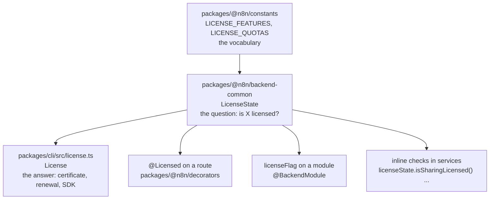

# Enterprise gating

n8n ships one codebase under two licenses. Everything under `packages/` is available to every install. Files and folders with the `.ee` suffix fall under the Enterprise license in `LICENSE_EE.md` and only do their work when the instance holds a license that grants the matching feature. The code for a paid feature is on your disk. The license decides whether it runs.

This document explains the convention, the three gating layers, and how to run paid features on your own machine. It does not list every feature. The flags are in one file, and the inventory marks each module's flag.

## The `.ee` convention

A path ending in `.ee` marks Enterprise code. Whole modules carry it, such as `packages/cli/src/modules/ldap.ee/`. Folders inside `packages/cli/src` carry it, such as `environments.ee/` and `permissions.ee/`. Single files carry it, such as `workflow.service.ee.ts` next to `workflow.service.ts`. A whole package can carry it, `packages/@n8n/ai-workflow-builder.ee`.

The suffix is a statement about licensing, not about loading. An `.ee` file is compiled and shipped like any other. The module loader even hides the suffix: it looks for `<name>/<name>.module.js` and falls back to `<name>.ee/<name>.module.js`, so the module name `ldap` finds the folder `ldap.ee`. What the suffix does is tell a reader and a reviewer that the code must not run without a license check somewhere on its path.

## The three layers

Gating happens at three levels, and a feature usually uses two of them.



*The constants name the features. `LicenseState` answers questions about them. `License` holds the certificate and talks to the license server. Routes, modules, and services ask `LicenseState`, never `License`.*

**Layer 1, the vocabulary.** `LICENSE_FEATURES` and `LICENSE_QUOTAS` in `packages/@n8n/constants/src/index.ts` are the only place feature strings are defined:

```ts
export const LICENSE_FEATURES = {
	SHARING: 'feat:sharing',
	LDAP: 'feat:ldap',
	NODE_TYPE_POLICIES: 'feat:nodeTypePolicies',
	SAML: 'feat:saml',
	OIDC: 'feat:oidc',
	MFA_ENFORCEMENT: 'feat:mfaEnforcement',
	LOG_STREAMING: 'feat:logStreaming',
	ADVANCED_EXECUTION_FILTERS: 'feat:advancedExecutionFilters',
	VARIABLES: 'feat:variables',
	SOURCE_CONTROL: 'feat:sourceControl',
	GIT_CONNECTIONS: 'feat:gitConnections',
	API_DISABLED: 'feat:apiDisabled',
```

A boolean feature is `feat:<name>`. A numeric limit is `quota:<name>`, such as `quota:users` or `quota:activeWorkflows`. As of September 2026 there are 46 feature flags and a dozen quotas. These strings are a contract with the license server and with n8n Cloud, which maps plans to them. Rename one and both break. See [Cloud coupling points](cloud-coupling.md#6-license-feature-keys).

**Layer 2, the question.** `LicenseState` in `packages/@n8n/backend-common/src/license-state.ts` is the injectable read side. It has a generic method and a named getter per feature:

```ts
	isLicensed(feature: BooleanLicenseFeature | BooleanLicenseFeature[]) {
		this.assertProvider();

		if (typeof feature === 'string') return this.licenseProvider.isLicensed(feature);

		for (const featureName of feature) {
			if (this.licenseProvider.isLicensed(featureName)) {
				return true;
			}
```

Notice the array form. It means "any of these", which the provisioning module uses because it serves SAML, OIDC, and LDAP alike. `LicenseState` lives in `backend-common`, not in `cli`, so that extracted packages can ask about licensing without depending on the server.

**Layer 3, the answer.** `License` in `packages/cli/src/license.ts` wraps the license SDK, holds the certificate, renews it, and reacts to leader changes and to the `reload-license` pubsub command. It implements the provider that `LicenseState` asks. Only the leader, or a CLI command, renews. Followers learn about a reload through pubsub. The certificate itself is stored in the `settings` table so that a restart does not need the license server, unless `N8N_LICENSE_CERT` supplies it directly.

## Where a check goes

Three places, chosen by what you gate.

**A route.** Put `@Licensed('feat:...')` between the route decorator and the scope decorator. The controller registry turns it into a middleware that answers 403 with "Plan lacks license for this feature". The decorator in `packages/@n8n/decorators/src/controller/licensed.ts` only records metadata:

```ts
export const Licensed =
	(licenseFeature: BooleanLicenseFeature): MethodDecorator =>
	(target, handlerName) => {
		const routeMetadata = Container.get(ControllerRegistryMetadata).getRouteMetadata(
			target.constructor as Controller,
			String(handlerName),
		);
		routeMetadata.licenseFeature = licenseFeature;
	};
```

**A module.** Put `licenseFlag` in the `@BackendModule` options. `ModuleRegistry.initModules` skips the module's `init()` on an unlicensed instance, so none of its controllers or hooks exist there. Its entities were collected earlier, so its tables do exist. The SAML module in `packages/cli/src/modules/sso-saml/sso-saml.module.ts` is the smallest example:

```ts
@BackendModule({ name: 'sso-saml', licenseFlag: 'feat:saml', instanceTypes: ['main'] })
```

A module that is partly free and partly paid does not use `licenseFlag`. It gates the paid routes with `@Licensed` and keeps the rest open. The insights module collects data for everyone and gates the dashboard routes and the hourly granularity.

**A service.** When the decision is not per route, call a named getter on `LicenseState` inside the service and throw `FeatureNotLicensedError` or degrade. Variables do this for the maximum count. Redaction does this at read time, because the module is on by default and the license decides whether it acts.

The review rule in `.agents/review-rules/backend/license-enforcement.md` states the order and the separation: a scope decorator is a permission check, not a license check, and the `@Licensed` flag must be one of the `LICENSE_FEATURES` values.

## Quotas

A quota is a number, not a boolean. `LicenseState` has getters such as `getMaxUsers()` and `getMaxActiveWorkflows()`. The code compares against them at the point of creation or activation. An unlimited quota is `-1`. Without a certificate the SDK returns nothing, and each getter falls back to a default written next to it: unlimited for users and active workflows, zero for team projects and AI credits, fixed numbers for insights. That is why a fresh install has limits without any certificate.

## Community, trial or plan, and Cloud

Three shapes of license reach the backend. A **community** install has no certificate and receives the fallback defaults in `LicenseState`. A **trial or plan** certificate comes from an activation key and a tenant id, set through `N8N_LICENSE_ACTIVATION_KEY` and `N8N_LICENSE_TENANT_ID`, and renews against the license server. On Cloud, the control plane passes a certificate directly. The frontend receives the resolved flags through the settings endpoint, so the editor hides what the instance cannot do. The backend still checks. Never trust that a hidden button means an unreachable route.

## Running paid features locally

Every new backend engineer asks this in the first month. The Notion page "Testing Enterprise Features in n8n Self-Hosted" holds the activation key and the tenant id for development. Set both variables, start n8n, and the instance pulls a certificate. When a local certificate expires, run `n8n license:clear` and start again. One more command, `n8n license:info`, prints what the instance holds.

Integration tests do not need a certificate. `setupTestServer` mocks the license, and the test can enable features with `testServer.license.enable('feat:...')`. See [Patterns](patterns.md#16-testing).

## Adding a feature flag

1. Add the constant to `LICENSE_FEATURES` in `packages/@n8n/constants/src/index.ts`.
2. Add a named getter to `LicenseState` if services will ask.
3. Gate the surface: `licenseFlag` on the module, or `@Licensed` on the routes, or a service check.
4. Expose the flag to the frontend through `FrontendService` if the editor must hide something.
5. Coordinate with the license server owners and the Cloud Platform team, because a plan must grant the new flag before anyone can use the feature.

## Self-check

1. Why does `LicenseState` live in `backend-common` and `License` in `cli`?
2. The provisioning module declares three flags. What does the array mean?
3. A module is on by default but only acts under a license. Which layer does it use, and why not `licenseFlag`?
4. Which process renews the certificate in multi-main, and how do the others learn about it?
5. The editor hides a button. Is the route protected?
