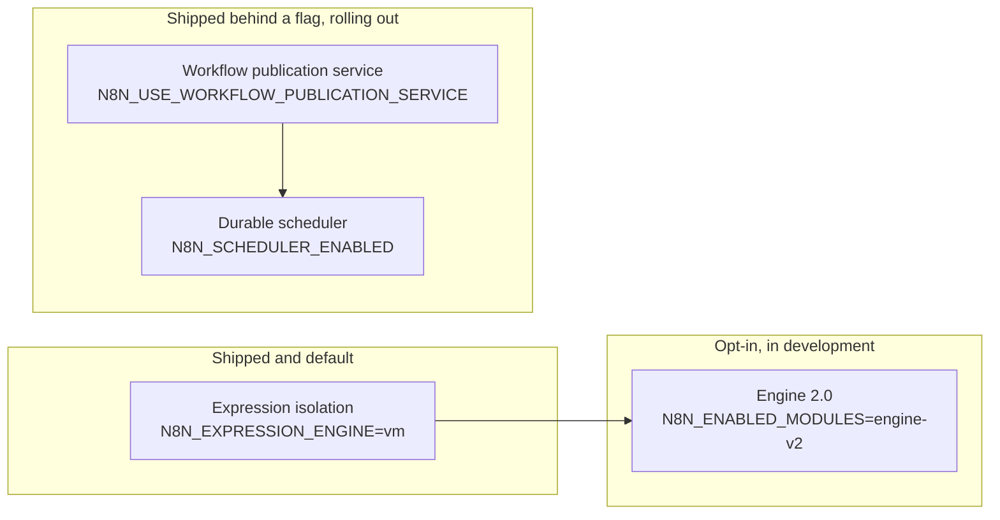

# Legacy and new

The n8n backend is ten years old and in the middle of several transitions at once. You will open two files that do the same job in different ways, and both will be correct for their time. This document names each transition, shows the old shape and the new shape side by side, and says where to put new code today. Dates are as of September 2026. The status of each item changes monthly, and the links to Linear and Notion carry the current state.

Two kinds of transition are in progress. **Structural migrations** change how code is organized without changing what n8n does. **Runtime transitions** change how n8n works at run time, each behind a flag. A third item, the v3 release, is the date on which several of them complete.

## Status labels

The [inventory](inventory.md) marks every package, module, and subsystem with one label. The labels tell you what to do when you touch the code.

| Label | Meaning | What you do |
|---|---|---|
| `extracted` | A focused package or module, the target shape | Add features here |
| `legacy-active` | Old structure that still receives features | Extend with care. Move code out when you touch it |
| `legacy-frozen` | Old structure with an announced successor | Do not add features. Point at the successor |
| `experimental` | Behind a flag or opt-in, not on by default | Read the flag before you assume it runs |
| `deprecated` | Marked deprecated in code | Do not use |

## Structural migrations

### Features into modules

| | Legacy | Now |
|---|---|---|
| Where a feature lives | A folder under `packages/cli/src`, wired by hand in `server.ts` and `start.ts` | A folder under `packages/cli/src/modules/<name>` with a `<name>.module.ts` entrypoint |
| How it loads | Always, with the process | Only when enabled and licensed, through `ModuleRegistry` |
| How it registers entities and routes | Imported into the global entity list and `server.ts` | `entities()` and dynamic imports in `init()` |
| Cost when unused | Paid by every instance | Zero, nothing is imported |

The module pattern is 17 months old. The first module was insights, in March 2025. Since then 36 modules exist, and 19 of them arrived in the six months before this document. January 2026 moved the first legacy features into modules: source control, log streaming, SAML, OIDC, and LDAP. The inventory still lists 79 server subsystems in `packages/cli/src` that are not modules, 49 of them folders. Two enterprise features wait in `environments.ee` and `evaluation.ee`.

**The path.** `scripts/backend-module/backend-module-guide.md` is the how-to. `pnpm setup-backend-module` scaffolds one. New features are modules. When you touch a legacy subsystem, ask whether it can become one.

**Where modules will live next.** `packages/modules/` holds frontend halves today, and its `packages/modules/README.md` reserves a path for the backend half:

```md
`<name>/backend` is a reserved path rather than a workspace package — the backend runtime discovers
modules under `packages/cli/src/modules/<name>`. The extra nesting level is what lets both halves of
a module sit together later.
```

The Notion pain point inventory for modularity calls `packages/cli` a "god package" that holds about 90 percent of the backend, and lists slow onboarding as pain point number eight. The Linear initiative "Monorepo Modularization" under "Agent-Centric Development Cycle" tracks the next steps.

### TypeORM into the persistence layer

| | Legacy | Now |
|---|---|---|
| Who imports `@n8n/typeorm` | Services, controllers, anything | Repositories in `@n8n/db` or a module's `database/` folder |
| How a service queries | `repository.find({ where: { id: In(ids) } })` | `repository.findMany(ids)`, a use-case-named method |
| Transactions | `repository.manager.transaction(...)` in the service | `txRunner.run(ctx, ...)` with `OperationContext` threaded to repositories |

The lint rule `misplaced-n8n-typeorm-import` fails CI on a new import. Existing leaks sit in two shrink-only allowlists in `packages/cli/eslint.config.mjs`. Every such allowlist in that file carries the same instruction:

```js
	{
		// Ratchet allowlist: legacy `export =` handler tuples pending migration to
		// `@PublicApiController` classes (API-70). NEVER add to this list — a new tuple handler
		// must fail CI. Entries are removed as each handler becomes a controller.
```

That excerpt is the public API allowlist. The two TypeORM allowlists further down the same file read the same way. The Linear project "Corral TypeORM to @n8n/db" tracks the backlog. Its second phase started in August 2026. See [Patterns](patterns.md#6-services-repositories-and-the-typeorm-boundary) for the target shape.

### Outbound HTTP into one package

| | Legacy | Now |
|---|---|---|
| Where network code lives | Scattered across `packages/core` and several packages | `@n8n/backend-network`, one entry point `OutboundHttp` |
| Proxy handling and the SSRF guard | Per call site | One place, one policy |

The package README states the intent: to be "the single home for n8n's backend outbound-network concerns". June 2026 moved the proxy and transport code out of `core` and the SSRF protection into the package. A lint rule keeps new HTTP clients out of other packages. The Linear project "Backend network consolidation" tracks the rest. Egress protection is still off by default. The Core Platform roadmap lists "default-on egress protection" as a future step.

### One error hierarchy

| | Legacy | Now |
|---|---|---|
| Class | `ApplicationError` | `UserError`, `OperationalError`, `UnexpectedError` by cause |
| Level and reporting | Set by hand | Defaulted by class |

The old class in `packages/@n8n/errors/src/application.error.ts` is a shim, and its header says why it still exists:

```ts
/**
 * Deprecated error class kept only for backwards compatibility
 * for community nodes.
 *
 * @deprecated Use `UserError`, `OperationalError` or `UnexpectedError` instead
 */
export class ApplicationError extends Error {
```

The lint rule `no-application-error` fails on a new use. The Linear project for this migration is complete. What remains is the shim itself, kept for community nodes.

### Three smaller ones

**Configuration.** `convict` in `packages/cli/src/config` gave way to `@n8n/config` classes. Five settings remain in the old schema. Four exist because the Cloud hooks file reads them, and one is internal state. Do not add to it.

**Jest to Vitest.** The `cli` package moved in June 2026. Root `AGENTS.md` explains the decorator-aware Vitest preset that backend packages must use.

**Public API handlers to controllers.** Legacy handler modules validated by an OpenAPI validator give way to `@PublicApiController` classes. New endpoints are controllers. The lint rule `require-public-api-controller` rejects new handlers. The skill `.agents/skills/public-api/SKILL.md` is the how-to.

## Runtime transitions

Four transitions change how n8n runs. They are at three different stages, which is the most useful thing to know about them.



*Left to right is also the order in which they started. The arrows are dependencies. The durable scheduler depends on the publication service. Engine 2.0 depends on isolated expressions.*

### Expressions

| | Legacy | Now |
|---|---|---|
| Where an expression runs | In the main process, through a template compiler | In a V8 isolate with a memory limit and a timeout |
| Data access | Direct object access | Lazy proxies that fetch one path at a time |
| Package | `packages/workflow/src/expression.ts`, with `@n8n/tournament` behind `expression-evaluator-proxy.ts` | `@n8n/expression-runtime` |

**Was.** Expressions ran in process, inside a sandbox that the team had to keep patching. Isolation moved to a separate V8 runtime. **Is.** The `vm` engine is the default since August 2026. `N8N_EXPRESSION_ENGINE=legacy` opts out. **Goes.** The config comment marks legacy as "soon to be deprecated". A QuickJS engine exists as an experiment. The browser still runs the legacy path for previews, because the isolate is Node only. The config class in `packages/@n8n/config/src/configs/expression-engine.config.ts` names the three engines:

```ts
	/**
	 * Which expression engine to use.
	 * - `vm` (default) runs expressions in a V8 isolate (isolated-vm).
	 * - `legacy` runs expressions without isolation. Less secure and soon to be deprecated.
	 * - `quickjs` runs expressions in a QuickJS WASM sandbox. Experimental.
	 */
	@Env('N8N_EXPRESSION_ENGINE', expressionEngineSchema)
	engine: 'legacy' | 'vm' | 'quickjs' = 'vm';
```

Read `packages/@n8n/expression-runtime/ARCHITECTURE.md`. It is the best written architecture document in the repo. The subsystem page is [Expressions](subsystems/expressions.md).

### Scheduling

| | Legacy | Now, behind the flag |
|---|---|---|
| Where a schedule lives | A `cron` timer in the leader's memory | Rows in `scheduled_job` and `scheduled_task` |
| Who fires it | The leader only | Any main, through a claim with a lease |
| A missed fire | Lost | Handled by a misfire policy |
| Package | `ScheduledTaskManager` in `packages/core` | `@n8n/scheduler`, host in `packages/cli/src/scheduling` |

**Was.** Four scheduling mechanisms existed: the Schedule Trigger, pollers, thirteen system task timers, and the wait tracker. All ran on the leader, and most in memory. **Is.** `@n8n/scheduler` landed on 2026-06-30 and gained `N8N_SCHEDULER_ENABLED` the next day, off by default, and is rolling out on Cloud. It requires the workflow publication service. The Schedule Trigger and pollers can run on it. Wait node resumes still use `WaitTracker`. **Goes.** System tasks move onto it next. The lint rule `no-on-leader-takeover` pushes every new periodic leader job to a `@SystemTask()` class. The goal, per the Notion page "Leaderless multi-main", is a multi-main deployment with no leader at all. Read `packages/@n8n/scheduler/README.md` and the subsystem page [Scheduling and waiting](subsystems/scheduling-and-waiting.md).

### Publication

| | Legacy | Now, behind the flag |
|---|---|---|
| Activation | Synchronous, in the HTTP request, through `ActiveWorkflowManager` | An outbox record, drained by the leader |
| Re-publish | Remove every trigger, add every trigger | Diff the trigger nodes, touch only the changed ones |
| Partial failure | Roll the whole row back | Leave the version published with per-node status |

**Was.** Activation ran inside the HTTP request through `ActiveWorkflowManager`, with a compensating rollback in code and no transaction across the row and the triggers. **Is.** Behind `N8N_USE_WORKFLOW_PUBLICATION_SERVICE`, off by default, rolling out on Cloud, and the prerequisite for the durable scheduler. **Goes.** The default flips once the rollout completes, and `ActiveWorkflowManager` keeps only the transfer flows. The flag is defined in `packages/@n8n/config/src/configs/workflows.config.ts`:

```ts
	/** Whether to use the workflow publication service. Still under development. */
	@Env('N8N_USE_WORKFLOW_PUBLICATION_SERVICE')
	useWorkflowPublicationService: boolean = false;
```

[Life of a workflow publish](life-of-a-workflow-publish.md#variant-2-the-publication-service) walks both paths.

### Engine 2.0

| | Legacy, the v1 engine | Now, Engine 2.0 |
|---|---|---|
| Model | A loop over a node stack, in one process | A graph of steps consumed from work queues |
| State | In memory, saved by hooks | Its own PostgreSQL database, the data plane |
| Where it runs | The main or a worker | A data plane, in process today, a separate deployment later |
| Package | `packages/core/src/execution-engine` | `@n8n/engine`, `@n8n/node-engine-compatibility`, the `engine-v2` module |

**Was.** One engine, the loop in `packages/core`, for every execution since 2019. **Is.** An opt-in module, main only, regular mode only, manual executions only, with an in-memory work queue. The config comments on `N8N_ENGINE_DATABASE_URL` and `N8N_ENGINE_AUTH_SECRET` both say "This is in development and not ready for use". A workflow opts in with `settings.engineType` set to `v2`. The Linear project targets internal testing in October 2026 and early access in early 2027. **Goes.** An engine control plane and data plane split, the data plane as its own deployment, and v1 nodes running through a compatibility shim. The `@n8n/engine` README still says the package is not wired in. That statement is stale. The `AGENTS.md` next to it is current, and its rules matter: the core must not import `express`, `pg`, `@n8n/typeorm`, or `n8n-workflow`, and `@n8n/config` and `@n8n/di` stay in the composition layer. A comment on `EngineDataPlaneClient` in the `engine-v2` module adds the other rule: the contract between planes stays HTTP shaped even in process, so that the engine can move out later without changing a caller. The only ADR in the repo is in this package. The subsystem page is [Engine 2.0](subsystems/engine-2.md).

## The v3 release

v3 is planned for October 2026. It is not a feature release. It is the release in which breaking changes land together. Two branches exist until then, as `.github/DEVELOPING_V3.md` states:

```md
> - Normal feature work → land on **`master`**, behind an **opt-in feature flag**.
> - Breaking changes → a separate PR targeting **`3.x`** directly. **Never on `master`.**
> - `master` is synced into `3.x` **daily**, automatically.
```

`.github/DEVELOPING_V3.md` is the guide. The `breaking-changes` module ships the in-product report that shows a self-hoster what will change. Its v3 rules already exist under `packages/cli/src/modules/breaking-changes/rules/v3/`. Examples of what v3 changes: manual executions always run on workers in queue mode, unverified community packages stop loading by default, binary data leaves memory, and the default runner task timeout drops. The plan is that `2.x` receives patches only after the release.

## Where to put new code today

- A new feature is a module under `packages/cli/src/modules/`.
- A new query is a use-case-named repository method in `@n8n/db` or the module's `database/` folder.
- A new outbound HTTP call goes through `@n8n/backend-network`.
- A new error is one of the three classes.
- A new periodic leader job is a `@SystemTask()` class.
- A new public endpoint is a `@PublicApiController`.
- A new environment variable is an `@Env` field in `@n8n/config`.
- A new cross-package boundary gets a package under `packages/@n8n/` with its purity rules stated and tested, the way `@n8n/scheduler` does in its README and `dependency-purity.test.ts`, and `@n8n/engine` does in its `AGENTS.md`.

## Self-check

1. You need to add a small feature with one table and two routes. Where does it go, and what file is its entrypoint?
2. A service needs a `LessThan` operator. What do you write, and what does the lint rule stop you from writing?
3. Which of the four runtime transitions is the default today, and how does an operator opt out?
4. What does the durable scheduler require before it can take over the Schedule Trigger?
5. Where does a breaking change land, and what happens to `master` every day?
6. The `@n8n/engine` README and its `AGENTS.md` disagree about whether the package is wired in. Which one is current, and which module proves it?
