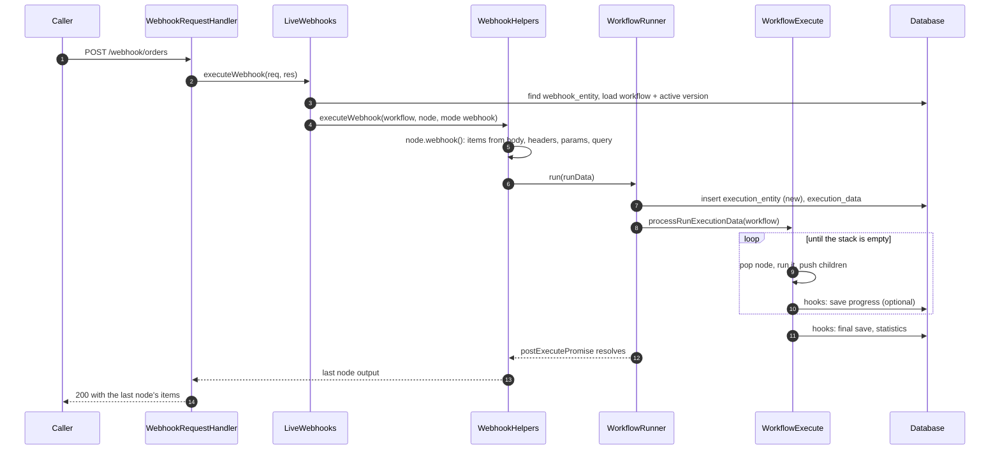
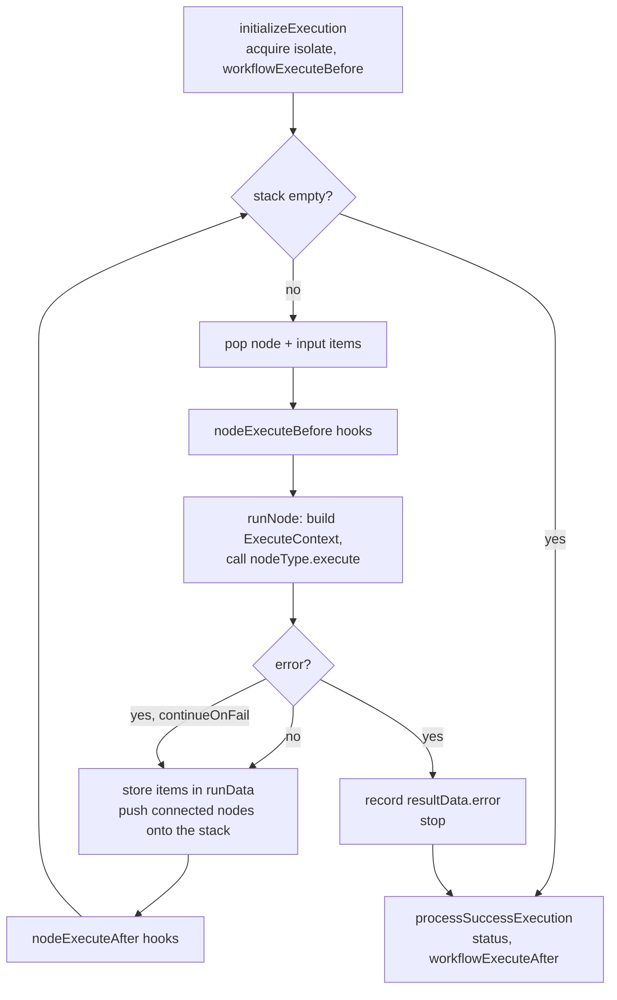
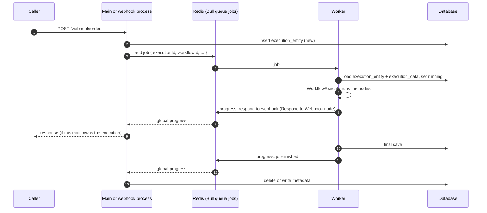

# Life of a webhook execution

A third-party service sends `POST /webhook/orders` to an n8n instance. A workflow with a Webhook node runs, does its work, and the caller receives the result of the last node. This document follows that request through the backend: the lookup, the node, the engine, the persistence, and the response. It is the execution walkthrough. Its sibling, [Life of a workflow publish](life-of-a-workflow-publish.md), explains how the webhook came to exist.

We follow one default path first: regular mode, a single main process, and a Webhook node whose response mode is **When Last Node Finishes**. Then we show the variants: the other response modes, queue mode with workers, multi-main, waiting executions, and sub-workflows.

## The vocabulary

Five terms carry this document.

- An **execution** is one run of one workflow. It has a row in `execution_entity` and a status: `new`, `running`, `waiting`, `success`, `error`, `canceled`, `crashed`, or `unknown`.
- **Run data** is the in-memory state of an execution: the items each node produced and the stack of nodes still to run. Its type is `IRunExecutionData` in `packages/workflow`.
- An **item** is one JSON object with optional binary references. Nodes take items in and put items out. Its type is `INodeExecutionData`.
- The **node execution stack** is the list of nodes waiting to run, each with its input items. The engine pops from it until it is empty.
- **Lifecycle hooks** are the callbacks the engine fires before and after a node and before and after a workflow. Everything persistent happens in a hook.

## The path at a glance



*Every participant runs in the main process. The database is the only other party. In this default path the response waits for the whole execution.*

## Stage 0. Before the request

The webhook exists because someone published the workflow. Publication inserted a row into `webhook_entity`, keyed by path and HTTP method, that points at the workflow and the node. For a path with parameters, such as `orders/:id`, the row also stores the node's `webhookId` and the number of path segments. Nothing else is prepared. Express has no per-webhook route. See [Life of a workflow publish](life-of-a-workflow-publish.md#stage-6-activeworkflowmanager-registers-the-triggers).

## Stage 1. The route

`AbstractServer.start` in `packages/cli/src/abstract-server.ts` mounts one catch-all handler per webhook kind, before the JSON body parser:

```ts
		// Setup webhook handlers before bodyParser, to let the Webhook node handle binary data in requests
		if (this.webhooksEnabled) {
			const liveWebhooks = Container.get(LiveWebhooks);

			// Register a handler for live forms
			this.app.all(`/${this.endpointForm}/*path`, createWebhookHandlerFor(liveWebhooks, 'form'));

			// Register a handler for live webhooks
			this.app.all(
				`/${this.endpointWebhook}/*path`,
				createWebhookHandlerFor(liveWebhooks, 'webhook'),
			);
```

**Why before the body parser?** A Webhook node can receive a file upload or a raw body. If Express parsed the body first, the node could not read the original bytes. REST routes are mounted after the parser. Webhook routes are mounted before it and parse the body themselves.

Two classes extend `AbstractServer`. `Server` in `packages/cli/src/server.ts` is the main process and serves both production and test webhooks. `WebhookServer` in `packages/cli/src/webhooks/webhook-server.ts` is the dedicated **webhook process**, started with `n8n webhook`. It serves production webhooks only. The command in `packages/cli/src/commands/webhook.ts` refuses to start outside queue mode:

```ts
	async init() {
		if (this.globalConfig.executions.mode !== 'queue') {
			/**
			 * It is technically possible to run without queues but
			 * there are 2 known bugs when running in this mode:
			 * - Executions list will be problematic as the main process
			 * is not aware of current executions in the webhook processes
			 * and therefore will display all current executions as error
			 * as it is unable to determine if it is still running or crashed
			 * - You cannot stop currently executing jobs from webhook processes
			 * when running without queues as the main process cannot talk to
			 * the webhook processes to communicate workflow execution interruption.
			 */

			this.error('Webhook processes can only run with execution mode as queue.');
		}
```

The process learns its own type from the command name. In `packages/core/src/instance-settings/instance-settings.ts`:

```ts
		this.instanceType = ['webhook', 'worker'].includes(command) ? command : 'main';

		this.hostId = `${this.instanceType}-${this.isDocker ? os.hostname() : nanoid()}`;
```

The host id embeds the type. Logs and the instance registry tell processes apart by it.

## Stage 2. The handler

`createWebhookHandlerFor` in `packages/cli/src/webhooks/webhook-request-handler.ts` joins the path segments, records metrics, and hands the request to `WebhookRequestHandler.handleRequest`. That method checks the HTTP method, answers CORS preflight, and delegates to the webhook manager. It also writes the response, in one of two shapes:

```ts
		try {
			const response = await this.webhookManager.executeWebhook(req, res, this.expectedNodeType);

			// Modern way of responding to webhooks
			if (isWebhookResponse(response)) {
				await this.sendWebhookResponse(res, response);
			} else if (response.noWebhookResponse !== true) {
				// Legacy way of responding to webhooks. `WebhookResponse` should be used to
				// pass the response from the webhookManager. However, we still have code
				// that doesn't use that yet. We need to keep this here until all codepaths
				// return a `WebhookResponse` instead.
				this.sendLegacyResponse(res, response.data, true, response.responseCode, response.headers);
			}
```

Notice the two shapes. The typed `WebhookResponse` is the target. The legacy object is what most code still returns. You will meet this pattern often in the backend: a new shape and an old shape coexist, and the boundary translates.

## Stage 3. The lookup

`LiveWebhooks.executeWebhook` in `packages/cli/src/webhooks/live-webhooks.ts` finds the webhook and loads the workflow.

**Find the webhook.** `WebhookService.findWebhook` in `packages/cli/src/webhooks/webhook.service.ts` tries a static path first. It checks the cache, then the database, and caches a hit:

```ts
	private async findCachedStaticWebhook(method: Method, path: string) {
		const cacheKey = `webhook:${method}-${path}`;

		let cachedStaticWebhook;
		try {
			cachedStaticWebhook = await this.cacheService.get(cacheKey);
		} catch (error) {
			this.logger.warn('Failed to query webhook cache', {
				error: ensureError(error).message,
			});
			cachedStaticWebhook = undefined;
		}

		if (cachedStaticWebhook) return this.webhookRepository.create(cachedStaticWebhook);

		const dbStaticWebhook = await this.findStaticWebhookInDb(method, path);
```

If no static row matches, the service tries a dynamic path. The first segment is the node's `webhookId`, and the remaining segment count must match:

```ts
	private async findDynamicWebhook(path: string, method?: Method) {
		const [uuidSegment, ...otherSegments] = path.split('/');

		const dynamicWebhooks = await this.webhookRepository.findBy({
			webhookId: uuidSegment,
			method,
			pathLength: otherSegments.length,
		});

		if (dynamicWebhooks.length === 0) return null;

		return this.pickMatchingTemplate(dynamicWebhooks, new Set(otherSegments)) ?? null;
	}
```

The cache is in memory in regular mode and in Redis in queue mode. The `CacheService` in `packages/cli/src/services/cache/cache.service.ts` makes that choice from `N8N_CACHE_BACKEND`, which defaults to `auto`.

**Load the workflow and build it.** Back in `packages/cli/src/webhooks/live-webhooks.ts`, the service loads the row with its active version and builds a `Workflow` object from the published nodes and connections, not from the draft:

```ts
		const { workflow: workflowData, publishedVersion } = await this.loadWebhookExecutionData(
			webhook.workflowId,
		);
		const { nodes, connections } = publishedVersion;

		// Create a clean workflowData object with only activeVersion nodes/connections
		// This prevents any downstream code from accidentally using the draft nodes
		const activeWorkflowData: IWorkflowBase = { ...workflowData, nodes, connections };

		const workflow = new Workflow({
			id: webhook.workflowId,
			name: workflowData.name,
			nodes,
			connections,
			active: workflowData.activeVersionId !== null,
			nodeTypes: this.nodeTypes,
			staticData: workflowData.staticData,
			settings: workflowData.settings,
		});
```

Then it calls the shared helper with two arguments worth noticing:

```ts
			return await new Promise((resolve, reject) => {
				const executionMode = 'webhook';
				WebhookHelpers.executeWebhook(
					workflow,
					webhookData,
					activeWorkflowData, // Use activeWorkflowData instead of workflowData
					workflowStartNode,
					executionMode,
					undefined,
					undefined,
					undefined,
					request,
					response,
```

The execution mode is `webhook`. The push reference is `undefined`. The first decides the concurrency queue and the save settings. The second means no push message will reach any browser for this execution. Production executions show nothing live in the editor.

## Stage 4. The node's webhook method

`WebhookHelpers.executeWebhook` in `packages/cli/src/webhooks/webhook-helpers.ts` is a long function. It reads the response mode from the node, attaches the request and response objects to the **additional data**, the per-execution bag of hooks, helpers, and request objects that every node context carries, parses the body, and calls the node.

`WebhookService.runWebhook` in `packages/cli/src/webhooks/webhook.service.ts` builds a `WebhookContext` and invokes the node type's `webhook()` method:

```ts
		const closeFunctions: Array<() => Promise<void>> = [];
		const context = new WebhookContext(
			workflow,
			node,
			additionalData,
			mode,
			webhookData,
			closeFunctions,
			runExecutionData ?? null,
		);

		try {
			return isNodeClassInstance(nodeType)
				? await nodeType.webhook(context)
				: await nodeType.webhook.call(context);
```

The context is what a node author sees as `this`. In `packages/core/src/execution-engine/node-execution-context/webhook-context.ts`, the request becomes the node's input item:

```ts
		if (executionData === undefined && additionalData.httpRequest) {
			const req = additionalData.httpRequest;
			connectionInputData = [
				{
					json: {
						body: (req.body ?? {}) as IDataObject,
						headers: req.headers,
						params: req.params as IDataObject,
						query: req.query as IDataObject,
					},
				},
			];
		}
```

The node returns `workflowData`, the items to start the workflow with. It may also return `webhookResponse`, a body to answer with, or `noWebhookResponse: true` when it has written to the response itself. If it returns no `workflowData`, the workflow does not run. Back in `packages/cli/src/webhooks/webhook-helpers.ts`:

```ts
		if (webhookResultData.workflowData === undefined) {
			// Workflow should not run
			if (webhookResultData.webhookResponse !== undefined) {
				// Data to respond with is given
				if (!didSendResponse) {
					responseCallback(null, {
						data: webhookResultData.webhookResponse,
						responseCode,
					});
					didSendResponse = true;
				}
			} else {
				// Send default response

				if (!didSendResponse) {
					responseCallback(null, {
						data: {
							message: 'Webhook call received',
						},
						responseCode,
					});
					didSendResponse = true;
				}
			}
			return;
		}
```

Otherwise `prepareExecutionData` builds the run data. The stack starts with the Webhook node and its items:

```ts
	// Initialize the data of the webhook node
	const nodeExecutionStack: IExecuteData[] = [
		{
			node: workflowStartNode,
			data: {
				main: webhookResultData.workflowData ?? [],
			},
			source: null,
		},
	];
```

Then the helper starts the execution and remembers the response mode, because the runner needs it later in queue mode:

```ts
		// Start now to run the workflow
		executionId = await Container.get(WorkflowRunner).run(
			runData,
			true,
			!didSendResponse && !shouldDeferOnReceivedResponse,
			// An execution id here means we are resuming one that is waiting on this webhook
			executionId ? { executionId, expectedStatus: 'waiting' } : undefined,
			responsePromise as IDeferredPromise<IExecuteResponsePromiseData> | undefined,
		);

		/**
		 * We track the webhook response mode so that `WorkflowRunner` can decide whether it
		 * needs to fetch full execution data from the DB when a job finishes in scaling mdoe.
		 */
		Container.get(ActiveExecutions).setResponseMode(executionId, responseMode);
```

The response mode is remembered here because the runner needs it later, in queue mode, to decide whether to read the full run data back.

## Stage 5. Starting the execution

`WorkflowRunner.run` in `packages/cli/src/workflow-runner.ts` is the single entry point for every execution: webhooks, triggers, manual runs, and resumes. Three things happen before any node runs.

**The row.** `ActiveExecutions.add` in `packages/cli/src/active-executions.ts` creates the execution row:

```ts
				executionId = await this.executionPersistence.create(fullExecutionData);
				assert(executionId);

				if (shouldReserveCapacity) {
					await capacityReservation.reserve({ mode, executionId });
				}

				if (this.executionsConfig.mode === 'regular') {
					await this.executionRepository.setRunning(executionId);
				}
				executionStatus = 'running';
```

`ExecutionPersistence.create` in `packages/cli/src/executions/execution-persistence.ts` inserts `execution_entity` with status `new`, writes the run data and a workflow snapshot, and records their size, all in one transaction when the data goes to the database:

```ts
		const storedAt = this.storageConfig.modeTag;
		const workflowVersionId = workflowData.versionId ?? null;
		const executionEntity = { ...rest, createdAt: new Date(), storedAt, workflowVersionId };
```

Inside the same transaction, the data bundle is written and measured:

```ts
				const jsonSizeBytes = await this.trackWrite(storedAt, ref.workflowId, async () => {
					const bundle: ExecutionDataPayload = {
						data: stringify(rawData),
						workflowData: workflowSnapshot,
						workflowVersionId,
					};
					return await this.writeData(storedAt, ref, bundle, tx);
				});
```

`storedAt` records where the data went. See Stage 9.

**The throttle.** In regular mode, `ConcurrencyControlService` in `packages/cli/src/concurrency/concurrency-control.service.ts` limits how many production executions run at once. The limit is `N8N_CONCURRENCY_PRODUCTION_LIMIT`, unlimited by default. The queue applies to the `webhook`, `trigger`, and `chat` modes:

```ts
		if (mode === 'webhook' || mode === 'trigger' || mode === 'chat') {
			return this.queues.get('production');
		}
```

A throttled execution sits in the database with status `new` and no start time, and the HTTP request stays open. In queue mode this service is off. The worker's own concurrency takes its place.

**The branch.** With the row written and capacity reserved, the runner in `packages/cli/src/workflow-runner.ts` decides where the execution runs:

```ts
		// @TODO: Reduce to true branch once feature is stable
		const shouldEnqueue =
			process.env.OFFLOAD_MANUAL_EXECUTIONS_TO_WORKERS === 'true'
				? this.executionsConfig.mode === 'queue'
				: this.executionsConfig.mode === 'queue' && data.executionMode !== 'manual';

		if (shouldEnqueue) {
			await this.enqueueExecution(
				executionId,
				workflowId,
				data,
				loadStaticData,
				realtime,
				existingExecution?.executionId,
			);
		} else {
			await this.runMainProcess(executionId, data, loadStaticData, existingExecution?.executionId);
		}
```

In our default path, `runMainProcess` runs. It loads the workflow's static data, builds the lifecycle hooks for a regular main, and creates the engine:

```ts
				const workflowExecute = new WorkflowExecute(
					additionalData,
					data.executionMode,
					data.executionData,
				);
				workflowExecution = workflowExecute.processRunExecutionData(workflow);
```

The engine receives the additional data, the mode, and the run data. It receives nothing about HTTP.

## Stage 6. The engine

`WorkflowExecute` in `packages/core/src/execution-engine/workflow-execute.ts` is the v1 execution engine. It is a loop over the node execution stack.



*One iteration per node run. A node with several inputs waits in a side list until every input has data. Nothing in this loop writes to the database. The hooks do.*

**Initialization** acquires the expression isolate and fires the first hook:

```ts
	private async initializeExecution(
		workflow: Workflow,
		hooks: ExecutionLifecycleHooks,
	): Promise<void> {
		try {
			await workflow.expression.acquireIsolate();

			// Establish the execution context
			await establishExecutionContext(
				workflow,
				this.runExecutionData,
				this.additionalData,
				this.mode,
			);

			if (!this.additionalData.restartExecutionId) {
				await hooks.runHook('workflowExecuteBefore', [workflow, this.runExecutionData]);
			} else {
				await hooks.runHook('workflowExecuteResume', [workflow, this.runExecutionData]);
			}
```

**The loop** pops the stack and guards against a node running twice in a row with the same run index:

```ts
				executionLoop: while (this.isExecutionStackNotEmpty()) {
					if (this.shouldStopExecuting()) {
						return;
					}

					subNodeExecutionResults = makeEngineResponse();

					let nodeSuccessData: INodeExecutionData[][] | null | undefined = null;
					executionError = undefined;
					executionData = this.popExecutionStack();
					executionNode = executionData.node;

					this.resetDynamicCredentialsUsage(executionData);

					const taskStartedData = this.createTaskStartedData(executionData);

					// Update the pairedItem information on items
					executionData.data = this.addPairedItemLineage(executionData);

					runIndex = this.computeRunIndex(executionData);

					currentExecutionTry = `${executionNode.name}:${runIndex}`;
					if (currentExecutionTry === lastExecutionTry) {
						throw new UserError('Stopped execution because it seems to be in an endless loop');
					}
```

The loop guard compares the node and its run index with the previous iteration. The same node with the same run index twice in a row means nothing moved.

Notice `addPairedItemLineage`. **Paired items** are the record of which input item produced which output item. The engine maintains this lineage so that an expression such as `$('Webhook').item.json.id` can find the right item several nodes upstream.

**Running a node** builds an `ExecuteContext` and calls the node type's `execute` method. The Webhook node itself has no `execute` method, so its items pass straight through. For every other node:

```ts
		const closeFunctions: CloseFunction[] = [];
		const context = new ExecuteContext(
			workflow,
			node,
			additionalData,
			mode,
			runExecutionData,
			runIndex,
			connectionInputData,
			inputData,
			executionData,
			closeFunctions,
			abortSignal,
			subNodeExecutionResults,
		);
```

Everything a node can reach is on this object: its input items, the run data, the additional data, and the abort signal.

**Scheduling children.** For each output index with items, the engine schedules the connected node. The workflow setting `executionOrder` decides the order. Version `v1`, the default for new workflows, sorts by canvas position, top-left first:

```ts
										// Add the node only if it did execute or if connected to second "optional" input
										if (workflow.settings.executionOrder === 'v1') {
											const nodeToAdd = workflow.getNode(connectionData.node);
											nodesToAdd.push({
												position: nodeToAdd?.position || [0, 0],
												connection: connectionData,
												outputIndex: parseInt(outputIndex, 10),
											});
										} else {
											this.addNodeToBeExecuted(
```

A node with more than one input is not pushed until every input has data:

```ts
		// Check if node has multiple inputs as then we have to wait for all input data
		// to be present before we can add it to the node-execution-stack
		const numberOfInputs =
			workflow.connectionsByDestinationNode[connectionData.node]?.main?.length ?? 0;
		if (numberOfInputs > 1) {
```

The check reads the inverted connection map. That map is why parents are found by destination, as root `AGENTS.md` describes.

**Errors.** A node can be set to continue on failure. Then the engine passes the input items through and moves on:

```ts
	private continuesOnError(node: INode): boolean {
		return (
			node.continueOnFail === true ||
			['continueRegularOutput', 'continueErrorOutput'].includes(node.onError ?? '')
		);
	}
```

Otherwise the engine records the error in `resultData.error` and stops.

**The end.** `processSuccessExecution` sets the final status and fires the last hook:

```ts
		if (executionError !== undefined) {
			fullRunData.data.resultData.error = {
				...executionError,
				message: executionError.message,
				stack: executionError.stack,
			} satisfies ExecutionBaseError;
		} else if (this.runExecutionData.waitTill) {
			fullRunData.waitTill = this.runExecutionData.waitTill;
		} else {
			fullRunData.finished = true;
		}

		// Prevent from running the hook if the error is an abort error as it was already handled
		if (!this.isCancelled) {
			await this.additionalData.hooks?.runHook('workflowExecuteAfter', [
				fullRunData,
				newStaticData,
			]);
		}
```

Three outcomes. An error, a wait, or `finished`. The wait is Variant 4.

## Stage 7. Inside a node

Three things a node does reach outside the engine.

**Parameters and expressions.** A node reads its settings with `getNodeParameter`. An expression such as `={{ $json.email }}` is evaluated at that moment, not up front, against a `WorkflowDataProxy` built from the run data and the current item. The evaluation runs in a V8 isolate. In `packages/workflow/src/expression.ts`:

```ts
	private renderExpression(expression: string, data: IWorkflowDataProxyData) {
		// The VM engines (isolated-vm, quickjs) are Node-only; the browser always
		// uses the legacy path below.
		if (
			(Expression.expressionEngine === 'vm' || Expression.expressionEngine === 'quickjs') &&
			!IS_FRONTEND
		) {
```

The same `n8n-workflow` code runs in the browser for the editor's expression preview, without the isolate. The engine is chosen by `N8N_EXPRESSION_ENGINE`, and `vm` is the default. See [Legacy and new](legacy-and-new.md#expressions).

**Credentials.** `getCredentials` goes through `CredentialsHelper` in `packages/cli/src/credentials-helper.ts`, which loads the row from `credentials_entity` and decrypts it with the instance encryption key. The node never sees the encrypted form.

**Code.** The Code node in `packages/nodes-base/nodes/Code/Code.node.ts` does not run user code in the main process. It asks a **task runner**:

```ts
		if (isJsLang) {
			const code = this.getNodeParameter(codeParameterName, 0) as string;
			const sandbox = new JsTaskRunnerSandbox(workflowMode, this);
			const numInputItems = this.getInputData().length;

			return nodeMode === 'runOnceForAllItems'
				? [await sandbox.runCodeAllItems(code)]
				: [await sandbox.runCodeForEachItem(code, numInputItems)];
		}
```

The sandbox calls `startJob` on the context, which reaches `TaskRequester` in `packages/cli/src/task-runners/task-managers/task-requester.ts`. The requester sends a task request to the `TaskBroker`, the broker matches it with a runner, and the runner asks for the items it needs. In `N8N_RUNNERS_MODE=internal`, the default, the runner is a child process of the process that executes the workflow. In `external` mode it connects to the broker over WebSocket. Python code goes to a separate native Python runner. See [Task runners](subsystems/task-runners.md).

## Stage 8. The lifecycle hooks

Everything persistent happens in a hook. `ExecutionLifecycleHooks` in `packages/core/src/execution-engine/execution-lifecycle-hooks.ts` runs the handlers of a hook one after another:

```ts
	async runHook<
		Hook extends keyof ExecutionLifecycleHookHandlers,
		Params extends unknown[] = Parameters<
			Exclude<ExecutionLifecycleHookHandlers[Hook], undefined>[number]
		>,
	>(hookName: Hook, parameters: Params) {
		const hooks = this.handlers[hookName];
		for (const hookFunction of hooks) {
			const typedHookFunction = hookFunction as unknown as (
				this: ExecutionLifecycleHooks,
				...args: Params
			) => Promise<void>;
			await typedHookFunction.apply(this, parameters);
		}
	}
```

Eight hooks exist: `workflowExecuteBefore`, `workflowExecuteResume`, `nodeExecuteBefore`, `nodeExecuteAfter`, `nodeFetchedData`, `workflowExecuteAfter`, `sendResponse`, and `sendChunk`. Which handlers are attached depends on the process. `packages/cli/src/execution-lifecycle/execution-lifecycle-hooks.ts` assembles the set for a regular main:

```ts
	hookFunctionsWorkflowEvents(hooks, userId, projectId, projectName, source, telemetryMetadata);
	hookFunctionsNodeEvents(hooks);
	hookFunctionsFinalizeExecutionStatus(hooks);
	hookFunctionsSave(hooks, optionalParameters);
	hookFunctionsPush(hooks, optionalParameters, userId, source);
	hookFunctionsSaveProgress(hooks, optionalParameters);
	hookFunctionsStatistics(hooks, source);
	hookFunctionsExternalHooks(hooks, source);
	Container.get(ModulesHooksRegistry).addHooks(hooks, source);
	return hooks;
```

What each one does on our path:

| Hook | Handlers that act | Effect |
|---|---|---|
| `workflowExecuteBefore` | events, external hooks | Emits `workflow-pre-execute` for telemetry and log streaming. No database write. |
| `nodeExecuteBefore` | node events | Emits `node-pre-execute`. |
| `nodeExecuteAfter` | node events, save progress | Emits `node-post-execute`. If the workflow saves progress, writes the whole run data with status `running`. |
| `nodeFetchedData` | statistics | Records that a node fetched data, for `workflow_statistics`. |
| `workflowExecuteAfter` | finalize status, save, external hooks, modules | Decides between delete and save, writes the final record, emits the completion event that updates `workflow_statistics`, runs the error workflow, feeds the insights module. |
| `sendResponse` | runner | Resolves the webhook response promise. See Stage 10. |

**Save or delete.** The save hook applies the **save settings**. A workflow can say that successful executions are not kept. Then the hook deletes the row it created in Stage 5:

```ts
			const shouldNotSave =
				(fullRunData.status === 'success' && !saveSettings.success) ||
				(fullRunData.status !== 'success' && !saveSettings.error);

			if (shouldNotSave && !fullRunData.waitTill && !isManualMode) {
				if (dispatchesErrorWorkflow) {
					executeErrorWorkflow(
						this.workflowData,
						fullRunData,
						this.mode,
						this.executionId,
						retryOf,
					);
				}

				await executionPersistence.deleteInFlightExecution({
					workflowId: this.workflowData.id,
					executionId: this.executionId,
					storedAt: fullRunData.storedAt,
				});

				return;
			}
```

**Why create a row and then delete it?** Because the execution must have an id while it runs. Other code addresses it by id: the executions list, cancellation, the resume URL, and the response relay in queue mode. The row is the id.

The settings come from the workflow with environment defaults, in `packages/cli/src/execution-lifecycle/to-save-settings.ts`:

```ts
	const DEFAULTS = {
		ERROR: Container.get(GlobalConfig).executions.saveDataOnError,
		SUCCESS: Container.get(GlobalConfig).executions.saveDataOnSuccess,
		MANUAL: Container.get(GlobalConfig).executions.saveDataManualExecutions,
		PROGRESS: Container.get(GlobalConfig).executions.saveExecutionProgress,
	};
```

**Modules join in.** A module can attach to these hooks with `@OnLifecycleEvent`. The insights module counts executions this way, and the OpenTelemetry module traces them. See [Patterns](patterns.md#9-lifecycle-hooks).

## Stage 9. Persistence

The record of an execution is split in two tables.

`execution_entity` holds the columns you filter on: `status`, `finished`, `mode`, `startedAt`, `stoppedAt`, `waitTill`, `workflowId`, sizes, and `storedAt`. `execution_data` holds the run data as one flattened string plus a snapshot of the workflow, so that the execution can be displayed even after the workflow changes. In `packages/@n8n/db/src/entities/execution-data.ts`:

```ts
@Entity()
export class ExecutionData {
	@Column('text')
	data: string;
```

One text column holds the whole run, flattened. The workflow snapshot next to it keeps the display stable after the workflow changes.

**Where the data lives.** The `storedAt` column says where the run data went. Its value comes from `N8N_EXECUTION_DATA_STORAGE_MODE` at insert time, and every read follows the row's own value, so an instance can switch modes without migrating old rows. In `packages/core/src/storage.config.ts`:

```ts
export const EXECUTION_DATA_STORAGE_MODES = ['database', 'filesystem', 's3', 'azure'] as const;

const modeSchema = z.enum(EXECUTION_DATA_STORAGE_MODES);

const MODE_TAGS = { database: 'db', filesystem: 'fs', s3: 's3', azure: 'az' } as const;
```

With `db`, the data goes to `execution_data`. With the other three, it goes to a JSON bundle in the blob store through `@n8n/blob-storage`, and `execution_data` is not written. See [Persistence](subsystems/persistence.md).

**The update.** `ExecutionPersistence.updateExistingExecution` in `packages/cli/src/executions/execution-persistence.ts` runs one transaction: the entity columns first, with optional status guards, then the data bundle, then the size columns:

```ts
			if (isFullOverwrite) {
				const binaryDataSizeBytes = sumBinaryDataBytes(data);
				const jsonSizeBytes = await this.trackWrite(mode, ref.workflowId, async () => {
					const bundle: ExecutionDataPayload = {
						data: stringify(data),
						workflowData: this.toWorkflowSnapshot(workflowData),
						workflowVersionId,
					};

					return mode === 'db'
						? await this.dbStore.overwrite(ref, bundle, tx)
						: await this.jsonStore.write(ref, bundle, mode);
				});
```

The mode decides the store. The transaction covers both the row and the bundle.

**Binary data.** Files that nodes produce never sit inside the run data. `BinaryDataService` in `packages/core/src/binary-data/` writes them to the configured store and leaves an id in the item. The mode is `N8N_DEFAULT_BINARY_DATA_MODE`: `filesystem` by default in regular mode, `database` by default in queue mode, or `s3` and `azure`.

## Stage 10. The response

Our node's response mode is **When Last Node Finishes**. `executeWebhook` in `packages/cli/src/webhooks/webhook-helpers.ts` therefore waits for the execution to end:

```ts
		const activeExecutions = Container.get(ActiveExecutions);

		// Get a promise which resolves when the workflow did execute and send then response
		const executePromise = activeExecutions.getPostExecutePromise(executionId);
```

The promise belongs to the entry in `ActiveExecutions`. The runner resolves it in `finalizeExecution` when the engine returns.

When the runner's `finalizeExecution` resolves that promise, the helper extracts the last node's output and answers:

```ts
					responseCallback(
						null,
						response.type === 'static'
							? createStaticResponse(response.body, responseCode, responseHeaders)
							: createStreamResponse(response.stream, responseCode, responseHeaders),
					);
					didSendResponse = true;
					return runData;
```

If the execution ended with an error, the caller receives status 500 and `{ message: 'Error in workflow' }`.

## Stage 11. What else happened

No push message reached a browser. `hookFunctionsPush` in `packages/cli/src/execution-lifecycle/execution-lifecycle-hooks.ts` returns at once when the push reference is missing:

```ts
function hookFunctionsPush(
	hooks: ExecutionLifecycleHooks,
	{ pushRef, retryOf }: HooksSetupParameters,
	userId?: string,
	source?: IWorkflowExecutionDataProcess['source'],
) {
	if (!pushRef) return;
```

Push is for manual runs from the editor. Production runs are observed through the executions list, which reads the database.

Two events did fire. `workflow-pre-execute` and `workflow-post-execute` went through `EventService` to the telemetry relay and the log streaming relay. `WorkflowStatisticsService` updated `workflow_statistics`.

If the execution failed and the workflow has an **error workflow**, the save hook started it. `executeErrorWorkflow` in `packages/cli/src/execution-lifecycle/execute-error-workflow.ts` seeds a new execution at the Error Trigger node with the failure details and starts it through `WorkflowRunner` in mode `error`, with one guard:

```ts
		const { errorTriggerType } = Container.get(GlobalConfig).nodes;
		// Run the error workflow
		// To avoid an infinite loop do not run the error workflow again if the error-workflow itself failed and it is its own error-workflow.
		const { errorWorkflow } = workflowData.settings ?? {};
		if (errorWorkflow && !(mode === 'error' && workflowId && errorWorkflow === workflowId)) {
```

## Variant 1. The other response modes

The Webhook node offers several response modes. Each one changes when and by whom the response is written.

| Mode | Who answers | When |
|---|---|---|
| Immediately (`onReceived`) | the helper | right after the execution id exists, before any node runs |
| When Last Node Finishes (`lastNode`) | the helper | after `postExecutePromise` resolves, with the last node's items |
| Using Respond to Webhook Node (`responseNode`) | the Respond to Webhook node, through the `sendResponse` hook | whenever that node runs |
| Streaming (`streaming`) | the node writes chunks through the `sendChunk` hook | during the run, ended when the execution finishes |

In `packages/cli/src/webhooks/webhook-helpers.ts`, `onReceived` still waits for the execution id, so that `$execution.id` can appear in the response body:

```ts
		if (shouldDeferOnReceivedResponse) {
			additionalKeys.$executionId = executionId;
			additionalKeys.$execution = {
				id: executionId,
				mode: executionMode === 'manual' ? 'test' : 'production',
				resumeUrl: `${additionalData.webhookWaitingBaseUrl}/${executionId}`,
				resumeFormUrl: `${additionalData.formWaitingBaseUrl}/${executionId}`,
			};
```

`responseNode` creates a deferred promise before the run and hands it to the runner. The Respond to Webhook node in `packages/nodes-base/nodes/RespondToWebhook/RespondToWebhook.node.ts` resolves it from inside the engine:

```ts
			response = {
				body: responseBody,
				headers,
				statusCode,
			};

			if (!shouldStream || respondWith === 'binary') {
				await this.sendResponse(response);
			}
```

`sendResponse` on the context, in `packages/core/src/execution-engine/node-execution-context/execute-context.ts`, is one line that runs the hook:

```ts
	async sendResponse(response: IExecuteResponsePromiseData): Promise<void> {
		await this.additionalData.hooks?.runHook('sendResponse', [response]);
	}
```

In regular mode the `sendResponse` handler resolves the promise in the same process. In queue mode the handler sends a message from the worker to the main. That is the next variant.

## Variant 2. Queue mode

In **queue mode** the main process accepts the request and a **worker** runs the execution. Redis holds a **Bull** queue between them. Bull is the Redis-backed job queue library that carries executions to workers. [Scaling and multi-main](subsystems/scaling-and-multi-main.md) covers the whole setup. Everything up to Stage 5 is the same. Then `shouldEnqueue` is true and the runner calls `enqueueExecution`.



*The job carries ids, not data. The run data is already in the database. Progress messages carry the response back, and every main hears every message but only the owner acts.*

**The job.** The main, in `packages/cli/src/workflow-runner.ts`, builds a small job and adds it to the queue named `jobs`:

```ts
		const jobData: JobData = {
			workflowId,
			executionId,
			loadStaticData: !!loadStaticData,
			pushRef: data.pushRef,
			streamingEnabled: data.streamingEnabled,
			restartExecutionId,
			projectId: data.projectId,
			projectName: data.projectName,
```

```ts
			job = await this.scalingService.addJob(jobData, { priority: realtime ? 50 : 100 });
```

A webhook that still owes a response gets priority 50. A fire-and-forget trigger gets 100.

**The worker.** `JobProcessor.processJob` in `packages/cli/src/scaling/job-processor.ts` reloads the execution from the database and refuses one that crashed:

```ts
	async processJob(job: Job): Promise<JobResult> {
		const { executionId, loadStaticData } = job.data;

		const execution = await this.executionPersistence.findSingleExecution(executionId, {
			includeData: true,
			unflattenData: true,
		});

		if (!execution) {
			throw new UnexpectedError(
				`Worker failed to find data for execution ${executionId} (job ${job.id})`,
			);
		}

		/**
		 * Bull's implicit retry mechanism and n8n's execution recovery mechanism may
		 * cause a crashed execution to be enqueued. We refrain from processing it,
		 * until we have reworked both mechanisms to prevent this scenario.
		 */
		if (execution.status === 'crashed') return { success: false };
```

The worker then runs the same `WorkflowExecute` with the worker's hook set. The `sendResponse` handler becomes a Bull progress message:

```ts
			// Standard webhook response
			const msg: RespondToWebhookMessage = {
				kind: 'respond-to-webhook',
				executionId,
				response: relayed,
				workerId: this.instanceSettings.hostId,
			};

			await job.progress(msg);
```

And the end of the job is a second message:

```ts
		const msg: JobFinishedMessage = {
			kind: 'job-finished',
			version: 2,
			executionId,
			workerId: this.instanceSettings.hostId,
			...props,
		};

		await job.progress(msg);
```

Version 2 of this message carries the status and the timing. The main can finish without a database read in most cases.

**The main listens.** Every main and webhook process subscribes to Bull's `global:progress` events in `packages/cli/src/scaling/scaling.service.ts`:

```ts
		this.queue.on('global:progress', (jobId: JobId, msg: unknown) => {
			if (!this.isJobMessage(msg)) return;

			// completion and failure are reported via `global:progress` to convey more details
			// than natively provided by Bull in `global:completed` and `global:failed` events

			switch (msg.kind) {
				case 'send-chunk':
					this.activeExecutions.sendChunk(msg.executionId, msg.chunkText);
					break;
				case 'respond-to-webhook': {
					const decodedResponse = decodeRelayedWebhookResponse(msg.response);
					this.activeExecutions.resolveResponsePromise(msg.executionId, decodedResponse);
					break;
				}
```

One listener handles several message kinds. The switch continues with the finished and failed cases.

**How does the right main answer?** Every main hears every message. `ActiveExecutions.resolveResponsePromise` in `packages/cli/src/active-executions.ts` does nothing on a process that does not hold the execution:

```ts
	resolveResponsePromise(executionId: string, response: IExecuteResponsePromiseData): void {
		const execution = this.activeExecutions[executionId];
		execution?.responsePromise?.resolve(response);
	}
```

Only the process that accepted the HTTP request has an entry for that execution id. This is the whole multi-main story for webhooks. Nothing routes the message. Everyone hears it, and the owner acts.

**Who writes what.** The hook sets are split. The worker saves the execution data, always, and never deletes. The main, when the job finishes, either deletes the execution per the save settings or writes the metadata. The worker also dispatches the error workflow, which becomes a new job. The comment in the worker's save hook, in `packages/cli/src/execution-lifecycle/execution-lifecycle-hooks.ts`, explains the metadata split:

```ts
			// In scaling mode, worker saves execution without metadata
			// Main process will save metadata after deletion decisions to avoid FK violations
			await updateExistingExecution({
				executionId: this.executionId,
				workflowId: this.workflowData.id,
				executionData,
			});
```

The main writes the metadata only after it has decided whether the execution is kept.

**When does the main read the database?** For `lastNode`, the main needs the full run data to build the response. `needsFullExecutionData` in `packages/cli/src/workflow-runner.ts` decides:

```ts
		return (
			executionMode === 'integrated' ||
			this.activeExecutions.getResponseMode(executionId) === 'lastNode' ||
			this.externalHooks.hasHook('workflow.postExecute')
		);
	}
```

This is why Stage 4 recorded the response mode. For `responseNode` the response arrived as a progress message, and the main does not read the data back.

**Recovery.** The leader main runs `recoverFromQueue` on an interval. An execution that is `new` or `running` in the database but absent from the queue is marked `crashed`.

## Variant 3. Multi-main

Several mains, one leader. For a webhook execution the leader plays no special role. Any main or webhook process accepts the request, creates the row, adds the job, and holds the response promise. The `global:progress` mechanism above delivers the response to the right process. The leader matters for triggers, waiting executions, and queue recovery, not for webhooks.

## Variant 4. Waiting

A Wait node pauses an execution. Two paths exist, chosen by the wait length. In `packages/nodes-base/nodes/Wait/Wait.node.ts`:

```ts
		const waitValue = Math.max(waitTill.getTime() - new Date().getTime(), 0);

		if (waitValue < 65000) {
			// If wait time is shorter than 65 seconds leave execution active because
			// we just check the database every 60 seconds.
			return await new Promise((resolve, _reject) => {
				const timer = setTimeout(() => resolve([context.getInputData()]), waitValue);
				context.onExecutionCancellation(() => {
					clearTimeout(timer);
					resolve([context.getInputData()]);
				});
			});
		}

		// If longer than 65 seconds put execution to wait
		return await this.putToWait(context, waitTill);
```

**Why 65 seconds?** The tracker that resumes waiting executions polls the database every 60 seconds. A wait shorter than the poll interval is cheaper as an in-process timer than as a database query.

A longer wait sets `waitTill` on the run data. The engine in `packages/core/src/execution-engine/workflow-execute.ts` pushes the Wait node back onto the stack and leaves the loop:

```ts
					if (this.runExecutionData.waitTill) {
						await hooks.runHook('nodeExecuteAfter', [
							executionNode.name,
							taskData,
							this.runExecutionData,
						]);

						// Add the node back to the stack that the workflow can start to execute again from that node
						this.pushExecutionStack(executionData);

						break;
					}
```

The save hook persists the execution with status `waiting`. A waiting execution is never deleted by the save settings.

**Resume by time.** `WaitTracker` in `packages/cli/src/wait-tracker.ts` runs on the leader only. Every 60 seconds it loads the executions due in the next 70 seconds and sets a timer for each. When a timer fires, it restarts the execution through `WorkflowRunner.run` with an expected status:

```ts
		// Start the execution again
		try {
			await this.workflowRunner.run(data, false, false, {
				executionId,
				expectedStatus: 'waiting',
			});
```

`ActiveExecutions.add` in `packages/cli/src/active-executions.ts` then claims the row with a conditional update. If another process claimed it first, the update affects no row and the resume stops:

```ts
				const updateSucceeded = await this.executionPersistence.updateExistingExecution(
					executionId,
					execution,
					// Only claim the execution if it is still in the status the caller expected
					{ requireStatus: existingExecution.expectedStatus },
				);

				if (!updateSucceeded) {
					// Another process is already resuming this execution
					throw new ExecutionAlreadyResumingError(executionId);
				}
```

The expected status is the guard. A resume that lost the race stops here with a clear error instead of running twice.

**Resume by webhook.** A Wait node set to "wait for a webhook" gives the caller a resume URL under `/webhook-waiting/<executionId>`. `WaitingWebhooks` in `packages/cli/src/webhooks/waiting-webhooks.ts` loads the execution, checks the resume token, rejects one that is already running or finished, and calls the same `executeWebhook` helper with the existing execution id. The Wait node's output becomes the new items on the stack.

The durable scheduler, described in [Scheduling and waiting](subsystems/scheduling-and-waiting.md), moves schedule and poll triggers into the database. As of September 2026, it does not change how Wait node executions resume. `WaitTracker` still does that.

## Variant 5. Sub-workflows

An Execute Workflow node starts a **sub-workflow**. `executeWorkflow` in `packages/cli/src/workflow-execute-additional-data.ts` loads the published child, builds a run in mode `integrated` whose stack starts at the child's trigger with the parent's items, and creates a new execution row. The child has its own id. Then it runs a fresh `WorkflowExecute` in the same process:

```ts
	/**
	 * A subworkflow execution in queue mode is not enqueued, but rather runs in the
	 * same worker process as the parent execution. Hence ensure the subworkflow
	 * execution is marked as started as well.
	 */
	await executionRepository.setRunning(executionId);
```

A sub-workflow in queue mode does not become a new job. It runs on the worker that runs the parent. The `integrated` mode is also exempt from the production concurrency queue. If the child ends in a wait, the parent waits too, and `WaitTracker.resumeParentExecution` resumes it when the child completes.

## What was touched

| Table | Entity file | Read or written | By |
|---|---|---|---|
| `webhook_entity` | `packages/@n8n/db/src/entities/webhook-entity.ts` | read | lookup |
| `workflow_entity`, `workflow_history` | `packages/@n8n/db/src/entities/workflow-entity.ts`, `workflow-history.ts` | read, `staticData` written | lookup, save hook |
| `execution_entity` | `packages/@n8n/db/src/entities/execution-entity.ts` | insert `new`, update `running`, final update or delete | runner, hooks |
| `execution_data` | `packages/@n8n/db/src/entities/execution-data.ts` | insert and overwrite when `storedAt` is `db` | persistence |
| `execution_metadata` | `packages/@n8n/db/src/entities/execution-metadata.ts` | written | save hook (main) |
| `credentials_entity` | `packages/@n8n/db/src/entities/credentials-entity.ts` | read | credentials helper |
| `workflow_statistics` | `packages/@n8n/db/src/entities/workflow-statistics.ts` | upsert | statistics hook |
| `insights_raw` | `packages/cli/src/modules/insights/database/entities/insights-raw.ts` | insert | insights module hook |

In Redis, queue mode only: the Bull queue `jobs` under the `bull` prefix, Bull's `global:progress` events, the cache key `webhook:<METHOD>-<path>`, and the leader key for multi-main.

## The flags on this path

| Flag | Defined in | Effect here |
|---|---|---|
| `EXECUTIONS_MODE` | `packages/@n8n/config/src/configs/executions.config.ts` | `queue` sends the execution to a worker |
| `N8N_CONCURRENCY_PRODUCTION_LIMIT` | same file | Throttle in regular mode, worker concurrency in queue mode |
| `EXECUTIONS_DATA_SAVE_ON_SUCCESS`, `EXECUTIONS_DATA_SAVE_ON_ERROR`, `EXECUTIONS_DATA_SAVE_ON_PROGRESS` | same file | Defaults for the save settings |
| `EXECUTIONS_TIMEOUT`, `EXECUTIONS_TIMEOUT_MAX` | same file | Execution timeout |
| `N8N_DISABLE_PRODUCTION_MAIN_PROCESS` | `packages/@n8n/config/src/configs/endpoints.config.ts` | Main stops serving production webhooks when webhook processes exist |
| `N8N_EXECUTION_DATA_STORAGE_MODE` | `packages/core/src/storage.config.ts` | Where run data is stored, recorded per row in `storedAt` |
| `N8N_DEFAULT_BINARY_DATA_MODE` | `packages/core/src/binary-data/binary-data.config.ts` | Where files are stored |
| `N8N_EXPRESSION_ENGINE` | `packages/@n8n/config/src/configs/expression-engine.config.ts` | `vm` by default, `legacy` opts out |
| `N8N_RUNNERS_MODE` | `packages/@n8n/config/src/configs/runners.config.ts` | `internal` child process or `external` runner |
| `N8N_CACHE_BACKEND` | `packages/@n8n/config/src/configs/cache.config.ts` | Memory in regular mode, Redis in queue mode |
| `OFFLOAD_MANUAL_EXECUTIONS_TO_WORKERS` | read in `packages/cli/src/workflow-runner.ts` | Manual runs only. No effect on production webhooks |

## Self-check

1. Why are webhook routes mounted before the body parser, and REST routes after it?
2. A production execution runs and the editor shows nothing live. Which single argument explains this?
3. The workflow keeps successful executions off. The execution succeeded. What did the database see, in order?
4. In queue mode, three mains are running. Which one writes the webhook response, and how does it know?
5. Where is the run data of an execution with `storedAt = 's3'`, and what is in `execution_data` for it?
6. A Wait node waits 30 seconds. Which process holds the timer? Now it waits 30 minutes. Which process resumes it?
7. A sub-workflow starts in queue mode. Does a new job appear in Redis?
8. Which hook decides between deleting and saving the execution, and what would break if the row were never created?
