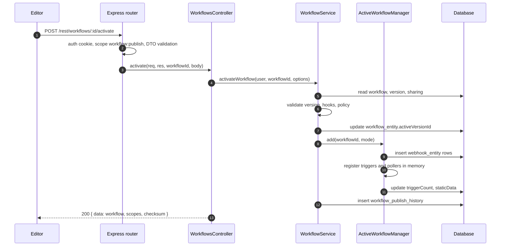
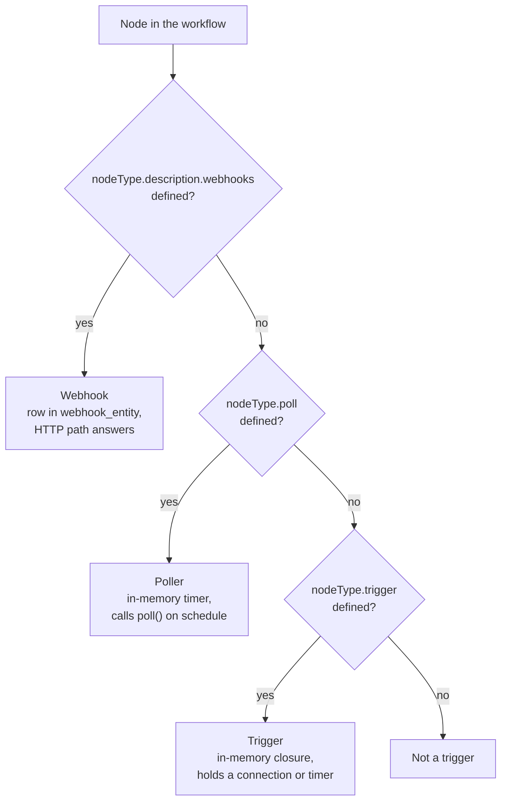
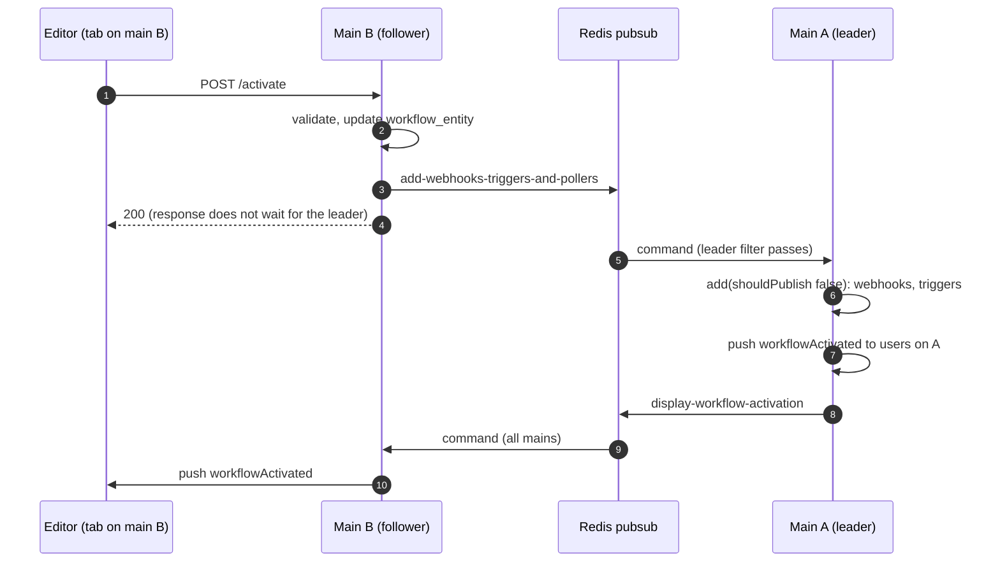
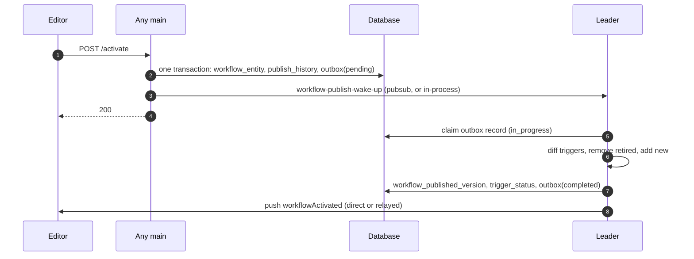

# Life of a workflow publish

A user clicks **Publish** in the editor. A few hundred milliseconds later the workflow's triggers are live: a webhook path answers, a schedule fires, a poller polls. This document follows that click through the backend, stage by stage, with the file and the symbol at each stage. It is the HTTP request walkthrough. Its sibling, [Life of a webhook execution](life-of-a-webhook-execution.md), follows what happens when one of those triggers fires.

We follow one default path first: regular mode, a single main process, and the publication service flag off. Then we show three variants: multi-main, the publication service, and queue mode. Deactivation closes the document.

## What "publish" means

A workflow row in `workflow_entity` has two columns that matter here. `versionId` points at the latest saved draft in `workflow_history`. `activeVersionId` points at the version whose triggers are registered. **Publishing** sets `activeVersionId` to a chosen version and registers that version's triggers. The `active` boolean column still exists and still gets written, but `activeVersionId` is the source of truth. A code comment in the publication applier says so directly. It calls `activeVersionId` "the source of truth for activity" and `active` "deprecated".

This split is why a user can keep editing a workflow while an older version runs in production. Saving writes `versionId`. Publishing writes `activeVersionId`.

## The path at a glance



*Solid arrows are calls inside one process. Everything above runs in the main process. In this default path no other process exists.*

## Stage 0. The click

The editor's publish modal calls `publishWorkflow` in `packages/frontend/editor-ui/src/app/stores/workflows.store.ts`. The store sends one request:

```ts
		const updatedWorkflow = await makeRestApiRequest<IWorkflowDb>(
			rootStore.restApiContext,
			'POST',
			`/workflows/${id}/activate`,
			data as unknown as IDataObject,
		);
```

The body is an `ActivateWorkflowDto`, defined in `packages/@n8n/api-types/src/dto/workflows/activate-workflow.dto.ts`:

```ts
export class ActivateWorkflowDto extends Z.class({
	versionId: z.string(),
	name: workflowVersionNameSchema,
	description: workflowVersionDescriptionSchema,
	expectedChecksum: z.string().optional(),
}) {}
```

Notice what is in the body and what is not. The client names the version to publish, and may give it a name and a description. It can send a checksum of the workflow it has on screen. It cannot send `active: true`. The `PATCH /rest/workflows/:id` route does not accept `active` either. The allowlist in `packages/cli/src/workflows/workflow-entity-mapper.ts` excludes it on purpose:

```ts
// Allowlist of fields that may be written from a client payload. This is the security
// boundary: relations/internal fields (e.g. `parentFolder`, `active`, `triggerCount`) are
// deliberately excluded so they can never be mass-assigned. Folder placement is handled
// separately via the validated `parentFolderId`.
```

**Why a dedicated route?** Activation has side effects outside the database: webhook paths get claimed, third-party webhooks get registered, timers start. A field on a generic update would hide those side effects behind a boolean. A dedicated route gets its own scope, `workflow:publish`, its own DTO, and its own error shapes.

## Stage 1. The Express app and the router

Two classes build the HTTP server. `AbstractServer` installs the common middleware and mounts the webhook handlers. `Server` in `packages/cli/src/server.ts` extends it and configures everything else. The order in `AbstractServer.start`, in `packages/cli/src/abstract-server.ts`, matters:

```ts
		// Setup webhook handlers before bodyParser, to let the Webhook node handle binary data in requests
		if (this.webhooksEnabled) {
			const liveWebhooks = Container.get(LiveWebhooks);
```

Then, after the webhook handlers:

```ts
		// Setup body parsing middleware after the webhook handlers are setup
		this.app.use(bodyParser);

		await this.configure();
```

Webhook routes are mounted before the body parser so that a webhook node can read a raw binary body. REST routes come after the body parser. Our publish request is a REST route, so its JSON body is parsed before the controller sees it.

`Server.configure` in `packages/cli/src/server.ts` then activates every controller:

```ts
		// register all known controllers
		Container.get(ControllerRegistry).activate(app);
```

`ControllerRegistry.activateController` in `packages/cli/src/controller.registry.ts` mounts one router per controller under the REST prefix. For `WorkflowsController` the prefix is `/rest/workflows`:

```ts
		const router = Router({ mergeParams: true });
		const basePath = metadata.registerOnRootPath
			? metadata.basePath
			: `/${this.globalConfig.endpoints.rest}/${metadata.basePath}`;
		const prefix = basePath.replace(/\/+/g, '/').replace(/\/$/, '');
		app.use(prefix === '' ? '/' : prefix, router);
```

How did the registry know about `WorkflowsController`? The controller file is imported at the top of `server.ts` for its side effect. The `@RestController` decorator ran at import time and recorded the class. See [Patterns](patterns.md#3-controllers-and-routes) for the mechanism.

## Stage 2. The middleware chain

Every route gets the same chain, built by `buildMiddlewares` in the registry. For our route three links do work.

**Authentication.** The route does not set `skipAuth`, so the registry pushes the cookie JWT middleware from `AuthService`:

```ts
		if (!route.skipAuth) {
			middlewares.push(
				this.authService.createAuthMiddleware({
					allowSkipMFA: route.allowSkipMFA ?? false,
					allowSkipPreviewAuth: route.allowSkipPreviewAuth ?? false,
					allowUnauthenticated: route.allowUnauthenticated ?? false,
				}),
				this.lastActiveAtService.middleware.bind(this.lastActiveAtService),
			);
		}
```

The middleware reads the auth cookie, checks that the token was not invalidated by a logout, resolves the user, and sets `req.user`. A request without a valid cookie ends here with 401.

**Authorization.** The route carries `@ProjectScope('workflow:publish')`. The registry pushes a scope middleware:

```ts
	private createScopedMiddleware(accessScope: AccessScope): RequestHandler {
		return async (req, res, next) => {
			if (!isAuthenticatedRequest(req)) throw new UnauthenticatedError();
			if (!req.user) throw new UnauthenticatedError();

			const { scope, globalOnly } = accessScope;

			try {
				if (!(await userHasScopes(req.user, [scope], globalOnly, req.params))) {
					res.status(403).json({
						status: 'error',
						message: RESPONSE_ERROR_MESSAGES.MISSING_SCOPE,
					});
					return;
				}
```

`userHasScopes` in `packages/cli/src/permissions.ee/check-access.ts` receives `req.params`, finds `workflowId` in it, resolves the project that owns the workflow, and checks the user's global role first, then the project role, then any sharing row. The tables are `role`, `scope`, `project_relation`, and `shared_workflow`. A user who can edit but not publish ends here with 403. The scope `workflow:publish` is declared in `packages/@n8n/permissions/src/scope-information.ts` and granted per role in the files under `packages/@n8n/permissions/src/roles/scopes/`.

**Validation.** The handler closure in `packages/cli/src/controller.registry.ts` validates the `@Body` argument with the DTO's `safeParse` before it calls the handler:

```ts
					else if (['body', 'query'].includes(arg.type)) {
						const paramType = argTypes[index] as ZodClass;
						if (paramType && 'safeParse' in paramType) {
							const output = paramType.safeParse(req[arg.type]);
							if (output.success) args.push(output.data);
							else {
								return res.status(400).json(output.error.errors[0]);
							}
						}
```

A body without `versionId` ends here with 400 and the first zod issue.

The full chain is listed in [Patterns](patterns.md#3-controllers-and-routes). Our route has no `@Licensed` decorator, so the license link is skipped. Publishing is a community feature.

## Stage 3. The controller

`WorkflowsController.activate` in `packages/cli/src/workflows/workflows.controller.ts` is short. It does one check, one call, and one response:

```ts
	@Post('/:workflowId/activate')
	@ProjectScope('workflow:publish')
	async activate(
		req: WorkflowRequest.Activate,
		_res: unknown,
		@Param('workflowId') workflowId: string,
		@Body body: ActivateWorkflowDto,
	) {
		const clientId = req.headers['push-ref'];

		await this.collaborationService.validateWriteLock(
			req.user.id,
			clientId,
			workflowId,
			'activate',
		);

		const { versionId, name, description, expectedChecksum } = body;

		const workflow = await this.workflowService.activateWorkflow(req.user, workflowId, {
			versionId,
			name,
			description,
			expectedChecksum,
		});
```

The check is the **write lock**, described in [Realtime and collaboration](subsystems/realtime.md). The `push-ref` header identifies the browser tab. If another tab of the same user holds the lock on this workflow, the controller answers 409. If another user holds it, the controller answers 423. Then the controller delegates everything to the service. After the service returns, the controller adds what the editor needs to render:

```ts
		const scopes = await this.workflowService.getWorkflowScopes(req.user, workflowId);
		const checksum = await calculateWorkflowChecksum(workflow);

		await this.collaborationService.broadcastWorkflowUpdate(workflowId, req.user.id);

		return { ...workflow, scopes, checksum };
	}
```

Notice the division of labor. The controller knows about HTTP headers, the write lock, and the response shape. The service knows nothing about HTTP. This is the controller, service, repository layering from [Patterns](patterns.md#6-services-repositories-and-the-typeorm-boundary).

## Stage 4. The service validates

`WorkflowService.activateWorkflow` in `packages/cli/src/workflows/workflow.service.ts` is the single entry point for activation. The internal route, the public API, and the indirect re-publish on a settings change all call it. The first half validates and writes nothing.

**Find the workflow with the right scope.** `WorkflowFinderService.findWorkflowForUser` joins `shared_workflow`, `project`, and `project_relation` and returns the workflow only if the user's roles carry the scope:

```ts
		let workflow = await this.workflowFinderService.findWorkflowForUser(workflowId, user, [
			'workflow:publish',
		]);

		// Re-applying the version that is already live publishes nothing new. It only re-registers the
		// triggers so a settings change takes effect, so an editor's own scopes are enough. Resolved as
		// a fallback, leaving the publish path above untouched. `workflow:read` joins the update scope
		// because this path reads the live version back out of history below.
		const resolvedWithEditorScopes = workflow === null;
		if (resolvedWithEditorScopes) {
			workflow = await this.workflowFinderService.findWorkflowForUser(workflowId, user, [
				'workflow:read',
				'workflow:update',
			]);
		}
```

Read the comment. An editor without publish rights may re-apply the version that is already live, because that publishes nothing new. If that editor asks for a different version, the service throws `ForbiddenError`.

**Resolve the version.** The version to activate is the requested one, or the latest draft when none is given:

```ts
		const versionIdToActivate = options?.versionId ?? workflow.versionId;
		const previousActiveVersionId = workflow.activeVersionId;
```

The service loads that version from `workflow_history`. A missing version is a 404.

**Check for conflicts and validate the nodes.** Then a series of checks, each of which can end the request:

```ts
		if (options?.expectedChecksum) {
			await this._detectConflicts(workflow, options.expectedChecksum);
		}

		await this._detectWebhookConflicts(workflow, versionToActivate);

		this._validateNodes(workflowId, versionToActivate.nodes, versionToActivate.connections);
		await this._validateDynamicCredentials(workflowId, versionToActivate.nodes, workflow.settings);
		await this._validateSubWorkflowReferences(workflowId, versionToActivate.nodes);
		if (this.globalConfig.workflows.useWorkflowPublicationService) {
			this._validateTriggerNodeIds(workflowId, versionToActivate);
		}
```

The checksum check answers 409 if someone else changed the workflow since the editor loaded it. The webhook conflict check answers 409 if another active workflow already owns one of the webhook paths. The node validation rejects a version that cannot run.

**Run the external hook before any write.** n8n Cloud and self-hosters can install hooks. The `workflow.activate` hook can veto a publish. The service builds a candidate entity and runs the hook against it:

```ts
		// Run hook before destructive state changes so a rejection leaves
		// the previous active version running instead of deactivating it.
		const candidateWorkflow = this.workflowRepository.create({
			...workflow,
			active: true,
			activeVersionId: versionIdToActivate,
			activeVersion: versionToActivate,
			nodes: versionToActivate.nodes,
			connections: versionToActivate.connections,
		});
```

Notice the order. The hook runs before the database changes so that a veto leaves the previous version running. On Cloud this is where plan limits are enforced. See [Cloud coupling points](cloud-coupling.md).

**Policy and review.** Two more gates can run: the policy enforcement service, when policies are configured, and the workflow publish guard, which the workflow reviews module can use to require an approved review. The guard only runs when the version changes:

```ts
		if (versionIdToActivate !== previousActiveVersionId) {
			await this.workflowPublishGuard.assertCanPublish(workflowId);
		}
```

At this point nothing has been written. Every failure so far leaves the database as it was.

## Stage 5. The service writes and activates

With the publication service flag off, the second half is synchronous. The HTTP response returns only after the triggers are registered. Three steps.

**Retire the old version.** If a version was live, the service removes its triggers, emits an event, and records the deactivation:

```ts
		} else {
			if (previousActiveVersionId) {
				await this.activeWorkflowManager.remove(workflowId);

				this.eventService.emit('workflow-deactivated', {
					user,
					workflowId,
					workflow,
					publicApi,
					deactivatedVersionId: previousActiveVersionId,
					source,
				});
				await this.workflowPublishHistoryRepository.addRecord({
					workflowId,
					versionId: previousActiveVersionId,
					event: 'deactivated',
					userId: user.id,
				});
			}

			const activationMode = previousActiveVersionId ? 'update' : 'activate';

			await this.workflowRepository.update(workflowId, {
				activeVersionId: versionIdToActivate,
				active: true,
				// workflow content did not change, so we keep updatedAt as is
				updatedAt: workflow.updatedAt,
			});
```

Two details to notice. The activation mode is `'update'` for a re-publish and `'activate'` for a first publish. `ActiveWorkflowManager` uses the mode to decide what it may register. And `updatedAt` is pinned to its old value, because publishing does not change the workflow's content.

**Register the triggers, or roll back.** `_addToActiveWorkflowManager` calls `ActiveWorkflowManager.add`. If that throws, the service undoes both the partial registration and the row update:

```ts
		let didPublish = false;
		try {
			await this.activeWorkflowManager.add(workflowId, mode);
			didPublish = true;
		} catch (error) {
			// Activation failed partway through. It may already have registered triggers
			// e.g. a Schedule Trigger before throwing; this ensures they get deregistered,
			// which otherwise may cause them to start unintended executions.
			// Done before the rollback below so the active version is still
			// resolvable by `clearWebhooks`.
			try {
				await this.activeWorkflowManager.remove(workflowId);
```

```ts
			const rollbackPayload = {
				active: false,
				activeVersionId: null,
				activeVersion: null,
			};
			await this.workflowRepository.update(workflowId, rollbackPayload);
```

**Why roll back by hand?** No database transaction spans this path. Trigger registration talks to third-party services and starts timers, and those cannot join a transaction. The code therefore does the work in the safe order and compensates on failure. This is a recurring shape in the backend. When the side effect cannot be transactional, write the row first, do the side effect, and undo the row if the side effect fails.

**Record the publish.** On success the service records the activation and emits the event that telemetry, log streaming, and the workflow index listen to:

```ts
		} finally {
			if (didPublish) {
				assert(workflow.activeVersionId !== null);

				await this.workflowPublishHistoryRepository.addRecord({
					workflowId,
					versionId: workflow.activeVersionId,
					event: 'activated',
					userId: user.id,
				});

				this.eventService.emit('workflow-activated', {
					user,
					workflowId,
					workflow,
					publicApi: options.source === 'api',
					source: options.source,
				});
			}
		}
```

## Stage 6. ActiveWorkflowManager registers the triggers

`ActiveWorkflowManager` in `packages/cli/src/active-workflow-manager.ts` is the class that turns a workflow row into live triggers. Its `add` method does the work.

**Build the workflow object.** The manager loads the row with its active version and builds an `n8n-workflow` `Workflow` from the version's nodes and connections:

```ts
			workflow = new Workflow({
				id: dbWorkflow.id,
				name: dbWorkflow.name,
				nodes,
				connections,
				active: true,
				nodeTypes: this.nodeTypes,
				staticData: dbWorkflow.staticData,
				settings: dbWorkflow.settings,
			});

			const validation = validateWorkflowHasTriggerLikeNode(
				workflow.nodes,
				this.nodeTypes,
				STARTING_NODES,
			);
```

A workflow with no trigger-like node cannot be activated. The error message lists what counts: "at least one active trigger, poll trigger, webhook trigger, or schedule trigger node is required".

**Decide what kind of trigger each node is.** This decision comes from the node type, not from the workflow. Three kinds exist.



*A **webhook** answers an HTTP request from outside. A **poller** asks a third party for changes on a schedule. A **trigger** holds a live resource, such as a message queue connection or a cron timer. The Schedule Trigger node is a trigger in this sense.*

The code that makes the decision, in `packages/workflow/src/workflow.ts`:

```ts
	getTriggerNodes(): INode[] {
		return this.queryNodes((nodeType: INodeType) => !!nodeType.trigger);
	}

	/**
	 * Returns all the poll nodes in the workflow
	 *
	 */
	getPollNodes(): INode[] {
		return this.queryNodes((nodeType: INodeType) => !!nodeType.poll);
	}
```

`queryNodes` walks every node and asks its type for the method. The node type decides, not the workflow.

And for webhooks, in `packages/cli/src/webhooks/webhook.service.ts`:

```ts
		const nodeType = this.nodeTypes.getByNameAndVersion(node.type, node.typeVersion);

		if (nodeType.description.webhooks === undefined) {
			// Node does not have any webhooks so return
			return [];
		}
```

**Register webhooks.** For each webhook the manager builds a `webhook_entity` row and inserts it. The primary key is the pair of path and method, so the database itself rejects a path another workflow already owns:

```ts
	async storeWebhook(webhook: WebhookEntity) {
		// The (webhookPath, method) primary key serializes concurrent registrations
		// at the database level (also across processes, e.g. multi-main).
		try {
			await this.webhookRepository.insert(webhook);
		} catch (error) {
			const existing = await this.webhookRepository.findOneBy({
				method: webhook.method,
				webhookPath: webhook.webhookPath,
			});
```

Then the manager calls the node's own `webhookMethods.create`, which for nodes like Slack or GitHub registers the webhook with the third party. A node that stores an id from that registration writes it into the workflow's **static data**. The manager persists static data at the end of `add`.

**Register pollers and triggers in memory.** Non-webhook triggers are closures held in `ActiveWorkflowTriggers`, a registry in `packages/core/src/execution-engine/active-workflow-triggers.ts`. When a trigger fires, its closure starts an execution through `WorkflowRunner`. For a Schedule Trigger, when both the durable scheduler and the publication service are on, the registration writes rows into `scheduled_job` instead of setting a timer. See [Scheduling and waiting](subsystems/scheduling-and-waiting.md) and [Legacy and new](legacy-and-new.md#scheduling).

**Who may register what.** Two small methods in `packages/cli/src/active-workflow-manager.ts` decide:

```ts
	shouldAddWebhooks(activationMode: WorkflowActivateMode) {
		// Always try to populate the webhook entity table as well as register the webhooks
		// to prevent issues with users upgrading from a version < 1.15, where the webhook entity
		// was cleared on shutdown to anything past 1.28.0, where we stopped populating it on init,
		// causing all webhooks to break
		if (['init', 'leadershipChange'].includes(activationMode)) return true;

		return this.instanceSettings.isLeader; // 'update' or 'activate'
	}

	/**
	 * Whether this instance may add active, poll, and schedule triggers to memory.
	 *
	 * In both single- and multi-main setup, only the leader is allowed to manage
	 * non-webhook triggers in memory, to ensure they are not duplicated.
	 */
	shouldAddNonWebhookTriggers() {
		return this.instanceSettings.isLeader;
	}
```

In our default path there is one main and it is the leader, so it registers everything. Keep these two methods in mind for the multi-main variant below.

**Finish.** Back in `packages/cli/src/active-workflow-manager.ts`, the manager clears any recorded activation error, counts the triggers and writes `triggerCount` to the row, and persists static data:

```ts
			// Workflow got now successfully activated so make sure nothing is left in the queue
			this.removeQueuedWorkflowActivation(workflowId);

			await this.activationErrorsService.deregister(workflowId);

			await this.workflowRepository.updateWorkflowTriggerCount(workflow.id, triggerCount);
		} catch (e) {
			const error = e instanceof Error ? e : new Error(`${e}`);
			await this.activationErrorsService.register(workflowId, error.message);

			throw e;
		}

		// If for example webhooks get created it sometimes has to save the
		// id of them in the static data. So make sure that data gets persisted.
		await this.workflowStaticDataService.saveStaticData(workflow);
```

`ActivationErrorsService` keeps a hash in the cache. The editor reads it to show why a workflow failed to activate.

## Stage 7. The response and the push

The controller returns the workflow entity with its active version, the publish history, the user's scopes, and the new checksum. The registry wraps it as `{ data }` and answers 200. The editor updates from this response.

In the default path, no `workflowActivated` push message is sent. `ActiveWorkflowManager.add` has no push call. The push exists for the cases where the process that registers the triggers is not the process that answered the HTTP request. That brings us to the variants.

## Variant 1. Multi-main

In a **multi-main** deployment, described in [Scaling and multi-main](subsystems/scaling-and-multi-main.md), several main processes share the load of the UI and the API. One of them is the **leader**, chosen through a Redis lease. Only the leader may hold in-memory triggers, because two mains with the same timer would start every scheduled execution twice.

The HTTP request can land on any main. On a follower, `ActiveWorkflowManager.add` in `packages/cli/src/active-workflow-manager.ts` therefore registers nothing. It publishes a command:

```ts
		if (this.instanceSettings.isMultiMain && shouldPublish) {
			if (!dbWorkflow?.activeVersionId) {
				throw new UnexpectedError('Active version ID not found for workflow', {
					extra: { workflowId },
				});
			}

			void this.publisher.publishCommand({
				command: 'add-webhooks-triggers-and-pollers',
				payload: { workflowId, activeVersionId: dbWorkflow.activeVersionId, activationMode },
			});

			return added;
		}
```

The leader handles the command with a filtered pubsub handler:

```ts
	@OnPubSubEvent('add-webhooks-triggers-and-pollers', {
		instanceType: 'main',
		instanceRole: 'leader',
	})
	async handleAddWebhooksAndNonWebhookTriggers({
		workflowId,
		activeVersionId,
		activationMode,
	}: PubSubCommandMap['add-webhooks-triggers-and-pollers']) {
		try {
			await this.add(workflowId, activationMode, undefined, {
				shouldPublish: false, // prevent leader from re-publishing message
			});
```

`shouldPublish: false` makes the leader register locally instead of publishing the command a second time.

**What if the leader itself received the HTTP request?** Then the leader is both sender and receiver. Redis delivers a published message to every subscriber, the sender included, and n8n's subscriber drops messages from its own host id unless the message is marked as self-sent. The command is in the self-send list in `packages/cli/src/scaling/constants.ts`:

```ts
export const SELF_SEND_COMMANDS = new Set<PubSub.Command['command']>([
	'add-webhooks-triggers-and-pollers',
	'remove-triggers-and-pollers',
	// The leader may itself enqueue an outbox record, so it must receive its own wake-up.
	'workflow-publish-wake-up',
]);
```

The comment on the third entry states the same rule for the publication service.

**Where does the push come from?** The follower that answered the HTTP request never learns whether activation succeeded. The leader therefore pushes `workflowActivated` to the users connected to it, and relays a `display-workflow-activation` command. Every other main handles that command in `packages/cli/src/active-workflow-manager.ts` and pushes to its own users:

```ts
	@OnPubSubEvent('display-workflow-activation', { instanceType: 'main' })
	async handleDisplayWorkflowActivation({
		workflowId,
		activeVersionId,
	}: PubSubCommandMap['display-workflow-activation']) {
		await this.workflowPushNotifier.notify(workflowId, {
			type: 'workflowActivated',
			data: { workflowId, activeVersionId },
		});
	}
```

`WorkflowPushNotifier.notify` resolves the user ids that can read the workflow and hands the message to `Push.sendToUsers`, which selects the connections of those users on this main. On failure, the leader resets the row to inactive, pushes `workflowFailedToActivate`, and relays `display-workflow-activation-error`. One failure is different: an isolate error is queued for a retry instead.



*The HTTP response and the activation are decoupled. The editor learns the final outcome from the push, not from the response.*

The leader election itself lives in `packages/cli/src/scaling/multi-main-setup.ee.ts`. Multi-main requires queue mode and the license flag `feat:multipleMainInstances`.

## Variant 2. The publication service

The default path has a weakness. The row update and the trigger registration are two steps without a transaction, the HTTP response waits for third-party webhook registration, and a re-publish removes every trigger and then adds every trigger, even the unchanged ones. The **Workflow Publication Service** replaces this with an **outbox**. It is behind the flag `N8N_USE_WORKFLOW_PUBLICATION_SERVICE`, off by default as of September 2026, and rolling out on Cloud.

**The service side becomes a transaction.** With the flag on, `activateWorkflow` in `packages/cli/src/workflows/workflow.service.ts` writes the row, the publish history, and an outbox record in one transaction:

```ts
		await this.workflowPublishHistoryRepository.addRecord(
			{
				workflowId,
				versionId: versionIdToActivate,
				event: 'activated',
				userId,
			},
			trx,
		);

		await this.outboxRepository.enqueue(
			workflowId,
			versionIdToActivate,
			WorkflowPublicationReason.Publish,
			trx,
		);
```

The outbox insert, in `packages/@n8n/db/src/repositories/workflow-publication-outbox.repository.ts`, uses a partial unique index so that a workflow has at most one pending record:

```ts
		await trx.query(
			`INSERT INTO ${tableName} ("workflowId", "publishedVersionId", "status", "reason")
			 VALUES ($1, $2, '${Status.Pending}', $3)
			 ON CONFLICT ("workflowId", "status") WHERE "status" IN ('${Status.Pending}', '${Status.InProgress}')
			 DO UPDATE SET "publishedVersionId" = EXCLUDED."publishedVersionId", "reason" = EXCLUDED."reason", "updatedAt" = CURRENT_TIMESTAMP(3)`,
			[workflowId, publishedVersionId, reason],
		);
```

After the commit, the service wakes the leader through `WorkflowPublicationNotifier` in `packages/cli/src/workflows/publication/workflow-publication-notifier.ts` and returns. The HTTP response no longer waits for triggers:

```ts
	requestDrain(): void {
		if (!this.workflowsConfig.useWorkflowPublicationService) return;

		const wake = this.instanceSettings.isMultiMain
			? this.publisher.publishCommand({ command: 'workflow-publish-wake-up' })
			: this.wakeLocalConsumer();

		void wake.catch((error) => this.errorReporter.error(error, { shouldBeLogged: true }));
	}
```

In single main the wake is a direct method call. In multi-main it is a pubsub command that the leader receives, even when the leader sent it.

**The leader drains the outbox.** `WorkflowPublicationOutboxConsumer` in `packages/cli/src/workflows/publication/workflow-publication-outbox-consumer.ts` runs on the leader. It wakes on the pubsub command, on leader takeover, and on a fallback poll every 15 seconds:

```ts
	@OnPubSubEvent('workflow-publish-wake-up', { instanceType: 'main', instanceRole: 'leader' })
	@OnLeaderTakeover()
	async wakeUp(): Promise<void> {
		if (!this.workflowsConfig.useWorkflowPublicationService) return;
```

A pool of concurrent claimers on the leader takes records with a `FOR UPDATE SKIP LOCKED` query in `packages/@n8n/db/src/repositories/workflow-publication-outbox.repository.ts`. SQLite has no such clause, so the repository claims inside a transaction there. Two claimers never pick the same record, and a record whose lease expired is reclaimed:

```ts
			`UPDATE ${tableName}
			 SET "status" = '${Status.InProgress}', "updatedAt" = CURRENT_TIMESTAMP(3)
			 WHERE "id" = (
				 SELECT o."id" FROM ${tableName} o
				 WHERE (
					 o."status" = '${Status.Pending}'
					 -- skip workflows that are already being processed
					 AND NOT EXISTS (
						 SELECT 1 FROM ${tableName} ip
						 WHERE ip."workflowId" = o."workflowId" AND ip."status" = '${Status.InProgress}'
					 )
				 )
				 OR (
					 -- reclaim expired leases
					 o."status" = '${Status.InProgress}'
					 AND o."updatedAt" < CURRENT_TIMESTAMP(3) - make_interval(secs => $1)
				 )
				 ORDER BY o."id" ASC
				 LIMIT 1
				 FOR UPDATE SKIP LOCKED
			 )
```

One statement claims one row and marks it in progress. The database arbitrates between claimers, not the process.

**The applier diffs the triggers.** `WorkflowPublicationApplier.apply` in `packages/cli/src/workflows/publication/workflow-publication-applier.ts` loads the old published version and the new one, and computes which trigger nodes to add and which to remove:

```ts
		const oldTriggerNodes = this.workflowTriggerActivator.getEnabledTriggerNodes(oldVersion);
		const desiredTriggerNodes = this.workflowTriggerActivator.getEnabledTriggerNodes(newVersion);
		const triggerKinds = this.workflowTriggerActivator.getTriggerKinds(desiredTriggerNodes);

		const { toAdd, toRemove } = computeTriggerDiff(oldTriggerNodes, desiredTriggerNodes);
```

Unchanged triggers keep running. When they fire, they re-read the published version from the database, so they pick up the new version without a restart. The applier removes the retired nodes, advances `workflow_published_version`, and activates the added nodes. The published version is cached, and the cache is invalidated before the write and refreshed after it:

```ts
	private async advancePublishedVersion(record: WorkflowPublicationOutbox) {
		// Invalidate → write → refresh: with the cache empty across the write, reads
		// fall through to the database (the source of truth) rather than ever serving
		// a stale version, before the new version is cached again.
		await this.workflowPublishedDataService.invalidateCache(record.workflowId);
		await this.workflowPublishedVersionRepository.setPublishedVersion(
			record.workflowId,
			record.publishedVersionId,
		);
		await this.workflowPublishedDataService.refreshCache(record.workflowId);
	}
```

Read the comment. The order invalidate, write, refresh is what keeps a stale version out of the cache during the write.

**The reporter records the outcome.** `PublicationStatusReporter` in `packages/cli/src/workflows/publication/publication-status-reporter.ts` is the only writer of terminal outbox states. It writes one `workflow_publication_trigger_status` row per trigger node and marks the outbox record `completed`, `partial_success`, or `failed`, then pushes `workflowActivated`, `workflowPartiallyActivated`, or `workflowFailedToActivate` to the users, locally and through a relay command to the other mains:

```ts
	private async pushStatus(pushMsg: WorkflowPublicationStatusMessage): Promise<void> {
		// Relayed before the lookup, so a recipient-lookup failure only drops
		// the local push, not the relay.
		void this.publisher
			.publishCommand({ command: 'display-workflow-publication-status', payload: pushMsg })
			.catch((error) => this.errorReporter.error(error, { shouldBeLogged: true }));

		await this.workflowPushNotifier.notify(pushMsg.data.workflowId, pushMsg);
	}
```

A partial failure leaves the version published with a per-node status. The default path rolls the whole row back instead. The editor can ask `GET /rest/workflows/:id/publication-status` for the derived state: `in_progress`, `published`, `partial`, `failed`, or `not_published`.

**A reconciler heals drift.** Every 10 seconds the leader compares in-memory triggers, `workflow_published_version`, `activeVersionId`, and the trigger status rows, and re-enqueues any workflow that disagrees with itself. Followers sweep in-memory triggers they should not hold. On leader stepdown the deactivator removes all in-memory triggers. A cleanup service deletes old outbox rows.



*Compare with the default path. The response returns after one transaction. The leader does the rest, and a crash between the two halves leaves a pending record that the next drain picks up.*

Startup changes too. With the flag on, `packages/cli/src/commands/start.ts` imports the consumer, the reconciler, and the deactivator, and does not call `ActiveWorkflowManager.init()`:

```ts
		// Start to get active workflows and run their triggers
		if (this.globalConfig.workflows.useWorkflowPublicationService) {
			const { WorkflowPublicationOutboxConsumer } = await import(
				'@/workflows/publication/workflow-publication-outbox-consumer.js'
			);
```

`ActiveWorkflowManager` still exists with the flag on. The `start` command does not call its `init()`, its leader hooks return early, and its `add` and `remove` methods still serve the transfer flows. The two systems share `ActiveWorkflowTriggers` in memory and `WebhookService` for `webhook_entity`.

## Variant 3. Queue mode

In **queue mode** the main process does not run workflow executions. Workers do. What changes for publishing? Less than you might think. Triggers still live on the main. `packages/cli/src/commands/worker.ts` never instantiates `ActiveWorkflowManager`. When a trigger fires on the main, it calls `WorkflowRunner`, which in queue mode enqueues a job in Redis instead of running the workflow in process. The worker picks the job up. The trigger lives on the main, and the execution runs on the worker.

Two more differences. `Publisher.publishCommand` returns without publishing outside queue mode, so every pubsub command in this document is queue mode only. And the cache backend switches to Redis in queue mode, so the activation errors hash and the webhook cache are shared across processes.

## Deactivation

Deactivation is the mirror image. The route is `POST /rest/workflows/:workflowId/deactivate` with `@ProjectScope('workflow:unpublish')`. The service in `packages/cli/src/workflows/workflow.service.ts` detects conflicts, runs the `workflow.deactivate` hook, and then tears down the active version:

```ts
		if (this.globalConfig.workflows.useWorkflowPublicationService) {
			await this._unpublishViaOutbox(userId, workflowId, deactivatedVersionId, workflow.updatedAt);
		} else {
			await this.activeWorkflowManager.remove(workflowId);

			await this.workflowRepository.update(workflowId, {
				active: false,
				activeVersionId: null,
				// workflow content did not change, so we keep updatedAt as is
				updatedAt: workflow.updatedAt,
			});

			await this.workflowPublishHistoryRepository.addRecord({
				workflowId,
				versionId: deactivatedVersionId,
				event: 'deactivated',
				userId,
			});
		}
```

`ActiveWorkflowManager.remove` calls each webhook node's `delete` method to unregister at the third party, deletes the `webhook_entity` rows, and removes the in-memory triggers. In multi-main it clears webhooks and durable jobs locally and publishes `remove-triggers-and-pollers` for the leader. With the flag on, the outbox record carries the deactivated version, and the applier tears down the triggers of the version in `workflow_published_version`.

## What was touched

| Table | Entity file | Written by | Fields |
|---|---|---|---|
| `workflow_entity` | `packages/@n8n/db/src/entities/workflow-entity.ts` | service, manager | `activeVersionId`, `active`, `triggerCount`, `staticData`, `updatedAt` pinned |
| `workflow_history` | `packages/@n8n/db/src/entities/workflow-history.ts` | service | `name`, `description` of the published version |
| `workflow_publish_history` | `packages/@n8n/db/src/entities/workflow-publish-history.ts` | service | one row per activation and deactivation |
| `webhook_entity` | `packages/@n8n/db/src/entities/webhook-entity.ts` | manager, webhook service | one row per webhook, keyed by path and method |
| `workflow_publication_outbox` | `packages/@n8n/db/src/entities/workflow-publication-outbox.ts` | service, consumer, reporter | flag on only |
| `workflow_published_version` | `packages/@n8n/db/src/entities/workflow-published-version.ts` | applier | flag on only |
| `workflow_publication_trigger_status` | `packages/@n8n/db/src/entities/workflow-publication-trigger-status.ts` | reporter | flag on only |
| `scheduled_job` | `packages/@n8n/db/src/entities/scheduled-job.ts` | schedule trigger registrar | durable scheduler and publication service on only |

Outside the database: the cache hash `workflow-activation-errors`, the cache key `workflow-published-data:<workflowId>`, the in-memory `ActiveWorkflowTriggers` registry, and in queue mode the Redis channel `n8n.commands`.

## The flags on this path

| Flag | Defined in | Effect here |
|---|---|---|
| `N8N_USE_WORKFLOW_PUBLICATION_SERVICE` | `packages/@n8n/config/src/configs/workflows.config.ts` | Outbox path instead of synchronous activation |
| `EXECUTIONS_MODE` | `packages/@n8n/config/src/configs/executions.config.ts` | `queue` enables pubsub and Redis cache, and moves executions to workers |
| `N8N_MULTI_MAIN_SETUP_ENABLED` | `packages/@n8n/config/src/configs/multi-main-setup.config.ts` | Leader election, leader-only trigger registration |
| `N8N_SCHEDULER_ENABLED` | `packages/@n8n/config/src/configs/scheduler.config.ts` | Schedule triggers write `scheduled_job` rows, when the publication service is on too |
| `feat:multipleMainInstances` | `packages/@n8n/constants/src/index.ts` | License required for multi-main |

## Self-check

1. A user can edit a workflow but sees 403 on publish. Which link in the middleware chain answered, and which table did it consult?
2. Why does the service run the `workflow.activate` hook before it updates the row?
3. A workflow has a Slack Trigger and a Schedule Trigger. The Slack webhook path is taken. Which registration fails first, and what state is the database in after the request, in the default path?
4. In multi-main, the HTTP request landed on a follower. Which process registers the triggers, and how does the follower's user learn the result?
5. Name the three kinds of trigger and what decides the kind.
6. With the publication service on, what does the HTTP response wait for, and what does it not wait for?
7. Which two systems share `webhook_entity` and the in-memory trigger registry?
