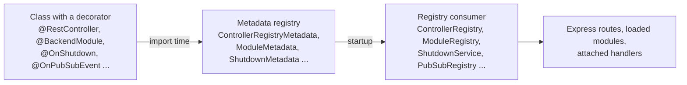

# Recurring patterns

The n8n backend is a set of classes. Decorators wire them together. Almost every pattern in this document works the same way: a decorator writes a fact about a class into a **metadata registry** at import time, and a registry consumer reads those facts at startup and acts on them. Controllers become routes, modules get loaded, hooks get attached.



*Every arrow is a point of failure a new joiner meets once. If the file with the class is never imported, the decorator never runs, and the registry never hears about the class. Nothing errors. The route answers 404, the module stays dark, the hook never fires.*

Two facts follow from this design. First, the decorated class is almost always also a `@Service()`, because the consumer resolves it from the dependency injection container. `@RestController`, `@BackendModule`, and `@Config` apply `@Service()` for you. The method decorators do not. Second, "the file is never imported" is the shared root cause behind a missing route, a missing module, and a missing hook. Keep it in mind when something you wrote does not appear.

We now go through the patterns in the order you meet them: how classes find each other, how a request becomes a response, how data reaches the database, how features are packaged, how processes talk, and how we test.

## 1. Dependency injection

**The problem.** A service needs a repository, a logger, and a config object. Nobody should construct these by hand, and a test must be able to swap any of them.

**The mechanism.** The `@n8n/di` package provides `@Service()` and one global `Container`. A class declares its collaborators as constructor parameters. The container instantiates each class once and resolves the parameter types through `reflect-metadata`.

From `packages/cli/src/controller.registry.ts`:

```ts
@Service()
export class ControllerRegistry {
	constructor(
		private readonly license: License,
		private readonly authService: AuthService,
		private readonly globalConfig: GlobalConfig,
		private readonly metadata: ControllerRegistryMetadata,
		private readonly lastActiveAtService: LastActiveAtService,
		private readonly rateLimitService: RateLimitService,
	) {}
```

The constructor lists six collaborators. The container builds each one on first use and hands the same instance to everyone.

**Why our own container?** n8n used `typedi` until early 2025. Its README in `packages/@n8n/di/README.md` gives the reasons for the replacement: `typedi` is no longer maintained, we want stage 3 decorators later, the code is small enough to own, and a small container is easier to bend for tests.

**Tests.** One container exists per process. A test replaces a registration with `mockInstance`, from `packages/@n8n/backend-test-utils/src/mocking.ts`:

```ts
export const mockInstance = <T>(
	serviceClass: Constructable<T>,
	data?: Parameters<typeof mock<T>>[0],
) => {
	const instance = mock<T>(data);
	Container.set(serviceClass, instance);
	return instance;
};
```

Because the container is global, the Vitest config for `packages/cli` runs every test file in its own forked process, except the migration tests, which share one fork. Mocks cannot leak between files.

**The common mistake.** Writing `import type { Foo }` for a class that is also a constructor parameter. TypeScript erases the type, the compiler emits nothing useful for it, and the container injects `undefined` without an error. The failure appears later as "cannot read property of undefined". The lint rule `no-type-only-import-in-di` exists for this reason.

Read more: `packages/@n8n/di/README.md`, `packages/@n8n/di/src/di.ts`.

## 2. Configuration

**The problem.** n8n has hundreds of environment variables. Each one needs a type, a default, and one place where it is declared.

**The mechanism.** You decorate a config class with `@Config` and each field with `@Env('N8N_...')`. Each field carries an explicit type and a default. `GlobalConfig` in `packages/@n8n/config/src/index.ts` nests every config class. Consumers inject `GlobalConfig`, or inject one sub-config directly.

From `packages/@n8n/config/src/configs/tags.config.ts`:

```ts
@Config
export class TagsConfig {
	/** When true, workflow tags are disabled (no tagging UI or filtering by tag). */
	@Env('N8N_WORKFLOW_TAGS_DISABLED')
	disabled: boolean = false;
}
```

The decorator reads the `design:type` metadata to decide how to parse the string from the environment. The explicit `: boolean` annotation is what turns `'true'` into `true`. Any variable `X` can also arrive as `X_FILE` with a path to a file that holds the value.

**How to add a variable.** Add an `@Env` field with a doc comment to the right class under `packages/@n8n/config/src/configs/`. Pass a zod schema as the second argument for enums. Add the default to the defaults object in `packages/@n8n/config/test/config.test.ts`, or the test fails. If you create a new class, add a `@Nested` field for it in `GlobalConfig`.

**The remnant.** Before `@n8n/config`, n8n used the `convict` library. Its schema still exists in `packages/cli/src/config/schema.ts`. Do not add to it. Its header says why it is still there:

```ts
/**
 * @deprecated Do not add new environment variables to this file. Please use the `@n8n/config` package instead.
 */
export const schema = {
	userManagement: {
		/**
		 * @important Do not remove isInstanceOwnerSetUp until after cloud hooks (user-management) are updated to stop using
		 * this property
		 * @deprecated
		 */
		isInstanceOwnerSetUp: {
```

The cloud hooks file that n8n Cloud injects into every instance still reads this object. The whole schema is five settings. One is loaded from the `settings` table, one is internal state, and three default to `GlobalConfig` values. Four of the five exist for the hooks file. See [Cloud coupling points](cloud-coupling.md).

**The common mistake.** Declaring `disabled = false` without the type annotation. The lint rule `no-untyped-config-class-field` fails the build for it.

Read more: `packages/@n8n/config/src/decorators.ts`, `packages/@n8n/config/src/index.ts`.

## 3. Controllers and routes

**The problem.** We want routes declared next to their handlers, with one middleware chain, one response shape, and one error mapping. Nobody should call `app.get(...)`.

**The mechanism.** You decorate a class with `@RestController('/base-path')`, each handler with `@Get`, `@Post`, `@Patch`, `@Put`, or `@Delete` and a path, and each argument with `@Param('key')`, `@Body`, or `@Query`. The decorators write into `ControllerRegistryMetadata`. At startup, `ControllerRegistry.activate(app)` in `packages/cli/src/controller.registry.ts` mounts one Express router per controller under the REST prefix.

From `packages/cli/src/controllers/tags.controller.ts`:

```ts
@RestController('/tags')
export class TagsController {
	constructor(private readonly tagService: TagService) {}

	@Get('/')
	@GlobalScope('tag:list')
	async getAll(_req: AuthenticatedRequest, _res: Response, @Query query: RetrieveTagQueryDto) {
		return await this.tagService.getAll({ withUsageCount: query.withUsageCount });
	}
```

Notice the handler signature. The first two parameters are always the Express request and response. Decorated arguments follow in declaration order. The handler returns a value, and the registry wraps it as `{ data }`. A handler that writes to `res` itself is left alone.

**The middleware order.** The registry builds the same chain for every route:

1. IP rate limit.
2. Body-keyed rate limit.
3. Authentication.
4. User-keyed rate limit. All three rate limits are active in production only.
5. License check.
6. Scope check.
7. Controller-level middlewares.
8. Route-level middlewares.

The order matters. Rate limits by IP run before authentication so an attacker cannot use them to guess at account names. Scope checks run after authentication because they need `req.user`.

**How a controller becomes a route.** The file must be imported somewhere for its decorators to run. Core controllers are side-effect imports at the top of `packages/cli/src/server.ts`. Module controllers are imported inside the module's `init()` method. Then `server.ts` calls `Container.get(ControllerRegistry).activate(app)`.

**Errors to HTTP status.** A handler throws. The registry catches. A `ResponseError` subclass from `packages/cli/src/errors/response-errors/` carries its own status code, for example `NotFoundError` is 404 and `BadRequestError` is 400. A plain `UserError` becomes 400. A few framework errors, such as the OpenAPI validator's `Unauthorized`, keep their own status. Anything else becomes 500 and is reported to Sentry.

From `packages/cli/src/errors/response-errors/not-found.error.ts`:

```ts
	constructor(message: string, hint: string | undefined = undefined) {
		super(message, 404, 404, hint);
	}
```

The subclass fixes the status. The message and the hint travel to the client.

**The common mistake.** Adding a controller file and not importing it. Every route answers 404 and startup prints nothing.

Read more: `packages/@n8n/decorators/src/controller/`, `packages/cli/src/response-helper.ts`.

## 4. Authorization and licensing on routes

**The problem.** Authentication answers who is calling. Authorization answers whether they may do this. Licensing answers whether the instance paid for this. The three are separate gates.

**The mechanism.** Every authenticated route carries one scope decorator. A scope is a string `resource:operation`, for example `workflow:update`. `@GlobalScope` checks the scope against the user's global role only. `@ProjectScope` checks the global role first. If the global role lacks the scope, it checks the project role, for the project that owns the resource named in the URL, and then any sharing row. `@Licensed('feat:...')` checks a license feature flag from `@n8n/constants`.

From `packages/cli/src/workflows/workflows.controller.ts`:

```ts
	@Patch('/:workflowId')
	@ProjectScope('workflow:update')
	async update(
		req: WorkflowRequest.Update,
		_res: unknown,
		@Param('workflowId') workflowId: string,
		@Body body: UpdateWorkflowDto,
	) {
```

The scope middleware passes `req.params` to `userHasScopes` in `packages/cli/src/permissions.ee/check-access.ts`. That is how `:workflowId`, `:credentialId`, `:dataTableId`, and `:projectId` are picked up. Roles map to scopes in `packages/@n8n/permissions/src/roles/role-maps.ee.ts`.

**The rule.** The skill in `.agents/skills/protect-endpoints/SKILL.md` states it without softening:

> **Rule:** every authenticated route on a `@RestController` MUST carry an access-scope decorator. If you add a route without one, the IDOR/permission bypass is on you.

The decision is simple. A URL with a project or resource id gets `@ProjectScope`. A URL without one gets `@GlobalScope`. A route with `skipAuth: true` gets no decorator and a comment that explains the alternative authentication.

**Order of decorators.** Route decorator first, then `@Licensed`, then the scope decorator. Enterprise code lives in `*.ee.ts` files or in licensed modules.

**The common mistake.** Putting `@ProjectScope` on a route with `skipAuth: true`. Every call answers 401 because `req.user` is undefined.

Read more: `.agents/skills/protect-endpoints/SKILL.md`, `.agents/review-rules/backend/license-enforcement.md`, `packages/@n8n/permissions/src/constants.ee.ts`.

## 5. Request validation with DTOs

**The problem.** TypeScript types vanish at runtime. A request body needs a runtime check before it reaches a service.

**The mechanism.** A DTO is a class built from a zod schema with `Z.class` from `@n8n/api-types`. The class is both a static type and a runtime validator. The controller registry calls `safeParse` on `@Body` and `@Query` arguments before the handler runs. A failure answers 400 with the first zod issue.

From `packages/cli/src/modules/favorites/dto/add-favorite.dto.ts`:

```ts
export class AddFavoriteDto extends Z.class({
	resourceId: z.string(),
	resourceType: z.enum(FAVORITE_RESOURCE_TYPES),
}) {}
```

The registry only validates when the argument's runtime type has a `safeParse` method. This is the detail behind the common mistake below.

**Where DTOs live.** DTOs shared with the frontend go in `packages/@n8n/api-types/src/dto/`. DTOs local to a module go in the module's `dto/` folder.

**The common mistake.** Typing a body parameter with a plain interface, or forgetting `@Body`. The registry pushes no argument, the handler receives `undefined`, and no 400 is returned. The review rule `controller-request-validation` flags a parameter named `body`, `payload`, or `data` without `@Body`, and any direct read of `req.body`.

Read more: `packages/@n8n/api-types/src/zod-class.ts`, `.agents/review-rules/backend/controller-request-validation.md`.

## 6. Services, repositories, and the TypeORM boundary

**The problem.** Business logic must not know the ORM. If a service imports `In` from `@n8n/typeorm`, the service depends on TypeORM forever, and every query shape leaks upward.

**The mechanism.** Three layers. A **controller** parses the request and calls a service. A **service** holds business logic and calls repositories. A **repository** in `@n8n/db` (or in a module's `database/` folder) owns every TypeORM import and exposes methods named after use cases. Entities describe tables and run with `synchronize: false`, so the schema is defined by migrations, not by entities.

From `packages/@n8n/db/src/repositories/tag.repository.ts`:

```ts
@Service()
export class TagRepository extends BaseRepository<TagEntity> {
	constructor(dataSource: DataSource, transactionRunner: TransactionRunner) {
		super(TagEntity, dataSource.manager, transactionRunner);
	}

	async findMany(tagIds: string[]) {
		return await this.find({
			select: ['id', 'name'],
			where: { id: In(tagIds) },
		});
	}
```

`findMany(tagIds)` takes plain strings and returns entities. The `In` operator stays inside the repository.

**The rule and the shrinking allowlist.** The lint rule `misplaced-n8n-typeorm-import` fails CI on a new `@n8n/typeorm` import in business logic. Existing leaks sit in two shrink-only allowlists in `packages/cli/eslint.config.mjs`. The comment there reads "NEVER add to this list". Relabeling the import to `@n8n/db` does not help. The rule catches `In`, `Like`, `EntityManager`, and friends by name, with the message "importing it here relabels the dependency without decoupling".

**Why does the old shape still exist?** `packages/cli/src/workflows/workflow.service.ts` still imports `In` and `EntityManager` from `@n8n/typeorm`. It is on the allowlist. The backend is in the middle of this migration. New code follows the target shape, and old code is moved when touched.

**The common mistake.** The relabel dodge, `import { In } from '@n8n/db'`. The rule catches it, and reviewers reject it.

Read more: the "Persistence layer & the TypeORM boundary" section of `AGENTS.md`, `packages/cli/AGENTS.md`, `packages/@n8n/db/AGENTS.md`.

## 7. Transactions

**The problem.** Two writes must succeed or fail together, and the code that decides this is a service, which must not see a driver type.

**The mechanism.** Inject the abstract `TransactionRunner` from `@n8n/db`. Call `txRunner.run(ctx, async (ctx) => ...)`. The callback receives an `OperationContext` that carries the active transaction as a handle that business logic cannot inspect. Thread that `ctx` into every repository call inside the callback. The repository resolves the right `EntityManager` with `this.managerFor(ctx)`. A nested `run` joins the active transaction instead of opening a new one.

From `packages/@n8n/db/src/services/transaction.ts`:

```ts
export abstract class TransactionRunner {
	/**
	 * Run `fn` inside a transaction. A context is always required, forcing callers to thread
	 * it (so it can be enriched later without touching every signature). If `context` already
	 * carries a `trx`, that transaction is reused; otherwise a new one is opened and `fn`
	 * receives a context augmented with it. The root/top-level context is an empty `{}`.
	 */
	abstract run<T>(
		context: OperationContext,
		fn: (ctx: OperationContext) => Promise<T>,
		options?: RunOptions,
	): Promise<T>;
}
```

A caller at the entry point passes an empty `{}`. From `packages/cli/src/modules/oauth-server/oauth-token.service.ts`:

```ts
		await this.txRunner.run({}, async (ctx) => {
			await this.accessTokenRepository.insertToken({ token: accessToken, clientId, userId }, ctx);
			await this.refreshTokenRepository.insertToken(
```

And the repository side, from `packages/cli/src/modules/oauth-server/database/repositories/oauth-access-token.repository.ts`:

```ts
	async insertToken(token: NewAccessToken, ctx: OperationContext): Promise<void> {
		await this.managerFor(ctx).insert(AccessToken, token);
	}
```

The repository never sees a driver type. It asks `managerFor(ctx)` for the right manager and passes the entity through.

**Three patterns coexist.** `packages/cli/AGENTS.md` names them. First, raw `manager.transaction(...)` in a service, still common in older code such as `workflow.service.ee.ts`. Second, the `withTransaction` helper in `packages/@n8n/db/src/utils/transaction.ts`, marked `@deprecated` because it hands an `EntityManager` to the callback. Third, `TransactionRunner`, the target. New code uses only the third.

**The common mistake.** Reaching for `.manager.transaction(...)` in a service to avoid an operator import. It trades a visible leak for an invisible one, and reviewers reject it.

Read more: `packages/@n8n/db/src/services/typeorm-transaction.ts`, `packages/@n8n/db/src/repositories/base-repository.ts`.

## 8. Backend modules

**The problem.** n8n has many optional features. LDAP, insights, external secrets, and MCP each need entities, controllers, settings, and startup work. An instance that does not use a feature should not load its code.

**The mechanism.** A **backend module** is a folder under `packages/cli/src/modules/<name>/`. Its entrypoint `<name>.module.ts` is a class decorated with `@BackendModule({ name, licenseFlag?, instanceTypes? })` that implements `ModuleInterface`. The interface has optional methods: `init()`, `shutdown()`, `entities()`, `settings()`, `context()`, `commands()`, `systemTasks()`, `nodeLoaders()`.

From `packages/cli/src/modules/favorites/favorites.module.ts`:

```ts
@BackendModule({ name: 'favorites', instanceTypes: ['main'] })
export class FavoritesModule implements ModuleInterface {
	async init() {
		await import('./favorites.controller.js');

		const { FavoritesEventRelay } = await import('./favorites.event-relay.js');
		Container.get(FavoritesEventRelay).init();
	}

	async entities() {
		const { UserFavorite } = await import('./database/entities/user-favorite.entity.js');
		return [UserFavorite] as never;
	}
}
```

Notice that every relative import is a dynamic `await import()`, and that the class has no constructor. A constructor would inject dependencies, and injecting them would load their files when the module class is imported, whether the module is enabled or not. That is why a disabled module costs nothing at boot: none of its code is loaded. Notice also that `init()` imports the controller file. That import is what runs the `@RestController` decorator (see pattern 3).

**The lifecycle.** `ModuleRegistry` in `packages/@n8n/backend-common/src/modules/module-registry.ts` computes the eligible set: the default modules, plus `N8N_ENABLED_MODULES`, minus `N8N_DISABLED_MODULES`. It imports each `<name>.module.js`, falling back to `<name>.ee/<name>.module.js`, so the `.ee` folder suffix is invisible to the module name. It collects `entities()` before the database connection is built, so the tables of an unlicensed module exist. Later, `initModules(instanceType)` skips modules whose `licenseFlag` is not licensed or whose `instanceTypes` exclude the current process, then calls `init()`, and caches `settings()` for the frontend and `context()` for workflow execution.

**The rules.** Lint enforces two: no top-level relative imports in the entrypoint, and no constructor in the entrypoint. The compiler enforces a third: under `module: NodeNext`, every dynamic import needs an explicit `.js` extension. A module name must be in the `MODULE_NAMES` union in `modules.config.ts`, or startup throws `UnknownModuleError`. A name in both the enabled and the disabled list throws `ModuleConfusionError`.

**The common mistake.** Writing `await import('./insights.service')` without the `.js` extension. `tsc` fails, and at runtime under NodeNext the import fails too. The module scaffold template still writes such imports, so fix them after scaffolding.

Read more: `scripts/backend-module/backend-module-guide.md`, `packages/@n8n/decorators/src/module/module.ts`. Scaffold a module with `pnpm setup-backend-module`.

## 9. Lifecycle hooks

**The problem.** Some moments concern many classes: the process shuts down, this main becomes the leader, a Redis command arrives, a workflow execution ends. We want each class to declare its interest without a central file that knows every subscriber.

**The mechanism.** Four method decorators, one per moment. Each writes into its own metadata registry, and each requires the class to be a `@Service()`.

| Decorator | Moment | Consumer |
|---|---|---|
| `@OnShutdown(priority?)` | The process is stopping | `ShutdownService` in `packages/cli/src/shutdown/` |
| `@OnLeaderTakeover()`, `@OnLeaderStepdown()` | This main gains or loses leadership in multi-main | `MultiMainSetup` in `packages/cli/src/scaling/multi-main-setup.ee.ts` |
| `@OnPubSubEvent(command, filter?)` | A Redis pubsub command arrives | `PubSubRegistry` in `packages/cli/src/scaling/pubsub/pubsub.registry.ts` |
| `@OnLifecycleEvent(event)` | A workflow or node starts or ends | `ModulesHooksRegistry` in `packages/cli/src/execution-lifecycle/execution-lifecycle-hooks.ts` |

From `packages/cli/src/wait-tracker.ts`, a leader-only timer:

```ts
	@OnLeaderTakeover()
	private startTracking() {
		// Poll every 60 seconds a list of upcoming executions
		this.mainTimer = setInterval(() => {
			void this.getWaitingExecutions();
		}, 60000);

		void this.getWaitingExecutions();

		this.logger.debug('Started tracking waiting executions');
	}
```

Only the leader polls for waiting executions. When leadership moves, the old leader's `@OnLeaderStepdown` method clears the timer and the new leader's `@OnLeaderTakeover` method starts one.

From `packages/cli/src/license.ts`, a pubsub handler:

```ts
	@OnPubSubEvent('reload-license')
	async reload(): Promise<void> {
		if (!this.manager) {
			return;
		}
		await this.manager.reload();
		await this.notifyRefreshCallbacks();
		this.logger.debug('License reloaded');
	}
```

One main reloads the certificate and publishes the command. Every other process runs this method.

**A rule with a direction.** The lint rule `no-on-leader-takeover` restricts new uses of `@OnLeaderTakeover`. Its message says that periodic leader-only work belongs on a `@SystemTask()` class, and that `@OnLeaderTakeover` is reserved for services that hold live resources on the leader, such as webhooks, pollers, and sockets. This is the durable scheduler work described in [Legacy and new](legacy-and-new.md).

**The common mistake.** Decorating a class that is not a `@Service()`. `ShutdownService.validate()` fails at startup with a message that names the class.

Read more: `packages/@n8n/decorators/src/shutdown/`, `packages/@n8n/decorators/src/multi-main/`, `packages/@n8n/decorators/src/pubsub/`, `packages/@n8n/decorators/src/execution-lifecycle/`.

## 10. Events and relays

**The problem.** A workflow was saved. Telemetry wants to know, log streaming wants to know, and the favorites module wants to know. The workflow service should not know any of them.

**The mechanism.** `EventService` in `packages/cli/src/events/event.service.ts` is a typed emitter. Its event map is the intersection of the map files in `packages/cli/src/events/maps/`. A service emits an event with a typed payload. A **relay** extends `EventRelay`, maps event names to handler methods, and forwards to its destination.

From `packages/cli/src/events/event.service.ts`:

```ts
type EventMap = RelayEventMap &
	QueueMetricsEventMap &
	AiEventMap &
	ExecutionDataEventMap &
	InstanceAiEventMap &
	WorkflowPublicationMetricsEventMap &
	PollTriggerMetricsEventMap;

@Service()
export class EventService extends TypedEmitter<EventMap> {}
```

Emitting, from `packages/cli/src/workflows/workflow.service.ts`:

```ts
		this.eventService.emit('workflow-saved', {
			user,
			workflow: updatedWorkflow,
			publicApi,
			previousWorkflow: workflow,
			aiBuilderAssisted,
			...(settingsChangesDetail && { settingsChanged: settingsChangesDetail }),
			source,
		});
```

Consuming, from `packages/cli/src/events/relays/log-streaming.event-relay.ts`:

```ts
	init() {
		this.setupListeners({
			'n8n-package-imported': (event) => this.packageImported(event),
			'n8n-package-exported': (event) => this.packageExported(event),
			'n8n-package-export-failed': (event) => this.packageExportFailed(event),
			'n8n-package-import-failed': (event) => this.packageImportFailed(event),
			'workflow-created': (event) => this.workflowCreated(event),
```

The two relays you will meet first are `telemetry.event-relay.ts`, which sends to RudderStack and PostHog, and `log-streaming.event-relay.ts`, which forwards to the message event bus that feeds log streaming destinations.

**The rule.** Add the payload type to a map file first. The emitter is typed, and the lint rule `no-type-unsafe-event-emitter` blocks an untyped one. Telemetry events also go through the `@n8n/telemetry` registry. Run `pnpm --filter @n8n/telemetry catalog` to list them.

Read more: `packages/cli/src/events/maps/relay.event-map.ts`, `packages/cli/src/events/relays/`.

## 11. Errors

**The problem.** An error class must say who is at fault and how loud to be. The class drives the log level, the Sentry report, and the HTTP status.

**The mechanism.** Three base classes from `n8n-workflow`, chosen by cause. `UserError` when the user caused it, default level `info`. `OperationalError` for a transient, expected problem such as a network timeout, default level `warning`. `UnexpectedError` for a bug, default level `error`, reported to Sentry. In HTTP handlers, throw a `ResponseError` subclass from `packages/cli/src/errors/response-errors/` when a specific status matters.

From `packages/workflow/src/errors/base/user.error.ts`:

```ts
export class UserError extends BaseError {
	declare readonly description: string | null | undefined;

	constructor(message: string, opts: UserErrorOptions = {}) {
		opts.level = opts.level ?? 'info';

		super(message, opts);
	}
}
```

A guard against an impossible state, from `packages/@n8n/db/src/repositories/base-repository.ts`:

```ts
		if (!(trx instanceof TypeOrmTransaction)) {
			throw new UnexpectedError('Transaction was not created by the TypeORM runner');
		}
```

This cannot happen unless a second transaction runner exists. That is what makes it an `UnexpectedError` and not a `UserError`.

**The deprecated class.** `ApplicationError` in `packages/@n8n/errors` is a shim kept so community nodes keep resolving. The lint rule `no-application-error` fails the build on a new use.

**The common mistake.** `throw new Error('...')` in a service. It passes lint because `no-plain-errors` is off repo-wide, but it lands as a 500 with no level, no tags, and no Sentry filter. The second mistake is expecting a `UserError` thrown from a controller to produce a 404. Only a `ResponseError` subclass carries a status.

Read more: `packages/workflow/src/errors/base/`, `packages/core/src/errors/error-reporter.ts`, `.agents/review-rules/backend/error-classes.md`.

## 12. Logging

**The problem.** One logger, structured metadata, and a way to turn on debug output for one subsystem without drowning in the rest.

**The mechanism.** Inject `Logger` from `@n8n/backend-common`. Call `this.logger.scoped('license')` once in the constructor to tag every line with a scope. Log a string message and put context in a metadata object. Operators set `N8N_LOG_LEVEL` and, optionally, `N8N_LOG_SCOPES`.

From `packages/@n8n/backend-common/src/logging/logger.ts`:

```ts
	/** Create a logger that injects the given scopes into its log metadata. */
	scoped(scopes: LogScope | LogScope[]) {
		scopes = Array.isArray(scopes) ? scopes : [scopes];
		const scopedLogger = new Logger(this.globalConfig, this.instanceSettingsConfig, {
			isRoot: false,
		});
		const childLogger = this.internalLogger.child({ scopes });

		scopedLogger.setInternalLogger(childLogger);

		return scopedLogger;
	}
```

A scope name must be in `LOG_SCOPES` in `packages/@n8n/config/src/configs/logging.config.ts`. The type is derived from that list, so an unknown scope fails typecheck.

**The common mistake.** Setting `N8N_LOG_SCOPES` and wondering where the other logs went. Once scoping is on, the filter drops every record without a matching scope.

Read more: `packages/@n8n/config/src/configs/logging.config.ts`.

## 13. Pubsub across processes

**The problem.** In queue mode there are several mains and several workers. A license reload on one main must reach every other main and every worker.

**The mechanism.** `Publisher` in `packages/cli/src/scaling/pubsub/publisher.service.ts` publishes a typed command message on the Redis channel `n8n.commands`. Every main and worker runs a `Subscriber` on that channel. The subscriber drops messages the host sent itself unless the command is in `SELF_SEND_COMMANDS`, and drops messages whose `targets` list excludes this host. It then emits the command on an internal bus, and `PubSubRegistry` invokes every `@OnPubSubEvent` handler whose instance type and role match.

From `packages/cli/src/active-workflow-manager.ts`:

```ts
			void this.publisher.publishCommand({
				command: 'add-webhooks-triggers-and-pollers',
				payload: { workflowId, activeVersionId: dbWorkflow.activeVersionId, activationMode },
			});
```

`Publisher.publishCommand` returns without publishing unless `EXECUTIONS_MODE` is `queue`. In regular mode there is nobody else to tell.

**Debouncing.** Commands are debounced by default so a burst collapses into one. Commands in `IMMEDIATE_COMMANDS` opt out. Request and response style commands must opt out, or concurrent requests merge.

**How to add a command.** Add a payload type to `PubSubCommandMap` in `pubsub.event-map.ts`, add the command to the union in `pubsub.types.ts`, decide on membership in `SELF_SEND_COMMANDS` and `IMMEDIATE_COMMANDS` in `packages/cli/src/scaling/constants.ts`, and write an `@OnPubSubEvent` handler.

Read more: `packages/cli/src/scaling/pubsub/`, `packages/cli/src/scaling/constants.ts`.

## 14. Lazy loading heavy modules

**The problem.** A top-level import of a native module or a large parser loads it into every process at boot, including processes that never use it.

**The mechanism.** Use `await import()` at the point of use when a dependency is only needed on one code path. `AGENTS.md` states the rule, and the review rule `lazy-load-heavy-modules` enforces it. The Instance AI dependencies are protected by an ESLint restricted imports list in `packages/cli/eslint.config.mjs`.

From `packages/cli/src/modules/agents/runtime/agent-secure-runtime.ts`:

```ts
	private async getPool(): Promise<AgentIsolatePool> {
		if (this.pool) return this.pool;
		this.poolInitPromise ??= (async () => {
			try {
				const ivmModule = (await import('isolated-vm')).default;
```

Other examples in the tree: `posthog-node` is imported only when diagnostics are enabled, the Redis cache backend only when configured, and `ScalingService` only in queue mode.

Read more: `.agents/review-rules/backend/lazy-load-heavy-modules.md`.

## 15. Feature flags

**The problem.** Until v3 ships, two long-lived branches exist. `master` carries the v2 line and `3.x` carries master plus breaking changes, rebuilt daily. New behavior lands on `master` disabled behind an opt-in flag.

**The mechanism.** A flag key constant in `@n8n/api-types`. An `@Env('N8N_...')` boolean defaulting to `false` in `@n8n/config`. Override wiring in `PostHogClient.applyEnvOverrides()` in `packages/cli/src/posthog/index.ts`. PostHog owns the rollout, and the env toggle lets an operator force the flag on without PostHog.

From `packages/cli/src/modules/agent-evals/agent-evals-flag-gate.ts`:

```ts
@Service()
export class AgentEvalsFlagGate {
	constructor(private readonly postHogClient: PostHogClient) {}

	async isEnabled(user: User): Promise<boolean> {
		const flags = await this.postHogClient.getFeatureFlags(user);
		return flags?.[AGENT_EVALS_FLAG] === true;
	}

	// 404 rather than 403: a flag-off surface should look unknown, not forbidden.
	async assertEnabled(user: User): Promise<void> {
		if (!(await this.isEnabled(user))) throw new NotFoundError('Not found');
	}
```

Notice the comment. A surface behind a flag that is off answers 404, not 403.

**The rules.** From `.github/DEVELOPING_V3.md`: normal feature work lands on `master` behind an opt-in flag, breaking changes land only on `3.x`, and `master` syncs into `3.x` daily. The per-feature env toggle is force-enable only. Setting it to `false` defers to PostHog. Only `N8N_FEATURE_FLAG_OVERRIDES='{"<flag>":false}'` forces a flag off.

**The common mistake.** Branching a breaking-change PR off `3.x`. That branch is force-pushed daily. Branch off `master` and target `3.x`.

Read more: `.github/DEVELOPING_V3.md`, `packages/@n8n/config/src/configs/feature-flags.config.ts`. The other three toggle systems (license flags, cloud instance flags, module enablement) are compared in [Cloud coupling points](cloud-coupling.md#the-four-toggle-systems).

## 16. Testing

**The problem.** A unit test constructs the class under test with typed mocks and never touches the database. An integration test boots a real Express app against a real test database and drives it with HTTP.

**Unit tests.** Use `mock<T>` from `vitest-mock-extended` for values and `mockInstance` for container registrations. From `packages/cli/src/services/__tests__/ai-usage.service.test.ts`:

```ts
describe('AiUsageService', () => {
	const settingsRepository = mockInstance(SettingsRepository);
	const cacheService = mockInstance(CacheService);

	const aiUsageService = new AiUsageService(settingsRepository, cacheService);
```

Hoist shared fixtures to module scope. `AGENTS.md` asks for this because building nested proxy mocks in every test is slow, and because an `as unknown as User` cast throws away the type contract.

**Integration tests.** `setupTestServer` in `packages/cli/test/integration/shared/utils/test-server.ts` builds the app with only the requested controller groups, replaces the logger, push, telemetry, and PostHog with mocks, initializes the test database, and mocks the license. From `packages/cli/test/integration/api-keys.api.test.ts`:

```ts
const testServer = utils.setupTestServer({ endpointGroups: ['apiKeys'] });
```

```ts
	test('POST /api-keys should 404', async () => {
		await authAgent.post('/api-keys').expect(404);
	});
```

The agent carries the auth cookie of the owner. The test drives a real Express app against a real test database.

**How to run one file.** From `packages/cli`:

```bash
pnpm test src/services/__tests__/ai-usage.service.test.ts
pnpm test:integration test/integration/api-keys.api.test.ts
pnpm test:postgres test/integration/api-keys.api.test.ts
```

The first runs a unit test. The second runs an integration test against SQLite. The third runs the same integration test against PostgreSQL.

**The rule that surprises people.** Vitest packages that use `@n8n/di` decorators must use `createVitestConfigWithDecorators`. Otherwise two DI containers exist and `Container.get(...)` returns `undefined`. `AGENTS.md` explains why.

Read more: `packages/@n8n/backend-test-utils/`, `packages/cli/vitest.config.base.ts`, `.agents/review-rules/testing/coverage.md`.

## Self-check

You can answer these from this document. If one stays open, read the section again before you move on.

1. You added a controller. Every route answers 404. What is the first thing to check?
2. A service needs `In` from TypeORM for one query. Where does the query go?
3. Which decorator do you put on `PATCH /rest/workflows/:workflowId`, and why not the other one?
4. A body parameter arrives as `undefined` in the handler and no 400 is returned. Why?
5. You want a job to run once every minute on the leader only. Which decorator does the lint rule steer you toward?
6. A per-feature environment toggle set to `false` did not switch a rolled-out flag off. What does switch it off?
7. Why does a module entrypoint have no constructor and only dynamic imports?
8. Name the three error classes and the fault each one assigns.
