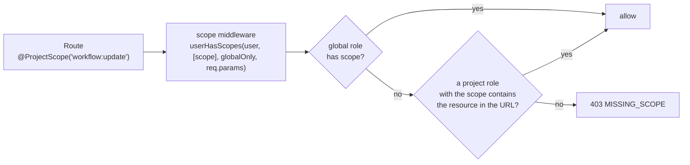

# Authorization

Read this when you add a route, a scope, or a role, or when you need to know who may see a workflow or a credential.

## What it is

Authorization is scope based. A **scope** is a string `resource:operation`, such as `workflow:read`. A **role** is a named bundle of scopes. Every user carries one global role, and project membership carries a project role. Workflows and credentials are owned by **projects**, not by users, through `shared_workflow` and `shared_credentials` rows that also carry a resource-level sharing role. Since August 2025 roles and scopes live in the database so that custom project roles can exist under a license.

## How it works

*The URL decides the resource. The resource decides the project. The project role decides the answer. Without a resource id in the URL, only the global role can answer, which is what `@GlobalScope` means.*

`@n8n/permissions`, whose only dependency is zod, is the source of truth: `RESOURCES` defines every resource and its operations, the `Scope` type is derived from it, and the role maps assign static scope lists to the built-in roles such as `global:owner`, `project:editor`, and `workflow:owner`. Controllers declare requirements with `@GlobalScope` or `@ProjectScope`, which only stash metadata. `ControllerRegistry` turns that into a middleware, after authentication and after the license check.

`userHasScopes` in `packages/cli/src/permissions.ee/check-access.ts` tries the global role first. Unless the check is global only, it then finds the projects where the user's project role carries the scopes, and for a workflow or credential id in the URL it intersects those with the sharing rows whose role also carries the scopes. For a data table id, project membership counts. For a project id, membership is checked directly. If the URL has none of these, it throws an error telling the developer to use `@GlobalScope`.

List endpoints narrow their queries to accessible projects through `ProjectScopeService`. `RoleService` and `RoleController` manage built-in and custom roles, and `RoleService.isRoleLicensed` maps each role to a license check. A `RoleCacheService` caches database roles with a static fallback.

## Where to look

| Path | What |
|---|---|
| `packages/@n8n/permissions/src/constants.ee.ts` | `RESOURCES`, `API_KEY_RESOURCES` |
| `packages/@n8n/permissions/src/roles/` | Role maps and per-role scope lists |
| `packages/@n8n/decorators/src/controller/scoped.ts` | `GlobalScope`, `ProjectScope` |
| `packages/cli/src/controller.registry.ts` | The scope middleware |
| `packages/cli/src/permissions.ee/check-access.ts` | `userHasScopes` |
| `packages/cli/src/permissions.ee/project-scope.service.ts` | Accessible project ids for lists |
| `packages/cli/src/services/role.service.ts`, `role-cache.service.ts` | Roles from the database |
| `packages/cli/src/controllers/role.controller.ts`, `project.controller.ts` | The REST surface |
| `.agents/skills/protect-endpoints/SKILL.md` | The rule and the recipe for a new scope |

## What it owns

`project`, `project_relation`, `shared_workflow`, `shared_credentials`, `role`, `scope`, and the join table `role_scope`, all in `packages/@n8n/db/src/entities/`. Not a module.

## Flags

`feat:customRoles` on creating, editing, and deleting roles. `feat:projectRole:admin` on creating a project, plus editor and viewer flags on the built-in project roles. `feat:advancedPermissions`. `feat:sharing` on sharing routes.

## Per mode

The same on every process. No cloud branch in code.

## Was, is, goes

**Was.** Static role maps in the permissions package since 2023 and RBAC since May 2024. **Is.** Roles and scopes in the database since August 2025, custom roles since September 2025. **Goes.** The static maps are being replaced by database roles. One helper is marked deprecated in favor of the auth roles service. New scopes keep landing, such as granular instance settings permissions and a scope for node type policies. One observation: `check-access.ts` builds a query directly, which predates the persistence boundary rule.

## Terms

- **scope**: `resource:operation`.
- **global role**: `global:owner`, `global:admin`, `global:member`, or `global:chatUser`.
- **project role**: `project:admin`, `project:personalOwner`, `project:editor`, `project:viewer`, or a custom role.
- **sharing role**: the role on a `shared_workflow` or `shared_credentials` row, such as `workflow:owner`.
- **personal project**: the project every user owns. Team projects are licensed.

## Read more

- [Patterns](../patterns.md#4-authorization-and-licensing-on-routes)
- [Enterprise gating](../enterprise-gating.md)
- docs.n8n.io: RBAC pages
