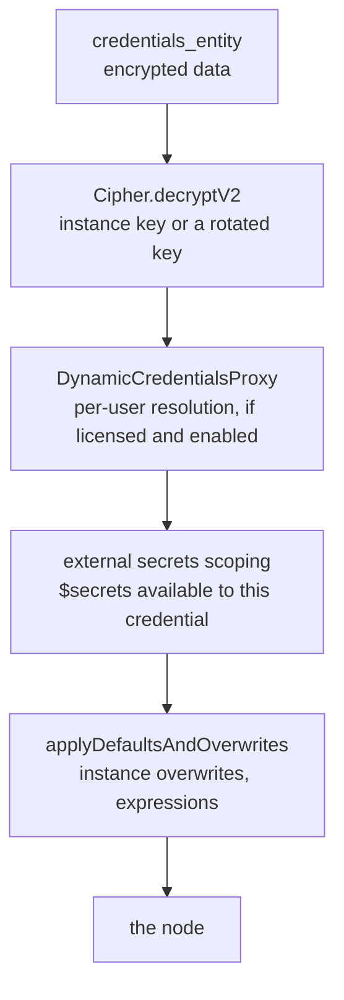

# Credentials

Read this when you touch how secrets are stored, decrypted, resolved at run time, refreshed through OAuth, or supplied from an external secret store.

## What it is

Credentials are the encrypted secrets that nodes use to call external services. A credential row stores a ciphertext blob plus a type name, and a `shared_credentials` row ties it to the project that owns it or has it shared. The backend decrypts a credential only at execution time, then layers instance-wide overwrites, external secret stores, and, when licensed, per-user **dynamic** resolution on top. Around this core sit the OAuth callback flow, the encryption key layer, and newer modules: dynamic credentials, runtime credentials, external secrets, quick connect, and n8n acting as its own OAuth 2.1 server.

## How it works

*`CredentialsHelper.getDecrypted()` runs this chain for every credential a node asks for. Nothing decrypted is stored anywhere.*

**Core.** `CredentialsController` handles list, create, update, delete, test, share, and transfer, delegating to `CredentialsService` and, for sharing, to an enterprise service. `CredentialsFinderService` answers which credential ids a user can reach with which scopes. At run time `CredentialsHelper.getDecrypted()` in `packages/cli/src/credentials-helper.ts` loads the entity, returns a synthetic credential for gateway-managed nodes, checks that decryption is allowed, decrypts, tries dynamic resolution, sets the accessible external secret providers, and applies defaults and overwrites. `CredentialsOverwrites` loads instance-wide field overwrites, such as a provided OAuth client id, from an environment variable or an encrypted settings row.

**OAuth.** Two controllers, for OAuth1 and OAuth2, each expose an authorization route and a callback route. Both are thin and call `OauthService`, which builds the authorization URL, mints a CSRF state token, stores the flow state server side, verifies it at callback, exchanges the code through `@n8n/client-oauth2`, and saves tokens. It also handles discovery, PKCE, dynamic client registration, and refresh. Encrypted token responses go through a proxy so that this code never imports the JWE module.

**Encryption.** `Cipher` in `packages/core/src/encryption/` dispatches between the legacy AES-256-CBC format and a versioned AES-256-GCM format. `encryptV2` and `decryptV2` are the current API. With key rotation enabled, `encryptV2` fetches the active data encryption key from the key manager, and the ciphertext is prefixed with the key id so that `decryptV2` can pick the right key. The `encryption-key-manager` module wires the key manager on every process and seeds keys on a main that may do so.

**Dynamic credentials.** A **resolver** is a class decorated `@CredentialResolver()` that gets and sets a secret for a credential id plus an identity context. Three exist: the n8n resolver, which stores per-user entries and backs "private credentials", plus OAuth and Slack resolvers for external identities. At run time the proxy picks the resolver and builds the identity context from hooks that extracted it at execution start. Manual and internal executions skip resolution unless a context is present.

**Runtime credentials** is a different thing. An always-on hook strips sensitive fields from trigger payloads by rule, stores them encrypted under an alias, and lets nodes read them back with `getRuntimeCredential(alias)`. **External secrets** loads provider instances for the major secret managers, refreshes on an interval, and exposes `$secrets.<provider>.<name>` to credential expressions only. **Quick connect** promotes selected credential types with a backend handler. The **OAuth server** module lets n8n act as an OAuth 2.1 authorization server for the instance MCP server and other protected resources. **Instance credentials** are admin-managed rows with no project owner, unusable by workflows, handed to trusted backend features through a broker.

## Where to look

| Path | What |
|---|---|
| `packages/cli/src/credentials/` | Controller, services, finder, the dynamic credentials proxy, the instance credential broker |
| `packages/cli/src/credentials-helper.ts` | `getDecrypted` and the resolution chain |
| `packages/cli/src/credentials-overwrites.ts`, `credential-types.ts` | Overwrites and the type lookup |
| `packages/cli/src/controllers/oauth/`, `packages/cli/src/oauth/oauth.service.ts` | The OAuth flows |
| `packages/core/src/encryption/` | `Cipher` and the key proxy |
| `packages/cli/src/modules/encryption-key-manager/` | Key rotation |
| `packages/cli/src/modules/dynamic-credentials.ee/` | Resolvers and context hooks |
| `packages/cli/src/modules/runtime-credentials/` | Stripping secrets from trigger payloads |
| `packages/cli/src/modules/external-secrets.ee/` | Providers and the manager |
| `packages/cli/src/modules/oauth-server/` | n8n as an OAuth provider |
| `packages/cli/src/credentials/instance-credentials.md` | The only in-domain design note |

## What it owns

`credentials_entity`, `shared_credentials`, `credential_dependency`, `instance_credential_assignment`, `secrets_provider_connection`, and `project_secrets_provider_access` in `@n8n/db`. Module-owned tables for dynamic credential resolvers and entries, and for the OAuth server's clients, codes, tokens, and consents. Encrypted overwrites live in `settings`. Key material lives in `deployment_key`.

## Flags

`feat:sharing` on sharing routes. `feat:dynamicCredentials` on the dynamic credentials module, plus `N8N_ENV_FEAT_DYNAMIC_CREDENTIALS` for external resolvers. `feat:externalSecrets` on the external secrets module. `N8N_ENV_FEAT_ENCRYPTION_KEY_ROTATION` and `N8N_ENV_FEAT_RUNTIME_CREDENTIALS` gate the write paths of their modules. `CREDENTIALS_OVERWRITE_DATA` and `CREDENTIALS_OVERWRITE_ENDPOINT`, without the `N8N_` prefix, feed overwrites. `N8N_ENCRYPTION_KEY` is the instance key. No license flag on core CRUD, OAuth callbacks, or encryption.

## Per mode

The same on every process. Decryption happens where the node runs, so workers hold the encryption key too. The only cloud reference is a comment that managed credentials provide free credits on Cloud.

## Was, is, goes

**Was.** Credentials and sharing arrived in 2022, OAuth controllers in 2023, external secrets moved into a module in June 2025, the OAuth abstraction was made generic in December 2025. **Is.** Dynamic credentials arrived in December 2025. The OAuth server started inside the MCP module in November 2025 and became its own module in June 2026. Runtime credentials, key rotation, and instance credentials arrived in 2026, most behind environment flags. `Cipher.encrypt` and `decrypt` are deprecated in favor of the v2 methods. **Goes.** The key manager module now loads on every start as of 2026-09-02. A `TODO` marker asks for a usage check on key deletion, and a comment asks for the rotation flag check to leave the cipher.

## Terms

- **resolver**: a class that supplies a credential's secret for an identity context.
- **private credentials**: the user-facing name for credentials on the system resolver, one secret per user.
- **runtime credential**: a value stripped from a trigger payload and readable by nodes under an alias.
- **overwrite**: an instance-wide field value applied to every credential of a type.
- **managed auth**: the overwrite mechanism that supplies an OAuth client for the user.
- **instance credential**: an admin-managed credential for trusted backend features, unusable by workflows.
- **data encryption key**: a rotated key wrapped by the instance key.

## Read more

- `packages/cli/src/credentials/instance-credentials.md`
- `.agents/skills/node-add-oauth/SKILL.md`
- [Enterprise gating](../enterprise-gating.md)
- docs.n8n.io: credentials, external secrets, and the encryption key pages
