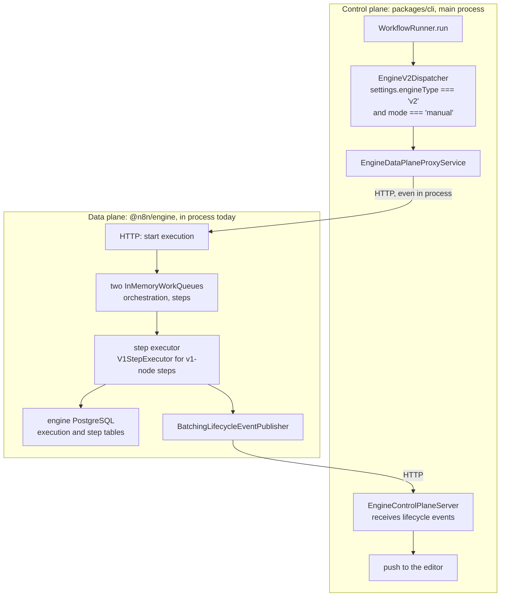

# Engine 2.0

Read this when you see `engine-v2`, `@n8n/engine`, or a control plane and data plane mentioned, and you need to know what exists today versus what is planned.

## What it is

Engine 2.0 is a new workflow execution engine in `packages/@n8n/engine`. It models a run as a graph of **steps** consumed from work queues, with its own PostgreSQL database, the **data plane**. `packages/cli` is the **engine control plane**, not to be confused with the Cloud control plane: the `engine-v2` module boots the engine inside the main process, forwards manual runs to it over HTTP, and relays lifecycle events back to the editor as push messages. `@n8n/node-engine-compatibility` bridges the two worlds by converting v1 workflow JSON into a graph and running v1 nodes as steps. As of September 2026 it is opt-in, manual-trigger only, and its configuration says "This is in development and not ready for use".

## How it works

*The two planes talk over HTTP even when they share a process. A comment on `EngineDataPlaneClient` says why: keeping the contract network shaped lets the engine move out of the process later without changing any caller.*

A workflow opts in with `settings.engineType` set to `v2`. `WorkflowRunner.run` asks `EngineV2Dispatcher.routesToEngineV2` first. If it says yes, none of the v1 path runs, and no control plane execution row is created. The dispatcher converts the workflow with `V1WorkflowConverter`, mints a UUID execution id, registers the editor's push reference, and calls the data plane through a proxy. Without the module, the proxy throws a user error.

Inside the module, `EngineV2Runtime.init()` creates the data plane data source from `N8N_ENGINE_DATABASE_URL`, runs the engine's own migrations, and calls `createEngineRuntime` with an admittance service that admits everything, a shared-secret identity verifier, and the external dependencies: a lifecycle event callback and a `V1StepExecutor`. When a `v1-node` step runs, the executor loads prior step data, adapts the graph node to a v1 node, builds a v1 `Workflow` and `ExecuteContext`, and runs the node inside an expression isolate. Lifecycle events are batched and posted to a second server on the control plane, whose controller validates the batch and relays it as the v1 push message shapes. Reads of a v2 execution id go through a reader that maps the engine's snapshot onto the v1 response type with empty run data.

## Where to look

| Path | What |
|---|---|
| `packages/cli/src/modules/engine-v2/engine-v2.module.ts` | Main only, regular mode only, refuses queue mode |
| `packages/cli/src/modules/engine-v2/engine-v2.runtime.ts` | The in-process composition root |
| `packages/cli/src/services/engine-v2-dispatcher.service.ts` | The routing decision and the supported-shape checks |
| `packages/cli/src/services/engine-data-plane-proxy.service.ts` | The indirection between the planes |
| `packages/cli/src/executions/execution-id.ts` | v1 ids are numeric, v2 ids are UUIDs |
| `packages/@n8n/engine/src/runtime/create-engine-runtime.ts` | The engine factory |
| `packages/@n8n/engine/src/queue/in-memory-work-queue.ts` | The queue whose work is lost when the process ends |
| `packages/@n8n/engine/src/database/` | The data plane entities and migrations |
| `packages/@n8n/node-engine-compatibility/src/` | `V1WorkflowConverter`, `V1StepExecutor` |
| `packages/@n8n/config/src/configs/engine.config.ts` | Every flag, with the "not ready" comments |

## What it owns

Nothing in the control plane database. The selector is `engineType` inside the workflow's settings JSON, not a column. The data plane owns its own PostgreSQL database with a workflow execution table and a step execution table, and its own migrations under `packages/@n8n/engine/src/database/migrations/`. No Redis. The queues are in memory.

## Flags

`N8N_ENABLED_MODULES=engine-v2` loads the module. `N8N_ENGINE_PORT`, `N8N_ENGINE_HOST`, and `N8N_ENGINE_BASE_URL` address the engine. `N8N_ENGINE_DATABASE_URL` is required for anything beyond a health check. `N8N_ENGINE_AUTH_SECRET` is the shared secret between planes and is generated when unset. `N8N_ENGINE_CONTROL_PLANE_PORT` defaults to 3001 on the local interface so that it can be firewalled off from the editor API. An isolated expression engine is required. No license flags.

## Per mode

The module throws on queue mode. Its comment says why: the in-process engine uses an in-memory queue, so its work is lost when the process ends and cannot be shared with other mains or workers. It loads on mains only. Only manual executions route to it, and the dispatcher rejects partial runs, explicit start nodes, AI tool runs, pinned data on non-trigger nodes, and triggers other than the Manual Trigger.

## Was, is, goes

**Was.** The package was scaffolded in May 2026 as a standalone proof of concept with zero imports from n8n. The Notion design documents describe a proof of concept that reached about 3000 step transitions per second at low database load. **Is.** The compatibility package arrived in July 2026, the in-process module in August, followed by lifecycle events, push relay, production trigger conversion, and control plane id minting. The `@n8n/engine` README still says the package is not wired in. That is stale. **Goes.** Internal testing in October 2026, early access in early 2027, and migration through 2027, per the Linear project and the Notion page "Engine 2.0, What You Should Know". Open items carry ticket ids in `TODO` comments: real admittance, credential access for v1 nodes, webhook and trigger entry paths, error workflow dispatch, and a reconciliation layer for crashed executions instead of cross-store transactions.

## What not to do here today

The engine `AGENTS.md` states the purity rules. Do not import `express`, `pg`, `@n8n/typeorm`, `@n8n/config`, or `@n8n/di` into the core folders `graph/`, `execution/`, and `admittance/`. Do not import `n8n-workflow` into the engine at all, not even types. Put v1 adaptation in `@n8n/node-engine-compatibility`, not in the engine. Do not add cross-store transactions to close partial-write windows. Keep the contract between planes HTTP shaped. Treat the feature as not user ready.

## Terms

- **control plane and data plane**: today's n8n main, and the engine that runs executions and owns their state.
- **integrated and standalone mode**: the data plane inside the main process, or `serve.ts` alone with no v1 step executor.
- **step**: one unit of work. A `v1-node` step wraps a v1 node. A `trigger` step records the trigger output supplied by the caller. `wait`, `subworkflow`, and `batch` are the other step types.
- **back edge**: the only allowed cycle, the return edge of a batch loop.
- **admittance**: the policy that decides whether a start request is accepted. Today everything is admitted.
- **lifecycle event**: a status change the engine emits, batched and posted to the control plane.
- **settled trigger**: the ADR's term for a trigger whose output has been received before execution starts. Triggers run outside the engine.
- **reconciliation**: the planned layer that detects crashed or stalled executions.

## Read more

- `packages/@n8n/engine/AGENTS.md`, the current design statement
- `packages/@n8n/engine/docs/adr/ADR-2026-08-28-trigger-settlement-before-execution.md`, the only ADR in the repo
- `packages/@n8n/scheduler/src/__tests__/dependency-purity.test.ts`, the enforcement pattern the engine copies
- [Legacy and new](../legacy-and-new.md#engine-20)
- Linear project "Engine 2.0" and the Notion RFC and detailed design
