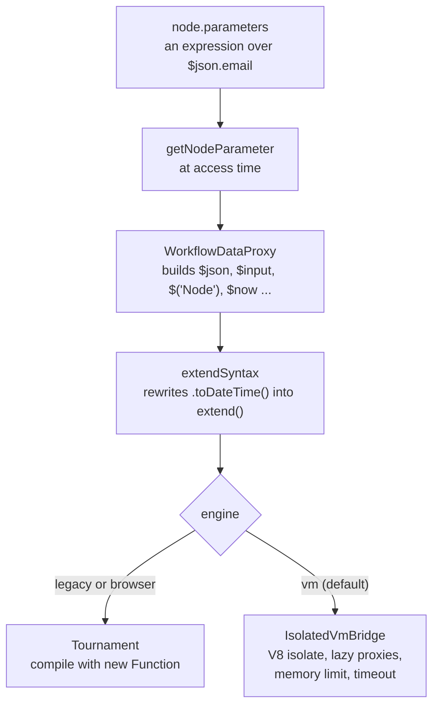

# Expressions

Read this when you touch how `={{ $json.email }}` becomes a value, the `$` globals, the data transformation functions, or the isolated expression engine.

## What it is

An **expression** is a node parameter string that starts with `=` and contains `{{ }}` JavaScript snippets that reference workflow data. `n8n-workflow` parses and evaluates them. `WorkflowDataProxy` builds the object the snippet sees. `Expression` renders it through either the legacy in-process evaluator, `@n8n/tournament`, or the **VM engine**, `@n8n/expression-runtime`, which runs the snippet in a V8 isolate. The **extensions** layer adds n8n's data transformation functions such as `.toDateTime()` and `$if()`. The same evaluation code runs in the browser for previews, always on the legacy path.

## How it works

*Evaluation is lazy. Nothing is evaluated until a node reads the parameter for a given item.*

**Resolution.** `isExpression(value)` is true for any string whose first character is `=`. When a node calls `getNodeParameter`, the context calls `workflow.expression.getParameterValue(...)`, which builds a `WorkflowDataProxy` for the current node, run index, and item index. The proxy exposes the `$` globals: `$json` and `$binary` for the current item, `$input`, the `$('Node')` function that returns a proxy per named node with `first`, `last`, `all`, `item`, and `itemMatching`, plus `$node`, `$workflow`, `$now`, `$today`, and others. `$vars`, `$secrets`, and `$execution` arrive from `packages/core` through the additional keys. `$('Node').item` resolves through **paired items**, walking back from the active node's input through each run's source until it reaches the requested node. A broken chain throws an `ExpressionError` with a paired item description key.

**Sandboxing.** `Expression.resolveSimpleParameterValue` strips the `=`, attaches a reduced `process` object, shadows `document`, `global`, `eval`, `Function`, `require`, `fetch`, and friends with empty objects, rejects `.constructor` access, and rewrites extension calls with `extendSyntax`. Then `renderExpression` branches on the engine. Tournament, the legacy evaluator, is an output-compatible rewrite of riot-tmpl. It splits the template into text and code chunks, parses each code chunk, wraps member and call expressions in try and catch, polyfills free identifiers against the data object, and compiles with `new Function`. AST hooks block `with` statements, destructuring, class extension, prototype and constructor lookups, and bare `$` access.

**The VM engine.** `packages/@n8n/expression-runtime/ARCHITECTURE.md` describes three layers. Layer 3, `ExpressionEvaluator`, runs Tournament with the hooks, caches transformed code in an LRU, and hands each caller a bridge from an isolate pool. Layer 2, the bridge, whose Node implementation is `IsolatedVmBridge`, creates a V8 isolate with a memory limit, loads the runtime bundle, registers synchronous host callbacks, and executes with a timeout. Layer 1, the runtime bundle, provides deep lazy proxies so that `$json.user.email` fetches only that path, bundled lodash and Luxon, in-isolate copies of the extension functions, and typed RPC for `$('Node').first` and friends. A QuickJS bridge is the experimental alternative.

**Lifecycle.** `BaseCommand.init` calls `Expression.initExpressionEngine(...)` for the commands that evaluate expressions and exits with a clear message if `isolated-vm` is broken. `WorkflowExecute.initializeExecution` acquires an isolate at run start and releases it at the end. Activation, credential resolution, polling, and live webhooks acquire their own. The webhook path can skip the isolate when the webhook node's fields are static.

## Where to look

| Path | What |
|---|---|
| `packages/workflow/src/expression.ts` | `Expression`: init, acquire, release, resolve, render |
| `packages/workflow/src/workflow-data-proxy.ts` | The `$` globals and paired item resolution |
| `packages/core/src/execution-engine/node-execution-context/utils/get-additional-keys.ts` | `$vars`, `$secrets`, `$execution` |
| `packages/workflow/src/expression-sandboxing.ts` | The AST hooks |
| `packages/workflow/src/extensions/` | `extendSyntax` and the per-type extension maps |
| `packages/@n8n/tournament/src/` | The template compiler |
| `packages/@n8n/expression-runtime/src/` | evaluator, bridge, runtime bundle, pool |
| `packages/@n8n/config/src/configs/expression-engine.config.ts` | Every flag |
| `packages/cli/src/expression-observability/` | Metrics and traces for the VM engine |

## What it owns

Nothing persistent. No Redis.

## Flags

`N8N_EXPRESSION_ENGINE` is `vm` by default, `legacy` opts out, `quickjs` is experimental. `N8N_EXPRESSION_ENGINE_POOL_SIZE`, `N8N_EXPRESSION_ENGINE_TIMEOUT` (5000 milliseconds), `N8N_EXPRESSION_ENGINE_MEMORY_LIMIT` (128 megabytes), `N8N_EXPRESSION_ENGINE_MAX_CODE_CACHE_SIZE`, `N8N_EXPRESSION_ENGINE_IDLE_TIMEOUT`, and the observability toggles sit in the same config class. `N8N_EXPRESSION_ENGINE_ALLOW_WEBHOOK_ISOLATE_SKIP` (default true) lets webhook phases skip the isolate. `N8N_BLOCK_ENV_ACCESS_IN_NODE` is read from `process.env` in `workflow-data-proxy-env-provider.ts` and hides environment variables from `$env` unless set to `false`. No license flags.

## Per mode

The browser always runs the legacy path, because the isolate is Node only. The editor build aliases the runtime package to a stub. Each backend process owns its own isolate pool. Commands that do not evaluate expressions only record the engine choice, so that an unexpected evaluation throws instead of falling back. Queue mode and multi-main change nothing here.

## Was, is, goes

**Was.** riot-tmpl evaluated expressions in process until Tournament became the default in September 2023, and stayed selectable until May 2025. AST sandbox hooks followed in 2024. Keeping an in-process sandbox tight took repeated patching, so isolation moved to a separate V8 runtime. **Is.** `@n8n/expression-runtime` was scaffolded in February 2026, gained pooling, limits, idle scaling, and observability through spring, rolled out on Cloud from April to July, and became the default in August 2026. Tournament moved into the monorepo in April. **Goes.** Legacy is "soon to be deprecated" per the config comment. The runtime README lists Web Worker support and task runner integration as later phases. The extension functions exist twice, once for the legacy path and once bundled into the isolate.

## Terms

- **template and chunk**: the split of an expression into text and `{{ code }}` parts. One code chunk alone returns its raw value.
- **Tournament**: the riot-tmpl compatible compiler in `@n8n/tournament`.
- **data proxy**: the object the snippet reads from, built per node, run, and item.
- **extension**: a data transformation function attached to a value type, rewritten by `extendSyntax`.
- **bridge**: the object that runs code in an isolate or a QuickJS context, with a memory limit and a timeout.
- **isolate pool**: warm isolates ready for acquire. Idle scaling disposes them after an idle period.
- **lazy proxy**: an in-isolate object that fetches a value from the host on first access.
- **nested evaluation**: `$evaluateExpression` inside an expression, which shares the outer timeout.

## Read more

- `packages/@n8n/expression-runtime/ARCHITECTURE.md` and `README.md`
- `packages/@n8n/expression-runtime/docs/deep-lazy-proxy.md`
- `packages/@n8n/tournament/README.md`
- [Legacy and new](../legacy-and-new.md#expressions)
- docs.n8n.io: expressions, built-in variables, and data transformation functions
