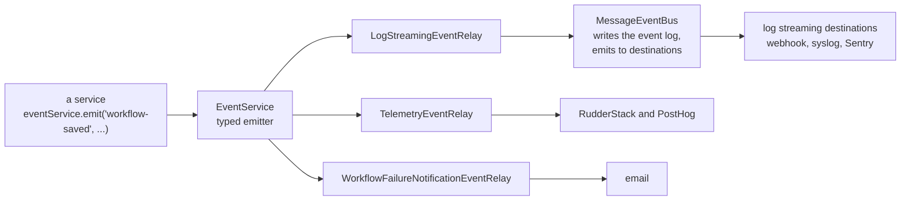

# Observability and audit

Read this when you add an event, need it in log streaming or telemetry, add a metric, or touch tracing, redaction, the security audit, or insights.

## What it is

This domain is every path by which n8n reports on itself. The internal `EventService` is the single typed emitter for backend events, and three relays distribute it: to the `MessageEventBus` for licensed **log streaming** to webhook, syslog, and Sentry destinations, to RudderStack and PostHog for **product telemetry**, and to an email on the first production failure. Alongside sit the Prometheus `/metrics` endpoint, an OpenTelemetry tracing module, expression engine observability, the `n8n audit` security report, execution data **redaction**, and **insights**, which aggregates execution counts into hourly, daily, and weekly rows.

## How it works

*One emit, three consumers. To add an event, add its payload type to a map file, emit it, and handle it in the relays that need it.*

**Event bus.** `MessageEventBus` in `packages/cli/src/eventbus/` receives typed messages. Its `send` does four things in order:

1. Write the message to a rotating event log on disk through a worker thread.
2. Emit it for Prometheus.
3. Emit it to destinations with a confirm callback.
4. Confirm it at once when no destination listens, so that the log does not grow without bound. The log doubles as the crash recovery source: at startup the bus reads it and marks executions with no final event as crashed or recovers them. Event names are a public contract grouped by prefix, `n8n.audit.*`, `n8n.workflow.*`, `n8n.node.*`, and others, guarded by a test. The `log-streaming` module owns the destination side: it loads `event_destinations` rows, filters by subscription, and calls each destination behind a circuit breaker.

**Events and relays.** `EventService` is a typed emitter whose map is the intersection of the files in `packages/cli/src/events/maps/`. Relays extend `EventRelay` and map event names to handlers. The log streaming relay translates events into bus messages and masks user fields with `@Redactable`. The telemetry relay translates them into `Telemetry.track` calls.

**Telemetry.** `Telemetry` lazy-loads the RudderStack SDK when diagnostics are on, buffers counts, and flushes them every six hours together with license and project counts. `track()` accepts a string or a typed definition from `@n8n/telemetry`, validates properties when a definition is given, drops payloads above 32 kilobytes, and forwards to both PostHog and RudderStack. `@n8n/telemetry` is definitions only. `pnpm --filter @n8n/telemetry catalog` prints the registry, and the `n8n:telemetry` skill covers adding an event.

**Metrics.** `PrometheusMetricsService` composes about twenty collectors, each with an enable flag, and mounts `GET /metrics` on main, worker, and webhook servers. Collectors cover cache, event bus, queue, routes, instance role, active workflows, execution duration, workflow statistics, execution data reads and writes, SSRF checks, DNS cache, webhook and form durations, database pool, publication, the durable scheduler, and poll triggers.

**Tracing.** The `otel` module runs on every process, owns an OpenTelemetry SDK with an OTLP exporter, and listens to execution lifecycle events to keep one span per execution with optional node spans. Settings come from `N8N_OTEL_*` variables with a database override.

**Redaction.** The `redaction` module wires a service into a proxy in `packages/cli/src/executions/`, so that the execution code depends on the proxy and does nothing when the module is absent. The service resolves the effective policy from a snapshot captured at execution start, decides whether the reading user may reveal, and runs strategies that mutate the execution in place at read time. An instance floor can be set, and workflow updates weaker than the floor are rejected.

**Insights.** `InsightsCollectionService` listens to `workflowExecuteAfter` on main and webhook processes, skips the manual, internal, integrated, chat, and agent modes, and buffers raw rows. On the leader, compaction folds raw into hourly, hourly into daily after 90 days, and daily into weekly after 180 days. Pruning deletes old rows. Collection is not licensed. The dashboard routes are.

**Security audit.** `SecurityAuditService.run` loads all workflows and runs one risk reporter per category: credentials, database, filesystem, instance, nodes. The `n8n audit` command and a public API endpoint invoke it.

## Where to look

| Path | What |
|---|---|
| `packages/cli/src/eventbus/message-event-bus/message-event-bus.ts` | The bus and the log on disk |
| `packages/cli/src/modules/log-streaming.ee/` | Destinations, README |
| `packages/cli/src/events/event.service.ts`, `maps/`, `relays/` | The typed emitter and the relays |
| `packages/cli/src/telemetry/index.ts`, `packages/cli/src/posthog/index.ts` | Product telemetry |
| `packages/@n8n/telemetry/` | Event definitions and the catalog script |
| `packages/cli/src/metrics/prometheus/` | Collectors and the service |
| `packages/cli/src/modules/otel/` | Tracing, README |
| `packages/cli/src/expression-observability/` | Metrics and traces for the VM expression engine |
| `packages/cli/src/modules/redaction/`, `packages/cli/src/executions/execution-redaction*.ts` | Redaction and its proxy |
| `packages/cli/src/modules/insights/` | Collection, compaction, pruning, controller |
| `packages/cli/src/security-audit/` | Risk reporters |

## What it owns

`event_destinations`, a module entity. `insights_raw`, `insights_by_period`, and `insights_metadata`, module entities. Settings rows for tracing and the redaction floor. The event log files under the n8n folder. Telemetry, metrics, and the audit own nothing.

## Flags

`feat:logStreaming` on the module and its routes. `feat:dataRedaction` checked at runtime. `feat:insights:viewSummary`, `feat:insights:viewDashboard`, `feat:insights:viewHourlyData`, and the insights quotas. `N8N_DIAGNOSTICS_ENABLED` (default true) for telemetry. `N8N_METRICS` (default false) plus one `N8N_METRICS_INCLUDE_*` per collector. `N8N_OTEL_ENABLED` (default false). `N8N_EVENTBUS_RECOVERY_MODE` for crash recovery depth.

## Per mode

The bus and the log streaming relay run on every process type, each with its own log file. Telemetry runs on every process type. Insights collects on main and webhook processes and compacts on the leader. On Cloud, one telemetry identify path adds the Cloud user id, PostHog attaches session context, and the instance section of the security audit is omitted.

## Was, is, goes

**Was.** Destinations lived in `eventbus` until they moved to a module in 2026. Relays were reorganized in 2024. **Is.** `@n8n/telemetry` since July 2026, adopted incrementally. Prometheus split into per-metric services in June 2026. Redaction became generally available in 2026. **Goes.** The bus stays in core because it is the crash recovery log, and carries a `TODO` to become a typed emitter. Public API endpoints exist for log streaming destinations and tracing configuration.

## Terms

- **event bus message**: a typed record with an `n8n.*` name, written to disk and sent to destinations.
- **relay**: a class that maps `EventService` events to one consumer.
- **destination**: a configured log streaming target with a subscription filter.
- **collector**: one Prometheus metric family with its own enable flag.
- **redaction policy snapshot**: the policy captured at execution start and applied at read time.
- **insights compaction**: folding raw rows into period rows on the leader.

## Read more

- `packages/cli/src/modules/log-streaming.ee/README.md`, `packages/cli/src/modules/otel/README.md`
- `packages/@n8n/telemetry/README.md`
- [Patterns](../patterns.md#10-events-and-relays)
- docs.n8n.io: logging, log streaming, monitoring, and insights pages
