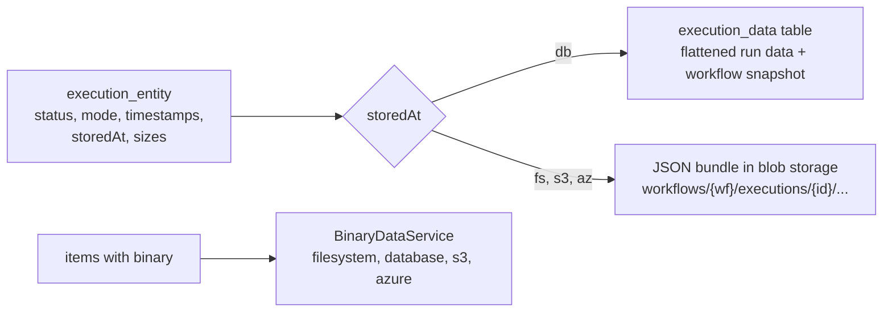

# Persistence

Read this when you add a table or a column, write a query, store execution data, or touch binary files.

## What it is

Persistence stores n8n state in SQLite or PostgreSQL through a forked TypeORM, plus the blob stores that keep execution data and binary files outside the database. The `@n8n/db` package owns the entities, the repositories, the `DbConnection` service, and the migration set. Business logic is not meant to import TypeORM. A lint rule enforces that with a shrinking allowlist of old call sites. New code calls use-case-named repository methods and, for multi-write units, the abstract `TransactionRunner`. Execution rows live in the database. The execution data bundle and binary files go to the database, the filesystem, S3, or Azure depending on two independent mode settings.

## How it works

**The schema is the migrations.** Entities run with `synchronize: false`, so a change to an entity does nothing until a migration says the same thing. `docs/db.md` states this and points at the generated per-table schema docs. Migrations live under `packages/@n8n/db/src/migrations/`, most in `common/` and written against a small DSL that works on both databases. Module entities join the list through `ModuleRegistry.entities`, but their migrations still live in `@n8n/db`. The skill `.agents/skills/db-migrations/SKILL.md` is the how-to, and the `migrations-review` team must approve every migration.

**Connecting and migrating.** `DbConnectionOptions.getOptions()` builds TypeORM options from `DatabaseConfig`: a pooled SQLite driver or PostgreSQL. `DbConnection.init()` connects with exponential backoff and starts a monitor that pings the database and, on PostgreSQL, rebuilds the pool after repeated failures. `DbConnection.migrate()` wraps each migration with a context and, on PostgreSQL, runs the set under an advisory lock so that mains booting at the same time migrate one at a time.

**Repositories and transactions.** Repositories extend `BaseRepository`, whose `managerFor(ctx)` is the only place a transaction handle becomes an `EntityManager`. Business code injects `TransactionRunner` and calls `run(ctx, fn)`. See [Patterns](../patterns.md#7-transactions).

**Execution data.** `ExecutionPersistence` in `packages/cli/src/executions/` creates the `execution_entity` row with `storedAt` set to the current storage mode tag, and writes the data bundle either to the `execution_data` table or to a JSON store on a blob backend, keyed by workflow and execution id. Reads follow the row's own `storedAt`, so changing the mode does not orphan old rows. Updates run in one transaction: entity columns, then the bundle, then the size columns.

**Binary data.** `BinaryDataService` in `packages/core/src/binary-data/` keeps one manager per mode. Only ids live inside items. The default is `filesystem` in regular mode and `database` in queue mode, because workers and mains do not share a disk. S3 and Azure are licensed.

**Pruning and recovery.** `ExecutionsPruningService` soft-deletes prunable executions every hour and hard-deletes soft-deleted ones every 15 minutes, on the leader only. A crash journal file detects an unclean exit. `MessageEventBus` reads the event log at startup and hands executions with no final event to `ExecutionRecoveryService`, or marks them crashed directly in `simple` mode.

*Two independent modes. `N8N_EXECUTION_DATA_STORAGE_MODE` decides the bundle. `N8N_DEFAULT_BINARY_DATA_MODE` decides the files.*

## Where to look

| Path | What |
|---|---|
| `packages/@n8n/db/src/entities/` | About 60 entities by family: workflows, executions, credentials, users and projects, settings, insights, evaluations |
| `packages/@n8n/db/src/repositories/` | Use-case-named repository methods, `base-repository.ts` |
| `packages/@n8n/db/src/connection/` | `DbConnection`, options, monitor, backoff, PostgreSQL version policy |
| `packages/@n8n/db/src/migrations/` | `common/`, `sqlite/`, `postgresdb/`, `dsl/` |
| `packages/@n8n/db/src/services/transaction.ts` | The `TransactionRunner` port |
| `packages/cli/src/executions/execution-persistence.ts` | Execution rows and data bundles |
| `packages/core/src/binary-data/` | Binary data managers and config |
| `packages/@n8n/blob-storage/src/` | Filesystem, S3, and Azure byte stores |
| `packages/cli/src/services/pruning/` | Pruning and compaction |
| `packages/cli/src/executions/execution-recovery.service.ts`, `packages/cli/src/crash-journal.ts` | Crash recovery |
| `docs/db.md`, `docs/generated/` | The schema rule and the generated table docs |

## What it owns

Everything in the database. The migrations table is `<prefix>migrations`. The `deployment_key` table holds shared secrets. `execution_entity.finished` is deprecated in favor of `status`. `execution_entity.deduplicationKey` is a partial unique index used by the scheduler. Binary files in `database` mode use the `binary_data` table, capped at 512 megabytes per file by default and at one gigabyte at most, the PostgreSQL byte array limit.

## Flags

`DB_TYPE` is `sqlite` or `postgresdb`. MySQL is gone. The `DB_POSTGRESDB_*` connection settings include a pool size that defaults to 2. The `DB_SQLITE_*` settings include a pool size of 3. `DB_PING_*` and `DB_RECOVERY_BACKOFF_*` drive the monitor. `EXECUTIONS_DATA_PRUNE`, `EXECUTIONS_DATA_MAX_AGE` (336 hours), and `EXECUTIONS_DATA_PRUNE_MAX_COUNT` drive pruning. `N8N_EXECUTION_DATA_STORAGE_MODE` and `N8N_STORAGE_PATH` in `packages/core/src/storage.config.ts`. `N8N_DEFAULT_BINARY_DATA_MODE` in `packages/core/src/binary-data/binary-data.config.ts`. `N8N_EVENTBUS_RECOVERY_MODE` chooses `extensive` (default) or `simple` crash recovery. License flags `feat:binaryDataS3`, `feat:binaryDataAz`, `feat:executionDataS3`, and `feat:executionDataAz` are checked at startup, and an unlicensed write mode exits the process.

## Per mode

The binary data default flips between regular and queue mode. Recovery of enqueued executions runs in regular mode only, because workers pick them up in queue mode. Pruning and compaction run on the leader main only. PostgreSQL migrates under an advisory lock, SQLite runs migrations sequentially because only one process can exist. Every process type opens a database connection and checks the license for storage modes.

## Was, is, goes

**Was.** Entities and repositories lived in `packages/cli/src/databases` until 2025. Only tests remain there. The TypeORM fork was vendored into the monorepo in June 2026. **Is.** `ExecutionPersistence` since January 2026, storage modes `fs`, `s3`, and `az` added in 2026, a supported PostgreSQL range of 17 and later, with a warning and no refusal for older versions. About 20 migrations land per month. **Goes.** The storage folder migration from `binaryData` to `storage` becomes the default in v3. The `withTransaction` helper is removed as call sites migrate. A `TODO` marks the `N8N_DB_PING_TIMEOUT` fallback for removal in v3. The Linear project "Corral TypeORM to @n8n/db" tracks the boundary work.

## Terms

- **storedAt**: where an execution's data bundle lives: `db`, `fs`, `s3`, or `az`.
- **execution data bundle**: the flattened run data, a workflow snapshot, and the version id, written as one unit.
- **soft delete and hard delete**: `deletedAt` set on prunable rows, then rows and blobs removed after a buffer.
- **tombstone**: a soft-deleted row reclaimed by a new execution with the same deduplication key.
- **OperationContext**: the ambient context threaded as `ctx` through a unit of work, carrying the transaction.
- **reversible and irreversible migration**: the former requires `down()`, the latter forbids it.
- **withFKsDisabled**: a SQLite migration option for recreating tables with foreign keys, to avoid cascade data loss.
- **advisory lock**: a PostgreSQL lock by id, registered centrally in `DbLock`, used for migrations and other leader-like work.
- **crash journal**: a file present while a production process runs and removed on clean exit.

## Read more

- `docs/db.md`, `packages/@n8n/db/AGENTS.md`, root `AGENTS.md` section on the TypeORM boundary
- `.agents/skills/db-migrations/SKILL.md`
- `packages/@n8n/backend-test-utils/MIGRATION_TESTING.md`
- `packages/@n8n/blob-storage/README.md`, `packages/@n8n/typeorm/README.md`
- docs.n8n.io: database, executions, and binary data environment variable pages
