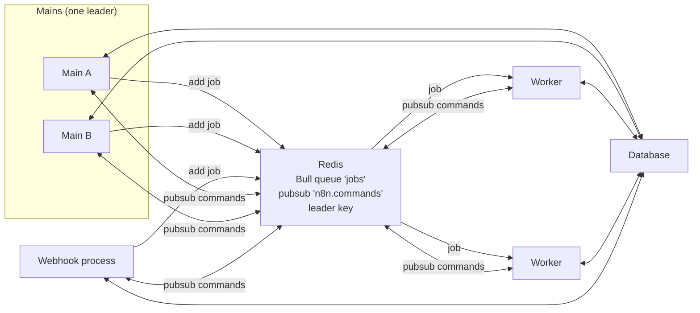

# Scaling and multi-main

Read this when you touch queue mode, workers, the Bull queue, pubsub between processes, leader election, or anything that must run on exactly one main.

## What it is

**Queue mode**, `EXECUTIONS_MODE=queue`, splits n8n into main, worker, and webhook processes that share one Redis and one database. Mains enqueue executions as Bull jobs on the `jobs` queue. Workers dequeue and run them. Webhook processes receive production webhooks and enqueue. A separate Redis pubsub layer keeps processes in sync outside a job's lifetime. **Multi-main** is the licensed extension where several mains run at once. One is elected **leader** through a Redis key with a time to live, and leader-only duties move between mains on `leader-takeover` and `leader-stepdown` events.

## How it works

*Redis holds three things. Bull carries jobs and their progress messages. Pubsub carries commands between processes. The leader key names one main. All state that matters is in the database.*

**The queue.** `ScalingService.setupQueue()` lazily imports `bull`, builds the queue with the `QUEUE_BULL_PREFIX` prefix, and registers listeners by role. A main's `addJob` enqueues a small `JobData` with ids and flags, not the run data, which is already in the database. A worker's `setupWorker(concurrency)` hands each job to `JobProcessor.processJob`, which reloads the execution, refuses a crashed one, marks it running, and runs the engine with the worker's hooks. Results and side channels flow back over Bull's `global:progress` event as `JobMessage` variants: `respond-to-webhook`, `send-chunk`, `mcp-response`, `job-finished`, `job-failed`, `abort-job`. Every main hears every progress message. Only the process that holds the execution acts. The leader runs **queue recovery** on an interval: executions that are `new` or `running` in the database but absent from Bull are marked `crashed`.

**Pubsub.** `Publisher.publishCommand` stamps the sender, whether the sender should also receive it, and whether to debounce, then publishes on `n8n.commands`. `Subscriber` drops the message if this host sent it and the command is not self-send, or if a `targets` list excludes this host, debounces by command name, and emits on an internal bus. `PubSubRegistry` binds every `@OnPubSubEvent(name, filter)` method, and evaluates the instance role filter at fire time because the role can change. Commands include `reload-license`, `add-webhooks-triggers-and-pollers`, `display-workflow-activation`, `workflow-publish-wake-up`, `relay-execution-lifecycle-event`, `stop-execution`, `get-worker-status`, and the community package commands. Workers answer on `n8n.worker-response`.

**Leader election.** `MultiMainSetup.init()` tries to set the leader key with the host id, an expiry, and "only if absent". The winner marks itself leader and emits `leader-takeover`. Every `N8N_MULTI_MAIN_SETUP_CHECK_INTERVAL` seconds the leader renews with a script that only extends the key if the value is still its own host id, and steps down if another host owns it. A follower reads the key and claims it when vacant. `@OnLeaderTakeover` and `@OnLeaderStepdown` methods, collected from every service, run on those events.

**Locks and the registry.** `RedisLockService` provides a lease-based lock with a renewal watchdog, bound as the lock service when queue mode, multi-main, or the Redis cache is on. The `instance-registry` module records every process in Redis with a heartbeat and runs cluster checks on the leader: split brain, host id clash, version mismatch.

## Where to look

| Path | What |
|---|---|
| `packages/cli/src/scaling/scaling.service.ts` | Queue setup, `addJob`, listeners, queue recovery |
| `packages/cli/src/scaling/job-processor.ts` | Runs a job on a worker |
| `packages/cli/src/scaling/scaling.types.ts`, `constants.ts` | `JobData`, `JobMessage`, channel names, self-send and immediate command sets |
| `packages/cli/src/scaling/pubsub/` | `Publisher`, `Subscriber`, `PubSubRegistry`, the command map |
| `packages/cli/src/scaling/multi-main-setup.ee.ts`, `leader-election-client.ts` | Leader election |
| `packages/cli/src/scaling/redis-lock.service.ts` | Lease-based locks |
| `packages/cli/src/scaling/worker-server.ts` | Worker health, readiness, metrics |
| `packages/cli/src/modules/instance-registry/` | Process registry and cluster checks |
| `packages/core/src/instance-settings/instance-settings.ts` | `isLeader`, `isMultiMain`, `hostId` |

## What it owns

No tables. In Redis: the Bull queue `jobs` under the `bull` prefix, the channels `n8n.commands`, `n8n.worker-response`, and `n8n.mcp-relay`, the leader key `n8n:main_instance_leader`, lock keys under `n8n:lock:`, and the instance registry keys, all under the `N8N_REDIS_KEY_PREFIX` prefix. Queue recovery updates `execution_entity.status`.

## Flags

`EXECUTIONS_MODE`, the `QUEUE_BULL_REDIS_*` connection settings, `QUEUE_BULL_PREFIX`, the worker lock settings, and `QUEUE_HEALTH_CHECK_ACTIVE` in `packages/@n8n/config/src/configs/scaling-mode.config.ts`. `N8N_MULTI_MAIN_SETUP_ENABLED`, `N8N_MULTI_MAIN_SETUP_KEY_TTL` (10 seconds), and `N8N_MULTI_MAIN_SETUP_CHECK_INTERVAL` (3 seconds) in `multi-main-setup.config.ts`. `N8N_REDIS_KEY_PREFIX` defaults to `n8n`. Worker concurrency comes from `--concurrency` or `N8N_CONCURRENCY_PRODUCTION_LIMIT`. The license flag `feat:multipleMainInstances` gates multi-main, and followers retry the check with backoff because the leader may not have written the certificate yet.

## Per mode

Regular mode marks the main leader at once and never publishes a command. Queue mode with one main also marks it leader. Multi-main requires queue mode, the flag, and the license. Listeners differ by role: mains and webhook processes listen for job progress, workers process jobs. On shutdown a single main pauses the queue, a worker pauses and waits for its running jobs. Leader-only duties, found by searching for `isLeader` and the two decorators, include trigger and poller registration, the wait tracker, queue recovery, license renewal, pruning and compaction, the publication outbox consumer, insights compaction, instance registry checks, and several module timers.

## Was, is, goes

**Was.** One orchestration service and leader election inside the multi-main file. **Is.** Bull on ioredis, three pubsub channels, decorator-driven leader handlers, `LeaderElectionClient` extracted in May 2026, `RedisLockService` added in June 2026, and large webhook responses offloaded to storage in queue mode when a worker sets `N8N_WEBHOOK_RESPONSE_RELAY_OFFLOAD_ENABLED`. **Goes.** The lint rule `no-on-leader-takeover` pushes periodic leader work to system tasks on the durable scheduler, which is leaderless by design, so the list of leader-only duties is meant to shrink. The Notion page "Leaderless multi-main" is the plan. A code comment in the multi-main setup accepts inconsistency during a Redis partition and expects recovery once Redis is back.

## Terms

- **main, worker, webhook process**: the three process roles in queue mode.
- **leader and follower**: the main that holds the leader key, and the others.
- **JobData**: what is enqueued. It points at an execution that is already in the database.
- **JobMessage**: progress messages inside a job's lifetime, on Bull's own channel.
- **PubSub command**: n8n's own Redis messages across processes, outside job lifetimes.
- **selfSend**: a command also delivered to its sender.
- **debounce**: same-named commands within 300 milliseconds collapse into one, unless the command is immediate.
- **queue recovery**: the leader's sweep for executions with no job.
- **stalled job**: Bull's term for a job whose worker stopped renewing its lock.
- **lease**: a lock held with an expiry and a renewal watchdog. An efficiency primitive, not a correctness one.
- **split brain**: two leaders at once, detected by the instance registry.

## Read more

- [Life of a webhook execution](../life-of-a-webhook-execution.md#variant-2-queue-mode)
- [Life of a workflow publish](../life-of-a-workflow-publish.md#variant-1-multi-main)
- [Patterns](../patterns.md#13-pubsub-across-processes)
- `packages/testing/containers/README.md` for running a multi-main stack locally
- docs.n8n.io: queue mode and scaling pages
