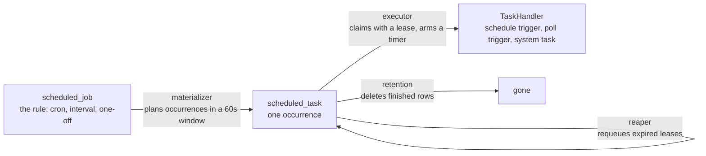

# Scheduling and waiting

Read this when you touch the Schedule Trigger, pollers, system tasks, the durable scheduler, the Wait node, or resume URLs.

## What it is

**Scheduling** is how n8n fires time-based work: Schedule Trigger nodes, poll triggers that check an external source on an interval, and internal maintenance jobs such as pruning and license renewal. Two engines coexist. The legacy engine keeps `cron` timers in the leader's memory. The **durable scheduler**, the `@n8n/scheduler` package plus its host in `packages/cli/src/scheduling`, writes every upcoming run to the database first and lets any main claim it. **Waiting** is the sibling concern: an execution pauses on a Wait node, a Form node, or a send-and-wait operation, is persisted with a `waitTill` timestamp, and resumes later by time or by an HTTP call to a resume URL.

## How it works

*Four loops, all in `@n8n/scheduler`. The host supplies storage and handlers. Every main runs the loops. The claim, not a leader, prevents double firing.*

**The durable scheduler.** `createScheduler(deps)` composes four background loops over storage functions the host supplies. The **materializer** claims `scheduled_job` rows whose next run is due, computes their occurrences inside a lookahead window, inserts `scheduled_task` rows, and advances each job's clock. The **executor** atomically claims due tasks for this host, takes a time-limited lease, arms an in-memory timer per task, and calls the handler registered for the task type. The **reaper** finds running rows whose lease expired and requeues or dead-letters them. The **retention** loop deletes finished rows. The host `DurableScheduler` is active only when `N8N_SCHEDULER_ENABLED` is on and the process is a main. Every main runs it. The class doc says why: "claiming makes concurrent instances safe, and sharing the work across mains is the point of the durable scheduler".

**How a Schedule Trigger gets onto it.** During activation, `ScheduleTriggerJobRegistrar.interceptsNode(node)` decides. If true, the node's context receives a collector whose `registerCron` records rules instead of arming a timer, and the activation commits them as `scheduled_job` rows. Interception requires the scheduler flag **and** `N8N_USE_WORKFLOW_PUBLICATION_SERVICE`. When a task fires, `ScheduleTriggerTaskHandler` loads the published workflow, builds the same item the legacy node emits, and starts an execution with a **deduplication key** so that a redelivery does not run twice. Poll triggers follow the same shape. A durable cursor in `poller_state` is a third, separate flag, `N8N_POLLER_DURABLE_CURSORS_ENABLED`, off by default.

**System tasks.** `SystemTaskRunner` owns `@SystemTask()` classes. A task marked durable goes to the database queue. Every other task runs from an in-memory timer on the leader. As of September 2026 no such classes exist yet in `packages/cli/src`. The lint rule `no-on-leader-takeover` requires every new periodic leader job to be one. Thirteen legacy timers sit on a shrink-only allowlist: pruning, compaction, license renewal, insights, instance registry checks, and others.

**The legacy path.** `getSchedulingFunctions` in `packages/core` hands a trigger node `registerCron`, which calls `ScheduledTaskManager.register`. That manager refuses registration unless the instance is the leader, and re-checks leadership on every tick.

**Waiting.** A node calls `putExecutionToWait(waitTill)`. The engine persists the execution as `waiting`. The Wait node keeps waits shorter than 65 seconds in process, because the leader's `WaitTracker` polls the database once a minute. `WaitTracker` loads executions due within the next 70 seconds and arms one timer per execution. On fire, it restarts the execution through `WorkflowRunner.run` with an expected status of `waiting`, and the claim is a conditional update, so two processes cannot resume the same execution. Webhook and form resumes go through `WaitingWebhooks` and `WaitingForms`, which validate a resume token or an HMAC signature, reject running or finished executions, and re-run. A sub-workflow that waits puts its parent on an indefinite wait, and `resumeParentExecution` wakes the parent when the child finishes. The durable scheduler does not yet handle Wait node resumes.

## Where to look

| Path | What |
|---|---|
| `packages/@n8n/scheduler/src/core/` | factory, scheduler interface, materializer, executor, reaper, retention |
| `packages/cli/src/scheduling/durable-scheduler.ts` | The host adapter |
| `packages/cli/src/scheduling/durable-job-provisioner.ts` | The write side, reconciles rules into rows |
| `packages/cli/src/scheduling/schedule-trigger-node/` | Registrar and task handler for the Schedule Trigger |
| `packages/cli/src/scheduling/poll-trigger-node/` | The same for pollers |
| `packages/cli/src/workflows/triggers/poll-cursor.service.ts` | The durable poll cursor, behind its own flag |
| `packages/cli/src/scheduling/system-tasks/` | `SystemTaskRunner` |
| `packages/core/src/execution-engine/scheduled-task-manager.ts` | The legacy cron path |
| `packages/cli/src/wait-tracker.ts` | Time-based resumes |
| `packages/cli/src/webhooks/waiting-webhooks.ts`, `waiting-forms.ts` | Resume URLs |

## What it owns

`scheduled_job` and `scheduled_task`, entities in `packages/@n8n/db/src/entities/scheduled-job.ts` and `scheduled-task.ts`. `poller_state` for durable poll cursors. `execution_entity.waitTill`, indexed for the tracker's query. `execution_entity.deduplicationKey`, a partial unique index that suppresses duplicate fires. No Redis. The scheduler coordinates in the database only.

## Flags

`N8N_SCHEDULER_ENABLED` (off by default) and about twenty-five siblings in `packages/@n8n/config/src/configs/scheduler.config.ts`: window, intervals, lease duration, batch sizes, retention, misfire grace, and `N8N_SCHEDULER_TRIGGER_NODE_MODE`. `N8N_SCHEDULER_POLL_TRIGGERS_ENABLED` and `N8N_SCHEDULER_SYSTEM_TASKS_ENABLED` extend it to pollers and system tasks. `N8N_POLLER_DURABLE_CURSORS_ENABLED` (off by default) stores poll cursors in `poller_state`. `N8N_USE_WORKFLOW_PUBLICATION_SERVICE` is a prerequisite. `GENERIC_TIMEZONE` is the fallback timezone. No license flags.

## Per mode

The durable scheduler runs on every main and never on workers or webhook processes. Legacy crons and `WaitTracker` run on the leader only and follow leadership changes through `@OnLeaderTakeover` and `@OnLeaderStepdown`. On PostgreSQL the scheduler runs passes concurrently. On SQLite it runs them sequentially. Queue mode changes nothing in the scheduler itself. The handler starts an execution, and the execution layer decides whether to enqueue it.

## Was, is, goes

**Was.** In-memory timers on the leader. Missed fires were lost. **Is.** `@n8n/scheduler` was scaffolded on 2026-06-30, gained misfire policy, coalescing, poll backoff, and the system task contract through August, and is rolling out on Cloud. Everything is off by default. The README states: "Turning it off reverts n8n to its previous in-memory scheduling, which is the rollback path during rollout." **Goes.** A dedicated host module outside `cli`, lease renewal for long handlers, and an exploratory standalone scheduler worker. The Notion page "Leaderless multi-main" lists every remaining leader-only duty and its intended replacement.

## Terms

- **job**: the rule for when something runs. It never executes anything.
- **task**: one concrete run of a job at a specific time. Identity is job id plus scheduled time.
- **materialize**: turn due jobs into task rows ahead of time.
- **claim**: one statement that flips a waiting row to running and stamps the claimer.
- **lease**: the claim's expiry. If the host dies, the reaper takes the run back.
- **misfire**: a run that came due while nothing could fire it and is past its grace window. Policies: skip, coalesce, coalesce per owner.
- **dead letter**: a task that failed with no attempts left.
- **deduplication key**: job id plus scheduled time, stored on the execution, the guard against duplicate effects.
- **system task**: a periodic background task owned by the system rather than by a workflow.
- **waitTill**: when a waiting execution resumes. The indefinite value is the year 3000.
- **resume URL**: the waiting webhook URL with the execution id and a token.

## Read more

- `packages/@n8n/scheduler/README.md`, the primary design document
- `packages/@n8n/scheduler/src/__tests__/dependency-purity.test.ts`, the algorithm and host split
- [Life of a webhook execution](../life-of-a-webhook-execution.md#variant-4-waiting)
- [Legacy and new](../legacy-and-new.md#scheduling)
- docs.n8n.io: the durable scheduler configuration page
