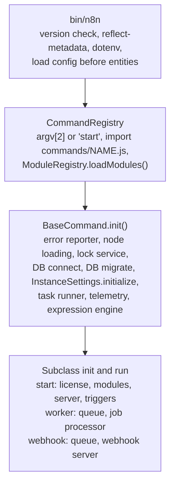

# Startup and process roles

Read this when you need to know what happens between `n8n start` and the first HTTP request, or which process does what in queue mode.

## What it is

The `n8n` binary is one Node.js entry point that becomes one of several **process roles** depending on the first CLI argument: `start` makes a **main**, `worker` makes a **worker**, `webhook` makes a **webhook process**, and other commands such as `execute` or `license:info` run once and exit. Every role shares one initialization sequence in `BaseCommand.init()`. `InstanceSettings` in `n8n-core` owns the process identity: its type, a per-process host id, its leader or follower role, the encryption key, and the settings file. Graceful shutdown drains a registry of `@OnShutdown` handlers.

## How it works

*One shared sequence, then a role-specific tail. Modules load before the database connection so that their entities join the schema.*

`packages/cli/bin/n8n` checks the Node.js version, installs source maps and `reflect-metadata`, loads `.env`, and requires the config early so that `GlobalConfig` is populated before TypeORM entity decorators read the database type. Then `CommandRegistry` in `packages/cli/src/command-registry.ts` picks the command from `process.argv[2]`, defaulting to `start`, imports `commands/<name>.js` (a colon in the name becomes a path separator, so `license:info` maps to `commands/license/info.js`), calls `ModuleRegistry.loadModules()` so that modules can contribute commands and entities, parses flags with `CliParser` against the command's zod schema, and runs `init()`, `run()`, `catch()`, and `finally()`.

`BaseCommand.init()` in `packages/cli/src/commands/base-command.ts` is the shared sequence, in this order:

1. Outbound proxy agents and the error reporter.
2. Signal handlers.
3. `LoadNodesAndCredentials.init()`.
4. The Redis lock service, when queue mode, multi-main, or a Redis cache is on.
5. `DbConnection.init()` and `migrate()`.
6. `InstanceSettings.initialize()`.
7. The task runner, when the command needs it.
8. Telemetry relays and the expression engine.

Subclasses layer role-specific steps on top: the license, community packages, binary data, external hooks, `ModuleRegistry.initModules(instanceType)`, and `postProcessLoaders()`.

`Start` marks itself leader in regular mode. In queue mode it runs `initOrchestration()`, which sets up the pubsub publisher and subscriber and then either `MultiMainSetup.init()` or `markAsLeader()`. Its `run()` loads settings flagged for startup and starts `Server`, the pruning and compaction services, the system task runner, and the durable scheduler. Then it starts either the publication outbox consumer or `ActiveWorkflowManager.init()`.

`Worker` forces queue mode and sets its concurrency. It sets up the Bull queue, subscribes to the command channel, starts the optional `WorkerServer` for health and metrics, and registers the job processor. `Webhook` refuses to start outside queue mode and starts `WebhookServer`. `Execute` loads one workflow by id and runs it in mode `cli`.

`InstanceSettings` derives `instanceType` from the command, builds `hostId` as `<type>-<hostname or nanoid>`, loads or creates the settings file at `~/.n8n/config` with the encryption key, and derives `instanceId` from the key. `instanceRole` starts as `unset` and becomes `leader` or `follower` on mains only. On shutdown, a signal arms a force-exit timer of `N8N_GRACEFUL_SHUTDOWN_TIMEOUT` seconds, `ShutdownService` runs `@OnShutdown` handlers by priority, then the role's `stopProcess()` runs, and the crash journal is removed.

## Where to look

| Path | What |
|---|---|
| `packages/cli/bin/n8n` | Process entry, version check, early config load |
| `packages/cli/src/command-registry.ts` | Command lookup and lifecycle |
| `packages/cli/src/commands/base-command.ts` | The shared init sequence |
| `packages/cli/src/commands/start.ts`, `worker.ts`, `webhook.ts`, `execute.ts` | Role-specific init and run |
| `packages/core/src/instance-settings/instance-settings.ts` | Process identity, encryption key, settings file |
| `packages/@n8n/backend-common/src/modules/module-registry.ts` | `loadModules` and `initModules` |
| `packages/cli/src/shutdown/shutdown.service.ts` | Ordered shutdown |
| `packages/cli/src/crash-journal.ts` | Crash detection between runs |
| `packages/cli/src/deprecation/deprecation.service.ts` | Warnings for retired environment variables |

## What it owns

The `deployment_key` table, entity `packages/@n8n/db/src/entities/deployment-key.ts`, holds rows shared by all processes of one deployment, such as the instance id and the HMAC signing secret. The `settings` table holds rows loaded at startup. On disk, `~/.n8n/config` holds the encryption key, and `~/.n8n/crash.journal` exists while a production process runs. Redis holds nothing owned here. Leader keys and channels belong to [Scaling and multi-main](scaling-and-multi-main.md).

## Flags

`EXECUTIONS_MODE` selects regular or queue. `N8N_MULTI_MAIN_SETUP_ENABLED` and its TTL and interval siblings enable leader election. `N8N_GRACEFUL_SHUTDOWN_TIMEOUT` bounds shutdown. `N8N_ENCRYPTION_KEY` and `N8N_USER_FOLDER` locate identity and the settings file. `N8N_ENABLED_MODULES` and `N8N_DISABLED_MODULES` change the module set. `EXTERNAL_HOOK_FILES` names hook files. Any `@Env` value can arrive as `<NAME>_FILE`. The license flag `feat:multipleMainInstances` gates multi-main. Storage flags such as `feat:binaryDataS3` are checked when a command initializes binary data, and the process exits when unlicensed.

## Per mode

Regular mode marks the main as leader at once. Queue mode runs orchestration, and multi-main runs leader election. Workers force queue mode and require the encryption key. Webhook processes refuse regular mode. Main-only steps in `start.ts` are guarded by the instance type: auth roles sync and the instance settings loader. `initModules` skips modules whose `instanceTypes` exclude the current type. The license renews on the leader only. Workers and webhook processes keep `instanceRole` at `unset` forever.

## Was, is, goes

**Was.** Commands were built on `oclif`. `EXECUTIONS_PROCESS=own` ran each execution in a child process. It was deprecated in 2023 and removed in January 2024. **Is.** A custom `CommandRegistry` with `@Command` metadata, since PR 16709, and one shared init sequence. Modules load before the data source. **Goes.** Leaving `OFFLOAD_MANUAL_EXECUTIONS_TO_WORKERS` unset is deprecated, and v3 removes the choice: manual executions always run on workers in queue mode. `N8N_USE_WORKFLOW_PUBLICATION_SERVICE` will replace `ActiveWorkflowManager.init()` at startup.

## Terms

- **instanceType**: `main`, `webhook`, or `worker`, from the command name.
- **instanceRole**: `unset`, `leader`, or `follower`. Only mains get a role.
- **hostId**: per-process id, hostname based in Docker. Not the same as `instanceId`.
- **instanceId**: fixed id for telemetry. `N8N_INSTANCE_ID` wins when set. Otherwise it is derived from the encryption key on first boot, then read from the database.
- **settings file**: `~/.n8n/config`, JSON with the encryption key.
- **deployment key**: a row shared by every process of one deployment.
- **orchestration**: the pubsub publisher, subscriber, and registry set up in queue mode.
- **crash journal**: a file whose presence at boot means the last run did not exit cleanly.

## Read more

- `packages/cli/AGENTS.md` and root `AGENTS.md`
- `scripts/backend-module/backend-module-guide.md`
- [Patterns](../patterns.md#8-backend-modules) for the module lifecycle
- docs.n8n.io: hosting, CLI commands, and queue mode pages
