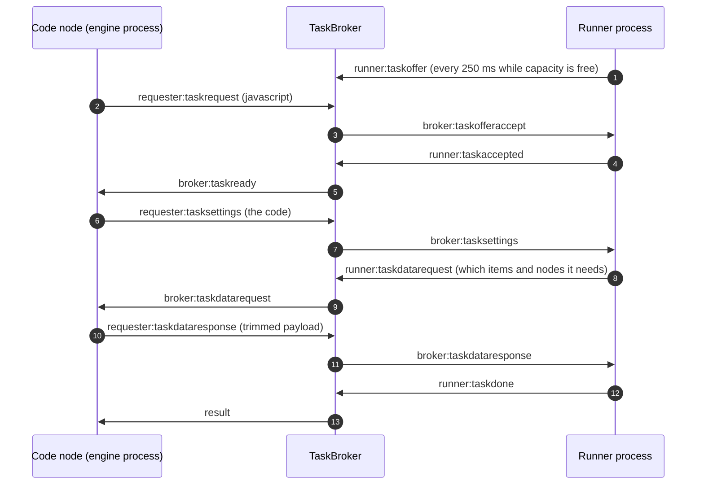

# Task runners

Read this when you touch the Code node, user code isolation, the task broker, or the runner processes.

## What it is

**Task runners** execute user-supplied code from the Code node, JavaScript and Python, outside the n8n main or worker process. n8n hosts a **task broker**, an HTTP and WebSocket server on its own port, default 5679, that matches **task requests** from the workflow engine with **task offers** from connected runners. In `internal` mode n8n spawns the runners as child processes. In `external` mode a separate launcher starts runners that connect to the broker with a shared token.

## How it works

*The runner does not receive the items with the task. It asks for what the code uses. That is why a Code node that reads only `$json` does not copy every upstream node's output.*

`BaseCommand.init()` starts `TaskRunnerModule` for the commands that need it, `start` and `worker`. The module creates the requester, starts the broker server, and in internal mode spawns a JavaScript runner process, and a Python runner process when the Python requirements are present, each wrapped in a restart loop detector. Each child receives a single-use **grant token** minted by the broker and connects over WebSocket.

On the runner side, `@n8n/task-runner` answers an info request with its task types and then offers capacity every 250 milliseconds until its concurrency is used. When the Code node calls `startJob`, the request travels through the additional data to `TaskRequester.startTask`, which sends a task request to the broker. `TaskBroker.settleTasks()` pairs the first pending request with a matching offer. The function is synchronous on purpose, and its comment says "DO NOT MAKE THIS FUNCTION ASYNC", because it relies on never yielding while it walks the two lists.

The JavaScript runner parses the code to learn which built-ins it uses, then asks for exactly that data. Helper calls such as HTTP requests are RPC calls through the broker. The Python runner receives items inside the task settings and runs each task in a forked subprocess with filtered built-ins. Results return as `runner:taskdone` or `runner:taskerror`.

**Liveness.** The broker pings runners, emits timeouts and unresponsiveness events, and the process wrapper kills and relaunches its child. A disconnect analyzer watches the child's output for an out-of-memory message so that the user sees a memory error rather than a generic disconnect.

## Where to look

| Path | What |
|---|---|
| `packages/cli/src/task-runners/task-runner-module.ts` | Startup |
| `packages/cli/src/task-runners/task-broker/task-broker.service.ts` | Matching, timeouts, `settleTasks` |
| `packages/cli/src/task-runners/task-broker/task-broker-server.ts`, `task-broker-ws-server.ts`, `auth/task-broker-auth.service.ts` | The HTTP and WebSocket server, grant token auth |
| `packages/cli/src/task-runners/task-managers/task-requester.ts` | The requester side, data request responses |
| `packages/cli/src/task-runners/task-runner-process-base.ts`, `-js.ts`, `-py.ts` | Child process management in internal mode |
| `packages/@n8n/task-runner/src/` | The JavaScript runner: `start.ts`, `js-task-runner/`, `message-types.ts` |
| `packages/@n8n/task-runner-python/src/` | The Python runner |
| `packages/nodes-base/nodes/Code/Code.node.ts` | The consumer |
| `docker/images/runners/` | The external-mode sidecar image |

## What it owns

No tables. Runner and task state lives in memory in the broker. The grant token is a cache entry with a short time to live. No Bull queues.

## Flags

`N8N_RUNNERS_MODE` is `internal` or `external`. `N8N_RUNNERS_AUTH_TOKEN` is required in external mode. `N8N_RUNNERS_BROKER_PORT` defaults to 5679 and `N8N_RUNNERS_BROKER_LISTEN_ADDRESS` to the local interface. `N8N_RUNNERS_MAX_CONCURRENCY`, `N8N_RUNNERS_TASK_TIMEOUT` (300 seconds, with a comment that v3 will reduce it to 60), `N8N_RUNNERS_TASK_REQUEST_TIMEOUT`, `N8N_RUNNERS_HEARTBEAT_INTERVAL`, and `N8N_RUNNERS_INSECURE_MODE` sit in `packages/@n8n/config/src/configs/runners.config.ts`. The runner process reads its own variables, including `NODE_FUNCTION_ALLOW_BUILTIN` and `NODE_FUNCTION_ALLOW_EXTERNAL`. `N8N_PYTHON_ENABLED` offers or hides Python in the Code node. It does not stop the runner spawn. `N8N_RUNNERS_ENABLED` is deprecated because runners are always on. No license flags.

## Per mode

The runner lives next to the process that executes workflows: the main in regular mode, the worker in queue mode. The main in queue mode skips its runner when manual executions are offloaded. The webhook process starts no broker. Internal mode kills and relaunches a runner that times out. External mode sends a cancel message instead, because n8n does not own the process. Multi-main changes nothing. Each main has its own broker.

## Was, is, goes

**Was.** The Code node ran user code in process in a sandbox. That sandbox still exists for the legacy Function nodes. Runners arrived in late 2024 and were enabled on workers shortly after. **Is.** Always on. The native Python runner replaced Pyodide, which had run inside the n8n process through `node:vm`, in 2025. **Goes.** The default task timeout drops in v3. The runner image README still labels external mode a preview, and a code comment says internal mode is not recommended for production. The Notion sandbox service documents describe a stronger isolation layer for Cloud.

## Terms

- **task broker**: the matchmaker plus its server, internal and never public.
- **runner**: a process that executes tasks of one type, `javascript` or `python`.
- **requester**: the n8n side that asks for a task.
- **task offer**: a runner's advertisement of a free slot, valid for about five seconds.
- **task request**: the engine's ask, which expires after the request timeout.
- **grant token**: single-use, short-lived credential minted by the broker and consumed at connect.
- **data request**: the runner's lazy fetch of the items and nodes the code uses.
- **insecure mode**: drops the code generation and prototype hardening restrictions for compatibility with libraries that need them.
- **restart loop**: repeated child exits, on which n8n exits so that the process manager restarts it.

## Read more

- `docker/images/runners/README.md`
- `packages/@n8n/task-runner-python/README.md`
- [Life of a webhook execution](../life-of-a-webhook-execution.md#stage-7-inside-a-node)
- docs.n8n.io: task runners configuration page
