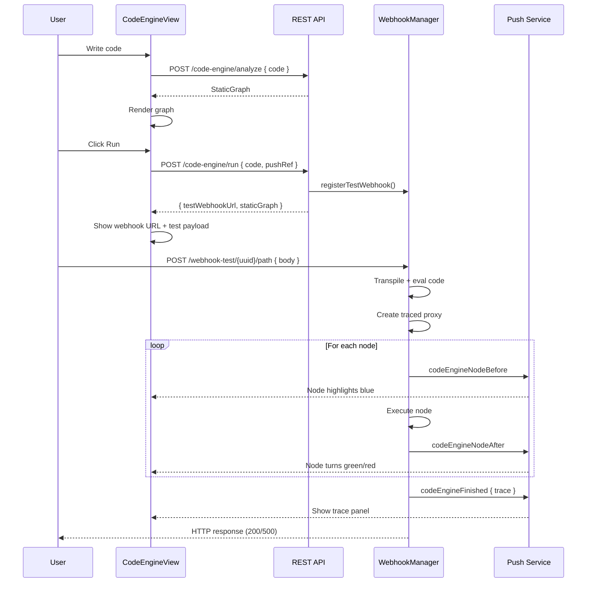

# Code Engine

A decorator-based automation execution engine that lets users write TypeScript classes with NestJS-like decorators, statically analyze the code structure, execute it via webhooks, and visualize both the static graph and runtime execution trace in real time.

## Overview

The code engine introduces three layers:

1. **`@n8n/code-engine` package** -- standalone library for decorators, static analysis, and runtime tracing
2. **Backend integration** (`packages/cli`) -- REST API, webhook manager, push messaging
3. **Frontend view** (`packages/editor-ui`) -- CodeMirror editor, VueFlow graph, real-time trace panel

```
+-----------------------+       +-----------------------+       +------------------------+
|   @n8n/code-engine    |       |     packages/cli      |       |  packages/editor-ui    |
|                       |       |                       |       |                        |
|  Decorators           |       |  CodeEngineController |       |  CodeEngineView        |
|  Static Analyzer      | <---- |  CodeEngineWebhooks   | ----> |  CodeEngineGraph       |
|  Tracer               |       |  Push messages        |       |  codeEngine store      |
|  Engine               |       |                       |       |                        |
+-----------------------+       +-----------------------+       +------------------------+
```

---

## `@n8n/code-engine` Package

Location: `packages/@n8n/code-engine/`

### Decorators

Class-level and method-level decorators for defining automations:

```typescript
@Controller('/api')
class OrderAutomation {
  @POST('/orders')
  handleOrder(body: unknown) {
    return this.route(body);
  }

  @Callable('Route by type')
  route(data: { type: string }) {
    if (data.type === 'order') return this.processOrder(data);
    return this.handleInquiry(data);
  }

  @Callable('Process order')
  processOrder(data: unknown) {
    return { status: 'processed' };
  }

  @Callable('Handle inquiry')
  handleInquiry(data: unknown) {
    return { status: 'received' };
  }
}
```

| Decorator | Level | Purpose |
|-----------|-------|---------|
| `@Controller(basePath)` | Class | Marks as automation controller, sets base URL |
| `@GET(path)` | Method | HTTP GET trigger |
| `@POST(path)` | Method | HTTP POST trigger |
| `@PUT(path)` | Method | HTTP PUT trigger |
| `@DELETE(path)` | Method | HTTP DELETE trigger |
| `@PATCH(path)` | Method | HTTP PATCH trigger |
| `@Callable(description)` | Method | Internal callable node |

Decorator metadata is stored via `reflect-metadata` using unique Symbols.

### Static Analyzer

Parses TypeScript code strings into a graph **without executing** them. Uses the TypeScript Compiler API (`ts.createSourceFile`) for AST-based analysis.

```typescript
import { analyzeCodeString } from '@n8n/code-engine';

const graph = analyzeCodeString(code);
// graph.nodes: [{ id, label, type: 'trigger' | 'callable', method?, path? }]
// graph.edges: [{ from, to, condition?: 'true' | 'false' }]
```

What it extracts:
- **Nodes** from decorated methods (triggers for HTTP decorators, callables for `@Callable`)
- **Edges** from `this.methodName()` calls within method bodies
- **Branching** from `if/else` statements -- edges are annotated with `condition: 'true'` or `'false'`

### Tracer

Creates a `Proxy`-based wrapper around class instances that records execution flow without modifying the original code.

```typescript
import { createTracedInstance } from '@n8n/code-engine';

const { proxy, getTrace } = createTracedInstance(instance, metadata, {
  onNodeEnter(nodeId, meta, args) { /* ... */ },
  onNodeExit(nodeId, meta, output, durationMs, error?) { /* ... */ },
});

const result = proxy.handleOrder(body);
const trace = getTrace();
```

The trace records:
- Each node's input, output, timing, and errors
- Edges between parent and child node calls
- Overall execution status (`'success'` | `'error'`)
- Supports async methods (detects thenables and defers recording)

### Engine

Orchestrator that combines registration, routing, and tracing:

```typescript
const engine = new CodeEngine();
engine.register(OrderAutomation);

const routes = engine.getRoutes();    // HTTP route handlers
const graph = engine.getStaticGraph(); // Static analysis result
const trace = engine.getLastTrace();   // Most recent execution trace
```

Each request creates a fresh instance, wraps it in a traced proxy, executes, and stores the trace.

---

## Backend Integration

### REST API

**Controller**: `packages/cli/src/controllers/code-engine.controller.ts`

| Endpoint | Method | Request | Response |
|----------|--------|---------|----------|
| `/code-engine/analyze` | POST | `{ code }` | `StaticGraph` |
| `/code-engine/run` | POST | `{ code, pushRef }` | `{ waitingForWebhook, testWebhookUrl, staticGraph }` |

### Webhook Manager

**File**: `packages/cli/src/webhooks/code-engine-webhooks.ts`

Handles the lifecycle of temporary test webhooks:

1. **Registration** -- `/code-engine/run` analyzes code, transpiles TypeScript to JavaScript, generates a unique webhook path (`/webhook-test/{uuid}{triggerPath}`), stores it with a 2-minute timeout
2. **Execution** -- when a request hits the webhook URL, the code is evaluated, a traced proxy is created, and the trigger method is called with the request body
3. **Cleanup** -- webhook is removed after execution or on timeout

The code-engine webhook handler is checked **before** regular test webhooks in `abstract-server.ts`.

**Code execution pipeline**:
- TypeScript transpiled to CommonJS via `ts.transpileModule()`
- Decorator stubs injected (they're no-ops at runtime; metadata comes from static analysis)
- Class extracted via `@Controller` decorator capture
- Traced proxy wraps the instance with `onNodeEnter`/`onNodeExit` callbacks that send push messages

### Push Messages

**Types**: `packages/@n8n/api-types/src/push/code-engine.ts`

| Message | When | Data |
|---------|------|------|
| `codeEngineNodeBefore` | Node starts executing | `{ nodeId, label, input }` |
| `codeEngineNodeAfter` | Node finishes executing | `{ nodeId, label, output, durationMs, error? }` |
| `codeEngineFinished` | Entire execution completes | `{ trace: ExecutionTrace }` |
| `codeEngineWebhookDeleted` | Webhook times out (2 min) | `{}` |

Messages are routed to the correct browser session via `pushRef`.

---

## Frontend Integration

### Route

Path `/code-engine`, lazy-loaded, authenticated. Uses `DefaultLayout`.

### CodeEngineView

**File**: `packages/frontend/editor-ui/src/app/views/CodeEngineView.vue`

Three-panel layout:

```
+------------------+-------------------------------+
|                  |                               |
|  Code Editor     |       Graph Panel             |
|  (CodeMirror 6)  |       (VueFlow + Dagre)       |
|                  |                               |
|  [Run]           |                               |
|                  |                               |
|  Test Request    |                               |
|  (when waiting)  |                               |
|                  +-------------------------------+
|                  |       Trace Panel              |
|                  |       (after execution)        |
+------------------+-------------------------------+
```

- **Editor**: CodeMirror 6 with TypeScript syntax, dark theme (VS Code Dark+ colors), line numbers, bracket matching, auto-close brackets
- **Graph**: VueFlow with Dagre left-to-right layout, node colors reflect execution state (blue = executing, green = completed, red = error)
- **Test Request**: Shows webhook URL, JSON body textarea, response display (green for success, red for error)
- **Trace Panel**: Lists executed nodes with timing, click to inspect input/output/error JSON

Code changes trigger a debounced (500ms) call to `/code-engine/analyze` to keep the graph in sync.

### CodeEngineGraph

**File**: `packages/frontend/editor-ui/src/app/views/CodeEngineGraph.vue`

- Dagre layout: left-to-right, 180x60px nodes, 60px node separation, 120px rank separation
- Node labels: triggers show `{method} {path}`, callables show the description
- Edge animation: traversed edges (from execution trace) are animated in green
- Read-only (not draggable/connectable)

### Pinia Store

**File**: `packages/frontend/editor-ui/src/app/stores/codeEngine.store.ts`

| State | Type | Purpose |
|-------|------|---------|
| `executingNodes` | `Set<string>` | Currently running node IDs |
| `waitingForWebhook` | `boolean` | Waiting for test request |
| `webhookTimedOut` | `boolean` | Webhook expired |
| `executionTrace` | `ExecutionTrace \| null` | Full execution result |
| `nodeOutputs` | `Map<string, {...}>` | Per-node results |

### Push Handlers

Four handlers in `composables/usePushConnection/handlers/`:

- `codeEngineNodeBefore` -- adds node to executing set (blue highlight)
- `codeEngineNodeAfter` -- removes from executing, stores output
- `codeEngineFinished` -- stores full trace, hides webhook panel
- `codeEngineWebhookDeleted` -- marks webhook as timed out

The push WebSocket connection is explicitly initialized in `CodeEngineView` on mount (since `DefaultLayout` has no `MainHeader` that normally handles this).

---

## Execution Flow



---

## Commits

| Commit | Description |
|--------|-------------|
| `aaf33acb` | Initial package: decorators, static analyzer (regex), tracer, engine, controller, webhook manager, frontend view with VueFlow |
| `842ff485` | Register controller in server.ts, restructure view layout (editor on top, graph below) |
| `0a817960` | Replace textarea with CodeMirror 6 editor, dark theme, VueFlow CSS imports |
| `d5ab358b` | Remove empty state message from graph panel |
| `a4bf58a0` | Fix data flow between components |
| `99d3a2c7` | Fix webhook-test 404 by removing path prefix mismatch |
| `8c321768` | Remove debug console.log statements |
| `7b0ffe3f` | Fix webhook execution: body parsing, async handlers, class capture via decorator |
| `2dcc1649` | Show successful webhook response in green |
| `73f10f53` | Connect push WebSocket in code engine view (was missing without MainHeader) |
| `6da43220` | Add async support and onNodeEnter/onNodeExit callback hooks to tracer |
| `210922be` | Replace regex static analyzer with TypeScript AST parsing |

---

## File Map

```
packages/@n8n/code-engine/
  src/
    index.ts              # Public exports
    types.ts              # All type definitions
    decorators.ts         # @Controller, @GET/@POST/..., @Callable
    metadata.ts           # reflect-metadata storage/retrieval
    static-analyzer.ts    # TypeScript AST-based code analysis
    tracer.ts             # Proxy-based runtime tracing with async support
    engine.ts             # Orchestrator (register, route, trace)
  __tests__/
    decorators.test.ts
    engine.test.ts
    poc.integration.test.ts
    static-analyzer.test.ts
    tracer.test.ts

packages/cli/src/
  controllers/
    code-engine.controller.ts    # REST endpoints: /analyze, /run
  webhooks/
    code-engine-webhooks.ts      # Webhook lifecycle manager
  abstract-server.ts             # Webhook middleware registration
  server.ts                      # Controller import

packages/@n8n/api-types/src/push/
  code-engine.ts                 # Push message type definitions

packages/frontend/editor-ui/src/app/
  views/
    CodeEngineView.vue           # Main view: editor + test panel + trace
    CodeEngineGraph.vue          # VueFlow graph visualization
  stores/
    codeEngine.store.ts          # Pinia state management
  api/
    codeEngine.ts                # REST API calls
  composables/usePushConnection/
    handlers/
      codeEngineFinished.ts
      codeEngineNodeAfter.ts
      codeEngineNodeBefore.ts
      codeEngineWebhookDeleted.ts
  constants/navigation.ts        # VIEWS.CODE_ENGINE constant
  router.ts                      # /code-engine route
```
