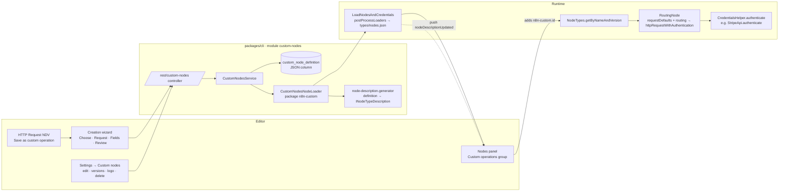

# Design: Custom Nodes & Custom Operations

Status: presentation mockup on branch `feat/custom-nodes-mockup`, behind
`N8N_CUSTOM_NODES_MOCKUP=true`. Not production code.

## Problem

Most APIs are far bigger than their n8n node. Stripe alone has hundreds of
endpoints; the Stripe node covers eight resources. The escape hatch is the
HTTP Request node, but that configuration is trapped inside one workflow:
no name, no icon, no typed parameters, no reuse, no central place to fix a
wrong header for the whole instance. Builders copy the same node between
workflows and every copy drifts.

The community has asked for this for years:

- [Convert a HTTP Request into a custom node](https://community.n8n.io/t/convert-a-http-request-into-a-custom-node/6980)
- The 2025 "Node Presets" / "Pre-configured Node Templates" threads, which
  ask for the same thing from the template angle: save a configured node
  and re-add it with one click.

## Two concepts, one schema

| | Custom Operation | Custom Node |
| --- | --- | --- |
| Belongs to | an existing node type (`n8n-nodes-base.stripe`) | itself |
| Appears | under the parent's actions, group **Custom operations**, parent icon | as a regular node with its own icon |
| Credential | the parent's predefined credential (`stripeApi`) | generic HTTP auth or any predefined type |
| Operations | exactly one | one or more |

Both are stored with the same `CustomOperationDefinition` document (see
`packages/@n8n/api-types/src/schemas/custom-nodes.schema.ts`). A Custom Node
is a `CustomNodeDefinition` that points at its operations. Operations carry
a version history and an `activeVersion`.

**Why both?** Operations cover the dominant case (extend Stripe) with zero
setup: the user never chooses an icon or an auth method because the parent
already has them. Custom Nodes cover the long tail of internal and niche
APIs. **Why operations first?** They reuse everything the parent node
already established, they are discoverable where users already look, and
they exercise the whole pipeline (definition → generated type → execution)
with the smallest UI.

## Architecture

1. **Definition** (JSON) is the source of truth. Versions are immutable;
   editing appends a version and moves `activeVersion`.
2. **Generator** turns each definition into declarative node descriptions.
   Fixed data (method, URL, baked-in headers/query/body) goes into
   `requestDefaults` (single operation) or the `routing.request` of the
   selected `operation` option (custom node). Each input carries a
   `routing.send` (body/query) or `routing.request.headers` (header) rule.
   URL placeholders become expressions on the URL. Required inputs are
   top-level parameters, optional inputs live in an *Additional Fields*
   collection. One description per stored version, `defaultVersion` set to
   the active one, so new nodes get the active version and existing nodes
   stay pinned to theirs.
3. **Loader** implements `NodeLoader` (the same contract the MCP registry
   module uses for its synthetic nodes) under the package name
   `n8n-custom`. After every write the service calls `loader.loadAll()`,
   `LoadNodesAndCredentials.postProcessLoaders()`, `releaseTypes()` and
   broadcasts `nodeDescriptionUpdated`. This is the community-package
   install path, so `types/nodes.json` and the frontend update without a
   restart.
4. **Execution** needs no new code. `NodeTypes.getByNameAndVersion` gives
   every description with `requestDefaults` a `RoutingNode`-backed
   `execute`. The declared credential's `authenticate` block adds the
   header, so a Stripe operation reuses the user's Stripe credential.
5. **Nodes panel**: custom operations are options of the parent node, so the
   existing resource/operation action generation lists them under a *Custom
   Operation* group. Custom Nodes appear like any other node. The "Create
   custom node" entry point is the last item of the panel list and is
   highlighted when a search has no results.

### Custom operations live inside the parent node

The first iteration generated a separate hidden node type per operation and
only *presented* it as a Stripe action. Feedback from the first demo run was
clear: an added operation should be a Stripe operation, not a new node. The
branch now does that:

- `ParentNodePatcher` (`packages/cli/src/modules/custom-nodes/parent-node.patcher.ts`)
  adds a **Custom Operation** entry to the parent's `resource` dropdown, an
  `operation` dropdown for that resource listing the custom operations, and
  the operations' inputs (with `displayOptions` on resource + operation). It
  patches both the served description (`types/nodes.json`) and the loaded
  class description, for every version of the parent. Nodes without a
  `resource` dropdown get the options appended to `operation`.
- The parent's `execute` is wrapped once. If the selected `operation` is a
  custom one, a `RoutingNode` runs with a declarative description generated
  from the definition (inputs, fixed request, the parent's `credentials`).
  Otherwise the original `execute` runs unchanged. The Stripe source is not
  modified; the patch is applied in memory after every registry rebuild.
- The nodes panel needs no special code: `resourceCategories` turns the new
  resource into a "Custom Operation Actions" group automatically, and
  selecting one adds a regular Stripe node with `resource`/`operation` set.
- Consequence for versioning: a node on the canvas is a Stripe node and has no
  custom-operation version of its own. All nodes follow the **active**
  version; "Set active" in Settings is therefore an instance-wide switch
  (and rollback). Per-node pinning would need the option value to carry the
  version, which the mockup does not do.
- The patcher runs as a *prepended* post-processor of
  `LoadNodesAndCredentials` so the injected description is in `types` before
  the frontend service writes `types/nodes.json`. `addPostProcessor` gained a
  `prepend` option for this.

| | Inside the parent (current) | Virtual node type (first iteration) |
| --- | --- | --- |
| Node on canvas | a real Stripe node, `resource: __customOperations__` | own type `n8n-custom.<id>` |
| Versioning | instance-wide active version | native per-node `typeVersion` |
| Touches `nodes-base` source | no (in-memory patch) | no |
| Risk | wraps the parent's `execute`; shares the parent's parameter namespace | panel integration patch; not "really" a Stripe node |

Custom Nodes are unchanged: they are standalone declarative node types with
their operations as options of one `operation` parameter.

## What is mocked or hacked

- **Feature flag** is a module config read at boot; the module is a default
  module whose `init()`/`nodeLoaders()` return early when off.
- **No RBAC**: every authenticated user can create, edit and delete
  definitions. No project scoping; definitions are instance-wide.
- **Icons** are served from `GET /rest/custom-nodes/:id/icon` and
  referenced by a relative `iconUrl`. The `/icons/*` route only serves
  filesystem loaders.
- **Versioning of operations inside a parent** is instance-wide: every
  Stripe node runs the active version. **Custom Node versioning** is not
  modelled either: a custom node always uses the active version of each
  operation and is served as version 1.
- **Execution wrapping** of the parent runs only where the module is
  initialised (`main` instances); workers in queue mode would run the
  parent's original `execute` and fail on custom operations.
- **Wizard** is a static preview (generated properties rendered as a list),
  not the real `ParameterInputList`. "Import cURL" reuses the existing
  `toHttpNodeParameters` converter.
- **Pre-fill heuristics**: expression-valued fields of the HTTP Request node
  become required inputs, literal fields stay fixed. Good enough for a demo,
  needs a real UI for mixed templates.
- **Multi-main / queue mode**: no pubsub fan-out; other main instances and
  workers only pick up new definitions on restart.
- **Used-in count** is not implemented.
- **Request Options** (batching, proxy, timeout) that `DirectoryLoader`
  injects into declarative nodes are not added.
- **Schema docs** (`docs/generated/`) were not regenerated (needs
  tbls/Docker). The DB Tests CI job will flag it.
- **Tests**: two unit tests for the generator; nothing for the service,
  controller or frontend.

## What a production version needs

- **Permissions and scoping**: scopes such as `customNode:create|update|delete`,
  project-owned definitions with sharing, and an "instance-wide" flag for
  admins. Credentials already follow this model.
- **Source control and export/import**: definitions must be part of the
  environments export (they are as much workflow dependencies as
  credentials). Workflow import should fail clearly when a `n8n-custom.*`
  type is missing, or carry the definition inline.
- **Credential handling**: for parents with several credential options
  (`authentication` parameter) the operation must pick one explicitly; the
  generator currently uses the first. OAuth2 parents work through
  `authenticate`, but token refresh edge cases need testing.
- **Versioning semantics**: pin per node (current), auto-upgrade for
  non-breaking changes, or a "migrate all workflows to v2" action. Deleting
  a version that is still in use must be blocked; "used in" needs a
  node-type index over workflows.
- **Export as node package**: the definition already is a declarative node.
  Emitting an `n8n-nodes-*` package (TypeScript files + `package.json`) is a
  mechanical transform and the natural graduation path to community nodes.
- **Cloud vs. self-hosted**: definitions are DB rows and generated types are
  in-memory, so cloud needs no filesystem access. Multi-main needs a pubsub
  reload command like `reload-mcp-registry`.
- **Type name stability**: today the type is `n8n-custom.<nanoid>`.
  Human-readable slugs are friendlier in JSON but need rename handling.
- **AI tools**: `usableAsTool: true` on generated descriptions would make
  every custom operation available to agents. Left out to keep the
  post-processing risk low in the mockup.
- **Tests**: generator property-based tests, service tests for versioning,
  Playwright coverage for the NDV → panel → run path.

## Verification done on this branch

- `pnpm build` (all 70 tasks), `pnpm typecheck` in `packages/cli` (only
  pre-existing errors in `modules/agents` and `modules/instance-ai` remain)
  and in `packages/frontend/editor-ui` (clean), eslint and biome on every
  touched file, and the generator unit tests.
- A throwaway instance (`N8N_USER_FOLDER` in a temp dir,
  `N8N_CUSTOM_NODES_MOCKUP=true`) booted, ran the new migration, seeded the
  two examples and served two `n8n-custom.*` types with the expected marker,
  icon and credentials. Through REST: preview, create operation, new version
  (both versions served, `defaultVersion` follows the active one), set active
  version, icon route, and a manual run of a workflow containing a custom
  Stripe operation against the mock webhook workflow. The mock received
  `Authorization: Bearer <stripe key>` and the form-encoded body
  `line_items[0][price]`, `line_items[0][quantity]`,
  `line_items[0][adjustable_quantity][enabled]`.
- Not exercised: the editor UI (wizard, settings page, nodes panel group,
  NDV/header buttons). It typechecks and lints, but walk through `DEMO.md`
  once before presenting.

## Deviations from the brief

- Editor paths in the brief (`packages/editor-ui`, `src/views`,
  `src/components/Node/NodeCreator`) no longer exist; the code lives in
  `packages/frontend/editor-ui/src/app` and `src/features`.
- The brief suggested one REST controller with update "creates a new
  version". Implemented as `PATCH /custom-nodes/operations/:id` (a `version`
  payload appends a version) plus `POST /custom-nodes/nodes` for custom
  nodes, because the two kinds have different DTOs. A `POST /preview`
  endpoint was added so the wizard's review step shows the real generated
  parameters.
- MySQL migrations do not exist any more; the migration is a single
  `common/` file covering SQLite and Postgres.
- The settings sidebar entry is added directly in `useSettingsItems.ts`
  (gated by the flag) so it sits next to Community Nodes; module-provided
  items are appended at the end of the list.
- `INodeTypeBaseDescription` in `n8n-workflow` gained an optional
  `customDefinition` marker (now only set on custom node types) and
  `LoadNodesAndCredentials.addPostProcessor` gained a `prepend` option.
- The "Create custom node" button moved from the workflow header into the
  nodes panel (last list item, highlighted on empty search results), as
  requested after the first demo run.
- Custom Node "operations" are options of one `operation` parameter, not
  separate node types, so a custom node's actions list works with the
  existing `operationsCategory` logic.

## Open questions for the team

1. Custom operations are now real Stripe operations (decided after the first
   demo run). Is wrapping the parent's `execute` acceptable in production, or
   should `NodeTypes` grow an explicit hook for "operation handled elsewhere"?
2. Who may create instance-wide operations? Members, project admins, or
   owners only? Where do project-scoped definitions show in the panel?
3. Version policy: is "new nodes get the active version, old nodes stay
   pinned" the right default, or should non-breaking edits (renames,
   descriptions) auto-apply?
4. Should the wizard produce a `Custom API Call`-style HTTP Request node as
   a fallback when the request cannot be expressed declaratively (streams,
   pagination, binary uploads)?
5. Do we want the "export as community node package" path soon enough that
   the definition schema should mirror `INodeTypeDescription` more closely?
6. Telemetry: how do we count usage of custom operations per parent node to
   learn which built-in operations are missing?
